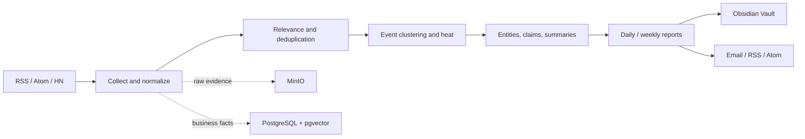

# HotKey Server

<p align="center"><a href="README.md">简体中文</a> · <a href="README_EN.md">English</a></p>

<p align="center">
  <strong>Turn scattered public signals into verifiable, traceable, and publishable event intelligence.</strong>
</p>

<p align="center">
  <a href="https://github.com/StephenQiu30/hotkey-server/actions/workflows/ci.yml"></a>
  <a href="https://go.dev/"></a>
  <a href="LICENSE"></a>
  
</p>

HotKey is a local-first, self-hosted platform for AI-assisted trend monitoring and Obsidian knowledge governance. It collects content from compliant sources such as RSS, Atom, and Hacker News, groups cross-source signals into events, preserves the underlying evidence, and produces daily or weekly intelligence reports.

`hotkey-server` is the backend and OpenAPI source of truth for collection, normalization, relevance, event intelligence, reports, delivery, identity, authorization, and operations.

> If HotKey is useful for your research, editorial, or intelligence workflow, consider starring the project, sharing your use case, or contributing through an Issue or Pull Request.

## Why HotKey

- **Local first** — PostgreSQL stores business facts, MinIO stores raw evidence, and your Obsidian Vault receives readable knowledge artifacts.
- **Evidence first** — events, claims, sources, metrics, and AI runs remain traceable instead of treating model output as ground truth.
- **Compliant collection** — connectors use official APIs, public RSS/Atom, or authorized feeds and do not bypass access controls.
- **Human-in-the-loop AI** — AI can expand queries, create embeddings, extract entities and claims, and draft summaries while approvals remain explicit.
- **End-to-end delivery** — monitoring, collection, clustering, frozen reports, Vault publishing, email, and private RSS/Atom live in one workflow.
- **Small-team operations** — one repository, one binary, and a modular monolith designed for individuals and teams of roughly 5–10 people.

## Capabilities

| Area | Implemented capabilities |
|------|--------------------------|
| Identity | Registration, login, session refresh, password reset, roles, and administration |
| Monitoring | Versioned drafts, preview, publish, pause, resume, archive, and AI rule candidate approval |
| Sources | RSS, Atom, Hacker News, health checks, collection runs, and reliable retries |
| Content | Normalization, deduplication, Markdown document view, and MinIO evidence |
| Relevance | Multilingual matching, human feedback, evaluation, and rule suggestions |
| Events | Clustering, lifecycle governance, heat/trend metrics, entities, claims, and evidence-backed summaries |
| AI | OpenAI, DeepSeek, Ollama, and optional local ONNX embeddings |
| Knowledge | Obsidian proposals, approval, reconciliation, daily/weekly reports, and publishing |
| Delivery & Ops | SMTP, private RSS/Atom, reliable jobs, Prometheus, OpenTelemetry, and operations APIs |

Development mode also includes a self-hosted Swagger UI at `/docs` and an OpenAPI document at `/openapi.json`.

## Architecture



The same Go binary can run as `all`, `api`, or `worker`.

## Quick start

### Requirements

- Go 1.26+
- PostgreSQL 16+ with pgvector
- Redis 7+
- MinIO
- Optional: SMTP, OpenAI / DeepSeek, Ollama, ONNX Runtime

### Configure and initialize

```bash
git clone https://github.com/StephenQiu30/hotkey-server.git
cd hotkey-server
cp .env.example .env
```

Configure a dedicated PostgreSQL database, MinIO, Redis, explicit CORS origins, and unique JWT/HMAC secrets of at least 32 bytes. See [`.env.example`](.env.example) for every option and never commit real credentials.

Initialize a new, empty database:

```bash
go run ./cmd/hotkey db init --empty-only --confirm-empty
go run ./cmd/hotkey db verify
```

Set `HOTKEY_BOOTSTRAP_ADMIN_EMAIL` and `HOTKEY_BOOTSTRAP_ADMIN_PASSWORD` temporarily, then create an administrator and start the service:

```bash
go run ./cmd/hotkey user bootstrap-admin
go run ./cmd/hotkey
```

Verify the runtime:

```bash
curl --fail http://127.0.0.1:8080/healthz
curl --fail http://127.0.0.1:8080/readyz
```

- Swagger UI: <http://127.0.0.1:8080/docs>
- OpenAPI: <http://127.0.0.1:8080/openapi.json>
- Prometheus: <http://127.0.0.1:8080/metrics>

For production, set `HOTKEY_ENV=production` to load `.env.prod` as an override. Process environment variables always take precedence. API documentation routes are disabled in production.

## Web application

Use [hotkey-web](https://github.com/StephenQiu30/hotkey-web) for the complete browser workspace, including events, monitors, sources, evidence, reports, and notification settings.

## Development

```bash
make lint
make test
make build
make validate
make ci
```

The complete CI suite requires a disposable PostgreSQL database and a dedicated Redis test database. GitHub Actions checks OpenAPI drift, database behavior, tests, builds, schemas, and architectural boundaries.

## Project status

HotKey is under active development. The core end-to-end workflow is implemented, but APIs and deployment details may still change before 1.0. It is best suited for technical previews, self-hosted evaluation, and collaborative development rather than unattended critical production workloads.

Long-lived acceptance evidence is available in [`docs/acceptance/archive/`](docs/acceptance/archive/README.md). External MinIO, SMTP, backup, and restore procedures must still be exercised in each deployment environment.

## Documentation

- [Architecture and design](docs/design/README.md)
- [Product requirements](docs/prd/README.md)
- [Implementation plans](docs/plans/README.md)
- [Acceptance evidence](docs/acceptance/README.md)
- [Operations guides](docs/operations/README.md)
- [OpenAPI JSON](docs/openapi/swagger.json)

## Contributing

Bug reports, use cases, connector proposals, documentation, and code contributions are welcome. Read the [contribution guide](CONTRIBUTING.md), [code of conduct](CODE_OF_CONDUCT.md), and [security policy](SECURITY.md) before getting started.

Please open an Issue before large changes. New connectors must document an official or authorized access path.

## License

HotKey Server is open source under the [MIT License](LICENSE).
