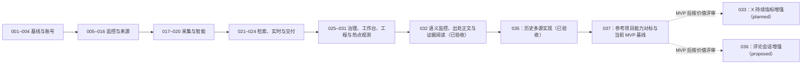

# HotKey MVP 文档地图

本目录已于 2026-08-06 从零重建。旧 Design、PRD、Plan、Acceptance、Operations 与归档材料不再作为当前项目依据；历史内容仍可通过 Git 版本记录追溯。

## 单一事实源

- 产品与技术目标：`docs/design/`
- 稳定交付范围：`docs/prd/`
- 文件级执行步骤：`docs/plans/`
- 数据库结构：`backend/db/schema.sql`
- 发布 API 契约：`docs/openapi/swagger.json`，只允许由后端生成
- 已完成验证证据：`docs/acceptance/`
- 已验收或明确标为 planned 的运维契约：`docs/operations/`

## 一条需求，一组三件套

每个编号必须同时拥有同主题的 Design、PRD 和 Plan。三份文档分别回答“如何设计”“交付什么”“如何实现”，不得把未设计的新功能直接写进计划或代码。

| 阶段 | 编号 | 交付项 | 当前判断 |
|---|---:|---|---|
| 基线 | 001 | MVP 产品边界与模块化单体 | 已验收 |
| 基线 | 002 | Vercel 风格与 shadcn/ui 设计系统 | 已验收 |
| 账号 | 003 | 账户认证与会话安全 | 已验收 |
| 账号 | 004 | 用户角色与权限管理 | 已验收 |
| 监控 | 005 | 监控主题 CRUD 与生命周期 | 已验收 |
| 监控 | 006 | 关键词规则与多语言查询扩展 | 已验收 |
| 来源 | 007 | 来源连接控制面与合规健康 | 已验收 |
| 来源 | 008 | RSS/Atom 来源连接器 | 已验收 |
| 来源 | 009 | Hacker News 官方来源连接器 | 已验收 |
| 来源 | 010 | X 官方搜索连接器 | 已验收 |
| 来源 | 011 | Bing Grounding 来源适配 | 已验收 |
| 来源 | 012 | 搜狗授权来源适配 | 已验收 |
| 来源 | 013 | Bilibili 开放平台与账号监控 | 已验收 |
| 来源 | 014 | 微博开放平台来源适配 | 已验收 |
| 来源 | 015 | Google 可授权搜索迁移 | 已验收 |
| 来源 | 016 | DuckDuckGo Instant Answer 边界 | 已验收 |
| 流水线 | 017 | 定时监听、手动搜索与失败重试 | 已验收 |
| 流水线 | 018 | 内容标准化、去重、时效与原始证据 | 已验收 |
| 智能 | 019 | AI 真伪、相关性、重要性与摘要 | 已验收 |
| 智能 | 020 | 事件聚类、生命周期、热度与趋势 | 已验收 |
| 体验 | 021 | 内容与事件检索、筛选、排序 | 已验收 |
| 体验 | 022 | 实时事件流与站内通知 | 已验收 |
| 交付 | 023 | 低噪声告警与邮件交付 | 已验收 |
| 交付 | 024 | 日报周报、私有 Feed 与知识归档 | 已验收 |
| 治理 | 025 | 配额、限流、保留与审计治理 | 已验收 |
| 前端 | 026 | Web 工作台全页面交互 | 已验收 |
| 集成 | 027 | Agent Skill 与外部 API | 已验收 |
| 工程 | 028 | 可观测性、部署与质量门禁 | 已验收 |
| 来源 | 029 | 来源凭据与个性化配置 | 已验收 |
| 前端 | 030 | 通知与订阅页面拆分 | 已验收 |
| 来源 | 031 | Hacker News 热门榜单与持续观测 | 已验收 |
| 重构 | 032 | 热点事件语义监控与出处正文 | 已验收 |
| 来源 | 033 | X 热点发现与持续热度观测 | 037 基线之外的 X 指标增强，暂缓 |
| 收敛 | 034 | X 热点核心链路收敛与遗留系统清理 | X-only 假设错误，已由 035 替代 |
| 历史 | 035 | 多源 AI 热点监控首版收敛 | 已完成并通过验收，产品边界由 037 替代 |
| 候选 | 036 | 评论会话采集与采集运行时边界 | 调研完成，待评审，不进入 037 MVP |
| 基线 | 037 | 实时热点监控 MVP 功能基线 | 已评审，待实现；当前产品范围 |

## 执行顺序

任一条进入开发前必须先将对应 Design 评审为 `accepted`，再将 PRD 评审为 `approved`，最后把 Plan 状态改为 `in_progress`。实现完成后新增同编号 Acceptance；实施期可新增 `planned` Operations 契约，但只有命令和恢复演练通过并随 Acceptance 留证后才能改为 `active`。
