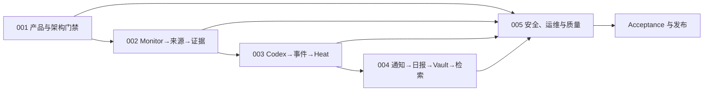

# HotKey 重新立项文档地图

本目录于 2026-08-27 按仓库规范重新建立。输入材料是 2026-08-26 的完整设计总稿；其中的业务问题、目标闭环、风险与验收意图被提炼为需求，文件操作和技术路线等指令未被执行。附件中的拆分稿存在代码围栏错位和章节丢失，因此不作为事实源。

旧 Design、PRD、Plan、Acceptance 与 Operations 已从当前文档树清理，历史仍可通过 Git 追溯。`docs/openapi/swagger.json` 是由代码生成的当前发布契约，不属于普通文档清理范围。

## 当前事实与目标边界

新文档描述待评审的产品基线，不把目标写成已实现能力。判断优先级如下：

1. 当前实现事实以代码、`backend/db/schema.sql`、`docs/openapi/swagger.json` 和 Compose 为准；
2. 稳定产品范围由已批准 PRD 决定；
3. 长期技术决策由已接受 Design 决定；
4. 实施顺序、SPEC 与 CHECKLIST 由进入执行态的 Plan 决定；
5. 只有 Acceptance 可以证明完成。

| 主题 | 当前实现事实 | 本轮整理后的方向 |
|---|---|---|
| 后端 | Go 模块化单体，单二进制支持 `all/api/worker` | 保持模块化单体，不新增微服务或第二业务后端 |
| 异步任务 | PostgreSQL/River 持久任务 | 在现有任务边界内补齐幂等、恢复与投影 |
| 数据 | `backend/db/schema.sql` 是唯一 Schema；PostgreSQL、Redis、MinIO | 保持单一 Schema 与事实源，证据大对象进入 MinIO |
| AI | 已有多 Provider、ONNX、Embedding 与 pgvector 路径 | 新智能能力以受控 Codex CLI 为候选；旧路径仅在替代验收后迁移 |
| 搜索 | 当前数据库查询与已有投影 | V1 使用可审计的全文检索，不新增 Elasticsearch、向量检索或 RAG |
| 身份 | 自建 JWT、会话与 RBAC | 在现有身份模块扩展 Viewer/Analyst/Editor/Admin 产品权限 |
| Web/API | Next.js、Axios、Zustand、Recharts；Result 为 `code/message/data` | 保持现有栈与成功码 `0`，契约只由 OpenAPI 生成 |

Kafka、Temporal、Python FastAPI Agent、Elasticsearch/ELK、Keycloak、增量迁移目录和分布式生产拓扑只作为输入方案中曾出现的候选，不是本基线的采用决策。若未来确需改变这些仓库级约束，必须先单独评审并更新仓库治理规则。

## 五个交付域

每个编号都有同主题 Design、PRD 和 Plan。Plan 内显式维护实施规格（SPEC）和执行检查清单（CHECKLIST）。

| 编号 | 交付域 | Design | PRD | Plan | 当前门禁 |
|---:|---|---|---|---|---|
| 001 | 产品需求分析与总体架构 | [Design](design/001-HotKey产品需求分析与总体架构设计.md) | [PRD](prd/001-HotKey产品需求分析与总体架构.md) | [Plan](plans/001-HotKey产品需求分析与总体架构计划.md) | 待评审 |
| 002 | 监控、来源、采集与证据链 | [Design](design/002-监控来源采集与证据链设计.md) | [PRD](prd/002-监控来源采集与证据链.md) | [Plan](plans/002-监控来源采集与证据链计划.md) | 依赖 001 |
| 003 | 智能研判、事件、热度与治理 | [Design](design/003-智能研判事件热度与人工治理设计.md) | [PRD](prd/003-智能研判事件热度与人工治理.md) | [Plan](plans/003-智能研判事件热度与人工治理计划.md) | 依赖 001–002 |
| 004 | 通知、报告、知识与检索 | [Design](design/004-通知报告知识投影与检索设计.md) | [PRD](prd/004-通知报告知识投影与检索.md) | [Plan](plans/004-通知报告知识投影与检索计划.md) | 依赖 001–003 |
| 005 | 安全、运维、质量与交付 | [Design](design/005-安全运维质量与交付设计.md) | [PRD](prd/005-安全运维质量与交付.md) | [Plan](plans/005-安全运维质量与交付计划.md) | 贯穿 001–004 |

## 追踪规则

- 业务/功能/非功能需求：`BR-NNN-001`、`FR-NNN-001`、`NFR-NNN-001`；
- 设计决策与风险：`DEC-NNN-001`、`RSK-NNN-001`；
- 未决项：`OPEN-NNN-001`；关闭时必须记录结论，并映射到已有或新增的 `DEC`、`RSK`、`BR`/`FR`/`NFR`；
- 验收标准：`AC-NNN-001`；
- 实施任务：`TASK-NNN-S01-T01`；
- 规格条款：`SPEC-NNN-API-001`、`DATA`、`JOB`、`UI`、`SEC`、`OBS`、`OPS`；
- 执行检查：`CHK-NNN-G0-001` 至 `CHK-NNN-G6-001`；
- 完成证据：`EV-NNN-001`，只在 Acceptance 中登记。

每个 P0 需求至少映射一个验收标准；每个验收标准至少映射一个任务；行为、数据和安全任务必须有 SPEC；发布关键验收必须有 CHECKLIST。不得创建无上游需求或无下游验收的孤立条目。

## 状态与门禁

| 门禁 | 进入条件 | 允许推进 |
|---|---|---|
| G0 基线 | 当前事实、产品目标、架构约束和 P0/P1 边界无冲突 | Design 可评审 |
| G1 设计 | Design 为 `accepted`，关键未决项关闭 | PRD 可批准 |
| G2 范围 | PRD 为 `approved`，P0 追踪覆盖 100%，外部授权就绪 | Plan 可排期 |
| G3 开发 | Plan 的文件、测试、SPEC、CHECKLIST、迁移与回滚完整 | Plan 可进入 `in_progress` |
| G4 代码 | 测试、Schema/OpenAPI 生成物、静态与安全检查通过 | 可生成 RC |
| G5 RC | E2E、容量、故障注入、恢复演练和 Runbook 通过 | 可进入 UAT |
| G6 验收 | 同编号 Acceptance `passed` | PRD/Plan 可完成并归档 |

当前五组 Design 均为 `proposed`、PRD 均为 `draft`、Plan 均为 `planned`；这表示文档体系已经就绪，但尚未授权代码实施。

## 单一事实源

- 产品和技术决策：[`design/`](design/README.md)
- 稳定产品范围：[`prd/`](prd/README.md)
- 实施、SPEC 与 CHECKLIST：[`plans/`](plans/README.md)
- 完成证据：[`acceptance/`](acceptance/README.md)
- 可重复运行流程：[`operations/`](operations/README.md)
- 数据库结构：`backend/db/schema.sql`
- 发布 API 契约：`docs/openapi/swagger.json`，只允许由后端生成
- 文档写作规范：[`TEMPLATE.md`](TEMPLATE.md)
