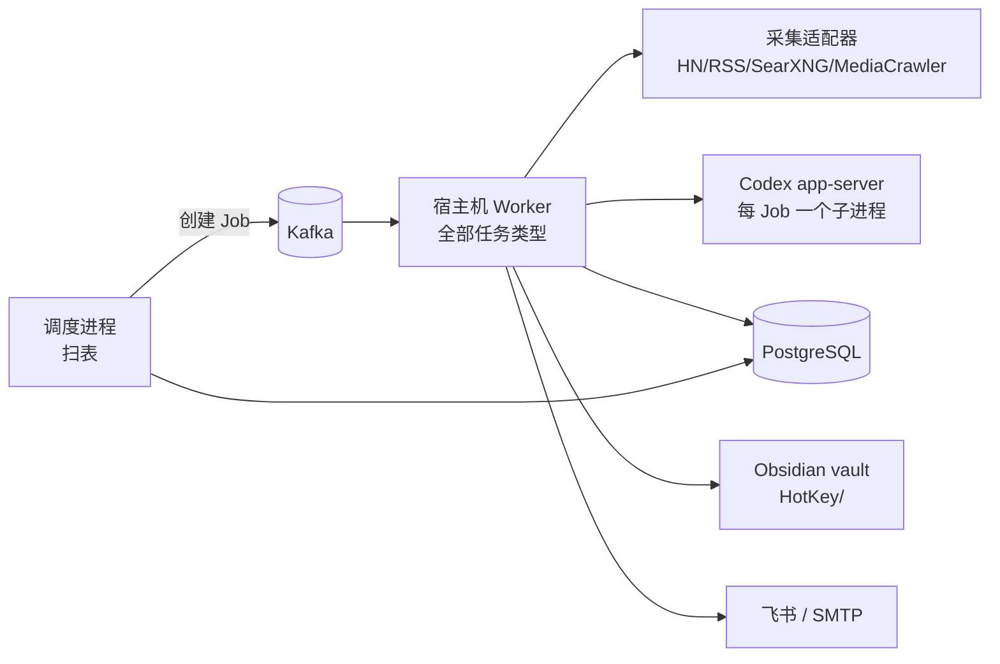

# 热点舆情监控平台总体设计

日期：2026-09-25。本文把 [PRD 001 v2.1](../prd/001-热点舆情监控平台需求.md) 落到现有代码上。v3.0 合并了三方面输入：用户决策（采集栈、Codex、飞书+邮件、Obsidian）、2026-09-25 实测结果、Codex 只读设计评审。v1.x 设计见 Git 提交 `3a72611a`。

## 1. 结论

- **保留底座，补主链路**。任务执行、内容模型、主题规则、身份、来源契约、Web 框架直接复用；新增 `ai`、`analysis`、`reports`、`notifications`、`knowledge`（P1）与 `events`（P2）。
- **不做任务 DAG，用数据库扫表驱动流水线**。一个独立的调度进程按"到期的采集、待采评论的帖子、未分析的内容、到点的报告、待发的推送、待导出的笔记"分别扫表，用确定的 operation ID 创建 Job；重复扫描天然幂等。现有代码没有"上游成功后同事务触发下游"的能力，不去造它。
- **P1 只跑一个宿主机 Worker**。Codex 登录态在宿主机，所有任务类型注册在同一个宿主机 Worker；容器 Worker 在 P1 停用，避免错误角色抢消息。
- **知识库用 Obsidian，不用向量数据库**。HotKey 单向导出 Markdown 到现有 vault 的 `HotKey/` 子目录；问答由 HotKey 用 PostgreSQL 检索 + Codex 回答。取消 v2 设计中的 pgvector 与 `knowledge_chunks`。
- **报告先确定性、后润色**。数字、排序、引用全由程序生成；模型只写带引用编号的句子；模型不可用时输出模板版照常推送。
- **首个竖切是 Hacker News**：预设 → 搜索 → 帖子 → 评论 → 楼中楼 → 重放幂等。它一次验证连接、策略、预算、任务和内容版本的全部前置。

## 2. 问题清单与处理

来源：2026-09-25 代码评审（#1—#10）、实测（#11—#14）、Codex 设计评审（#15—#26）。

| # | 问题 | 位置 | 处理 | 状态 |
|---|---|---|---|---|
| 1 | Worker 只注册 `webpage.collect` | `worker/app.py` `_registered_job_handlers` | 注册 `keyword.search`、`source.comments` 等 | 待做（A 阶段） |
| 2 | 评论无存储路径 | `content/`、`schema.sql` | `content_threads` + `persist_comment_in_transaction` | 已完成 `c10f2a37` |
| 3 | 无周期调度 | `jobs/services.py` | 独立调度进程扫表（第 5 节） | 待做（B） |
| 4 | 无模型与分析代码 | — | `ai` + `analysis`（第 7、8 节） | Codex 客户端已写未提交；其余待做 |
| 5 | `SourcePost` 缺标题、昵称、浏览量 | `sources/contracts.py` | 已补可选字段 | 已完成 `12fdc334` |
| 6 | 无热榜能力 | `sources/contracts.py` | P2 加 `HOTLIST`（同步能力 CHECK 与目录） | P2 |
| 7 | 无检索 | `schema.sql` | Obsidian 浏览 + PostgreSQL `pg_trgm` 检索（第 11 节） | P3 |
| 8 | 横切能力过重 | — | 不再扩展横切门禁 | 持续 |
| 9 | 文档过多 | `docs/` | 已整理为 PRD/Design/Plan 各一份 | 已完成 `e25d4440` |
| 10 | `twscrape` 残留 | `pyproject.toml` | 已移除 | 已完成 `12fdc334` |
| 11 | Codex 每次调用固定约 2 万输入 token | 实测 | 批量标注，一次调用合并相关性+情感+摘要 | 设计已处理 |
| 12 | SearXNG 只有 DuckDuckGo News 带发布时间；时间无时区 | 实测 | 默认该引擎；容器 `TZ=UTC`、无时区按 UTC | 已写未提交 |
| 13 | Reddit 匿名 RSS 易 429 | 实测 | 改为 P4 官方 OAuth | 设计已处理 |
| 14 | RSSHub 热榜无发布时间 | 实测 | 热榜按观察时间计（P2） | 设计已处理 |
| 15 | Codex 子进程继承 Worker 全部环境变量（数据库、MinIO 等凭据） | `ai/adapters/codex_app_server.py` `Popen` | 只传最小环境变量（7.2） | 待修（C） |
| 16 | 每个 Job 在新子进程执行，Codex 无法跨 Job 常驻；Job 硬截止只按 Firecrawl/浏览器计算，模型任务会被提前杀掉 | `worker/app.py`、`worker/execution.py`、`core/config.py` `job_process_execution_timeout_seconds` | 每个分析 Job 内启动一次 Codex；按任务类型配置截止时间（6.2） | 待做（C） |
| 17 | 同一 Kafka group 下宿主机与容器 Worker 会互抢消息，缺处理器即持久失败 | `worker/app.py` | P1 只运行宿主机 Worker（6.1） | 设计已处理 |
| 18 | 设计依赖"上游成功同事务触发下游"，代码中不存在 | `jobs/execution.py` 终结事务 | 改为扫表调度（第 5 节） | 设计已处理 |
| 19 | 无发布时间的条目被关键词发现丢弃 | `content/discovery.py` 候选过滤 | 以首次发现时间计入并标注（4.3） | 待做（A） |
| 20 | 报告没有输入冻结和"采集/分析完成"水位 | — | 报告冻结窗口、截止、内容与标注版本（9.1） | 待做（D） |
| 21 | 来源预设跨三个领域，现有 save 方法各自 rollback 无法组合 | `evidence/services.py`、`jobs/services.py` | 新增 `*_in_transaction` 变体 + 原子预设服务（4.1） | 待做（A） |
| 22 | 任务类型名 `keyword.search` 在三处写死 | `content/discovery.py`、`content/discovery_execution.py` | 沿用 `keyword.search`，不改名 | 设计已处理 |
| 23 | 发现提交把入口写死为 `MANUAL` | `content/discovery.py` | 由 Job 带入口（手动/定时） | 待做（B） |
| 24 | RSS 地址只校验协议且允许任意重定向，存在 SSRF 风险 | `sources/adapters/rss.py`、`http_source.py` | 主机白名单 + 重定向同样校验（4.2） | 待修（A） |
| 25 | `accept_schedule_window` 内部先 rollback，会释放调度器的行锁 | `jobs/services.py` `accept` | 新增 `accept_in_transaction`（5.2） | 待做（B） |
| 26 | 推送"只成功一次"无法保证；发送后崩溃会重复 | — | 投递状态含 `unknown`，不确定时不自动重发（10.2） | 待做（E） |

## 3. 架构总览



流水线顺序由调度进程的扫描条件保证，而不是任务之间互相触发：

| 扫描 | 条件 | 创建的 Job | 阶段 |
|---|---|---|---|
| 采集 | `monitor_schedules.next_run_at <= now` | `keyword.search` | P1 |
| 评论 | 近 24 小时入库、命中主题、互动排名前 N、6 小时内未采评论的帖子 | `source.comments` | P1 |
| 分析 | 有内容版本但缺当前提示词版本标注的内容，按主题攒批 | `analysis.annotate` | P1 |
| 报告 | 报告计划到点，且窗口内分析已完成或到达等待上限 | `report.daily` / `report.weekly` | P1 / P3 |
| 推送 | 已定稿报告缺投递记录 | `notification.send` | P1 |
| 导出 | 报告/事件/主题在上次导出后有变化 | `knowledge.export` | P1—P3 |
| 事件 | 每小时 | `events.cluster` | P2 |

每个 Job 的 operation ID 由扫描对象确定性派生（`uuid5(命名空间, 扫描类型:对象ID:版本)`），重复扫描命中现有唯一约束，不会重复创建。

| 领域 | 状态 | 主责 |
|---|---|---|
| `identity` `monitors` `connections` `jobs` `worker` `content` `sources` `evidence` `backups` `cli` | 已有 | `monitors` 增加调度与报告设置；`connections` 增加来源预设与非机密配置 |
| `ai` | P1 新增 | Codex 客户端、调用记录、频次门禁 |
| `analysis` | P1 新增 | 相关性、情感、摘要、观点标注 |
| `reports` | P1 新增 | 报告冻结、取数、撰写、校验、存档 |
| `notifications` | P1 新增 | 推送目标、投递状态 |
| `knowledge` | P1 新增 | Obsidian 导出；P3 问答 |
| `events` | P2 新增 | 事件归并、热度 |

## 4. 采集

### 4.1 来源预设与连接配置（问题 #21）

目标：`python -m cli sources preset apply hackernews` 一条命令就能让一个来源可用，不再手写 SQL。

- **预设定义** 放在 `connections/presets.py`（纯数据）：来源键、能力、主机白名单、字段用途（准入白名单）、保留天数、组件名/版本/许可、预算上限。
- **原子应用**：`connections/services.py` 新增 `SourcePresetService.apply_in_transaction`，在一个事务中写连接与连接版本、每个能力的准入策略、同版本保留策略、组件策略和来源预算。为此需要给 `evidence` 与 `jobs` 中现有的保存方法补 `*_in_transaction` 变体（现有方法开头都会 rollback）。重复应用同一预设是幂等的；预设内容变化时升版本。
- **连接版本新增 `config JSONB`**：只放非机密配置（RSS 模板、SearXNG 地址、引擎名），由预设写入，禁止出现凭据字段（写入前按白名单校验键名）。
- **目录**：`connections/catalog.py` 增加 `hackernews`、`google_news`、`news_search`（SearXNG）、`rss_<name>`。已有的 `web` 仍专指单网页正文采集。

### 4.2 适配器与安全（问题 #24）

| 适配器 | 状态 | 说明 |
|---|---|---|
| `http_source.py` | 已写未提交 | 公共基类：预算授权、截止、取消、游标防循环、4 MB 上限、状态码映射 |
| `hackernews.py` | 已写未提交，真实冒烟通过 | Algolia：搜索（时间窗过滤、翻页）、评论树展开为带父 ID 的评论页 |
| `rss.py` | 已写未提交，真实冒烟通过 | 任意 RSS/Atom；模板含 `{query}` 时代入关键词 |
| `web_search.py` | 已写未提交，真实冒烟通过 | SearXNG JSON，默认 `duckduckgo news` 引擎 |
| `mediacrawler.py` | P2 | 读 MediaCrawler 结果 → 统一契约 |

安全规则（A 阶段修正）：

- 适配器构造时接收**主机白名单**（来自预设），请求 URL 与每一跳重定向的主机都必须在白名单内，否则 `access_denied`；禁止私网地址（复用 `sources/adapters/web_targets.py` 已有规则）。
- 本地服务（SearXNG `127.0.0.1:8888`、RSSHub `127.0.0.1:1200`）以显式条目加入对应预设的白名单。它们由同级 `Docker` 服务集合的独立 `docker-compose.yml` 管理，Firecrawl 在 `StephenQiu` 独立编排，不再由 HotKey 根编排创建；MediaCrawler 的容器入口仅供按需任务使用，现有 HotKey 宿主子进程接入另行迁移与验收。

### 4.3 时间口径（问题 #19）

- 契约允许 `published_at=None`。关键词发现提交时：有发布时间的按发布时间判断是否落在任务窗口；**没有发布时间的一律接收**，以本次入库的首次发现时间（`content_discoveries.first_observed_at`）作为时间依据。
- 报告与统计的时间依据 = `COALESCE(发布时间, 首次发现时间)`，并对"按发现时间计"的条数单独计数、写入覆盖说明。

### 4.4 评论采集

- 新增 `source.comments` 执行器与 `CommentPageCommitService`（与关键词发现同构：锁租约、校验连接版本和准入、逐条 `persist_comment_in_transaction`、记录游标与计量）。
- 候选帖子由调度进程扫描（第 3 节表格）；每帖一级评论上限 200、每条回复上限 20，按来源能力取热门排序。
- 帖子 24 小时内每 6 小时刷新一次评论，之后停止。

## 5. 调度（问题 #3、#18、#23、#25）

### 5.1 主题设置

`monitors` 为主题新增：来源选择（多选，引用已应用的预设）、采集频率（默认 30 分钟，最短 10）、报告时间（默认 09:00 Asia/Shanghai）、周报开关、推送目标（多选）。主题"就绪"= 至少选了一个已应用预设的来源。

### 5.2 调度进程

- 入口 `python -m worker.scheduler`，与 Worker 分开运行（Kafka 消费是同步逐条执行的，不能把调度塞进消费循环）。
- 每 30 秒一轮，每种扫描各自开一个事务：`SELECT … FOR UPDATE SKIP LOCKED` 领取到期行 → 调用新增的 `JobService.accept_in_transaction`（不 rollback 的受理变体）→ 推进 `next_run_at` → 提交。多个调度进程并存也不会重复。
- `monitor_schedules`：`(owner_id, topic_id, source_key, capability)` 唯一，含 `interval_seconds`、`next_run_at`、`enabled`、`last_job_id`。
- Job 携带入口类型（`schedule` / `manual`），发现提交不再写死 `MANUAL`。

## 6. Worker 拓扑与任务截止（问题 #16、#17）

### 6.1 P1 拓扑

- 宿主机运行 **一个** `python -m worker`，注册全部任务类型；Compose 中的 `worker` 服务在 P1 不启动。
- 吞吐不够时再按任务类型拆 Kafka topic，引入独立的 AI Worker；P1 不做。

### 6.2 按任务类型的截止时间

`core/config.py` 由"全局一个截止时间"改为按任务类型取值：

| 任务类型 | 默认硬截止 |
|---|---|
| `keyword.search` / `source.comments` | 90 秒 |
| `webpage.collect` | 沿用现有计算 |
| `analysis.annotate` | 600 秒 |
| `report.daily` / `report.weekly` | 600 秒 |
| `notification.send` | 60 秒 |
| `knowledge.export` | 60 秒 |

## 7. 模型接入（DEC-001-109）

### 7.1 调用方式

`ai/adapters/codex_app_server.py`（已写未提交，单测 + 真实调用通过）：`initialize` → `thread/start`（`ephemeral`、`read-only`、`approvalPolicy=never`、独立空工作目录、防注入说明）→ `turn/start`（`outputSchema`、显式模型、`effort=low`）→ 收集最终消息与 token 用量；服务端发来的审批类请求一律拒绝。

- 模型必须显式配置：ChatGPT 账号不支持本机默认的 `gpt-6-luna`；P1 用 `gpt-5.6-luna`，由 `HOTKEY_AI_MODEL` 配置。
- 输出根节点必须是对象：批量结果用 `{"items": [...]}`。
- 每个分析 Job 启动一次 Codex 子进程，处理完本批后关闭；不跨 Job 常驻。

### 7.2 进程隔离（问题 #15）

- `Popen` 显式传 `env`，只包含 `PATH`、`HOME`、`CODEX_HOME`、`LANG`；不继承任何 `HOTKEY_*` 变量。
- 工作目录为每个 Job 新建的空临时目录，结束后删除。
- A 阶段额外验证：能否通过 `-c` 配置关闭 Codex 的 shell 工具。能关就关；关不了则在风险表中保留，并依靠"输出只接受结构化字段 + 引用校验"兜底。

### 7.3 调用记录与门禁

- `ai_calls` 表：owner、job、用途、提供方、模型、提示词版本、输入指纹、状态、失败码、各类 token 数、耗时、时间。**不存提示词和回答原文**。
- 每次调用前经预算账本 `analysis_attempt` 预留一次（按小时和并发上限），调用后结算。
- 限流（失败码 `rate_limited`）：Job 以延后重试结束，不计为失败。

## 8. 分析

- 一个任务 `analysis.annotate` 完成相关性、情感、摘要、观点四件事，摊薄每次约 2 万 token 的固定开销。
- **批大小**：≤ 30 条且序列化后 ≤ 24,000 字符；单条正文截取前 1,500 字符；评论按所属帖子分组，每帖最多取 50 条。
- **结果表 `content_annotations`**：唯一键 `(owner_id, content_version_id, topic_id, topic_rule_version, prompt_version)`；字段：相关与否、相关理由、情感、摘要、观点列表、`ai_call_id`。标注绑定不可变的内容版本，正文变了自然产生新版本，需要重新标注。
- 输出用 Pydantic 校验；单条不合法只标该条"未分析"，不影响整批；整批失败按失败码处理。

## 9. 报告

### 9.1 生成步骤（问题 #20）

1. **冻结**：确定主题、窗口（前一自然日 Asia/Shanghai）、截止时间；把窗口内纳入的内容版本 ID、标注 ID、各来源覆盖情况写入 `reports.input_manifest`。同一窗口重新生成使用同一份清单，版本号递增。
2. **等待水位**：09:00 报告任务先检查窗口内是否还有未分析内容；有则延后重试，最迟到 09:10 开始生成，未分析条数写入覆盖说明。
3. **取数（确定性）**：程序计算概览、平台与情感分布、Top 内容、风险内容、代表评论、覆盖说明，得到结构化数据；每条内容带引用编号 `[c12]`。
4. **撰写（可选）**：Codex 按 schema 返回句子列表，每句必须带引用编号；程序只保留引用编号全部存在的句子，数字一律由程序填写。
5. **降级**：Codex 失败、限流或校验不通过时，用模板把结构化数据直接渲染成日报，标注"模板版"。
6. **存档**：`reports` 保存 Markdown、结构化数据、生成方式（model / template）和版本；定稿后才进入推送和导出扫描。

### 9.2 P1 与 P2 的区别

P1 按"重点内容"组织（DEC-001-114）；P2 事件归并上线后，同一模板增加"重点事件 / 新出现事件"区块，数据来自 `events`。

## 10. 推送（DEC-001-110）

### 10.1 渠道与秘密

- 飞书自定义机器人（Webhook + 可选签名密钥）和 SMTP 邮件；企业微信延后。
- 秘密只从环境变量读取（`HOTKEY_FEISHU_WEBHOOK_URL`、`HOTKEY_FEISHU_SECRET`、`HOTKEY_SMTP_HOST/PORT/USER/PASSWORD/FROM`）；`notification_targets` 表只存目标名、类型、收件人和所用环境变量名。
- 飞书发摘要卡片：概览 + Top 3 + Web 报告链接 + Obsidian 链接（`obsidian://open?vault=Obsidian&file=HotKey/日报/…`）；邮件发完整 HTML（由同一 Markdown 渲染）。

### 10.2 投递状态（问题 #26）

- `notification_deliveries` 唯一键 `(report_id, report_version, target_id)`；状态 `pending → sending → succeeded | failed | unknown`。
- 发送前先把状态提交为 `sending`；请求前就失败（连接不上、4xx 参数错）记 `failed`，可自动重试 3 次；请求已发出但超时或进程中断，记 `unknown`，**不自动重发**，在 Web 上提示人工确认。

## 11. Obsidian 知识库（DEC-001-111/112）

### 11.1 写入位置与结构

- vault：`~/Desktop/Markdown/Obsidian`（`HOTKEY_OBSIDIAN_VAULT_PATH`），HotKey 只写 `HotKey/` 子目录（`HOTKEY_OBSIDIAN_ROOT=HotKey`）。

```
HotKey/
├── 日报/2026-09-25 小米SU7.md          P1
├── 周报/2026-W39 小米SU7.md            P3
├── 事件/<事件标题>.md                  P2
├── 主题/小米SU7.md                     P3
├── 帖子/<平台>/<标题前 40 字>-<短ID>.md  P2（只收被报告或事件引用的）
└── 问答/2026-09-25 <问题前 30 字>.md     P3
```

### 11.2 笔记格式

- **frontmatter**：`hotkey_id`、`type`（daily/weekly/event/topic/post/qa）、`topic`、`date`、`platform`、`sentiment`、`heat`、`source_url`、`generated_at`、`generator`。便于 Obsidian 属性视图和 Dataview 筛选。
- **正文**分两块：`<!-- hotkey:begin -->` 与 `<!-- hotkey:end -->` 之间由 HotKey 管理，每次导出整体替换；标记之外（含预置的"## 我的笔记"）归用户，导出时原样保留。
- **双链**：日报链接到帖子/事件/主题笔记（`[[帖子/…]]`）；引用的目标笔记不存在时先导出目标，保证链接不悬空。

### 11.3 写入规则（NFR-001-109）

- 路径由 HotKey 生成：去掉 `/\:*?"<>|` 和控制字符，限长，追加短 ID 防重名；最终路径必须位于 `HotKey/` 内（解析后校验）。
- 原子写：写同目录临时文件 → `fsync` → `rename`。
- `knowledge_exports` 表记录 `(owner_id, object_type, object_id)` → 相对路径、内容哈希、导出时间；内容哈希不变则跳过。
- vault 不存在或不可写时 `knowledge.export` 失败并重试，不影响报告推送。

### 11.4 问答（P3）

- 入口：Web 页面或 `python -m cli knowledge ask "问题"`。
- 检索：PostgreSQL `pg_trgm`（对内容版本标题/正文、报告、事件摘要建三元组索引），Codex 先把问题改写为 3—5 个检索词，取前 20 条资料。
- 回答：Codex 按 schema 返回句子列表，每句带资料编号；程序去掉无有效编号的句子；有效资料少于 3 条时直接回答"资料不足"。
- 结果存 `knowledge_answers` 表并导出为 `问答/` 笔记，引用链接到对应帖子笔记或原帖。

## 12. 事件归并（P2）

- 不用向量：候选分组用 `pg_trgm` 标题相似度（初值 ≥ 0.4）+ 共同命中关键词 + 72 小时时间窗；每个候选组交给 Codex 确认是否同一事件，并生成事件标题和摘要。
- 热度 = Σ log(1 + 赞 + 2×评 + 3×转 + 0.01×浏览) × 来源权重 + 帖子数加成；公式版本写入快照。新出现：首个成员落在窗口内；升温：近 3 小时热度增量 ≥ 前 24 小时平均每 3 小时增量的 3 倍。
- 人工合并/拆分优先，自动聚类不覆盖。

## 13. 任务类型

| kind | 领域 | 阶段 | 由谁创建 |
|---|---|---|---|
| `webpage.collect` | content | 已有 | Web 手动 |
| `keyword.search` | content | P1 | 调度（采集扫描）、手动 |
| `source.comments` | content | P1 | 调度（评论扫描） |
| `analysis.annotate` | analysis | P1 | 调度（分析扫描） |
| `report.daily` | reports | P1 | 调度（报告扫描）、手动重生成 |
| `notification.send` | notifications | P1 | 调度（推送扫描） |
| `knowledge.export` | knowledge | P1 | 调度（导出扫描） |
| `events.cluster` | events | P2 | 调度 |
| `source.hotlist` | content | P2 | 调度 |
| `report.weekly` | reports | P3 | 调度 |
| `alert.evaluate` | events | P4 | 调度 |

## 14. 保留、冻结与移除

| 类别 | 内容 |
|---|---|
| 保留并使用 | 046 错误契约；031 可靠执行；009 任务控制；003 主题；007 内容；038 来源契约；034 会话/CSRF；035 owner 隔离；036 来源准入与保留；037 预算账本（来源频次与模型调用门禁）；047 网页与浏览器采集 |
| 冻结 | 032 备份 S03+；033 公平派发与熔断；028 S02+ 复算；029 S03 缺口传播；039 S02+；040；042 B0；010 历史回补；Flutter App |
| 取消 | v2 设计中的 pgvector、`knowledge_chunks`、PostgreSQL 镜像更换；企业微信（延后）；团队协作 |
| 已移除 | 044、045；`twscrape` |

## 15. 风险

| ID | 风险 | 应对 |
|---|---|---|
| RSK-001-201 | B/C 档平台反爬、接口变动、登录态失效 | 适配器隔离；契约测试 + 每日冒烟；报告注明缺失来源 |
| RSK-001-203 | 模型幻觉进入报告 | 数字由程序填写；句子必须带有效引用编号；否则降级为模板 |
| RSK-001-204 | 平台合规与账号风险 | 只采公开数据；MediaCrawler 仅非商业研究；使用小号、限频 |
| RSK-001-206 | Codex 账号限流或模型下线 | 显式模型配置；限流延后；报告可降级；适配器可替换 |
| RSK-001-207 | 提示注入诱导 Codex 读取本机文件并写进输出 | 最小环境变量；空工作目录；尽量关闭 shell 工具；输出只接受结构化字段并校验引用 |
| RSK-001-208 | Obsidian 同步或用户编辑与导出冲突 | 只替换管理区块；原子写；哈希比对；vault 选用非 iCloud 路径 |
| RSK-001-205 | 重建数据库丢失开发数据 | 当前库无业务数据；上线后按备份 → 新建 → 导入流程 |

## 16. 决策

| ID | 决策 |
|---|---|
| DEC-001-202 | 数字由程序计算，模型只写带引用编号的句子；不通过校验则降级为模板 |
| DEC-001-203 | 流水线由独立调度进程扫表驱动，确定性 operation ID 保证幂等；不做任务链式触发 |
| DEC-001-205 | P1 只运行一个宿主机 Worker，注册全部任务类型 |
| DEC-001-206 | 任务硬截止按任务类型配置 |
| DEC-001-207 | Codex 每个分析 Job 启动一次，只传最小环境变量 |
| DEC-001-208 | 知识库检索用 PostgreSQL `pg_trgm`，不引入向量库；取代 DEC-001-201（pgvector）与 DEC-001-204（jieba 分词） |
| DEC-001-209 | 沿用任务类型名 `keyword.search` |
| DEC-001-210 | 推送秘密只从环境变量读取；投递结果不确定时不自动重发 |
| DEC-001-211 | Obsidian 导出只写 `HotKey/` 子目录的管理区块，原子写，按内容哈希去重 |

## 17. Web 公开首页视觉切片（知微见澜 / Ripplesight）

- **范围与信息架构**：公开首页解释“用户用关键词定义品牌、产品或话题的监控主题”，主入口通往现有主题创建流程。AI 是后续整理与分析能力，不是监控对象的限定。首页不展示模拟实时事件、统计值或未验收的数据；事件脉络只作能力说明，沿用 P2 阶段边界。
- **视觉**：采用用户选定的方案 1，沿用 Geist、浅色表面、黑色主操作和柔和青蓝紫粉渐变。首页以标题、简短说明和单个主操作建立层级，减少密集卡片与装饰性边框；装饰波纹不承载语义。
- **组件与目录**：`SiteHeader`（公开首页专属，`frontend/src/app/components/site-header.tsx`）负责品牌和登录入口；`HeroSection`（同目录 `hero-section.tsx`）负责主张、主题创建入口与视觉；`CapabilityOverview`（同目录 `capability-overview.tsx`）负责简短追踪步骤；`HomeContent`（同目录 `home-content.tsx`）组合上述组件。上述页面组件由静态产品文案提供数据，仅在首页使用。`BrandMark` 与 `BrandLockup`（`frontend/src/components/brand/brand-lockup.tsx`）在公开首页、登录页和工作台页稳定复用，只有静态品牌与目标链接，无加载/错误状态。基础按钮沿用现有 shadcn `Button`，在 `frontend/src/components/ui/button.tsx` 增加通用大尺寸。
- **状态与可访问性**：静态首页无加载、空、部分数据、API 错误或权限状态；主题创建和登录由各自现有路由处理认证与错误。窄屏保持单列阅读顺序，链接支持键盘焦点，装饰元素 `aria-hidden`，动效遵循减弱动态效果设置。
- **工作台入口**：`EventsWorkspace`（`frontend/src/app/events/components/events-workspace.tsx`）保持现有 owner、退出和加载/错误/无权限状态，只调整信息层级：关键词定义的监控主题优先，事件归并明确标为建设中；不显示虚构事件。`TopicList`（`frontend/src/components/monitors/topic-list.tsx`）沿用生成 API 与加载/空/错误/已归档状态，卡片只显示主题名称与运行状态，规则数量和版本留给详情页，以降低首页信息密度。
- **品牌元数据**：`frontend/src/app/layout.tsx`、`manifest.ts` 与唯一 `icon.svg` 母版使用“知微见澜 / Ripplesight”；工作台各入口标识、登录和全局错误文案同步品牌，数据契约不因本切片更改。

## 18. Web 账户入口与主题创建组件切片

- **入口和权限**：`/login` 使用现有 `createIdentitySession`；`/register` 仅承接首次部署的 owner 初始化，使用生成的 `initializeOwner`，要求部署者提供 `X-HotKey-Bootstrap-Token`，成功后建立会话。该页明确不支持访客自行注册；已初始化的 409 状态引导登录。两个私有入口均为 `noindex`，不展示密钥或密码，不新增客户端身份契约。
- **视觉与组件**：`AuthShell`（auth，`frontend/src/components/auth/auth-shell.tsx`，登录和初始化稳定复用）负责品牌、较大尺度的柔和渐变、卡片式表单容器和返回入口，只有静态展示状态；`CredentialsFields`（auth，同目录 `credentials-fields.tsx`，两页复用）组合 shadcn `Field`、`Input` 与 `InputGroup`，根据登录或初始化选择密码自动完成语义及禁用状态。`LoginForm`（login，现有页面专属文件）与 `RegisterForm`（register，新增页面专属文件）各自拥有提交、错误和跳转逻辑。静态文案来自页面；会话结果与错误来自生成身份 API。基础 `Card`、`Alert`、`Field`、`InputGroup` 和 Radix `Label` 保持在 `components/ui/`。
- **主题创建**：`TopicForm`（monitors/new，现有页面专属文件）用上述 `Field`、`Card`、`Alert` 组合主题名称和提交反馈，继续使用现有生成 API、来源选项和关键词规则，不改变保存行为或状态机。
- **状态与可访问性**：登录和初始化覆盖空输入、浏览器字段校验、提交中、凭据错误、初始化令牌错误、已初始化冲突、网络/API 错误和成功跳转；服务器错误保留请求编号。主题创建维持会话检查、加载、错误、无权限及提交状态。输入有可见标签，密码显隐为键盘可操作按钮，错误使用语义提示。布局在窄屏为单列，装饰图形隐藏于辅助技术并遵循减弱动态效果设置。

## 19. Web 品牌标志切片

此为选型过程中的首版 SVG，最终母版与页面引用以第 20 节为准。

- **图形**：一个观察点和两道向外展开的波纹，表达由单个关键词追踪到更广的事件脉络。标志使用 `#171717` 深色圆角底和白色线条，遵循根 `DESIGN.md` 的小尺寸单色规则；品牌渐变继续只用于首页与账户页的大面积背景。
- **资产与组件**：`frontend/src/app/icon.svg` 是唯一矢量母版，同时提供 Next.js Metadata 图标和 Manifest 图标。`BrandMark`（brand，`frontend/src/components/brand/brand-lockup.tsx`）在公开首页、登录与初始化入口、工作台复用该 SVG；`BrandLockup` 继续组合图形与现有名称，属于相同复用范围。标志与名称为静态本地资源，无加载、空、部分、错误或权限状态；图片加载失败时仍保留可读品牌名称。
- **名称边界**：本轮提供名称备选，但未获用户选定前不修改页面名称、SEO 元数据或应用身份。采用新名称时需一次性更新全部品牌文案和元数据，并另行核查商标与域名可用性。

## 20. 选定的 Web 品牌标志

- **选择与修正**：用户选择三款标志中的第 1 款。保留其左侧展开的视窗轮廓、右侧开口和单个观察点；将概念图过暗的黑底深灰表现修正为白底深色高对比版本，适配现有浅色页面。
- **资产与引用**：选定图形的 `frontend/src/app/icon.png` 是唯一品牌图标母版，由 Next.js Metadata 文件路由、`BrandMark` 和 Manifest 引用。`BrandMark` 继续在公开首页、登录、首次初始化和工作台复用；名称文案沿用“知微见澜 / Ripplesight”。图标为静态本地资源，无业务加载、空、部分、错误或权限状态；文本名称继续提供可读回退。

## 21. P1 运行时前置条件校准

- **模型协议与预算**：Codex app-server 初始化声明 `experimentalApi`，以支持当前 `thread/start.environments` 请求。`AiService` 与管理命令使用同一个 `codex.app-server` 组件键。部署者可运行 `jobs budget-baseline`，在唯一 owner 下用单次数据库事务写入全局网络请求、分析尝试的每日上限及本地 Codex 组件策略；命令不输出凭据，未初始化 owner 时失败。
- **调度与采集窗口**：独立调度进程先导入完整 ORM 注册表，再配置映射。采集窗口从上一窗口终点或首轮间隔起点回看，默认回看一天，配置上限为七天；按来源帖子身份去重，重复扫描仍依赖确定性 operation ID 和数据库约束。回看会增加来源请求与扫描量，受预算策略约束。
- **36Kr 来源**：`rss_36kr` 从本地 RSSHub 的 `/36kr/newsflashes` 读取快讯，预设同步标明 RSSHub 组件版本、许可及来源入口。RSSHub 不可用或返回异常时保留采集失败状态，不将空数据视为成功。
