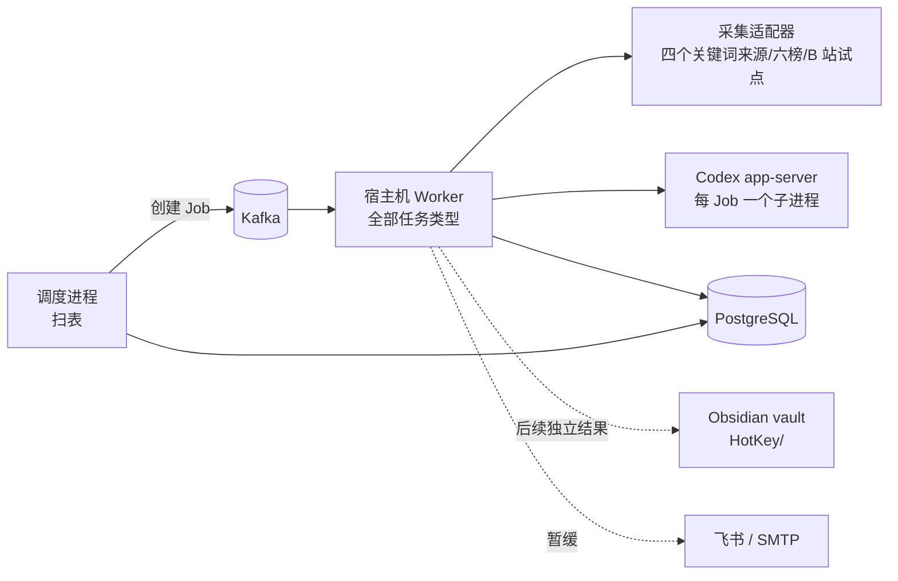

# 热点舆情监控平台总设计

日期：2026-09-26。v4.0 将 v3.2 的能力细节正向拆至 Design 002—007，保留跨里程碑架构、证据、决策和风险。Design 002—007 各为能力 Epic；PRD 保持 001—007，逐 Issue 执行 Plan 独立从 001 连续编号。拆分依据是本次工作树的 v3.2；现行需求与执行见[文档索引](../README.md)。

## 1. 结论

- **信息获取是当前核心**：按主题从逐一验收的来源持续获取帖子、评论与热榜，保留来源、时间、覆盖缺口和失败原因；相关性判断服务于检索和阅读。日报、Obsidian 知识库与推送分别作为后续独立结果验收；飞书推送暂缓，不能卡住信息获取验收。
- **保留底座，按能力验收**。任务、内容、主题、身份、来源契约和 Web 框架复用；`ai`、`analysis`、`reports`、`notifications`、`knowledge` 已有代码，`events` 尚未落地。代码存在与受控测试通过都不等于真实连续运行或产品验收。
- **不做任务 DAG，用数据库扫表驱动流水线**。独立调度进程分别扫描采集、评论、热榜、分析、报告、推送和导出，用确定性 operation ID 创建 Job；重复扫描由数据库约束幂等。各结果的启用与验收相互独立。
- **P1 只跑一个宿主机 Worker**。Codex 登录态在宿主机，所有任务类型注册在同一个宿主机 Worker；容器 Worker 在 P1 停用，避免错误角色抢消息。
- **知识库用 Obsidian，不用向量数据库**。HotKey 单向导出 Markdown 到现有 vault 的 `HotKey/` 子目录；问答由 HotKey 用 PostgreSQL 检索 + Codex 回答。取消 v2 设计中的 pgvector 与 `knowledge_chunks`。
- **报告先确定性、后润色**。数字、排序、引用由程序生成；模型只写带引用编号的句子；模型不可用时输出模板版。报告生成、知识库写入和推送分别验收，不能因其中一项可用而宣布另一项完成。
- **来源逐项验收**：四个关键词来源、六个公开热榜与本人账号 B 站试点分别证明真实采集、持久化、分析与覆盖；微博等登录平台暂不接入。HN 仍用于评论父链与重放的基础验证。

## 2. 当前能力与证据分层

状态以 2026-09-26 工作树中的 `backend/app`、`backend/database/schema.sql` 和运行记录为准。**代码已合入**指仓库已有实现；**受控测试通过**指单测、集成测试或离线回放；**真实运行通过**记录实际来源或外部依赖的运行范围；**产品验收**须满足对应来源、时间窗及连续性标准。下表真实运行数值来自 Claude 在本机开发库 `hotkey_p1` 的 2026-09-26 执行记录；同日 12:15—16:32 宿主机 Worker、调度和 API 连续运行约 4 小时，之后按用户要求停止。该库可重建，记录仅属开发验证证据；连续 3 天的产品验收尚未通过。概览见 `BACKLOG.md`“当前迭代”，明细以本机 `hotkey_p1` 库为准。

| 能力 | 代码已合入 | 受控测试通过 | 真实运行通过 | 产品验收 |
|---|---|---|---|---|
| 四个来源的 `keyword.search`、调度与持久覆盖窗口 | 是：`worker/app.py`、`worker/scheduler.py`、`content/`、`jobs/` | 有单测及新建库测试记录 | 开发库约 4 小时运行，主题“AI 编程助手”“人工智能”、24 小时回看；入库 `google_news` 365、`news_search` 94、`hackernews` 61、`rss_36kr` 8 | 未通过连续 3 天验收；回看不证明完整覆盖 |
| `source.comments` | 是：`worker/app.py`、`content/`、`jobs/` | 有受控测试记录 | 同日较早一轮 HN 评论 45 个线程真实入库；该库随后因新表重建，不能与当前库统计合并 | 未通过重放及连续运行验收 |
| Codex 调用、`analysis.annotate` 与标注表 | 是：`ai/`、`analysis/`、`content_annotations` | 有受控测试记录 | 开发库真实标注 738 条：相关 707、不相关 28、相关字段为空 3；质量抽检未完成 | 未通过 |
| 六榜 `source.hotlist`、快照/条目、最新榜 API | 是：`rsshub_hotlist.py`、`hotlist*.py`、调度与路由 | 有受控测试记录 | 开发库六榜共 59 份快照；最近 2 小时 23 成功、1 失败；首轮命中主题 12 条入库，Codex 判相关 7 条 | 未通过连续运行及逐榜覆盖验收 |
| B 站 MediaCrawler 搜索及同轮缓存评论 | 是：`mediacrawler.py`、B 站预设与 Worker 装配 | 新建库离线回放 5 条视频、2 条评论的记录 | 修复前两次真实运行失败：综合排序返回旧视频、空简介导致整页回滚；均无验证码。修复后尚未真实运行，开关默认关闭 | 未通过 |
| 日报、Obsidian 导出、飞书通知 | 是：`reports/`、`knowledge/`、`notifications/`；SMTP 未见实现 | 有受控测试记录 | 连续真实送达与 vault 写入未证实 | 各自未通过；推送暂缓 |

本表不以 HTTP 200、RSS 可解析、容器就绪、离线回放或单个成功 Job 推断整条来源链路。`hotkey_p1` 的四来源入库、六榜快照与 Codex 标注证明了上述开发运行范围，不证明 72 小时持续覆盖、评论完整性或来源产品验收。现有 `SourcePreset.component_version` 对 B 站仍记 `mediacrawler-380b426-hotkey-safe`，而适配器校验补丁后提交 `fb4e6c5…`；见 [M2 设计](003-本人账号B站试点设计.md) 与本设计 §8 的待修口径。

## 3. 架构总览

流水线顺序由调度进程的扫描条件保证，而不是任务之间互相触发：

| 扫描 | 条件 | 创建的 Job | 阶段 |
|---|---|---|---|
| 关键词采集 | `monitor_schedules.next_run_at <= now`，叠加来源节奏 | `keyword.search` | 信息获取，已有代码 |
| 评论 | 到期的高互动已入库帖子；B 站只读同轮缓存 | `source.comments` | 信息获取，已有代码 |
| 热榜 | 已应用热榜来源，独立间隔默认1800秒且可配置；M1窗口冻结实际间隔 | `source.hotlist` | 信息获取，已有代码 |
| 分析 | 有内容版本但缺当前规则/提示词标注，按主题攒批 | `analysis.annotate` | 信息获取，已有代码 |
| 报告 | 报告计划到点，且窗口内分析已完成或到达等待上限 | `report.daily`；`report.weekly` 待实现 | 后续独立验收 |
| 推送 | 已定稿报告缺投递记录 | `notification.send` | 暂缓；不作信息获取门禁 |
| 导出 | 报告等对象在上次导出后有变化 | `knowledge.export` | 后续独立验收 |
| 事件 | 事件归并能力上线后扫描 | `events.cluster` | 后续，未实现 |

每个 Job 的 operation ID 由扫描对象确定性派生（`uuid5(命名空间, 扫描类型:对象ID:版本)`），重复扫描命中现有唯一约束，不会重复创建。

| 领域 | 状态 | 主责 |
|---|---|---|
| `identity` `monitors` `connections` `jobs` `worker` `content` `sources` `evidence` `backups` `cli` | 已有代码 | 主题、预设、调度、内容与覆盖事实；具体能力看第 2 节 |
| `ai`、`analysis` | 已有代码 | Codex 调用与标注；质量抽检和真实运行另验 |
| `reports`、`notifications`、`knowledge` | 已有代码 | 日报、飞书、Obsidian；SMTP、周报、知识库问答仍待实现或验证 |
| `events` | 未见业务实现 | 事件归并、热度在后续阶段 |

## 4. 里程碑设计索引

| 里程碑 | 设计 | v3.2 承接章节 | 现行需求/计划 |
|---|---|---|---|
| M1 | [002 信息获取主链路](002-信息获取主链路设计.md) | §4.1—4.4、4.6、5、6/7/8 中信息获取、§21 | PRD 002 / Plan 001—009、031—041 |
| M2 | [003 本人账号 B 站试点](003-本人账号B站试点设计.md) | §4.5、§6 截止与 §15 风控 | PRD 003 / Plan 010—013 |
| M3 | [004 事件与热度](004-事件与热度设计.md) | §12、§13 事件任务 | PRD 004 / Plan 014—016、042 |
| M4 | [005 报告与知识库](005-报告与知识库设计.md) | §8 质量、§9、§11 | PRD 005 / Plan 017—023、043、052 |
| M5 | [006 推送](006-推送设计.md) | §10 | PRD 006 / Plan 024—026、044 |
| M6 | [007 扩展能力](007-扩展能力设计.md) | 扩展来源、账号、告警、导出边界；仍待逐项准入 | PRD 007 / Plan 027—030、045—050、053—054 |

共享运行库保留与恢复由Plan051承接；共享底座的已交付证据、维护责任及剩余工作见[Plan索引](../plan/README.md)。本轮执行合同补全仍属v4.0架构下的待实施细则，子Design更新至v1.1；新增表/端点/任务不表示当前已有实现。

| 待实施细则 | 所属设计与执行合同 |
|---|---|
| collection_due_windows、版本化SourceExecutionPolicy、采集周期时钟、覆盖/指标读API | Design002；Plan002/004/006/031—034 |
| events/event_members/event_candidates/event_revisions/event_heat_snapshots；候选与人工修订并发 | Design004；Plan014—016/042；events域仅实施时登记并加架构门禁 |
| monitor_topics既有报告设置字段、两阶段冻结、knowledge_documents/knowledge_answers、vault文件冲突保护 | Design005；Plan018—023/043/052 |
| 不可变收件身份、默认关闭、attempt/resolution审计、SMTP | Design006；Plan024/025/044；飞书026暂缓 |
| 告警/账号、报告及原始导出、逐来源准入 | Design007；Plan027—030/045—050 |

新增Job仍由既有独立调度/单Worker执行：events.cluster（600秒）、events.heat（60秒）、knowledge.index（60秒/100对象）、knowledge.answer（600秒）、report.export/content.export（120秒）；report.weekly沿用600秒，notification.send沿用60秒。account.scan复用获准来源截止；alert.evaluate的评估频率5分钟、发送复用notification.send。工程保护值以所属Plan/Design为准，受控及真实验证前不宣称性能达标。跨领域经服务DTO/同Session事务，单一schema.sql、既有MinIO和数据库恢复门槛保持一致。

## 5. 跨里程碑约束

- **调度/任务**：独立 `python -m worker.scheduler` 扫表，在业务事务中以确定性 operation ID 创建 Job/Outbox；Kafka 是唤醒，PostgreSQL 的状态/租约/预算/覆盖是事实。Worker 处理业务事务后提交连续完成 offset。各来源节奏由版本化预设与主题频率取更保守值；M1、M2 分别详述实际来源。
- **Worker 拓扑**：当前只有一个宿主机 Worker 注册全部任务；容器 Worker 不参与 P1。Worker 父进程拥有 Kafka Consumer/offset，单任务子进程受进程硬截止和有界回收；任务类型默认值及重试时间口径见下节。不得用业务协作式截止代替硬截止。
- **模型接入/隔离**：本机 Codex app-server 每分析 Job 一个进程，适配器按 `initialize` → `thread/start`（ephemeral、read-only、approvalPolicy=never）→ `turn/start`（outputSchema、显式模型）调用。`HOTKEY_AI_MODEL` 显式选模型，批量输出根节点为对象；`Popen` 只传 `PATH`、`HOME`、`CODEX_HOME`、`LANG`，每 Job 独立空工作目录，拒绝审批类工具请求并在结束后清理。输入是非可信文本，结构化输出和引用受校验。`ai_calls` 只记 owner、Job、模型、版本、输入指纹、状态、token、耗时等元数据而非原文；`analysis_attempt` 调用前预留预算，限流延后。模型不可用时报告可模板降级；M1 标注与 M4 质量分别验收。
- **预算**：来源每轮、每日及全局请求/时间上限和模型尝试由持久预算账本约束；自动重试、限流重排和租约重放只使用剩余额度。旧 Design 037 费用与资源约束已删除，见 Git 历史。付费模型不请求；X 在凭据与月上限明确前零真实请求。
- **HTTP 契约**：路由装饰器/Pydantic 为唯一源；API 边界映射稳定 ErrorView，成功资源/分页/受理 DTO 类型化，运行 OpenAPI 生成前端客户端。046 S03 技术门禁已有真实通过证据（含 AC-046-006 本地上游验证）；旧 Design 046 与 Acceptance 046 已删除，见 Git 历史。现行错误码、请求 ID、脱敏与 422 规则见 PROJECT.md 和 AGENTS.md。
- **安全与数据**：仅公开或本人授权数据；登录平台验证/限流停用并人工恢复。凭据不入库、日志、模型或 Git。来源适配器校验主机白名单与每跳重定向，owner 读写隔离；真实来源状态只凭持久化证据推进。所有里程碑区分代码、受控、真实与产品四层。
- **数据库**：`backend/database/schema.sql` 是全新空库唯一 DDL，开发库可在明确可丢弃时重建；连续验收库和正式库保留事实时，先验证备份，再新库原子建表、导入、核对和切换。完整门槛见下节。
- **共享底座责任**：现有身份、公开Web、预算/任务、证据、HTTP契约、CI与通用网页/浏览器实现按[Plan索引共享台账](../plan/README.md#已交付共享底座台账)登记代码、受控证据和维护责任。051演练运行库恢复，055回归证据保留/删除/谱系，056维护OpenAPI→客户端/CI，057冻结通用网页与Browser底座直至目标来源和授权确定；这些技术结果不能冒充平台接入或产品AC。

## 6. 共享任务与恢复

### 6.1 按任务类型的默认硬截止

`core/config.py` 已按任务类型计算进程硬截止；B 站当前仍有来源键特判，待 [M1/M2 设计](002-信息获取主链路设计.md)所述预设节奏迁移。Job 采集预算 `max_seconds` 与进程硬截止分别生效，硬截止须覆盖启动、处理、终止与持久化余量。

| 任务类型 | 默认硬截止 |
|---|---|
| `keyword.search` / `source.comments` | 90 秒 |
| B 站 `keyword.search` / `source.comments` | 240 秒进程硬截止；搜索 Job 最多 220 秒 |
| `source.hotlist` | 60 秒进程硬截止；请求预算 45 秒 |
| `webpage.collect` | 沿用现有计算 |
| `analysis.annotate` | 600 秒 |
| `report.daily` / `report.weekly` | 600 秒 |
| `notification.send` | 60 秒 |
| `knowledge.export` | 60 秒 |

### 6.2 首次启动、尝试与采集预算

- `jobs.started_at` 是**同一 Job 首次成功领取执行权的时间**，自动重试、限流后重排和手动重试都不得覆盖，用于首次启动时延与整单历时。`job_attempts.started_at` 是**当前尝试的开始时间**，每次重新领取新增一行，用于本次执行耗时。采集预算起点单独定义为 `collection_budget_started_at`（可持久字段或与当前尝试关联的稳定派生值），计算 `deadline = budget_started_at + max_seconds`；不能隐式复用 `jobs.started_at` 作为所有重试的预算起点。
- 首次领取时三者时间一致。自动重试、限流后重排、租约重放属于**同一采集预算周期**：保留预算起点，只获得剩余时间与请求配额；已结算请求不返还。用户明确发起的手动重试在校验连接和权限后开启**新采集预算周期**，起点取下一次实际领取时间，不把排队等待算入新预算；它只重置该 Job 的时间/请求上限，来源每日与全局预算继续累计。原 Job、`started_at`、operation ID、历史尝试与失败记录保留，必要时新增预算周期序号以隔离同一操作的幂等计量。重复点击手动重试保持幂等，不反复刷新预算。
- 现有代码 `JobExecutionService.acquire` 仅在空值时设置 `jobs.started_at`，`request_retry` 不更新它；关键词和评论执行器用它直接计算截止，故首次启动两分钟后手动重试可能立即耗尽。上述转换尚待 A7b 实现和测试。修复后分别报告**排队等待**（受理/到期至尝试开始）、**单次执行**（尝试开始至结束）、**整单历时**（首次开始至最终结束）及**当前预算已用/剩余**；不得用重置 `started_at` 美化耗时。验收须覆盖首次失败后两分钟手动重试可采、自动重试只用剩余预算、限流重排、重复点击与指标不倒退。

### 6.3 数据库重建门槛

- `backend/database/schema.sql` 是全新空库唯一 DDL。可丢弃的本机开发库可停服务后用它重建，并重新加载受控样本；重建会删除原库事实，不把重建后的测试通过写成旧运行数据已保留。
- 卡 F 的连续运行库和正式运行库需要保留内容、Job、覆盖、预算、报告或审计证据时，先完成备份并实际验证恢复可读，再建全新空库应用完整 `schema.sql`。该文件自身的 `BEGIN`/`COMMIT` 保证DDL原子性，`psql -X --set ON_ERROR_STOP=on`、CI stdin与Compose entrypoint均使用此事务，额外 `--single-transaction` 可选；失败后核对无部分业务表。导入经过校验的数据后，切换前核对各核心表行数、owner/主外键、内容身份、来源连接版本、Job/Outbox/offset、覆盖窗口及预算余额，并抽查原帖与报告引用。核对不通过保持旧库可回退；禁止在旧库上直接执行完整 Schema 或假设存在自动迁移。

## 7. 共享风险

| ID | 风险 | 应对 |
|---|---|---|
| RSK-001-201 | 本人账号平台验证、接口变动、登录态失效 | B 站单来源试点；验证/限流即停、人工恢复；覆盖查询注明缺失 |
| RSK-001-203 | 模型幻觉进入报告 | 数字由程序填写；句子必须带有效引用编号；否则降级为模板 |
| RSK-001-204 | 平台合规与账号风险 | 只采公开或本人获授权数据；MediaCrawler 限个人非商业研究；限频、独立资料、遇风控停止，不破解或自动恢复 |
| RSK-001-206 | Codex 账号限流或模型下线 | 显式模型配置；限流延后；报告可降级；适配器可替换 |
| RSK-001-207 | 提示注入诱导 Codex 读取本机文件并写进输出 | 最小环境变量；空工作目录；尽量关闭 shell 工具；输出只接受结构化字段并校验引用 |
| RSK-001-208 | Obsidian 同步或用户编辑与导出冲突 | 只替换管理区块；原子写；哈希比对；vault 选用非 iCloud 路径 |
| RSK-001-205 | 重建数据库丢失运行证据或正式数据 | 可丢弃开发库可按完整 `schema.sql` 新建；卡 F 连续运行库及正式库一旦要保留数据，先验证可恢复备份，再新建库应用完整 Schema、导入、核对行数/主外键/关键 Job、覆盖与预算，再切换；不对旧库就地执行 Schema |

## 8. 全局决策与去向

原 DEC-001 编号与含义不因拆分而重用；里程碑设计引用同一编号。DEC-001-201/204 是已被 208 替代的历史方案，DEC-001-101/110 的阶段顺序由 212 覆盖，保留引用而不静默删除。

| ID | 决策与原替代关系 | 主要承接设计 |
|---|---|---|
| DEC-001-101 | 旧“日报、周报和知识库为核心”产品顺序，已由 DEC-001-212 替代 | 001 保留历史；005 承接独立结果 |
| DEC-001-109 | 本机 Codex app-server、可替换适配器，不发付费模型请求 | 001 共享；002、005 使用 |
| DEC-001-110 | 飞书和 SMTP 推送目标保留，原 P1 顺序由 DEC-001-212 替代 | 006 |
| DEC-001-111 | Obsidian `HotKey/` 单向导出并保留用户区块 | 005 |
| DEC-001-112 | 本机 Codex + PostgreSQL 检索问答，不引入向量库 | 005 |
| DEC-001-114 | 日报先以重点内容组织，事件验收后增加事件区块 | 004、005 |
| DEC-001-201 | 旧 pgvector 方案，已由 DEC-001-208 替代 | 001 保留历史；005 使用新方案 |
| DEC-001-204 | 旧 jieba 分词方案，已由 DEC-001-208 替代 | 001 保留历史；005 使用新方案 |
| DEC-001-202 | 数字由程序计算，模型只写带引用编号的句子；不通过校验则降级为模板 | 005 |
| DEC-001-203 | 流水线由独立调度进程扫表驱动，确定性 operation ID 保证幂等；不做任务链式触发 | 002/004/005/006 |
| DEC-001-205 | P1 只运行一个宿主机 Worker，注册全部任务类型 | 002/003 |
| DEC-001-206 | 任务硬截止按任务类型配置 | 002/003 |
| DEC-001-207 | Codex 每个分析 Job 启动一次，只传最小环境变量 | 002/004/005 |
| DEC-001-208 | 知识库检索用 PostgreSQL `pg_trgm`，不引入向量库；取代 DEC-001-201（pgvector）与 DEC-001-204（jieba 分词） | 004/005 |
| DEC-001-209 | 沿用任务类型名 `keyword.search` | 002 |
| DEC-001-210 | 推送秘密只从环境变量读取；投递结果不确定时不自动重发 | 006 |
| DEC-001-211 | Obsidian 导出只写 `HotKey/` 子目录的管理区块，原子写，按内容哈希去重 | 005 |
| DEC-001-212 | 信息获取为当前核心；报告、知识库、推送各自独立验收，推送暂缓。替代 PRD 的 DEC-001-101 以报告/知识库为目标及 DEC-001-110 的 P1 推送顺序口径；PRD/Plan 待同步 | 002—007 |
| DEC-001-213 | 来源预设持有节奏与开关，主题频率取更保守值；节奏变更升连接版本并只影响后续 Job。替代原 v3.2 第 5.1 节“主题频率直接决定采集”的口径 | 002/003/007 |
| DEC-001-214 | MediaCrawler 只作本人账号 B 站宿主机子进程试点，固定补丁提交、独立 CDP 资料，遇风控停止并人工恢复。替代旧“B 站、微博同批接入/容器入口”的设计口径 | 003 |
| DEC-001-215 | 六榜按独立 `source.hotlist` 保存快照、排名与主题命中；命中内容入库并经 Codex 判相关，事件归并后验。替代原 v3.2 第 12 节“热榜条目直接进入事件”的口径 | 002/004 |
| DEC-001-216 | 覆盖查询按来源、能力、时间窗显示到期、请求/页、停止原因、入库/去重、分析积压、预算与缺口；回看不推定完整覆盖。替代旧“报告覆盖说明足以代表采集可观测”的口径 | 002/007 |
| DEC-001-217 | `jobs.started_at` 保留首次启动；当前尝试另记，手动重试在下一次领取时开启新采集预算，自动重试沿用剩余预算。替代“所有重试共用首次启动时间计算采集截止”的口径 | 002/003 |
| DEC-001-218 | 可丢弃开发库可按完整 Schema 重建；卡 F 与正式库需先验证备份，再新建、导入与核对后切换。替代“当前库无业务数据即可重建”的旧假设 | 002—007 |
| DEC-001-219 | P1 日报只链接原帖或已存在笔记；P2 在目标笔记成功导出后补双链。替代 DEC-001-211 下“日报先导出帖子笔记”的旧引用时序 | 005 |
| DEC-001-220 | MediaCrawler 证据分别记录上游基线、补丁后提交、实际适配器版本并关联 Job；替代旧预设以单一 `component_version` 混记上游与补丁版本的口径 | 003 |

上述 101、109—114、201、204 同时是 PRD 或旧设计沿用编号；替代关系与承接位置均保留。里程碑若出现新决策，使用本里程碑的 DEC-00N-xxx，并明确替代关系；本次拆分未新增替代决策。

## 9. Web 首页、账户与品牌

公开首页、账户入口与品牌母版是跨里程碑产品底座，保留于总设计，不并入 M1—M6 的业务验收。

### 9.1 Web 公开首页视觉切片（知微见澜 / Ripplesight）

- **范围与信息架构**：公开首页解释“用户用关键词定义品牌、产品或话题的监控主题”，主入口通往现有主题创建流程。AI 是后续整理与分析能力，不是监控对象的限定。首页不展示模拟实时事件、统计值或未验收的数据；事件脉络只作能力说明，沿用 P2 阶段边界。
- **视觉**：采用用户选定的方案 1，沿用 Geist、浅色表面、黑色主操作和柔和青蓝紫粉渐变。首页以标题、简短说明和单个主操作建立层级，减少密集卡片与装饰性边框；装饰波纹不承载语义。
- **组件与目录**：`SiteHeader`（公开首页专属，`frontend/src/app/components/site-header.tsx`）负责品牌和登录入口；`HeroSection`（同目录 `hero-section.tsx`）负责主张、主题创建入口与视觉；`CapabilityOverview`（同目录 `capability-overview.tsx`）负责简短追踪步骤；`HomeContent`（同目录 `home-content.tsx`）组合上述组件。上述页面组件由静态产品文案提供数据，仅在首页使用。`BrandMark` 与 `BrandLockup`（`frontend/src/components/brand/brand-lockup.tsx`）在公开首页、登录页和工作台页稳定复用，只有静态品牌与目标链接，无加载/错误状态。基础按钮沿用现有 shadcn `Button`，在 `frontend/src/components/ui/button.tsx` 增加通用大尺寸。
- **状态与可访问性**：静态首页无加载、空、部分数据、API 错误或权限状态；主题创建和登录由各自现有路由处理认证与错误。窄屏保持单列阅读顺序，链接支持键盘焦点，装饰元素 `aria-hidden`，动效遵循减弱动态效果设置。
- **工作台入口**：`EventsWorkspace`（`frontend/src/app/events/components/events-workspace.tsx`）保持现有 owner、退出和加载/错误/无权限状态，只调整信息层级：关键词定义的监控主题优先，事件归并明确标为建设中；不显示虚构事件。`TopicList`（`frontend/src/components/monitors/topic-list.tsx`）沿用生成 API 与加载/空/错误/已归档状态，卡片只显示主题名称与运行状态，规则数量和版本留给详情页，以降低首页信息密度。
- **品牌元数据**：`frontend/src/app/layout.tsx`、`manifest.ts` 使用“知微见澜 / Ripplesight”；工作台各入口标识、登录和全局错误文案同步品牌，数据契约不因本切片更改。首版 `icon.svg` 已由 §9.4 的 `icon.png` 取代。

### 9.2 Web 账户入口与主题创建组件切片

- **入口和权限**：`/login` 使用现有 `createIdentitySession`；`/register` 仅承接首次部署的 owner 初始化，使用生成的 `initializeOwner`，要求部署者提供 `X-HotKey-Bootstrap-Token`，成功后建立会话。该页明确不支持访客自行注册；已初始化的 409 状态引导登录。两个私有入口均为 `noindex`，不展示密钥或密码，不新增客户端身份契约。
- **视觉与组件**：`AuthShell`（auth，`frontend/src/components/auth/auth-shell.tsx`，登录和初始化稳定复用）负责品牌、较大尺度的柔和渐变、卡片式表单容器和返回入口，只有静态展示状态；`CredentialsFields`（auth，同目录 `credentials-fields.tsx`，两页复用）组合 shadcn `Field`、`Input` 与 `InputGroup`，根据登录或初始化选择密码自动完成语义及禁用状态。`LoginForm`（login，现有页面专属文件）与 `RegisterForm`（register，新增页面专属文件）各自拥有提交、错误和跳转逻辑。静态文案来自页面；会话结果与错误来自生成身份 API。基础 `Card`、`Alert`、`Field`、`InputGroup` 和 Radix `Label` 保持在 `components/ui/`。
- **主题创建**：`TopicForm`（monitors/new，现有页面专属文件）用上述 `Field`、`Card`、`Alert` 组合主题名称和提交反馈，继续使用现有生成 API、来源选项和关键词规则，不改变保存行为或状态机。
- **状态与可访问性**：登录和初始化覆盖空输入、浏览器字段校验、提交中、凭据错误、初始化令牌错误、已初始化冲突、网络/API 错误和成功跳转；服务器错误保留请求编号。主题创建维持会话检查、加载、错误、无权限及提交状态。输入有可见标签，密码显隐为键盘可操作按钮，错误使用语义提示。布局在窄屏为单列，装饰图形隐藏于辅助技术并遵循减弱动态效果设置。

### 9.3 Web 品牌标志切片

此为选型过程中的首版 SVG 历史方案，已被第 9.4 节的 `icon.png` 替代。以下资产路径与“唯一母版”仅记录当时设计，不是现行规则。

- **图形**：一个观察点和两道向外展开的波纹，表达由单个关键词追踪到更广的事件脉络。标志使用 `#171717` 深色圆角底和白色线条，遵循根 `DESIGN.md` 的小尺寸单色规则；品牌渐变继续只用于首页与账户页的大面积背景。
- **历史资产与组件提案（已被 §9.4 替代）**：当时拟以 `frontend/src/app/icon.svg` 为唯一矢量母版，供 Next.js Metadata 图标、Manifest 与 `BrandMark` 使用；`BrandLockup` 组合标志与名称。此路径不再是现行唯一母版，现行图标及引用以 `icon.png` 为准。
- **名称边界**：本轮提供名称备选，但未获用户选定前不修改页面名称、SEO 元数据或应用身份。采用新名称时需一次性更新全部品牌文案和元数据，并另行核查商标与域名可用性。

### 9.4 选定的 Web 品牌标志

- **选择与修正**：用户选择三款标志中的第 1 款。保留其左侧展开的视窗轮廓、右侧开口和单个观察点；将概念图过暗的黑底深灰表现修正为白底深色高对比版本，适配现有浅色页面。
- **资产与引用**：选定图形的 `frontend/src/app/icon.png` 是唯一品牌图标母版，由 Next.js Metadata 文件路由、`BrandMark` 和 Manifest 引用。`BrandMark` 继续在公开首页、登录、首次初始化和工作台复用；名称文案沿用“知微见澜 / Ripplesight”。图标为静态本地资源，无业务加载、空、部分、错误或权限状态；文本名称继续提供可读回退。

## 10. 章节摘要与待同步

原 v3.2 第 4 节的来源/评论/热榜细节见 M1，第 4.5 节的 B 站试点见 M2；原 v3.2 第 5 节的采集调度/覆盖见 M1，共享扫表在本设计 §5；原 v3.2 第 6 节的任务硬截止/重试在本设计 §6，M1/M2 使用各自来源上限；原 v3.2 第 7—8 节的 Codex 共享隔离在本设计 §5，M1 相关性及 M4 质量分别设计。原 v3.2 第 9—12 节的报告、知识库、推送和事件分别见 M4/M5/M3；原 v3.2 第 13 节的任务类型随各里程碑登记；原 v3.2 第 14 节的保留/冻结以[现行需求/计划](../README.md)与本设计 §5/§6 为准；原 v3.2 第 21 节运行时前置条件在 M1，第 17—20 节仍在本设计 §9。旧 P1/P2/P3 标签为历史定位，不改变 M1—M6 的当前边界。
