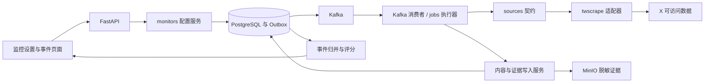

选型修订（2026-09-18）：按用户决定统一为 PostgreSQL + Redis + Kafka；Web 位于 server/frontend，独立 App 使用 Flutter。技术基线见 [PROJECT](../../PROJECT.md)。本文状态与验收进度不变；Kafka 重试、消费位点与 Redis 失效场景需在实现前补齐设计。

# X 官方 API 采集与热点监控设计

> 路径中的“免费”是 002 历史编号名称，不再代表当前费用决策。下文 2026-09-17/22 的 twscrape 技术研究仅保留为历史证据；与本节冲突的选型、会话、免费预算及验收描述均由本节覆盖，不得据此启用网页接口。

### 2026-09-23 官方 API 决策与本轮文件边界

用户已明确将 X 自动采集改用官方 API；用户尚未创建开发者 App/Token，要求先做离线实现。X 的浏览器登录不等于开发者凭据，既有 `x_twscrape.py` 不注册 Worker、不试用登录 Cookie、不作为失败时的自动回退。其他来源和基础分析仍遵循免费或自建约束；本决定不授权购买额度、自动充值或模型付费。

首个离线切片只接 [Recent Search](https://docs.x.com/x-api/posts/search-recent-posts) 的只读 `GET /2/tweets/search/recent`，复用 `sources/contracts.py` 的 SearchRequest/SourcePage，新增 `backend/app/sources/adapters/x_api.py` 与 `backend/tests/unit/test_x_api_adapter.py`；不增加业务表、HTTP、Worker 注册、代理放行、脚本或 `.sh`。Latest 对应 `sort_order=recency`，Top 对应 `sort_order=relevancy`，均只是本次查询返回样本；`max_results` 为 10—100，时间范围受近 7 天限制，游标用 `next_token`。离线片要求显式注入 HTTPX transport，不能默认联网；复用仓库已锁定的 HTTPX 而非 XDK 自动翻页，以免隐藏实际请求/重试次数。仅映射明确请求的作品字段、作者 ID、语言及公开互动数；无字段保持 null，API 错误/异常响应不可解释为合法空。其余用户时间线、帖子详情及回复能力单独按官方端点复核后实施，不用搜索结果冒充三条路径完成。

[X 官方接入说明](https://docs.x.com/x-api/getting-started/getting-access)要求开发者 App 和对应密钥/令牌；[官方定价](https://docs.x.com/x-api/getting-started/pricing)为按使用量付费，读取按返回资源计费，费率可变、以控制台为准。上线门禁是：用户确认账期美元支出上限并在 X 控制台设置上限；本地配置更严格的每任务/周期可返回资源上限和最坏成本预留；037 建立唯一 X 付费例外且未配置时默认拒绝；034/004 安全保存开发者 Token 并取得实际能力证据。当前离线适配器只接受 HTTPX `MockTransport`，无法通过其默认访问公网。以上任一项未满足，X 保持 `not_connected`，不发真实 API 请求、不勾产品 AC。

S01a 后续离线费用边界：Recent Search 不需要展开 User 对象，删去 `expansions=author_id`；每次请求前把本页 `max_results` 作为最坏 Post 读取数交给装配方一次性授权网络尝试与付费资源，拒绝时不得发送请求。每个已授权尝试结束时恰好回调一次：只有完整校验且没有额外 `includes` 资源的响应传实际 Post 数，其余失败、取消或协议不明传 `None`，由调用方按全额保守结算，不因错误释放未知费用。适配器不计算美元、不持有预算数据库，也不调用真实网络；037 后续须使用经控制台复核的费率、显式账期上限及持久预留实现这些回调，未接入前不得把模拟回调视为付费门禁通过。

S01a 端点字段复核（2026-09-23）：当前 [Recent Search 端点参考](https://docs.x.com/x-api/posts/search-recent-posts)及[官方 OpenAPI](https://docs.x.com/openapi.json)将 `author_id`、`referenced_posts` 列为 `expansions`，不列为 `post.fields` 可选值；通用 [Fields 指南](https://docs.x.com/x-api/fundamentals/fields)仍使用 `tweet.fields=author_id,referenced_tweets` 示例，口径不一致。离线请求只发送端点列明的 `post.fields`，不为取得作者/父帖关系悄悄打开可能返回额外收费资源的扩展。响应若直接提供稳定作者和关系 ID 则映射；作者 ID 缺失必须明确协议失败并按未知 Post 数保守结算，不能写成空页或猜测作者。此修正只消除已知的请求参数越界，不证明真实响应一定提供作者/关系字段；开发者 App、账期门禁及一次有界实调前仍保持 `not_connected`。

S01a 显式时间窗离线子片：[Recent Search 端点](https://docs.x.com/x-api/posts/search-recent-posts)接受 `start_time` 与 `end_time`，`start_time` 须处于最近 7 天。共享 `SearchRequest` 可选地同时提供严格递增的 UTC 起止时间；X 适配器对超出近 7 天、晚于当前时间或非校验复制产生的无效窗口均在费用授权前拒绝，合法窗口逐页原样发送同一对时间参数，不设来源默认重叠时长。无时间窗的既有关键词查询不变。该子片只证明请求参数与本地预拒绝，不提供来源终点证明、旧于 7 天的历史回补或真实平台覆盖证据；010 的水位仍不能据此确认。

S01a 总时限修正：一次请求即使返回 HTTP 200，若接收响应时已越过适配器累计时限，也不得产出成功页或供下游推进水位；该尝试仍计一次，费用按未知 Post 数保守结算。复用现有 HTTPX 流读取与单调时钟，用受控时钟模拟边界；检查每块响应及结束位置。这不声称能在被阻塞的单次底层读取中硬中断网络，也不替代 S01b 的持久账本或真实预算门禁。

调研日期：2026-09-17；S01 实施更新：2026-09-22。整体设计状态为提议；S01 受控适配器已实现，尚未使用真实 X 账号验证。总体功能与非功能需求见 [001 产品需求草案](../prd/001-热点事件监控平台功能与非功能需求.md)。对应 [002 执行计划](../plans/002-X免费采集与热点监控计划.md) 已建立，整体进度见 [BACKLOG](../../BACKLOG.md)；实采前仍需复核访问条件。本文产品指标是拟定验收条件，不是已经达到的结果。

## 1. 结论与当前事实

### 2026-09-22 S01 实施约束

本次接受 S01 的受控适配器范围；整体设计仍为 proposed，真实来源准入、用户样本与 S02—S04 未完成。复用 038 契约和 037 预算入口。源码复核发现固定候选 v0.20.1 的 QueueClient 在错误后换账号、只计成功请求，HTTP transport 有隐式重试，`parse_tweets` 会吞掉解析错误并将响应写入临时文件。因此不直接运行默认 QueueClient、账号池或高层解析生成器；复用 SDK 的操作常量、特性、响应归一化和 `Tweet.parse`，用单会话、无隐式重试的 HTTPX 边界执行有界请求。SDK 签名初始化同样经过这个边界；禁止全局 monkey patch。

S01 文件限定：新增 `backend/app/sources/adapters/__init__.py`、`x_twscrape.py`，修改 `sources/contracts.py` 补来源排序、原文/关系及请求计量元数据；`core/logging.py` 抑制会暴露 URL/请求头的传输诊断；新增 `backend/tests/unit/test_x_adapter.py`，扩展 `tests/architecture/test_structure.py` 的来源适配器依赖检查；依赖修改仅在 `pyproject.toml`/`uv.lock`。不新增 HTTP、数据库表、消息、页面、脚本或部署服务。同步 PROJECT/AGENTS 登记适配器职责。

每个适配器实例属于一次任务、持有一个由装配方提供的授权会话。各页共用累计请求数与总时长上限，初始化、失败请求均计数；跨任务持久预算和连接执行权由后续业务装配使用现有 037/031 服务提供，S01 不自动挂入 Worker。计量回调在网络副作用前执行，拒绝立即停止；取消/超时关闭 HTTP 客户端，HTTPX transport retries=0，403/429 不重试、不换会话。SDK 遥测关闭，解析失败不调用 SDK 的落盘 helper。来源配置与查询不入日志。

共享请求增加 Latest/Top 排序，作品增加原文链接、会话/父帖/引用/转帖身份，回复请求可带会话根身份；ID 保持字符串。分页仅认可存在的 entries 结构；缺结构、坏 JSON、坏作品均为 protocol_error，不能变成合法空。游标循环、连续空页、超额记录显式停止且不推进 watermark；页面元数据保留本页实际请求数与组件版本。根帖与嵌套引用对象不冒充回复或独立搜索命中。

验证先 Red 后 Green：Latest/Top、作者归属、直接/嵌套回复、合法空与认证失败、403/429/5xx、缺字段/坏 JSON、循环游标、请求/时间预算、取消释放、SDK 禁止隐式落盘及秘密不回显；仅受控 HTTPX transport 运行。运行端点与 OpenAPI 不变，前端/数据库/消息验证在本切片为 N/A；后端完整 Ruff/format/mypy/pytest 仍执行。真实账号、许可与事件样本不具备时，来源继续未就绪。

**历史结论已撤销：X 仍是首版必需来源，但自动采集现以官方 API 为唯一执行目标；twscrape 的受控实现不再进入真实请求链。**

免费开源解决的是软件采购问题，不能消除 X 的访问限制、维护成本或访问许可要求。当前没有足够证据承诺“免费、官方认可、全量、长期稳定”的 X 自动监控。本方案保留 X 的产品范围，明确自动采集启用条件，不用其他平台冒充 X 的替代覆盖。

已核实事实：

- twscrape 提供 Latest/Top 搜索、帖子详情、直接回复、会话线程、用户时间线；v0.20.1 于 2026-08-25 发布，已核查该版本源码。它使用 X 网页接口及登录会话，不要求购买开发者 API Key，但并非免登录。[S01][S02][S03]
- twscrape 近期仍有特定接口被拒绝、搜索结果缺失等 issue。开源接口存在，不代表在本项目环境可用；issue 是用户报告，并非本次复现。[S06][S07]
- X 当前生效条款限制未经书面许可的抓取；持有自己的登录会话不等于获得数据采集许可。页面同时展示 2026-10-09 才生效的新版本，本设计依据其中 current 部分，而非将未来条款当作已生效。[S13]
- 原工程实现已清理；本设计只沿用保留规范规定的 Python 3.12、FastAPI、SQLAlchemy、PostgreSQL、Redis、Kafka 及已有 MinIO，不表示这些服务已重新实现或部署。

**启用边界：**自动采集路径须在访问许可条件得到满足后，用用户自有或明确获授权的会话验证。许可未解决或实测失败时，X 连接显示未就绪；可以导入用户有权提供的 X 数据、保存原帖链接进行分析，但不得把导入模式宣称为自动监控已交付。

## 2. 用户目标、费用与范围

### 2.1 用户需要完成的三条主线

1. 设置关键词与排除词，持续发现 X 上相关的新内容和热门内容，识别升温事件。
2. 打开一个事件，查看代表帖子、互动变化、已采集回复及其上下文，理解讨论焦点。
3. 添加指定 X 用户，追踪其新作品，按需要关联事件并采集回复。

首版页面：监控设置、事件列表、事件详情、关注账号、来源连接状态。首版不建设通用爬虫编排产品、社交发帖机器人、私信工具、全历史 X 搜索或全量评论数据库。

### 2.2 免费的具体含义

| 项目 | 决策 |
|---|---|
| 软件与数据服务 | X 官方 API 是唯一按量付费内容例外，须有账期硬上限；其他来源和基础分析仍不接付费服务 |
| 账号 | 用户已有且有权使用的账号；不采购账号、不以多账号轮换绕过限制 |
| 基础设施 | 复用自有计算、PostgreSQL、Redis、Kafka、MinIO；自行部署仍有机器、网络和维护成本 |
| AI | 首版基础分析本地完成；不默认调用付费 LLM；模型权重许可和硬件需求另行核实 |
| 浏览器与网页工具 | Firecrawl 用于本次资料研究；生产 X 链路不依赖其收费云服务 |
| 媒体 | 首版保存文本、公开元数据和原帖链接；不默认下载视频、高清图片或全站附件 |

## 3. 开源候选比较

以下为 2026-09-17 查询快照，维护状态会变化。软件许可与平台数据访问许可分别判断。

| 候选 | 核查结果 | 适用性与决定 |
|---|---|---|
| **vladkens/twscrape** | MIT；异步 Python；v0.20.1 发布于 2026-08-25；HEAD 2026-08-28；支持关键词、帖子、回复、作者时间线 | 历史受控技术验证；因用户改选官方 API，不再进入真实采集链 |
| **d60/twikit** | MIT；搜索 Top/Latest、用户作品、帖子及回复分页；最新 release 为 version2.3.1，发布于 2025-02-06；2026-03-10 的 HEAD 是 README 修改 | 备用候选；当前维护和兼容性需独立验证，不因主链路 403/429 自动切换以继续请求 |
| **JustAnotherArchivist/snscrape** | GPL-3.0；核查到 master HEAD 的提交日期为 2023-06-22，仓库 pushed_at 为 2023-11-15 | 缺少当前 X 可用性证据，不作为新系统主采集器 |
| **zedeus/nitter** | AGPL-3.0；查询时 GitHub archived=true；README 提及 2026-08-24 收到下架要求，同时更新称项目将继续 | 不把共享公共实例或 RSS 镜像作为关键链路；不能据 archived 单独断言项目永久终止 |
| **官方 X API** | [Recent Search](https://docs.x.com/x-api/posts/search-recent-posts) 支持近 7 天、recency/relevancy、游标；[定价](https://docs.x.com/x-api/getting-started/pricing)按返回资源计费 | 2026-09-23 用户选定；先做离线适配器，费用硬上限和凭据具备后再验收真实能力 |

来源：[twscrape][S01]、[发布记录][S02]、[Twikit][S08]、[Twikit release][S09]、[snscrape][S10]、[Nitter][S11]、[X API 计费][S12]。

上述开源选型比较属于 2026-09-17 历史调研，不再作为 X 实现路线。现路线复用仓库已有 HTTPX 显式计量单次请求；不采用自动翻页/隐式重试的封装作为费用门禁依据。

### 3.1 必须防止的能力误判

- **无需 API Key ≠ 无需登录。** 会话失效必须重新由用户处理，不能靠空结果掩盖。
- **Top ≠ 全 X 热门总榜。** 它是某次查询、某个会话和时间下返回的排序样本，需要保留查询与采集时间。
- **tweet_replies ≠ 完整回复树。** v0.20.1 源码只保留直接回复目标帖子的记录。
- **tweet_thread ≠ 全量会话保证。** 源码按 conversationId 过滤；应以会话根 ID 调用，返回范围仍受上游分页与可见性限制。
- **limit ≠ 请求限额。** SDK 的记录数量限制不能代替网络请求、时间和分页预算。
- **生成器正常结束 ≠ 采集完整。** 部分无响应、空页或停滞会结束迭代；HotKey 必须记录停止原因。
- **最新提交日期 ≠ 最近修复功能。** Twikit 的近期 README 更新不能算作运行兼容性修复。

对应证据为 twscrape 的 api.py、queue_client.py、models.py 和 Twikit 仓库源码。[S03][S04][S05][S08]

## 4. 核心决策

| ID | 决策 | 原因 |
|---|---|---|
| DEC-002-001 | X 列入首版必需来源；自动接入以许可与能力验证为前置 | 用户明确要求；不将未知能力包装为可用 |
| DEC-002-002 | 官方 X API 为唯一真实执行路线；旧 twscrape 不注册 | 与用户 2026-09-23 费用/合规决定一致，避免双路径 |
| DEC-002-003 | 关键词、作者、回复为三类独立任务 | 它们的游标、频率、预算与失败影响不同 |
| DEC-002-004 | 所有数据保留采样与来源信息 | 检索结果和回复均不能视为总体 |
| DEC-002-005 | 原始互动快照与计算分数分开持久化 | 可以重算并解释升温原因 |
| DEC-002-006 | 使用一套业务数据库和调度；官方 Token 只经连接秘密引用读取 | 避免第二套业务事实及浏览器 Cookie 路线 |
| DEC-002-007 | 来源错误暂停或延期；不自动购买、不绕过账号限制 | 遵守费用约束，避免持续失败放大 |
| DEC-002-008 | 不使用 SDK 的全自动多账号切换作为产品能力 | 单个授权会话先验证，平台限制必须可见 |

## 5. 采集设计

### 5.1 关键词发现：Latest 与 Top 分工

输入：主题名、包含词/词组、排除词、语言、时间窗口、是否收录回复与转帖。保存原始配置及编译后的查询版本；查询预览只展示，不访问 X。

- **Latest 通道**用于增量发现，按配置时间窗查询；每轮与上轮有重叠，再以平台帖子 ID 去重。
- **Top 通道**低频补充热门样本，避免只看最新内容遗漏正在传播的帖子。
- 两个通道分别保存游标、来源排序、页面序号、采集时间；相同帖子合并实体但保留两种发现依据。
- 关键词命中只是候选；排除词、实体歧义及正文相关性在本地再判定，不能只依赖上游搜索。
- 首版用可解释词组与排除词规则；语义相似度作为后续增补，不能让 LLM 凭空扩展搜索结果。
- 日期/语言/排除等查询操作符先做小样本验证；不把 SDK 支持自由字符串等同于 X 当前支持所有操作符。
- 返回顺序可能异常，不能遇到一条旧帖就停止整轮。任何预算截断都记为 partial，并保留待回补窗口。

用户看到：“关键词相关热门样本”，不是“全网相关内容总数”。

### 5.2 指定用户作品追踪

1. 用户输入主页 URL 或用户名，解析并保存稳定 user_id、当前用户名和主页地址。
2. 初次授权采集确认身份；后续按 user_id 获取作品，用户名变更更新别名，不新建一个人。
3. 如果 numeric ID 查询失败但现有身份仍可用，不轻易替换身份；首次用户名解析失败则任务未就绪，要求复核输入或待适配器修复。[S06]
4. 原创、回复、引用、转帖分别分类。默认关注原创和引用；回复、转帖由设置决定，引用中他人的原文不能误归为被关注者创作。
5. 置顶和旧帖重排通过 ID 去重，不能以时间线第一条作为“最新时间”。
6. 账号追踪可独立于关键词：即使新作品不含关键词，也进入账号页；只有符合事件关联条件才进入对应事件。
7. 历史回填设数量和时间范围，单独排队，不承诺完整历史。

### 5.3 事件回复采样

- 先保存根帖子详情及 conversation_id；直接回复使用 tweet_replies，线程补充使用 tweet_thread(root_conversation_id)。
- 保留 post_id、conversation_id、in_reply_to_id、author_id；缺失父节点时显示“父帖未采集/不可见”，不猜造父帖文本。
- 独立引用帖通过 quoted_post_id 表达，转帖通过 repost_of_id 表达，不混入直接回复树。
- 根帖回复优先，采样达到配置预算后停止；在许可和预算范围内再补充分支，避免递归失控。
- conversation_id 查询只作为未来待验证补充路径，首版不把它当作已验证的全会话接口。
- 接口不保证稳定的“最热/最新回复”模式时，页面只显示“接口返回样本”。对已采集样本可本地排序，但必须标明排序范围。
- 显示“采集到 83 条回复，源帖显示回复数 260（时间为……）”。这不是 31.9% 的可靠总体覆盖率，因为时间、回复层级、删除与可见性口径可能不同。
- 初始上限建议每事件 3 个代表根帖、每根帖最多 50 条回复；这是验证配置，且受请求预算优先约束，不承诺每次能获得该数量。

## 6. 热度与事件评分

评分输出的是“本次已采集样本中的优先级”，不伪装成 X 官方指数；所有权重和窗口都是待校准的产品初值。

### 6.1 相关性先过滤

先通过包含词/排除词/语言及实体规则判断是否符合主题，再计算热度。对歧义词保留人工移入/移出事件功能；不让高互动的无关帖子靠总分进入事件。

### 6.2 X 帖子分数

同平台、相近发布时间及相同统计窗口形成比较样本。对 likes、reposts、replies、quotes 分别计算 log1p 后的样本分位值 P，取值 0–1：

    E = 0.40 P(likes) + 0.25 P(reposts)
      + 0.20 P(replies) + 0.15 P(quotes)

两次有效快照间隔至少 30 分钟，使用同一版本字段计算各项非负增量/小时，再用同一方法归一化得 V。计数回落保留原值并标记，不作为负增长惩罚；快照间断过长或计数口径变化时不算 V。

    F = 2 ^ (-age_hours / 24)
    H = 100 × (0.45 E + 0.35 V + 0.20 F)

- 缺少第二次快照时使用暂定分数 H0 = 100 × (0.70 E + 0.30 F)，标记“增长待观察”，与成熟 H 分区呈现。
- 比较样本少于 30 条时展示原始指标和暂定排序，明确分数不稳定；不能拿少量样本分位数当高置信结论。
- 某字段缺失保持 null，并对可用项重归一化；展示可用指标集合。views 不作为必需项，缺少浏览量不记为 0。
- retweetCount 与 quoteCount 是否相互包含需通过真实样本核查；口径未确认前不把它们相加宣称为“总传播量”，E 仅为加权指数。
- Top 返回位次保存为发现证据，首版不再加进 H，避免上游排序与互动信号重复奖励。
- 每个分数保存 score_version、快照 ID、统计窗口、比较样本数与计算时间，允许重算。

### 6.3 事件分数与评论分析

事件先按实体、时间和具体发生事项归并。同一关键词下可能有多个事件；同文转发和独立观点不能一概合并删除。

选择最多 3 个不同作者的代表原帖，以最高 H 占 60%、这些帖子的平均 H 占 40% 形成 X 事件分数。转帖不重复贡献一个独立原创作者。跨平台保留各平台分数，首版不直接累加点赞数；“多平台出现”作为独立标记。

首版评论分析提供样本规模、时间分布、词频、重复率、代表观点和原帖链接。主题聚类可复用前轮评估的本地文本组件；模型与中文/X 混合语言效果需单独验收。情绪比例只描述采集样本，不推断全体用户；不通过姓名、头像猜测人口属性。

## 7. 架构、边界与数据

### 7.1 单一业务与调度链路

HTTP 只修改配置和提交任务意图，不等待 X。sources 适配器不依赖 API、ORM、Worker 或 CLI；编排器经业务服务持久化结果，不让第三方 SDK 直接写业务表。

后续实施预计职责如下，此次不创建空实现目录：

| 位置 | 职责 |
|---|---|
| backend/app/monitors/ | 主题、关注账号、预算及启停设置 |
| backend/app/sources/adapters/ | X 官方 API 能力映射、分页和错误翻译；旧 twscrape 保持离线 |
| backend/app/jobs/ | 调度、租约、幂等、重试、进度和任务状态 |
| backend/app/content/（实施时登记） | 作品、评论、原文版本与互动快照的唯一持久化主责，供 007/008 共用 |
| backend/app/evidence/ | 引用、证据清单和 MinIO 文件；引用 content 的版本，不重复存储作品实体 |
| backend/app/events/（新职责，实施时登记） | 事件身份、内容归属及人工纠正；评分由 analysis 主责，避免两套口径 |
| backend/app/worker/ 与 cli/ | Worker 装配；独立显式来源探测命令 |

各模块只直接访问本领域 ORM；跨模块经函数/DTO 或显式同事务服务协作，不另建通用全局 models/repository。新增目录需在实施切片登记并由架构检查覆盖。

### 7.2 关键实体

| 实体 | 核心字段与约束 |
|---|---|
| Monitor | owner_id、query_version、关键词、排除词、语言、频率、预算、enabled |
| WatchedAccount | owner_id、platform、platform_user_id、handle、作品类型、last_observed_at |
| SourceConnection | owner_id、adapter/version、secret_ref、能力验证状态、cooldown_until、last_success_at |
| CollectionRun | id、monitor_id、mode、window、lease_epoch、预算、request_count、stop_reason、next_run_at |
| Post | platform + platform_post_id 唯一；author_id、正文、发布时间、conversation_id、父帖/引用/转帖关系 |
| Discovery | run_id + post_id + channel 唯一；记录关键词、排序、返回位次，支持同帖多个主题 |
| MetricSnapshot | post_id、observed_at、各项可空互动数、adapter_version；保留原始口径 |
| Coverage | run_id、时间窗、返回数量、空页/游标终点/截断/拒绝等状态；不记录虚假的全量完成 |
| Event / EventPost | 事件实体、证据关联、归并规则版本、人工纠正及分数快照 |

所有 X ID 在持久化和 JSON 契约中按字符串保存，避免浏览器 Number 精度损失。帖子内容与互动快照分离，重采幂等；删除或不可见保留状态与必要引用，按保留规则清除不应保留的正文。

用户之间默认隔离监控配置、会话与采集结果；首版不共享账号池或跨用户结果，以免混淆权限边界。

### 7.3 来源结果契约

适配器输出包含：

- items、next_cursor、observed_at、source_sort、adapter_version；
- request_count、accepted_count、duplicate_count、rejected_count；
- stop_reason：cursor_exhausted / record_budget / request_budget / time_budget / empty_page_limit / cursor_stalled / upstream_denied / parse_error / cancelled；
- coverage_kind：sampled / source_exhausted / unknown；
- retry_at、稳定错误码与 request_id。

source_exhausted 仅代表这次可见上游分页结束，不代表 X 上不存在更多数据。返回 0 条必须区分“有效查询零结果”与“无法获取结果”。

## 8. 调度、增量、失败与恢复

### 8.1 历史 SDK 封装记录（不再作为执行依据）

twscrape 已有搜索与解析，HotKey 不重写 GraphQL 协议。但是必须核查并补齐 SDK 边界：

- 禁止无账号时无限等待；使用有界等待/NoAccountError，将任务交还调度器并设置 next_run_at。
- SDK 会处理部分限流/错误，也可能返回空值结束迭代。封装需要可测试的传输结果事件，提取状态、请求计数和停止原因；若公开扩展点不足，维护极小固定版本补丁并争取上游支持。不能仅靠日志文本判断成功。
- 预算覆盖 SDK 内部翻页、重试及必要初始化请求；只统计业务方法调用会严重低估。
- 外部跟踪本轮游标集合，检测 A→B→A 等循环；同时限制运行时间，取消时关闭 async generator 释放 SDK 账号锁。
- SDK 可能按不同操作队列管理账号，HotKey 还需单账号全局并发锁；初始最多一个网络采集任务。
- 持久化已处理页与数据可在重投时幂等写入；只有当前 lease_epoch 持有者能更新游标和完成状态。
- SDK SQLite 存会话及内部运行信息；HotKey PostgreSQL 保存预算、冷却、任务和进度。重启先遵守 PostgreSQL 的冷却期，不通过重建 SDK 数据库清除限流约束。

### 8.2 初始试运行预算

建议仅在前置条件满足后，用 **2 个主题、3 个关注账号**启动验证。Latest 与账号更新目标间隔 60 分钟，Top 目标间隔 6 小时：

    每日基础调度次数 = (2 + 3) × 24 + 2 × 4 = 128

这只是调度次数，不是请求数。多页、初始化、详情、回复和重试会增加网络请求。建议初始应用保护预算 200 次上游请求/日、20 次/小时、单任务 90 秒，具体通过试运行调整；这些数字不是 X 的免费额度或许可范围。遇到更低的上游额度，以更低值为准。

优先级：到期账号更新与 Latest → 活跃事件指标快照 → Top 补充 → 回复扩展 → 历史回填。预算不足则延后并显示原因；不得同时承诺这些频率和每次回复数量必然达成。记录最大排队时长，避免低优先级任务无限饥饿。

### 8.3 状态与动作

任务生命周期与采集结果分开：queued → running → succeeded / partial / failed / cancelled；延期仍为 queued，附 defer_reason 和 next_run_at。

| 条件 | 来源/结果状态 | 系统动作 |
|---|---|---|
| 有效返回、分页结束 | available；sampled 或 source_exhausted | 写入数据；只确认本轮范围 |
| 触及应用限额/时间 | partial、budget_exhausted | 保存进度、延期；不覆盖未完成水位 |
| 429/明确速率限制 | rate_limited | 使用可信 reset 时间，否则有界退避；停止当前轮，不换账号继续 |
| 会话失效 | needs_login | 停止自动尝试；由用户自行重新完成会话配置 |
| 403/挑战/账号受限 | access_denied / restricted | 暂停自动请求，保留诊断 ID；不自动绕过验证 |
| 页面结构/字段不兼容 | integration_broken | 熔断相应能力，保留其他已验证能力；等待适配器修复 |
| DNS/超时/暂时性 5xx | temporary_error | 少量有界重试，计入预算；持续失败则延期 |
| 帖子删除/不可见 | unavailable（对象级） | 保存状态，不将全来源标成失败 |
| 进程中断/消息重投 | interrupted | 租约恢复、幂等写入；不重复触发通知 |

增量水位只推进已经明确完成的采样时间窗；partial 留下待回补缺口。游标过期时从保存的时间窗重扫并去重，不依赖游标永久有效。即使扫描完成，也只代表执行完成，不表示搜索召回完整。

## 9. API 与用户交互

下列为待实现契约范围；最终 Pydantic/FastAPI 生成唯一 OpenAPI，前端客户端按工程规范生成。

| 操作 | 语义 |
|---|---|
| POST /api/monitors | 新建主题，配置保存后返回；不隐式探测 X |
| POST /api/watched-accounts | 保存待确认账号输入；身份确认在授权任务中完成 |
| POST /api/monitors/{id}/runs | 显式请求一次采集，202 返回 run_id；幂等键避免重复排队 |
| GET /api/collection-runs/{id} | 返回进度、采样范围、错误码、延后原因和更新时间 |
| GET /api/source-connections | 返回连接能力及最近验证结果；永不返回 Cookie/Token |
| GET /api/events 与 /api/events/{id} | 返回事件、分数解释、帖子及采样说明 |
| GET /api/posts/{id}/replies | 本地已持久化回复分页；不在浏览时触发实时爬取 |

配置与结果 API 需要登录并校验资源所有者；请求受大小和页数限制。来源探测遵循现行规范，仅用独立 CLI 显式执行；只有数据落库并可查的验收通过后，来源才由 not_connected 转为 available。

页面必须区分：

- 首次加载、未连接、有效零结果、有数据但部分采集、预算延期、登录失效、访问受限、适配器不兼容。
- “最后一次尝试”与“最后一次成功”时间；设置的计划间隔与真实数据新鲜度。
- 事件列表显示热门/升温及分数依据；回复区显示样本数、时间范围和缺失父帖。
- 账号页提供“新作品”筛选、作品类型开关与更新状态。
- 同一作品/事件多轮命中不重复提醒；只对新增作品、首次越过阈值或确认升温生成新的站内变化记录。

## 10. 会话、证据与可观测性

- 会话只通过用户自行完成的本地配置流程导入；不读取其他应用的浏览器登录库，不要求在聊天中粘贴凭据。
- SDK 会话数据库按敏感凭据处理：最小权限、独立运行目录；可使用运行时 tmpfs，原始会话材料加密存储或交由主机秘密存储管理，密钥不与数据同位置备份。
- 业务库只存 secret_ref。日志与错误中不出现 Cookie、Token、原始搜索词、请求 URL 或完整响应；调试证据必须脱敏。
- 显式关闭 twscrape 默认匿名遥测（TWS_TELEMETRY=0）；应用对外网络目标可审计。[S01]
- 只读使用 SDK，不暴露发帖、关注、点赞、私信等写操作。
- 原始响应证据按许可与最小必要原则暂存 MinIO，初始建议 7 天；结构化文本初始建议 30 天，可配置并支持删除，不将其解释为平台允许的固定保留期限。
- 记录任务成功/部分/失败率、每次有效请求成本、429/403 数量、解析失败、去重率、延迟、会话失效及未完成时间窗。日志只用内部标识关联。

## 11. 验证与交付顺序

| 阶段 | 输出 | 进入下一阶段的条件 |
|---|---|---|
| S0 许可与可行性 | 访问条件记录；固定组件版本；能力矩阵 | 可使用的会话及数据访问条件明确；不自动付费或绕过 |
| S1 最小采集验证 | 一个关键词、一名作者、一个根帖及回复的持久化证据 | 以下核心 AC 通过；失败如实列入能力矩阵 |
| S2 监控产品闭环 | 2 主题/3 账号的配置、任务、事件与证据页 | 端到端查询和状态可解释；预算与恢复正确 |
| S3 持续观察 | 先 24 小时，再视结果进行 72 小时低频观察 | 记录真实成功率、部分结果及延迟，再决定刷新参数 |
| S4 扩展 | 更多主题/账号及国内平台事件关联 | 已证明请求余量与能力边界，按真实瓶颈扩容 |

### 11.1 拟定验收项（均未执行）

| ID | 场景与预期 |
|---|---|
| AC-002-001 | 一个有已知结果的关键词，Latest/Top 均能采集、落库、查询；保留各自 channel，不要求排序完全等于另一个人的页面 |
| AC-002-002 | 有效无匹配与开发者凭据缺失/失效都不能混淆；系统区分 empty 与认证未就绪，不存在“空结果=成功”的假阳性 |
| AC-002-003 | 关注账号采集到已知新作品，作者 ID 正确；置顶、引用和重采不导致归属错误或重复作品 |
| AC-002-004 | 固定样本含根帖、直接回复、至少一条可访问的嵌套回复；父子关系正确；缺失父帖明确占位，不宣称全量 |
| AC-002-005 | 两次真实互动快照可追溯并重算热度；缺失视图指标、计数回落、样本不足均不伪造数值 |
| AC-002-006 | 使用可控故障响应验证 429、403、无开发者凭据、空页、游标循环和解析错误；不会无限循环、改用网页登录绕过或误报完成 |
| AC-002-007 | 请求/返回资源/时间与最坏费用预算涵盖每次官方 API 翻页和重试；取消释放资源，预算不足显示延期 |
| AC-002-008 | PostgreSQL/Redis/Kafka 集成验证进程中断、重复消息和旧租约不能重复写入或推进水位 |
| AC-002-009 | 浏览器验证配置→采集状态→事件→原帖/回复；部分采集和数据过期状态可见 |
| AC-002-010 | 检查日志、证据、备份中无明文开发者 Token；仅 X 官方 API 有明确费用上限且控制台用量可核对，不接其他付费数据/推理服务；原始证据到期可删除 |

真实平台验证不主动触发账号封禁、挑战或压测；这些分支用可控故障验证。24/72 小时观察不能证明长期稳定，更不能证明全量覆盖。

## 12. 风险、待决项与回滚

| ID | 风险/待决项 | 处理 |
|---|---|---|
| RSK-002-001 | 平台条款与访问许可不匹配 | 自动采集不标可用；保留合法导入路径；软件 MIT 许可不能替代平台许可 |
| RSK-002-002 | X 网页接口变化、账号失效或封锁 | 固定版本、按能力熔断、保存最后成功数据；恢复前重验 |
| RSK-002-003 | 搜索漏采与排序偏差 | 多通道与重叠窗口，只做样本分析，公开覆盖说明 |
| RSK-002-004 | 免费自建的维护成本超过收益 | 记录每周修复工时；若无法持续维护，明确阻塞自动 X 能力，不偷偷切收费服务 |
| OPEN-002-001 | 首轮关键词、作者及事件样本 | 实施前选定；不影响本轮设计交付 |
| OPEN-002-002 | 是否能满足 X 数据访问条件 | 实采前解决；本次没有获取或声称取得平台书面许可 |
| OPEN-002-003 | 实际账号是否能通过三条能力路径 | S1 验证，特别关注数字 ID 查询和搜索完整性 |
| OPEN-002-004 | 可接受的延迟与覆盖范围 | 用 S3 数据定频率；初始参数不作为 SLA |
| OPEN-002-005 | 本地文本模型及语言效果 | 基础统计先行；额外模型许可、资源与效果单独评估 |

上游升级先用脱敏固定样本做契约回归，再小范围验证；失败时回滚适配器版本并暂停对应采集，保留数据库兼容。Twikit 替换需同样通过能力验收，不能认为切库自然解决平台拒绝。首次上线是新建数据模型；不导入清理前的旧业务库或恢复旧实现。

本轮交付范围为资料核查、设计与验收条件；没有运行社交采集、配置账号、启动常驻监控或完成生产验收。

## 13. 资料与版本依据

GitHub 用于核查许可证、版本、源码与 issue；Firecrawl 用于公开网页及 X 条款读取；Context7 用于交叉核对 twscrape/Twikit 的搜索、作品和回复用法。Context7 示例不是运行测试。前轮全平台研究与本轮证据目录在项目父级 research 中；正式设计的判断均附独立外链，不依赖父级目录才能阅读。

[S01]: https://github.com/vladkens/twscrape/blob/v0.20.1/readme.md
[S02]: https://github.com/vladkens/twscrape/releases/tag/v0.20.1
[S03]: https://github.com/vladkens/twscrape/blob/v0.20.1/twscrape/api.py
[S04]: https://github.com/vladkens/twscrape/blob/v0.20.1/twscrape/queue_client.py
[S05]: https://github.com/vladkens/twscrape/blob/v0.20.1/twscrape/models.py
[S06]: https://github.com/vladkens/twscrape/issues/337
[S07]: https://github.com/vladkens/twscrape/issues/315
[S08]: https://github.com/d60/twikit
[S09]: https://github.com/d60/twikit/releases/tag/version2.3.1
[S10]: https://github.com/JustAnotherArchivist/snscrape
[S11]: https://github.com/zedeus/nitter
[S12]: https://docs.x.com/x-api/getting-started/pricing
[S13]: https://x.com/en/tos#current

文档复核（2026-09-21）：对齐 PROJECT 的现有基线、领域/页面归属及单一 DDL 约束；仍为 proposed，来源/模型资格与效果需实施前复核，本轮未做外部运行验证。
