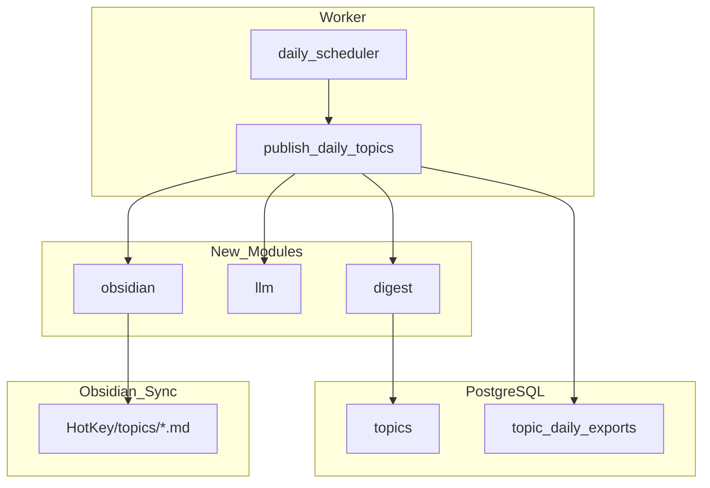

# 背景

HotKey 当前已具备 X 监控采集、评分、主题聚类与趋势查询能力，但热点信息仍以「实时 API 列表」形式存在，缺少面向个人知识管理的**日级沉淀**。

用户希望将每个关键词监控下的热点整理为**日报**，并写入 Obsidian 同步目录，形成可检索、可链接、可用 Dataview 聚合的**每日热点知识库**。

# 目标

MVP（仅 hotkey-server）必须实现：

1. 按**北京时间自然日**统计每个 `keyword_monitor` 的活跃热点主题。
2. 调用 **LLM** 为每个入选主题生成中文摘要，并回写 `topics.summary`。
3. 将主题渲染为带 **YAML frontmatter** 的 Markdown 笔记，**原子写入** Obsidian 同步目录。
4. 用 `topic_daily_exports` 表记录发布状态，保证**幂等、可重试、可审计**。
5. 每日固定时刻（默认 08:00 CST）自动触发，产出**昨日**终稿。

# 非目标

- hotkey-web 配置页、手动触发、预览（后续迭代）
- Obsidian 官方插件
- 多用户各自 Vault 路径（MVP 全局 `OBSIDIAN_VAULT_PATH`）
- 用户级汇总日报、PDF/邮件推送
- 修改 Jaccard 聚类算法（LLM 仅用于 digest 阶段摘要）

# 与 001 设计的关系

[`001-x热点监控平台设计.md`](001-x热点监控平台设计.md) 规定主题聚合不依赖 LLM。本功能作为**独立的日报沉淀层**引入 LLM，不改变 `internal/topic.Cluster()` 行为。OpenSpec change 中须记录此范围扩展。

# 系统架构



## 模块职责

| 包 | 职责 |
|----|------|
| `internal/digest` | CST 自然日窗口、主题入选规则、代表帖聚合 |
| `internal/llm` | `SummarizeTopic` 接口、OpenAI 兼容实现、prompt 模板 |
| `internal/obsidian` | frontmatter 渲染、slug 生成、原子写文件 |
| `internal/jobs/publish_daily_topics.go` | 编排：monitors → digest → LLM → export → write |
| `internal/jobs/daily_scheduler.go` | 每分钟 gate，判断是否到达 `DAILY_DIGEST_TIME` |
| `internal/database/digestrepo.go` | `topic_daily_exports` CRUD |

# 数据模型

## 新表 `topic_daily_exports`

```sql
create table topic_daily_exports (
  id bigserial primary key,
  monitor_id bigint not null references keyword_monitors(id),
  topic_id bigint not null references topics(id),
  export_date date not null,
  summary_text text not null default '',
  markdown_path text not null default '',
  status text not null default 'pending',
  error_message text not null default '',
  published_at timestamptz,
  created_at timestamptz not null default now(),
  unique(monitor_id, topic_id, export_date)
);
```

- `status`: `pending` | `published` | `failed`
- 幂等键：`(monitor_id, topic_id, export_date)`

## 主题入选规则

主题 `T` 进入 `export_date = D`（CST 自然日），当且仅当：

1. `topics.monitor_id = M` 且 `status = 'active'`
2. 存在关联帖，且 `monitor_post_hits.first_seen_at` 或 `platform_posts.published_at` ∈ `[D 00:00 CST, D+1 00:00 CST)`
3. 按 `current_heat_score DESC` 取 Top N（默认 20，`DAILY_DIGEST_TOP_N`）

# Obsidian 笔记契约

## 目录

```
{OBSIDIAN_VAULT_PATH}/HotKey/topics/{monitor-slug}/{date}-topic-{id}-{title-slug}.md
```

## Frontmatter

```yaml
---
type: hotkey-topic
date: 2026-06-14
monitor: AI监管
monitor_id: 1
topic_id: 42
topic_key: "ai:监管:政策"
heat: 85.4
trend: rising
post_count: 12
tags:
  - hotkey
  - topic
  - monitor/ai监管
---
```

## 正文

1. LLM 摘要（2–4 段中文）
2. 关键帖摘录（Top 3：作者、摘录、`post_url`）
3. 数据脚注（热度、趋势、帖子数、生成时间）

Dataview 示例见 [`docs/obsidian/dataview-examples.md`](../obsidian/dataview-examples.md)。

# 配置项

| 环境变量 | 默认值 | 说明 |
|----------|--------|------|
| `OBSIDIAN_VAULT_PATH` | — | Vault 同步目录根路径（必填） |
| `DAILY_DIGEST_TIME` | `08:00` | CST 触发时刻 |
| `DAILY_DIGEST_TIMEZONE` | `Asia/Shanghai` | 时区 |
| `DAILY_DIGEST_TARGET` | `yesterday` | `yesterday` \| `today` |
| `DAILY_DIGEST_TOP_N` | `20` | 每 monitor 最多导出主题数 |
| `LLM_PROVIDER` | `openai` | LLM 提供方 |
| `LLM_API_KEY` | — | API Key（启用 LLM 时必填） |
| `LLM_BASE_URL` | `https://api.openai.com/v1` | 兼容网关 |
| `LLM_MODEL` | `gpt-4o-mini` | 模型 |

# LLM 设计

```go
type Client interface {
    SummarizeTopic(ctx context.Context, in TopicSummaryInput) (string, error)
}
```

- 输入：monitor 名称/查询词、topic 标题、代表帖文本、热度/趋势/帖子数
- 截断：每帖最多 500 字
- 输出：客观中文，不编造事实
- 失败：`status=failed`，不写文件；可选 fallback 为规则摘要

# 调度

现有 `jobs.Runner` 仅支持固定 interval。MVP 方案：

- 注册 `publish_daily_topics`，interval 1min
- `daily_scheduler` 内部判断：当前 CST 时间 ≥ `DAILY_DIGEST_TIME` 且今日 batch 未执行
- 用 `topic_daily_exports` 或 advisory lock 防并发重复

# 错误处理

| 场景 | 行为 |
|------|------|
| Vault 无写权限 | exports `failed`，打日志 |
| LLM 超时/限流 | 单 topic 失败，不影响其他 topic |
| 同步盘冲突 | `*.md.tmp` → `rename` 原子写 |
| 无热点 | 跳过，不写空文件 |

# 验证方式

- 单元测试：`digest` 时间边界、`obsidian` 渲染、LLM mock
- 集成测试：temp dir 验证文件落盘与幂等
- 手工：配置真实 Vault 路径，触发 job，Obsidian 中 Dataview 查询

# 残余风险

- 同步盘延迟导致 Obsidian 各端滞后
- LLM 成本随 monitor 数与 Top N 线性增长
- 单 Vault 路径多用户混写（后续 per-user 配置）
