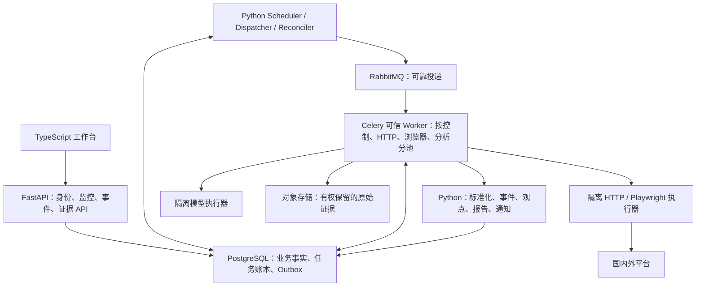

# 社交媒体关键词监控与评论分析设计

关联文档：[PRD](../prd/006-社交媒体关键词监控与评论分析.md) · [Plan 与实施规格](../plans/006-社交媒体关键词监控与评论分析计划.md)

调研日期：2026-09-08。代码基线：`26b93d8a` 及调研时工作区。用户明确要求国内外平台同等重要，先通过免费接口和可维护网页采集验证需求。本文件记录目标设计与调研快照；调研期间未安装第三方采集项目、登录平台、采集社交用户数据或验证真实账号权限。当前基础实现进度见 Plan，不将目标能力视为已实现。来源公开文档证明的是能力存在，实际可用性仍需应用、账号、配额和具体用途验证。

## 1. 结论与产品边界

**项目定位：个人非商业学习项目。固定使用 SQLAlchemy 作为数据库访问层、RabbitMQ 作为消息队列，不再将二者列为待选项。** v2.1 按此澄清修订来源采用与工程范围；默认单人、单实例 Compose，重点学习多平台关键词/评论采集、关系建模、可靠消息与分析。多用户协作、商业分发、计费和集群高可用不进入首轮。

**从需求重新设计，推荐全 Python 服务端：FastAPI + PostgreSQL + SQLAlchemy/Alembic + Celery/RabbitMQ，采集采用 HTTPX/Playwright，分析在隔离执行进程中运行。** 业务 API、身份权限、监控、任务、采集、事件、分析、报告与通知均重新建立契约和验收。全 Python 指服务端应用代码，浏览器工作台仍采用 TypeScript，不要求数据库、消息系统或浏览器自身用 Python 编写。

用户已明确旧实现不可信。撤回 v1.0 根据旧模块“可复用价值”保留 Go 的建议；旧代码、表结构、测试通过和 001–005 验收记录均不构成新架构正确性的依据。新方案不依赖旧 Go API、River 或旧 Agent；只有经过独立核验的数据、规则与测试样本可作为迁移输入。

关键业务链是 **平台关键词发现 → 帖子详情 → 评论与回复 → 增量刷新 → 事件归并 → 有证据的观点分析与告警**。语言选择服务于这一链路的开发和维护效率；Python 不会自动解决平台准入、评论分页或限流问题。

入口分为官方免费接口、具备使用依据且可维护的公开网页采集、用户有权使用的数据导入。试用与长期免费分开，付费入口保留能力契约但不作为本轮验证依赖。每个平台逐项核对搜索、详情、根评论、回复、历史范围与保存用途，不能用单个“支持”开关概括。

国内与海外同时推进：国内核实微博官方试用及一个公开网页候选，海外优先验证 YouTube 与 Bluesky。首个完整交付至少包含国内、海外各一个关键词到评论/回复的真实闭环；HN 可辅助协议测试，不能抵消国内主流平台缺口。国内免费持续来源未通过时，如实保留未完成状态。

## 2. 当前实现边界

旧实现已退役，不作为新功能完成依据。现有切片包含 owner 会话、监控草稿、任务账本和可靠诊断消息链路。来源检索、评论关系、证据、预算、事件与分析仍是下文目标设计，实际完成情况以 Plan 和运行验证记录为准。

## 3. 平台接入矩阵

“已证实”表示一手文档可核对；“候选”表示技术路线，需要真实账号或页面验证；“未核实”不能解释为平台绝对没有该能力。免费指数据入口费用，不包含服务器、带宽、浏览器维护和模型费用。

| 平台 | 关键词发现与详情 | 评论/回复 | 免费验证判断 | 采用顺序与限制 |
|---|---|---|---|---|
| 微博 | 官方 CLI 提供检索；当前仓库已有搜索适配器 | 官方入口声明评论能力，仍需逐端点核对回复范围 | 7 天体验是试用，非长期免费 | 国内优先验证新适配器；试用配额不足时只做小样本，结束后停止对应任务 |
| B站 | 当前实现仅授权账号稿件；公开搜索页采集是另一个能力 | 公开评论/回复网页适配为候选，现有业务链路未实现 | 公开页面路线须单独验证访问条件与可保存范围 | 国内网页候选；不能把 OAuth 账号稿件 API 声称为全站搜索 |
| 抖音 | 官方存在视频垂搜文档，但能力介绍和申请入口的准入描述有冲突 | 搜索结果评论与授权账号评论应分别核对 | 申请可用、用途和保存许可未核实 | 第二批；不把公开 endpoint 当成已获全网舆情权限 |
| 小红书 | 通用关键词检索依赖网页候选；所查官方开放能力不足以证明任意全站搜索 | 网页帖子评论与二级回复是独立能力 | 登录依赖和页面变动影响维护成本 | 第二批；先验证 7 日稳定性，再扩大监控数 |
| 知乎 | 已有官方站内搜索、全网搜索与热榜数据平台 | 搜索 API 不等于评论树 API；评论仍待核实 | 邀测、试用额度，定价需沟通 | 可申请免费试用；长期接入单独决策 |
| 快手 | 账号授权 API 与全站关键词采集分开；后者未核实 | 公开网页路线为候选 | 不能从开放平台存在推断免费全站数据 | 第二批、小规模验证 |
| 微信公众号 | 自有账号接口及有权使用的文章入口；全站关键词发现未核实 | 官方留言接口按自有群发消息查询，不代表任意文章会话树 | 满足账号资质与权限后验证自有范围 | 单独标为“自有公众号”；公开文章发现依赖授权入口 |
| 微信视频号 | 与公众号不同的产品和权限体系 | 全站评论能力未核实 | 无已核实的通用免费入口 | 独立列候选，不能复用公众号标签冒充支持 |
| YouTube | `search.list(q,type=video)`，详情走 `videos.list` | `commentThreads.list` 加 `comments.list(parentId)` 补回复 | 官方有限默认免费额度，需 API 项目 | 海外优先；部分视频关闭评论；搜索不覆盖所有口播/字幕 |
| Bluesky | `searchPosts(q,since,until,sort)`；服务提供方可能要求认证 | `getPostThread`，区分 blocked/notFound 与正常节点 | 公开 AppView 读接口适合免费小规模验证 | 海外优先；搜索游标不保证能遍历全部结果 |
| Hacker News | 现有 maxitem 增量/Top/Best；并非官方全站关键词搜索 | 按 item 与 kids 构建会话，需补现有规范化链 | 官方公开接口适合技术验证 | 独立验证新适配器；本地关键词过滤必须明确标识 |
| X | 现有 recent search；完整历史是另一种能力 | 回复也是 Post，用 conversation_id 检索并保留 replied_to | 当前 API 按使用量计费，非免费基线 | 重建操作契约，未配置预算时不运行 |
| Reddit | 官方 API 有帖子 search、详情 | 评论树及 morechildren 展开 | 个人用途按当前开发者申请、权限与配额验证 | 第二批，不能把历史免费额度当成当前默认权利 |
| Mastodon | 实例级搜索；全文帖文受实例索引配置、认证影响 | status context 范围内的祖先/后代 | 经实例规则允许后可验证 | 辅助来源，不能称为整个联邦网络的全量搜索 |
| Facebook / Instagram | 本轮官方资料请求返回 429，完整能力未核实 | 账号管理、标签、研究数据与全站评论必须分别核对 | 不承诺免费全站发现和评论 | 保留独立能力项，在账号验证后另排切片 |
| TikTok | Research API 有查询，但研究用途有资格限制 | Research API 提供评论能力 | 非商业用途仍须满足研究者/机构等申请资格 | 个人学习不自动取得 Research API 权限；与国内抖音分开 |

一手依据：[微博 CLI](https://open.weibo.com/cli/index)、[微博服务与积分](https://open.weibo.com/cli/manual#plans-usage)、[B站开放平台](https://openhome.bilibili.com/)、[知乎数据开放平台](https://developer.zhihu.com/)、[YouTube Search](https://developers.google.com/youtube/v3/docs/search/list)、[YouTube 评论](https://developers.google.com/youtube/v3/docs/commentThreads/list)、[YouTube 回复说明](https://developers.google.com/youtube/v3/docs)、[Bluesky 搜索契约](https://github.com/bluesky-social/atproto/blob/main/lexicons/app/bsky/feed/searchPosts.json)、[Bluesky 会话契约](https://github.com/bluesky-social/atproto/blob/main/lexicons/app/bsky/feed/getPostThread.json)、[HN 官方 API](https://github.com/HackerNews/API)、[X Search](https://docs.x.com/x-api/posts/search/introduction)、[X Conversation](https://docs.x.com/x-api/fundamentals/conversation-id)、[Reddit API](https://www.reddit.com/dev/api/)、[Reddit 使用条款](https://redditinc.com/policies/data-api-terms)、[Mastodon 搜索](https://docs.joinmastodon.org/methods/search/)、[TikTok Research FAQ](https://developers.tiktok.com/docs/en/research-api-faq)。国内平台的具体权限证据与冲突补充见第 16 节。

## 4. GitHub 项目研究与取舍

按 README、LICENSE 和采集核心代码判断，不以 Star 数作为稳定性证明。代码许可与平台数据使用权是两件事；没有运行这些项目进行真实采集。

| 项目 | 值得参考的能力 | 不能直接解决的问题 | 当前许可与采用结论 |
|---|---|---|---|
| [MediaCrawler](https://github.com/NanmiCoder/MediaCrawler) | 多国内平台的搜索、指定内容、评论与回复；平台适配、分页、登录态组织 | 登录和页面依赖；不自带 HotKey 的业务权利、证据、任务事务与持续完整性 | [LICENSE](https://github.com/NanmiCoder/MediaCrawler/blob/main/LICENSE) 允许非商业学习用途的使用、复制、修改与合并；纳入优先集成候选，保留版权与许可声明，按许可限定小规模学习使用 |
| [BettaFish](https://github.com/666ghj/BettaFish) | 多 Agent 调研、情绪分析、报告；有社交数据采集整合 | 报告演示不等于稳定监测；内嵌爬虫的许可、失败和增量仍需独立处理 | [根 LICENSE](https://github.com/666ghj/BettaFish/blob/main/LICENSE) GPL-2.0 与 README/内嵌组件声明需分别记录；个人学习可研究和试运行，选用组件逐项保留声明，不整套接管业务事实 |
| [TrendRadar](https://github.com/sansan0/TrendRadar) | 热榜/RSS、关键词过滤、历史与通知 | 热榜召回不能替代全站检索；无通用帖子评论主链保证 | [LICENSE](https://github.com/sansan0/TrendRadar/blob/master/LICENSE) GPL-3.0；参考发现和通知交互，不作为数据采集底座 |
| [RSSHub](https://github.com/DIYgod/RSSHub) | 统一 Feed 路由、平台解析和缓存 | 每条路由覆盖、登录依赖、维护状态不同；不保证关键词或评论能力 | [LICENSE](https://github.com/DIYgod/RSSHub/blob/master/LICENSE) 当前 AGPL-3.0；独立评估路由与许可，不沿用历史 MIT 认知 |
| [Scrapy](https://github.com/scrapy/scrapy) | HTTP 采集、中间件、限速、队列与任务持久化经验 | 不提供社媒数据权限；框架任务状态不能替代业务提交事实 | [LICENSE](https://github.com/scrapy/scrapy/blob/master/LICENSE) BSD-3-Clause；参考可靠性机制，当前不引入第二套采集调度 |
| [Crawlee](https://github.com/apify/crawlee) | 浏览器/HTTP 抽取、队列与并发控制 | 其队列不是 HotKey 业务任务事实；浏览器会话需要隔离 | [LICENSE](https://github.com/apify/crawlee/blob/bc345b9a4b893cb968d6933d1b78de30dcc4b921/LICENSE.md) Apache-2.0；框架备选，不能另起持久任务事实 |

选型结论：**独立 Python 采集执行器 + 可复用上游采集模块 + 薄适配层 + 统一业务任务与证据协议**。新采集器以 HTTPX + Playwright 为最小组合，纯 HTTP 能完成的动作不启浏览器。Scrapy 只在复杂抓取中间件有实际价值时采用；Crawlee 是可替代选项，不同时引入三个框架。官方 API 按新契约实现；国内网页采集优先验证 MediaCrawler 对应模块，由薄适配层转换输出，只有上游不满足分页、隔离或可维护性时再独立实现；旧 Go 连接器仅用于核对潜在端点与失败样本，不作为运行依赖。平台执行权登记到单一 adapter version，不能两个实现同时采同一任务。

采用 MediaCrawler 时固定 commit 和依赖，在隔离执行器内调用；配置按任务独立生成，不修改共享全局配置，不让上游存储后端直接写 HotKey 业务库。输出转换为统一页结果，补齐每父回复 cursor、真实计数和稳定错误。若模块只支持整批执行或内存 cursor，先改造出有界页接口并用 Fixture 验证，不把它直接声称为支持断点恢复。新增或修改的上游代码保留来源与许可，后续分享仓库时逐组件说明。

核心源码揭示了几个不能照搬的细节：MediaCrawler 的小红书根评论与每个父评论回复具有独立 cursor，但所查微博子评论实现仅读已返回的内嵌评论；BettaFish 的主题评论检索仅按评论正文 LIKE，会漏掉“太离谱了”等关联短评，其采集完成统计依赖子进程退出码；TrendRadar 的关键词匹配发生在已取热榜标题。由此要求 HotKey 保存真实提交数量、按根帖关联评论、分开评论与回复游标，不能信任平台支持勾选表。[MediaCrawler 小红书分页](https://github.com/NanmiCoder/MediaCrawler/blob/d6f7c5bb906b6dac40ddf343ef9e26438a3de092/media_platform/xhs/client.py#L449)、[微博回复](https://github.com/NanmiCoder/MediaCrawler/blob/d6f7c5bb906b6dac40ddf343ef9e26438a3de092/media_platform/weibo/client.py#L195)、[BettaFish 评论查询](https://github.com/666ghj/BettaFish/blob/c4ca6360489b53c38d3d41d213a67b50d2fcb883/InsightEngine/tools/search.py#L291)、[采集统计](https://github.com/666ghj/BettaFish/blob/c4ca6360489b53c38d3d41d213a67b50d2fcb883/MindSpider/DeepSentimentCrawling/platform_crawler.py#L301)、[TrendRadar 关键词](https://github.com/sansan0/TrendRadar/blob/b6ceb76ad3f8f4b34bc39e8ac73cd3e969f97217/trendradar/core/analyzer.py#L227)。这些是固定版本静态观察，不是对上游所有版本或实际运行的断言。

## 5. 从零架构与关键决策

### 5.1 语言和框架比较

| 方案 | 与需求的匹配 | 代价与判断 |
|---|---|---|
| 全 Go 服务端，另接 Python 分析 | Go 适合并发业务服务 | 高频变化的网页解析、浏览器、NLP 仍跨语言；没有可信遗留资产时不优先 |
| Go 控制面 + Python 采集/分析 | 可按资源划分进程，适合已有可信 Go 核心的团队 | 增加跨语言 DTO、RPC 和发布协同；本项目不以旧核心可信为前提，撤回推荐 |
| 全 Python 模块化服务端 | API、HTTP/浏览器采集、文本分析共享类型和工具链，独立进程扩缩容 | 必须重建权限、任务与数据一致性；CPU 工作用进程隔离，**推荐** |
| Python Django/DRF | 内置认证、Admin 和成熟 CRUD 体系，若运营后台为主有优势 | 本产品核心是异步采集和定制研判工作台；选择 FastAPI 的显式契约，承担认证模块建设。[Django 支持异步](https://docs.djangoproject.com/en/5.2/topics/async/) |

框架不按“性能排行榜”定案。API 采用 FastAPI/Pydantic v2，SQLAlchemy 2 + psycopg 3，数据库迁移 Alembic；uv 锁依赖。主要耗时来自外部 I/O、浏览器与模型，先测端到端延迟和成本，再决定性能优化。API 的 async 处理 I/O，CPU 重任务不得阻塞事件循环；API BackgroundTasks 不承载需要恢复的业务任务。[FastAPI 并发](https://fastapi.tiangolo.com/async/)、[后台任务边界](https://fastapi.tiangolo.com/tutorial/background-tasks/)

### 5.2 一个业务代码库，按资源与信任边界运行

同一 `backend/` Python 包划分以下业务模块，各模块拥有自己的表和应用服务，不强制每个模块生成多层空目录。

| 模块 | 唯一职责及边界 |
|---|---|
| identity | 首轮单一 owner、登录会话、来源范围与必要审计；成员管理、四角色 RBAC 与跨工作空间协作列 P1 |
| monitoring / sources | 监控版本、查询编译、操作能力、来源使用范围、凭据引用、限额配置 |
| collection | 采集运行、页级任务、游标、预算预留、执行结果与原始页观察 |
| content | 外部对象身份、版本、父子关系、指标、证据引用与删除屏障 |
| events | 事件候选、去重家族、合并拆分、可解释热度与时间线 |
| analysis / reports | 冻结样本、模型请求/输出验证、观点分析、版本化报告 |
| delivery / operations | 告警订阅与发送账本、可靠投递、调度恢复、观测与保留任务 |

API、调度器、可信 Worker 都是新 Python 代码。可信 Worker 通过模块应用服务和角色限定的数据库连接提交结果；它启动的网页/模型执行器不获得业务 DSN、RabbitMQ 凭据或通用对象存储权限。仅分 Celery 队列并不能隔离秘密：执行器还须独立进程/容器、环境变量白名单、非特权用户、出站限制与内存/CPU/PID 配额。模型执行器只获得有权处理的冻结文本，不获得来源 Cookie。

API 每请求一个 AsyncSession；Celery 采用 prefork 的同步任务入口，每任务使用自己的同步 Session，连接池在子进程初始化，不跨 fork 继承连接。HTTPX/Playwright 异步执行留在受监督执行器的自身事件循环；不把 `async def` Celery task 当作原生协程任务，也不在并发请求间共享 Session。[SQLAlchemy Session 并发边界](https://docs.sqlalchemy.org/en/20/orm/session_basics.html)、[AsyncSession](https://docs.sqlalchemy.org/en/20/orm/extensions/asyncio.html)

控制、HTTP、浏览器、分析队列分别绑定 Worker，浏览器积压不阻塞 API 或删除任务。API 镜像不安装浏览器和模型运行时；镜像共享锁文件但按依赖组构建。初期只使用 PostgreSQL、RabbitMQ、S3 兼容对象存储，不要求 Redis、Kafka、独立搜索集群或向量数据库。中文检索采用明确分词的索引字段与标注查询集验证，不能直接假定 PostgreSQL 默认全文检索正确支持中文；按实测召回/延迟决定后续索引引擎。

### 5.3 固定技术与任务框架职责

选择 Celery prefork + RabbitMQ，PostgreSQL 保存业务任务与 Outbox。Celery 提供工作进程、路由和消息消费，**不负责成为采集是否完成的唯一事实源**。RabbitMQ publisher confirm 与 consumer ack 是不同阶段，均不代替数据库提交。[Celery 任务语义](https://docs.celeryq.dev/en/stable/userguide/tasks.html)、[RabbitMQ 确认语义](https://www.rabbitmq.com/docs/confirms)

SQLAlchemy 与 RabbitMQ 已由用户固定：不再比较替换为 Django ORM、其他 ORM、Redis broker 或 PostgreSQL 队列。Celery 是当前建议的 Worker 执行框架，底层固定 RabbitMQ；它不是 RabbitMQ 的替代品。PostgreSQL 的 job/Outbox 是状态与投递意图账本，不作为替代消息队列。仍需实现 Outbox 与故障对账，依赖小版本在实施时锁定。

### 5.4 决策记录

v1 的 DEC-006-003（Go/River 控制）、004（复用旧 Document）、009（Go 调用 Collector）、011（旧库 SQL 基线）在 v2 **废止**，分别由 012/014、013、012、015 替代；保留编号历史，需求追踪使用新编号。

| 决策 ID | 当前决定 |
|---|---|
| `DEC-006-001` | 来源级查询编译与可验证覆盖范围 |
| `DEC-006-002` | 官方 API、网页和导入使用同一业务契约，入口类型保真 |
| `DEC-006-005` | 至少一次执行，事实提交幂等，记录重复请求成本 |
| `DEC-006-006` | 有界分层采样，暴露抽样依据与未知总体 |
| `DEC-006-007` | 热度、立场、事实可信性独立 |
| `DEC-006-008` | 请求、节点、浏览器、模型分别预算，来源可独立停止 |
| `DEC-006-010` | 撤权/删除使正文与派生面失效，恢复也执行删除屏障 |
| `DEC-006-012` | 全 Python 服务端，模块化代码库，API/可信 Worker/隔离执行器分角色运行 |
| `DEC-006-013` | 新数据库独立对象/版本/关系/证据模型，身份权限重新设计 |
| `DEC-006-014` | PostgreSQL 任务账本 + Outbox + Celery/RabbitMQ，显式租约/重试/对账 |
| `DEC-006-015` | 新库 Alembic 演进，旧数据经验证导入，正式切换不依赖 Go |
| `DEC-006-016` | 个人非商业学习：单人单实例首轮，可复用许可允许的上游模块，团队协作/商业分发不进入 P0 |
| `DEC-006-017` | SQLAlchemy 与 RabbitMQ 是用户固定约束；Celery 作为执行框架，其他 ORM/broker 不进入选型 |

### 5.5 执行器协议

可信 Worker 下发有界 `ExecutionRequest`：execution_id、contract/adapter version、operation、typed object/query、cursor、deadline、fencing token、预算 grant。内部结果是有界 items、原始证据、next_cursor/has_more、停因与消耗；只有可信 Worker 校验并提交后成为事实。执行器满载返回 busy，不建立第二套持久业务队列。

会话按 connection + visibility_scope + credential_version 隔离，由受限保密通道注入内存或私有临时文件，完成/撤权后清理。短期 grant 不会降低原平台 Cookie 的真实权限。BrowserContext 是存储隔离而非 OS 安全边界，浏览器所有跳转、子资源、WebSocket 和 DNS 都受出站限制。[Playwright 隔离](https://playwright.dev/python/docs/browser-contexts)、[认证文件](https://playwright.dev/python/docs/auth)

HTTPX connect/read timeout 不等于总墙钟期限；应用设置总 deadline。Playwright 操作超时后由监督器关闭 context；超硬截止回收整个执行进程树，清理残留和资源计量。普通取消设置持久 cancel_requested，在页边界和副作用前检查；不靠 RPC 断开、asyncio Task.cancel 或自动 Celery terminate 保证浏览器停止。[HTTPX 超时](https://www.python-httpx.org/advanced/timeouts/)、[Playwright 已知限制](https://playwright.dev/python/docs/library#known-issues)

## 6. 关键词发现与查询编译

Monitor 保存版本化 Intent：主题、实体及别名、包含/排除词、中文/英文查询、标签、语言、国家/区域筛选依据、时间窗、平台、发现频率、评论策略及预算引用。地域只使用平台提供或用户明确选择的检索范围，不从姓名或语言猜测个人位置。

例：监测虚构产品“星舟 X1 / StarBoat X1 电池召回”。保留产品精确短语与召回相关词，排除招聘和广告；中文、英文是两个可审查查询，不把模型生成的翻译当作无条件等义词。

编译输出至少包括：`operation`、`query_text`、`query_hash`、`compiler_version`、`remote_filters`、`local_filters`、`search_scope`、`sort`、`time_semantics`、`expected_cost`、`unsupported_terms`。支持布尔查询的平台可合并等义词；仅支持字符串的平台拆成有预算的多个查询。无法表达的条件必须出现在预览中，不能悄悄丢弃。

四类发现明确区分：`remote_keyword_search`、`feed_local_filter`、`trending_discovery`、`seed_url`。站内 PostgreSQL 搜索是第五种“已采集库检索”，不是远端采集。RSS/HN 固定流、热榜和搜索引擎发现链接不能互相冒充。

用户在预览中看到每个平台“远端查询/本地过滤/不可执行”、近期范围、预计调用次数及凭据状态。未支持关键词搜索的平台可显式绑定账号、标签、Feed 或人工种子，但不能默认用热榜抵消关键词搜索缺口。尚未确认的能力不参与发布可用性计数。

增量主通道优先按最新时间，热榜/相关度搜索作为补充通道。发布时间、平台索引时间、发现时间、采集时间分别保存；未知发布时间保持为空。语言别名、正文匹配和外部索引均不能保证全网召回，质量面板报告“已观测覆盖”，不报告虚构的全网召回率。

## 7. 采集操作、状态与恢复

每个平台按实测注册 search_posts、fetch_post、list_comments、list_replies、refresh_metrics、reconcile_availability；缺操作返回 capability_unavailable。操作请求绑定工作空间、连接、来源可见范围、监控版本、查询与窗口、对象/父对象、cursor、排序、策略和适配器版本。结果保存真实 kind、typed root/parent、原始 ID、证据、下一游标、has_more、停因与成本。

业务任务状态：queued → running → succeeded / retry_wait / blocked / failed / cancelled；过期租约由恢复器评估后重排。任务 succeeded 表示该有界工作单元提交，不代表全平台采集完成。运行覆盖单独记录 complete_for_window / partial / unavailable / unknown；complete 只针对已说明的接口、排序和窗口。

| 上游情况 | 结果与恢复 |
|---|---|
| 合法空页 | success_empty，保留响应结构和已遍历范围 |
| 200 登录页、挑战 | credential_required / access_challenge，暂停来源动作 |
| 401/403、会话到期、能力缺失 | permission_denied / credential_expired / capability_unavailable，不密集重试 |
| 429 或额度耗尽 | rate_limited / quota_exhausted，依据恢复窗口与 Retry-After 写 next_attempt_at |
| Schema 变化、坏 JSON、响应截断 | source_schema_changed 或 invalid_response，保留允许的诊断证据并隔离 |
| 评论关闭、确认删除、不可见 | comments_disabled / deleted / unavailable，缺失和权限失败不能推断删除 |
| 页/节点/深度/预算到限 | partial + stop_reason，保留进度和缺口 |
| 5xx/网络中断 | 有限退避；成本未知保持预留待对账 |

### 7.1 持久调度与可靠投递

1. 发布监控时在一个 PostgreSQL 事务中写配置版本、首个 job 和 outbox；API 返回 202 与 run/job ID。事务外直接 `.delay()` 不能替代此步骤。
2. Scheduler 用 due row 锁和唯一 `(monitor_version, scheduled_slot)` 创建到期任务；next_run_at、retry_wait 和 next_attempt_at 在数据库。停机遗漏窗口按有界补扫/合并策略恢复，避免恢复即爆量。长等待不放在 Celery ETA 内存中。
3. Dispatcher 锁定到期 Outbox，向已声明的持久队列发送持久 JSON 消息，启用 publisher confirm 并检测不可路由消息；确认后标记 sent。发布后、标记前崩溃会重复投递，这是预期路径。
4. Consumer 仅接收内部 job_id、dispatch_epoch、contract_version，不接收 Cookie、正文或任意任务函数。按数据库状态原子领取租约，增加 fencing token；已完成或旧 epoch 消息无副作用确认。所有结果写入再次验证租约与删除/授权屏障。
5. Reconciler 扫描未派发、已 sent 但长期未领取、心跳失联和过期租约。必要时增加 dispatch_epoch 并重新写 Outbox；队列遗失也不能使业务任务永远静默停住。不能仅扫描 unsent Outbox。

仅 PostgreSQL 决定业务重试时间与总尝试数；关闭 Celery autoretry 和适配器无界重试，broker redelivery 不擅自增加新的业务任务。每个真正外部执行计入 attempts；传输抖动与未知成本单独记录。初始设置 acks_late、task_reject_on_worker_lost、prefetch_multiplier=1，并以故障注入验证；必须在执行前检查 attempts/deadline，毒任务进入 failed/隔离，避免无限 requeue。Celery result backend 不存放权威业务状态。[Celery late ack 与进程丢失](https://docs.celeryq.dev/en/stable/userguide/tasks.html)

### 7.2 页提交和标准化两阶段

来源阶段：领取租约 → 原子预算预留 → 执行一页 → 校验并归档原始证据 → 单事务保存 collection_page、observations、checkpoint CAS、派生 job 与下一页 job 的 Outbox。对象写入成功但事务失败会产生孤立对象，按上传登记和保留期回收；不能先推进 cursor。

内容阶段：消费已提交 observation，单事务幂等创建 social_object/version/relation/metric，再写分析或事件任务 Outbox。该阶段失败可独立重放，来源页进度不回退；前端区分已采集和已标准化。没有 PostgreSQL 与 RabbitMQ 的分布式原子提交假设。

幂等至少覆盖页身份、对象身份、版本 hash、分析 input hash 和通知 delivery key。外部请求不承诺恰好一次；通知供应商若不支持幂等键，发送成功但响应丢失仍可能重复，记录 unknown 并对账，不能宣称绝对无重复。

### 7.3 游标、取消和预算

Checkpoint 独立于 broker 消息，按 workspace/connection/visibility、operation、typed object 或 query_hash、window、sort、policy/adapter version 唯一；每个父评论回复有自己的游标。保存当页全部预算允许的 items 后才判断末页，末页有数据必须入库；半页超限保留未完成页位置或可重放页身份，不越过未提交部分。

固定窗口上界、重叠下界（候选 5–15 分钟，依索引延迟校准）；热门排序遇旧帖不能停止。cursor 过期在预算内重扫窗口，重复 cursor/hash 或连续无进展停止并显示缺口。初期按连接隔离，不做跨账号正文共享；同权限域的查询合并另经预算分摊和可见性验证。

取消/来源禁用/撤权在下一请求和每次提交前检查。旧执行未停止或达到硬截止前不让同一会话的新执行并发启动；超期结果用 fencing 拒收。请求次数、平台单位、节点、字节和浏览器秒分别原子预留；超时不自动退款，执行成本未知先留账，再对账结算。

## 8. 新数据模型与一致性

全新数据库由 Alembic 从空库建立。下表是目标逻辑模型，不代表旧表可直接迁移或已实现。首轮只有一个默认 workspace 与 owner，业务表保留 workspace_id 作为归属键；不建设多租户产品。memberships、四角色权限和跨空间操作仅在 P1 实现时验收，首轮必须验证未登录访问与来源凭据隔离。

| 表组 | 核心字段和约束 |
|---|---|
| users / workspaces / memberships / sessions / audit_events | 首轮 owner、默认工作空间、会话摘要/到期/撤销与操作审计；memberships/多角色是 P1；旧会话不直接信任 |
| source_connections / capabilities / rights / credential_refs | provider_product、visibility_scope_version、operation、free/trial/paid/unknown、scope/字段/用途、有效期、验证时间、密文引用 |
| monitors / monitor_versions / compiled_queries | 不可变发布版本、远端/本地条件、语言/时间语义、排序、compiler_version/hash、预算策略 |
| collection_runs / targets / checkpoints | 按操作、查询/父对象、窗口、排序、版本独立进度，revision、cursor、has_more、停因与覆盖 |
| jobs / job_attempts / outbox | 幂等键、dispatch_epoch、状态、next_attempt_at、lease_until、fencing_token、attempt/成本、唯一后继意图 |
| budget_accounts / budget_reservations | 项目/来源/监控额度、计量单位、预留、结算、未知消耗；事务锁保证并发总额 |
| collection_pages / observations / raw_artifacts | 物理页身份/hash、上游对象、原始 kind/root/parent、parser version、时间、对象 hash/字节/保留依据 |
| social_objects / object_versions | 类型化外部身份、current_version、正文 hash、原文/语言、发布时间/索引时间/首次发现、可见状态 |
| object_relations | child、relation_type、typed parent/root 外部引用、内部关联可空、resolution_state；reply/quote/repost/thread_member 分开 |
| metric_snapshots | 对象、原始指标名/值/口径、observed_at、unknown；不将缺失填零 |
| conversation_collections / sampling_batches / sampling_members | 根帖、策略、排序、采样计划/实际、冻结 object_version IDs、rank/时间分箱/入样依据、截断原因 |
| events / event_members / content_families / event_revisions | 事件材料、重复家族、人工合并拆分审计、热度/证据状态与算法版本 |
| analysis_runs / analysis_results / reports / report_citations | input hash、模型/Prompt/Schema 版本、结果校验、引用白名单、质量/弃权与成本 |
| subscriptions / notification_deliveries / deletion_barriers | 告警冷却/幂等键/发送状态、删除和撤权版本、派生失效与恢复重放 |

外部对象唯一键为 `(workspace_id, platform_namespace, resource_kind, visibility_scope_version, external_id)`，规范化 ID 同时保留原 ID。权限分区变化需重新授权，凭据正常轮换不随意改变身份。新库初期不跨工作空间去重正文；相同公开内容仍分别保留来源依据。

正文编辑追加版本；相同版本重复观察只追加观察/指标，不能重复当前对象。对象列表索引按 workspace + root + published_at/id，关系索引按 parent，due job 与 Outbox 按状态/到期时间建部分索引；高增长 observation/page 表按容量实测再分区，不预先引入复杂分片。

父未知保留 unresolved；仅知道 conversation_id 时保存 thread_member，不伪造直接父。写关系检查自环、循环和根范围，并发关系更新在同根事务锁下校验。跨平台转载进入内容家族，不被伪装为平台内回复。

评论属于根帖的观点材料，默认不创建独立事实事件、不增加独立信源数。需要提升的新事实线索进入待核验候选。来源撤权先写读侧屏障并取消任务，再清理正文、对象、索引、分析、报告和缓存；备份恢复先重放删除清单。保留审计不意味着永久保存个人正文。

## 9. 评论采集与分析方法

三种可配置模式：`off`、`sampled`、`bounded_exhaustive`。最后一种也仅表示预算内遍历可见结果，不承诺读取隐藏、删除、不可访问或平台不返回的评论。

免费验证的候选策略：每个 Monitor 每日最多选择 20 个相关根帖；同帖每个分析批次最多 200 条唯一评论节点，其中根评论候选 120、回复候选 80，最大深度 3。另设每帖每轮最多 200 个新增节点、每日最多 400 个新增节点、连续 7 日采集周期最多 1,000 个新增节点；这些累计上限跨重试/排序共享并原子预留，不因重启重置。已有节点指标刷新另计请求预算，不算新增节点；正文版本和原始字节另有上限。最新和热门入口分别记录实际配额与来源，如果只提供一种排序就标记单一排序偏差。预算不足先降低帖数/频率，不能伪造随机样本。

每次采样冻结 `sampling_batch → selected object_version IDs` 成员集与输入哈希，保存抓取前计划、实际入口、rank、时间分箱、已见/去重/有效分析/失败数量；多入口同节点只计一次，保留多条入样依据。重跑同批使用冻结成员，新增或编辑形成新批次。仅从已获取候选池均匀抽样时称“候选池内随机样本”；热度结果不是概率总体，不能套用总体支持率置信区间。来源 `comment_count` 可能包含回复、删评或审核中评论，只有与已采集数语义一致才展示覆盖比例，否则展示两项独立计数与说明。

分析分六层：

1. **相关性**：评论是否讨论该事件，区分灌水、引用和跑题；短评读取有界父级上下文。
2. **主题/观点**：产品质量、召回安排、售后体验等，多标签、保留少数意见。
3. **目标情绪**：负面/中性/正面/混合/不确定，绑定评价对象，不将批评事件解释为批评品牌。
4. **立场**：支持/反对/质疑/求证/无明确立场，绑定一个明确命题；情绪与立场分开。
5. **证据与诉求**：经验陈述、求助、行动建议、待核验事实，附可回看的原文片段与版本。
6. **可信边界**：讽刺、引述、跨语言歧义、上下文不足允许 abstain；重复模板仅作为内容质量信号，不自动断言某账号为机器人。

先独立建立确定性规则与 Python 分析模块形成可评估基线，再比较模型配置。去掉模型后，发现、证据、评论树、计数和时间线仍运行；模型恢复后按输入版本哈希幂等补算。外部正文视为数据，不能成为 Agent 指令，不得诱导工具调用或外网请求。报告每个洞察绑定允许的 Evidence ID，Python 业务校验器验证引用属于本次输入，数字由代码计算。

质量验收使用按平台、语言、时间和排序分层的人工标注集，独立保留测试集；衡量相关性 precision/recall、立场 macro-F1、主题一致性、引用准确率及 abstain 比例。平台搜索的全网 recall 无真值则不估计；可以测固定已知帖集合中的可发现率。推荐候选相关性 precision ≥ 0.85、立场 macro-F1 ≥ 0.75，正式阈值在标注分歧和样本量校准后确定。数字引用准确与不存在越权引用是硬门禁。

## 10. 事件与热度

事件聚合使用时间接近、实体匹配、共享链接、来源对象关系与内容指纹构造候选，再由有界模型分析提议合并/拆分；Python events 模块保存最终状态，Editor 可纠正。跨语言别名必须有版本和来源；相似主题不能直接并成同一事实事件。

热度输入优先使用时间窗内新增相关根帖数、可比较的互动增量、独立来源覆盖和增长速度。按平台/同类内容的滚动基线计算归一化分位，再组合事件分数；平台原始阅读、点赞、转发、评论不同口径不得直接相加。样本量不足或来源掉线标记低覆盖，不能显示“热度下降”。指标减少保留原始负差并标记计数修订；正向增长项可取零，但不能抹掉删除/修订事实。

所有权重、窗口、分位基线和输入快照绑定 `heat_version`，用历史回放校准后采用。初期重建可解释计数与增长基线，旧 Heat 公式不直接采用；组合评分只有在回放比较有效后启用。按事件保存“声量趋势”“样本观点分布”“证据状态”三个独立视图。告警增加最小独立材料数、连续窗口、冷却与重复抑制；历史回填不触发实时升温通知。

## 11. 用户界面与 API 设计

工作台重新按任务流设计，默认 React + TypeScript + Vite SPA，通过同源反向代理调用 FastAPI；登录内工作台没有必须采用 SSR 的需求。若后续明确公开事件页 SEO，再为公开站单独选择 Next.js，不让旧前端框架决定业务后端。当前只定义交互，不制作假运行截图。

| 页面/流程 | 用户需要看到与操作 |
|---|---|
| Monitor 创建 | 主题与中英关键词 → 来源级查询预览 → 评论策略与成本估算 → 发布 |
| 来源管理 | 每个动作可用性、免费/试用/收费、最近成功、权限有效期、恢复动作 |
| 事件总览 | 事件标题、时间窗、来源覆盖、根帖数、样本评论数、数据更新时间 |
| 事件详情 | 时间线、相关帖子、评论树/列表、观点分布、证据与来源覆盖 |
| 评论洞察 | 目标情绪、立场、观点主题、引用、样本量、排序与截断说明 |
| 采集运行 | 各来源/动作已抓页数与条数、游标进度、错误、预算消耗、已保存成果 |

候选接口：来源能力查询；Monitor 预览/发布中的发现与评论策略；事件评论列表/树的有界展开；帖子会话采集；运行覆盖；分析结果和证据回看。新 API 统一以 `/api/v1` 发布，由 FastAPI/Pydantic 生成 OpenAPI，再生成 TypeScript Client；不对旧 Go DTO 做默认兼容。具体方法、权限和 DTO 写入 Plan；尚未发布到 OpenAPI。

UI 必须区分：未配置、正在采集、合法零结果、过滤后零结果、无权限、评论关闭、部分采样、预算到限、数据过期、来源故障、待分析。正常/空/加载/错误/权限不足覆盖桌面和移动；评论树有等价列表，键盘可展开，深层内容分页，未知数值显示“未知”。

## 12. 成本与容量：免费验证的具体边界

预算至少分为请求次数、平台计量单位、返回对象数、字节数、浏览器秒数和模型 Token，不能把所有供应商费用归一成“请求数”。来源级每日硬限、Monitor 子预算和共享项目额度同时校验。

YouTube 当前官方文档于 2026-09-04 更新：默认 Search Queries 独立桶每日 100 次 `search.list`，每次消耗该桶 1 单位；其他多数 API 共享默认每日 10,000 单位，评论列表/回复列表各 1 单位。每一页单独计费，额度以项目控制台为准，不能沿用“search.list 一次固定消耗通用 100 单位”的旧常识。[官方配额表](https://developers.google.com/youtube/v3/determine_quota_cost)

例：为 4 个唯一 YouTube 查询各预留每日 10 次轮询、每轮最多 2 页，共 80 次搜索，保留 20 次给人工操作/补偿。活跃 10 小时时约每小时轮询；全天轮询则约 144 分钟一次。该例显然不能承诺分钟级全平台发现。若日选 80 根帖，每帖 2 页根评论、平均 10 个父评论各 1 页回复，则评论请求约 `80 × (2 + 10) = 960` 次/日；这里只是规划假设，真实回复结构和 API 限制会改变调用量。

通用估算：`发现调用 = 唯一查询数 × 每日扫描轮数 × 平均页数`；`评论调用 = 入选根帖数 × (根评论页数 + 展开父节点数 × 回复页数)`。查询去重只在相同权限域内进行。免费接口没有报价不等于没有限速或无限结果。

存储候选：日 2,000 帖子 + 20,000 评论节点，若归档与规范化合计平均 6 KB/节点，30 天约 3.96 GB 十进制裸数据；算上多次观察、索引、对象冗余和备份需再按实测倍率预留。HTML/渲染证据可能远大于该假设；不默认下载视频、图片或录屏。原始正文保留候选 7 天，上限服从来源协议与用途；可重放的合成 Fixture 长期保存。

个人学习从 1–3 个主题、国内外各一个来源、每日每来源 5–10 个根帖与每帖最多 50 条评论节点启动；这是小样本初始 profile，不削减评论/回复功能。上文日 2,000/20,000 节点仅作后续容量实验，不是首轮负载或达标要求。

初期资源规划用单台 Worker 的实际基线，不声称已压测：HTTP 全局 4 并发、每来源 1 并发，浏览器全局 1–2 个 context；每页候选 30 秒、每动作墙钟 120 秒、最多 3 次总尝试。实际值受平台更严限制覆盖，写入版本化 profile 后才生效。优先先调频率与采样量，不能在 429 后扩大并发。

## 13. 可维护性、安全与观测

每个平台维护一份适配器契约、最小脱敏/合成 Fixture、版本、字段断言、结构指纹和有限 canary。发布新解析器前用固定原始样本重放；相同页面的关键 ID/时间/正文/父关系缺失率超阈值就停止，不让空结果静默污染趋势。模型不能自动修改线上解析器并发布。

认证会话只限用户拥有且允许该用途的账号；显式到期和撤销，权限按操作验证。遇到验证码、风控或禁止访问时转为稳定状态，由管理员处理或停止该来源，不设计代理轮换、账号池或指纹对抗。公开网页可见也不自动赋予批量存储、再分发或模型处理权；SourceRights 记录所依据的许可与允许动作，输出尊重这一范围。

帖子、评论、用户名等默认最小化处理。分析优先只使用必要文本、帖子内匿名作者标识和上下文，不采集粉丝关系、私信或个人敏感画像。凭据管理、日志脱敏、最小权限、证据短期下载授权全部独立实现并做负向验证；所有网页执行通过统一出站策略。第三方供应商文本、页面和评论均不可信，前端输出转义并校验链接。

身份默认使用同源 HttpOnly/Secure/SameSite 会话 Cookie，数据库只保存高熵会话 Token 摘要；登录/注销/撤销与 CSRF 校验重新实现，凭据和访问控制不从旧账号表自动继承。密码使用成熟 Argon2id 实现，登录限速、管理员来源授权与审计属于重建必需项；后续可接 OIDC，不自制密码学。

新增指标：按 platform/operation 的成功率、最新数据年龄、查询页数、候选/接受/去重/分析数量、回复未展开数、游标无进展、解析结构变化、每条有效材料的请求/浏览器秒/Token 成本、预算余额和删除队列积压。不要将 user_id、关键词、帖子 ID、原文或 cursor 用作指标 label，避免敏感信息和高基数。

## 14. 新库、切换与恢复

用户授权立即清理旧服务端、独立 Agent、旧工作台和旧契约。工作树只保留 `backend/` 与新 `frontend/`；历史代码从 Git 获取。根 Compose 不再定义旧服务或 Python profile。当前不导入旧数据，已有卷保留且不被新服务引用。

Alembic 迁移随 backend/src/migrations 目录部署，单次发布进程执行；API 就绪检查数据库版本，Worker 在 fork 后建池。迁移不可改写，不支持破坏性降级。失败时停止新写入，修复新版本或恢复经验证的新库备份；不能将启动旧服务当作等价回滚。[Alembic 自动生成限制](https://alembic.sqlalchemy.org/en/latest/autogenerate.html)

未来如果需要导入旧数据，必须另行实现只读清单、权限和证据核验、来源映射、接受/拒绝对账；不导入旧会话，不自动对导入内容发送告警。本轮不声称已完成导入与恢复演练。

## 15. 风险、验收与仍需决策

| ID | 风险/未决项 | 本设计的处理 |
|---|---|---|
| `RSK-006-001` | 国内长期免费稳定入口不足 | 先验证来源事实，试用显式到期，按平台保留缺口，不能宣称全部免费可用 |
| `RSK-006-002` | 网页采集失效/认证过期 | 版本化 Fixture、canary、稳定错误、有限暂停恢复 |
| `RSK-006-003` | 评论偏差导致误判 | 多入口分层、记录样本分母、保留未知/弃权，不推断总体民意 |
| `RSK-006-004` | 第三方代码许可不满足产品用途 | 按个人学习用途选择可复用组件，固定版本并保留声明；许可范围不清的组件先独立研究 |
| `RSK-006-005` | 评论树/重试造成预算爆炸 | 深度、节点、页、字节、墙钟、日额度和租约同时有界 |
| `RSK-006-006` | 多平台同一事件造成重复放大 | 对外部身份与内容家族分别去重，来源多样性与评论声量分开 |
| `OPEN-006-001` | 首批国内可持续入口及现有账号授权 | 用户方向已明确；实施 S01 以实测确定平台，暂不承诺长期免费 |
| `OPEN-006-002` | Monitor 数、发现延迟与免费预算取舍 | 先按第 12 节候选基线验证，按结果冻结首发配额 |
| `OPEN-006-003`（已关闭，2026-09-08） | 采集运行架构与语言 | v2 采用全 Python 服务端，FastAPI + Celery/RabbitMQ + PostgreSQL；对应 DEC-006-012 至 015，撤回 v1 保留 Go 的结论；依赖版本在实施锁定 |
| `OPEN-006-004` | 标注集与模型成本 | 独立建立 Python 分析/确定性基线，先完成分层人工评估再冻结质量目标 |

成功标准详见 PRD 的 `AC-006-001` 至 `AC-006-015`：必须证明国内/海外来源级能力、真实关键词查询、评论与回复、两轮增量、故障恢复、预算边界、样本质量、证据引用、权限删除和实际 UI 闭环。单纯 CI 通过、表存在、返回一份报告或得到热榜数据，都不代表本目标完成。

## 16. 研究证据与限制

来源选择优先官方文档和作者维护的 GitHub 代码。公开页面能力、账号准入、产品使用条款、持续维护和本地实现事实分开记录；仓库代码没有经过真实社媒采集验证。外部 API/许可均为调研日快照，实施锁定依赖和申请账号时需要再次核对。

| 证据族 | 本次核实结论 | 一手入口与访问说明 |
|---|---|---|
| 微博 | 官方 CLI 检索与评论入口存在；7 天试用非持续免费 | [CLI](https://open.weibo.com/cli/index)、[服务手册](https://open.weibo.com/cli/manual#plans-usage)；动态页面公开文案，不代表本账号已取得能力 |
| 抖音 | 新搜索 scope 为 aweme.dy.video_search；能力介绍仍写实验不开放并有保存用途限制，须核对产品线 | [新视频搜索](https://developer.open-douyin.com/docs/resource/zh-CN/dop/develop/openapi/douyin-search-capability/aweme-dy-video-search)、[能力介绍](https://developer.open-douyin.com/docs/resource/zh-CN/dop/ability/search-management/item-search)；不可将其标称日配额直接当本项目免费额度 |
| 抖音旧评论链路 | video.search.comment 的主评论/回复面向关键词结果 sec_item_id，关键词数量及变更有申请限制 | [评论](https://open.douyin.com/platform/resource/docs/openapi/search-management/keywords-video-comment-management/comment-list/)、[回复](https://open.douyin.com/platform/resource/docs/openapi/search-management/keywords-video-comment-management/comment-reply-list/)；不能未经核实拼接新搜索的 item_id |
| 小红书 | 所查账号 OAuth 与分享能力不足以证明全站笔记搜索和评论权限 | [账号 API](https://openaccount.xiaohongshu.com/docs/api-reference)、[分享平台](https://agora.xiaohongshu.com/)；通用读取仍未验证 |
| B站 | 关联 UP 主授权范围与全站采集分开，协议约束自动化获取 | [开发者协议](https://open.bilibili.com/agreement/developer-service)；公开网页技术候选未通过使用范围验收 |
| 快手 | OAuth 用户视频列表/详情含评论计数，未证明全站评论正文 | [查询视频](https://open.kuaishou.com/platform/openApi?menu=22)；不将计数能力扩写成评论树 |
| 微信 | listComment 针对自有群发 msg_data_id，含留言及运营者回复 | [留言接口](https://developers.weixin.qq.com/doc/service/api/leaving/api_listcomment.html)；账号资质/留言权限受限，不能当任意文章评论抓取 |
| 知乎 | 数据开放平台提供 zhihu_search/global_search/hot_list；邀测及试用 | [开放平台](https://developer.zhihu.com/)；未取得本账号授权，评论树能力未确认 |
| 海外免费候选 | YouTube 免费配额有限；Bluesky 搜索非全量保证 | [配额](https://developers.google.com/youtube/v3/determine_quota_cost)、[Bluesky Lexicon](https://github.com/bluesky-social/atproto/blob/main/lexicons/app/bsky/feed/searchPosts.json)；仅读文档/契约 |
| 海外受限候选 | X 按使用量计费；Reddit 核对个人开发者访问；TikTok Research 仍需资格申请 | [X 计费](https://docs.x.com/x-api/fundamentals/post-cap)、[Reddit 条款](https://redditinc.com/policies/data-api-terms)、[TikTok FAQ](https://developers.tiktok.com/docs/en/research-api-faq) |
| Meta | 关键官方资料读取遇到 429 | [Instagram 入口](https://developers.facebook.com/docs/instagram-platform/instagram-api-with-facebook-login/hashtag-search/)、[Content Library 入口](https://transparency.meta.com/researchtools/meta-content-library/)；仅作为后续核实入口，不作为已确认能力证据 |
| GitHub | 六个项目 README/LICENSE 与重点采集代码研究 | 第 4 节直接链接；个人学习可按对应许可复用，平台准入与代码许可分别验证 |

GitHub 研究固定 head：MediaCrawler `d6f7c5bb906b6dac40ddf343ef9e26438a3de092`；BettaFish `c4ca6360489b53c38d3d41d213a67b50d2fcb883`；TrendRadar `b6ceb76ad3f8f4b34bc39e8ac73cd3e969f97217`；RSSHub `b694e093e7bc59a4058afeaf91607f75c32d277c`；Scrapy `544f4d2d52377c7a5d6e12b51e219a310ec1b43d`；Crawlee `bc345b9a4b893cb968d6933d1b78de30dcc4b921`。这些标识用于复查研究，不是新增依赖版本决定。BettaFish 内嵌 MediaCrawler ref `4de2a325a9cd4f7de7dfb58204b154fc2bb86e40` 的 [LICENSE](https://github.com/NanmiCoder/MediaCrawler/blob/4de2a325a9cd4f7de7dfb58204b154fc2bb86e40/LICENSE) 同样限制非商用，根许可证不能替代逐组件核对。

本次研究的停止边界：已足以决定业务架构、采集契约、采样方法、分阶段验证和许可取舍；账号内配额、平台准入冲突、真实页面稳定性及实际数据质量无法从公开源码证明，明确列入实施验证，避免继续用更多相似仓库替代这些缺失证据。

全 Python 技术决策属于本项目推导，不是上游承诺其自动满足 HotKey 的可靠性或容量。新增一手依据见第 5、7、14 节；框架文档不替代本项目故障注入和真实平台验收。

2026-09-08 实施启动：用户直接授权进入006工程实现。首片为独立新库/可靠任务基础，平台来源验证仍待执行，未将G2真实来源证据标为通过。

## 17. 唯一技术栈切换决策（2026-09-08）

用户明确授权立即清理旧实现。工作区不保留旧 Go 实现、旧独立 agent/、旧Go客户端、旧CI和001–005运行文档；历史只在Git中查询，本地未提交配置移至仓库外私有恢复目录。持久数据库/对象卷不删除、不自动导入。

唯一后端为backend/的FastAPI模块化应用，固定SQLAlchemy与RabbitMQ。API按APIRouter、Pydantic输入/输出、业务service和SQLAlchemy持久模型分工；service拥有事务，路由不发SQL或直接发布消息。FastAPI同步def端点执行有界SQLAlchemy操作，在线程池中运行，每操作独立Session；Worker在fork后建立进程级连接池。后续引入异步外部I/O时显式使用独立AsyncSession，不把阻塞SQL放进async路由。

本轮补齐单owner初始化/会话撤销/CSRF、监控草稿与乐观锁、任务查询/有界分页/幂等诊断和取消。未连接来源前不发布采集任务；不伪造数据或兼容旧接口。工作台重建为React/TypeScript/Vite，通过唯一docs/openapi/openapi.json生成类型并以openapi-fetch调用；删除旧页面中的不可用动作。

Compose仅包含postgres、rabbitmq、migrate、backend、worker、scheduler、web。根生产文件为明确覆盖层，通过两个-f组合运行；禁止保留profile双运行面。统一HOTKEY_配置、环境校验、非明文会话摘要、请求ID、脱敏错误、依赖就绪与优雅关闭。Alembic随应用目录部署，启动不自动改库；CI验证空库/升级、元数据对账、真实消息、认证负向、生成契约、前端构建与浏览器主链。

技术栈切换不等于所有产品能力已实现：平台关键词/评论、证据归档、事件/模型分析和报告仍受对应AC约束。维护矩阵以新测试为准，不拿旧Go的通过记录认定等价。

### 17.1 当前 API 与工程规范

`main.py` 装配应用，`api/` 负责协议与依赖注入；`identity/`、`monitors/`、`jobs/` 按业务领域拆分服务、持久模型和 HTTP Schema。Session 每事务独立，连接池每进程独立。FastAPI lifespan 关闭 API 连接池，Celery 子进程初始化/关闭钩子管理 Worker 连接池。

当前错误契约为 `{code, request_id}`，不回显输入值；客户端按稳定 code 给出提示。写请求必须带精确 Origin，已登录写请求另带 X-CSRF-Token。会话 12 小时，HttpOnly、SameSite=Lax，生产强制 Secure；登录连续失败 5 次锁定 15 分钟。密码不进入命令参数、数据库明文或日志。

监控只提供 draft 保存/编辑，版本用行锁和 expected version 比较，冲突 409。分页按 UUID 升序游标，每页 1–100 项；它是有界遍历，不是并发新增期间的一致性快照，刷新从第一页开始。诊断接口只接受 verify_pipeline 和幂等键；不开放未实现采集操作。readiness 的范围明确为 database_schema，不能据此推断 Worker、采集或分析健康。

运行指令以 Operations 为准；目标 API 表中的其他操作尚未发布，不提供空壳端点。标准参考：[FastAPI APIRouter](https://fastapi.tiangolo.com/tutorial/bigger-applications/)、[SQLAlchemy Session](https://docs.sqlalchemy.org/en/20/orm/session_basics.html)、[FastAPI lifespan](https://fastapi.tiangolo.com/advanced/events/)。

### 17.2 后端目录与命名约束（2026-09-08 修订）

用户指定后端工程与 Compose 服务名统一为 `backend`，以本节为当前命名规范。Python 代码统一位于 backend/src，uv 管理依赖，取消独立包构建。不建立路径别名或兼容入口。

src 下直接按职责组织：`main.py` 只装配 FastAPI；`api/dependencies.py` 管理依赖；`api/routers/` 按身份、监控、任务和健康检查分路由；`api/middleware.py` 与 `api/exception_handlers.py` 管理协议边界。`core/` 放配置、错误、公共输入输出和时间函数；`db/` 放 Base、连接池、元数据注册和就绪查询。`identity/`、`monitors/`、`jobs/` 各自维护 models.py、schemas.py、services.py；任务状态机位于 jobs/execution.py，Celery 入口和消息收发分别位于 worker/app.py、worker/messaging.py，管理命令位于 cli/commands.py，由 cli/__main__.py 启动。跨领域审计归 audit 模块。迁移随应用目录部署，已发布 revision 不变。

`__init__.py` 不承载业务实现；模块/函数使用 snake_case，类使用 PascalCase，常量使用 UPPER_SNAKE_CASE。HTTP router 不能依赖 SQLAlchemy、持久模型或消息发布器；services 不依赖 FastAPI；models 和 schemas 不反向依赖服务/HTTP。同步 SQLAlchemy 保持同步依赖/路由及进程私有连接池。禁止泛化 Workspace 服务继续聚合多个业务领域。

测试按 unit、integration、architecture 分类，实际 Compose 验证脚本放 `backend/scripts/verify_*.py`。CI 执行结构/依赖方向检查、严格类型、格式、真实数据库和 RabbitMQ、OpenAPI 一致性、浏览器和优雅停止验证。此次重构保留 HTTP 路径、请求响应、数据库表和任务消息协议；内部目录变化不作为外部破坏性变更的理由。

### 17.3 运行目录与入口

应用源码位于 `backend/src/`，不增加 `hotkey/` 或 `app/` 包装层。Worker 和 CLI 分别为 src 下的独立目录；jobs 保存任务账本与执行状态机，不依赖 worker 或 cli。测试和容器验证脚本留在 backend/tests 与 backend/scripts。

uv 仅管理依赖，不构建独立 wheel。Python 运行目录为 backend/src（容器中为 /app/src），入口为 main:create_app、worker.app:app 和 python -m cli。本地使用 uv run --directory backend/src 启动，pytest 的 pythonpath 与 mypy 的搜索路径统一指向 src。OpenAPI 工具通过自身文件位置定位仓库契约，不依赖调用者工作目录。迁移内容、HTTP 契约和消息协议保持不变。
