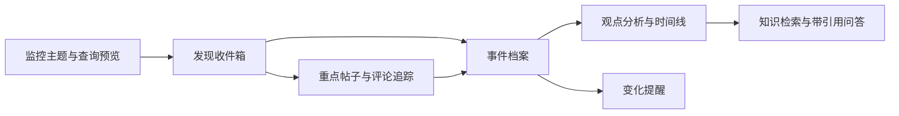
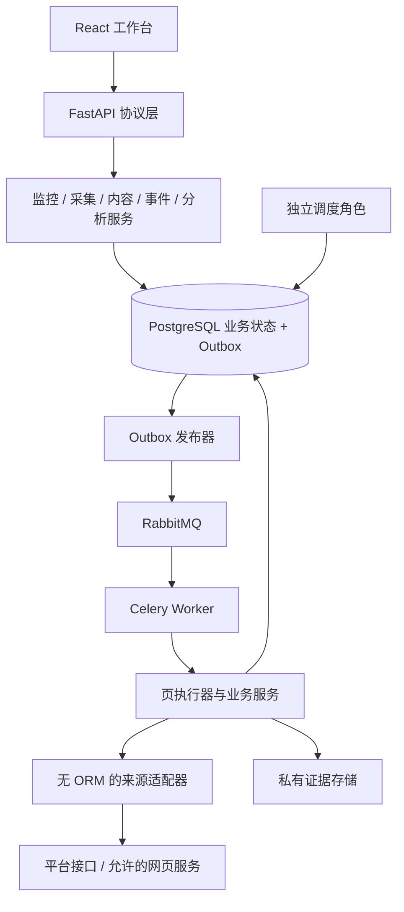

# 热点事件与评论知识库设计

2026-09-15。本文将本轮 GitHub、Firecrawl、Context7 研究和鱼皮源码分析落实到当前 HotKey。用户已授权开始实施；S00 工程与契约门禁、S02 的不可变监控配置、页事务、MinIO适配器、采集消费者、日预算、周期槽与运行列表基础已经验收，B站有界评论链与现有MinIO已完成一次真实产品canary；更多来源、生产准入与后续产品能力仍按切片验收。

**产品定位：围绕关注主题，持续发现相关内容，追踪重点事件与评论，将证据和分析沉淀为可检索、可统计、可复核的事件知识库。**

## 1. 与现有工程的关系

007 是下一轮产品范围、信息模型和实施顺序的规划入口；[006 Design](006-社交媒体关键词监控与评论分析设计.md) 继续记录已采用的 Python 基础架构和来源探测边界，[006 Plan](../plans/006-社交媒体关键词监控与评论分析计划.md) 保留原进度。007 不把 006 未完成事项标记完成，也不撤销其可靠性约束。进入下一轮实现时以 007 切片顺序承接，两套任务不并行重复建设。

本次直接核对的代码事实如下；没有重跑历史集成测试，也没有重新探测平台。

| 当前事实 | 对规划的影响 |
|---|---|
| FastAPI / SQLAlchemy / PostgreSQL / Alembic；Celery + RabbitMQ + 数据库 Outbox | 复用基础，增加真正的采集任务类型和业务结果；不重建语言栈 |
| 单 owner 认证、会话、CSRF；React / TypeScript / Vite 与生成客户端 | 第一版保持单用户工作台；页面跟随真实业务切片增加 |
| Monitor 仅有 title、keywords、sources、version、created_at；返回状态固定 draft | 增加监控生命周期和不可变配置版本；旧草稿仍为草稿 |
| Job 白名单包含 verify_pipeline 与 collect_page；JobResult 只保留诊断短结果，collection_runs 保存采集状态 | 诊断与采集共用Outbox/租约/fencing，业务结果不塞进消息或JobResult |
| 来源能力卡含X、B站、微博、小红书、抖音、Bluesky，流水线均为 not_connected | 平台名称是配置选项，不是已接入能力；创建采集运行前必须按操作和用途准入 |
| 通用查询预览不联网；CLI支持Bluesky与B站有界探测；原始页契约可接单页消费者 | 保留预览和独立探测；B站与现有MinIO的真实有界链已单次通过，生产连接仍受准入和长期验收门禁 |
| 2026-09-08 探测记录：搜索 403；线程 20 节点后 partial/node_limit | 是历史小样本证据，不能证明今天的搜索准入或完整评论覆盖 |

代码核对入口：[监控模型](../../backend/src/monitors/models.py)、[任务模型](../../backend/src/jobs/models.py)、[来源契约](../../backend/src/sources/schemas.py)、[历史探测记录](../operations/evidence/source-probe-summary.json)。

## 2. 产品边界与体验

### 2.1 四个核心对象

- **监控主题**：用户长期关心什么，例如“某品牌的售后体验”；包括别名、排除词、来源、频率、预算。
- **内容**：一篇帖子、文章、视频条目或评论，是带平台身份和时间的证据。
- **事件**：同一主体在一段时间内发生的具体事情，例如“9月某型号更新后续航投诉”。同主题可以有多个事件，同事件可以跨平台。
- **知识条目**：带引用和版本的事实陈述、时间线、观点总结、复盘报告；明确区分来源说法和已交叉核实的信息。

不要将“命中关键词的一条结果”直接命名为事件；不要把事件摘要当成事实原文。

### 2.2 主流程与页面



| 页面 | 核心信息和动作 | 交付阶段 |
|---|---|---|
| 监控主题 | 查询范围、排除项、实际平台查询、可用操作、采集计划；保存草稿、启用、暂停 | S02 |
| 发现收件箱 | 原文、来源、发布时间/发现时间、命中原因、分析状态；关注、忽略、归入事件 | S02 |
| 内容详情 | 原文版本、指标快照、根帖/回复关系、采集范围与停止原因；追踪评论 | S03 |
| 事件档案 | 简介、实体、时间线、相关内容、分平台趋势、主要观点、证据、更新历史 | S04 |
| 知识库 | 主题/事件/平台/时间筛选；全文检索、统计、带引用问答；保存分析 | S05 |
| 设置与运行状态 | 来源权限、预算、最近成功/失败、积压、告警规则；人工恢复 | 随阶段交付 |

默认首页先是可操作的收件箱；有事件后增加事件概览。首屏只显示新增、待处理、关注事件变化和来源异常，不先做缺少真实数据的大屏。

### 2.3 范围

完整 MVP 包含：单 owner、以X等主流信息平台为重点的信息发现入口、至少一个用户指定国内平台的重点帖评论及回复、人工辅助事件归并、样本观点分析、基础知识检索与引用、站内告警。信息发现与评论来源可以不同，但必须通过事件关联并保留平台原始关系。X的免费持续入口尚未验证，不能以其他平台成功替代该目标。S02 的收件箱只是首个可用版本，不是完整 MVP 验收。

P1 再扩展账号/RSS订阅、更多平台、自动事件合并建议、高级比较和外部通知；P2 再考虑团队工作区及复杂传播网络。全网完整覆盖、全量历史回溯、实时秒级承诺、视频文件归档/全量转录、自动判真伪不在本轮范围。

## 3. 技术选型与决策

| 决策 | 选择与理由 | 本轮取舍 |
|---|---|---|
| DEC-007-001 产品单元 | 主题 → 内容 → 事件 → 知识；先交付发现收件箱 | 借鉴鱼皮的轻量发现体验，增加后续可追踪身份和状态 |
| DEC-007-002 后端 | Python 3.12 + FastAPI + Pydantic + SQLAlchemy 2 + Alembic | 符合现有工程与采集/分析生态；不切换 Express/Prisma 或恢复 Go |
| DEC-007-003 持久化与任务 | PostgreSQL 为业务事实源；Celery + RabbitMQ 执行；原 Outbox/租约/fencing 延续 | 不以进程内 cron、消息队列结果或内存 Map 保存任务事实 |
| DEC-007-004 前端与交互 | React + TypeScript + Vite；`@umijs/openapi` 从 FastAPI OpenAPI 自动生成全部端点函数和类型；共享 Axios request 只处理传输横切逻辑 | 业务代码不手写 URL/HTTP 方法/DTO；首版轮询任务状态，暂不引入 Socket.io |
| DEC-007-005 来源 | 按平台、操作、账号范围和用途登记能力，HTTP API 优先 | Firecrawl 仅负责允许的新闻/网页发现与正文提取；社交搜索/评论使用专用适配器 |
| DEC-007-006 采集 | 页级任务、先保留有界候选再分析、重叠窗口和独立评论游标 | 模型故障不删除候选；保存条数上限不等于请求/模型调用预算 |
| DEC-007-007 数据与证据 | 规范内容 + 不可变版本 + 观察记录；跨监控多对多；关系数据库记录证据引用 | URL 只作辅助标识；未知计数保留 null，真实 0 保留 0 |
| DEC-007-008 评论与事件 | 根帖带入评论上下文；分层抽样；人工归并先行；趋势分平台展示 | 不按评论正文关键词硬筛；不把平台计数直接相加成全网热度 |
| DEC-007-009 知识与模型 | 受控 SQL 统计 + 词法/向量检索 + 引用生成；Pydantic 严格校验 | 模型不直接执行任意 SQL，不将模型摘要覆盖原始证据 |
| DEC-007-010 权限与保留 | 获取、展示、保存、派生分析、外部模型处理、导出分别准入 | 权限未知时禁用对应操作；删除传播覆盖衍生结果 |
| DEC-007-011 部署与演进 | 模块化单体 API + 独立 Worker/调度角色 + 当前根 Compose | 暂不引入 Kafka、Temporal、Redis、ClickHouse、OpenSearch、Neo4j 或多 Agent |
| DEC-007-012 目录先行 | 每片开始前固定模块归属、文件清单、依赖方向与生成物路径 | 新目录须纳入架构扫描；不为未来功能批量创建空目录 |
| DEC-007-013 来源角色与费用 | 2026-09-15用户明确：X等主流信息平台优先发现；B站/微博/小红书/抖音提供评论研究；内容采购零付费 | 免费服务或自建采集；免费额度耗尽停止，不自动充值、切换付费数据商 |
| DEC-007-014 对象存储 | 2026-09-15用户明确使用并复用现有MinIO，通过私有S3接口保存证据 | 撤回本地目录作为正式证据存储的推荐；不新建实例，实施前核对连接/版本 |

**有条件的组件选择：**

- 原始证据存储：固定MinIO，数据库保存bucket/object_key/hash/权限/过期时间。先完成对象上传和校验，再提交数据库引用；事务失败产生的孤儿对象按宽限期清理。S3对象提交/删除需独立验证，不照搬本地rename，不将私有对象公开。客户端锁定 `minio-py 7.2.20` 并封装在 evidence 适配器；现有实例已用专用应用身份完成真实来源和独立对象协议验证，远端网络、TLS与自动保留仍须单独验收。自托管服务不是应用内再写一套文件服务。
- 向量检索：S05 加 pgvector；小规模先精确搜索。中文词法检索增加经标注集验证的分词/归一化，不把 PostgreSQL 默认配置视为中文检索方案。ANN 上线前与精确结果比较过滤后的召回；扩展版本以兼容试验和锁定结果为准。
- 模型：先定义可替换的文本分析/embedding 接口；供应商与模型 ID 在 S04 用同一标注集比较质量、耗时和单次费用后锁定。初版无须 LangChain 或独立 AI Agent 服务。
- 浏览器采集：仅在目标用途允许、HTTP 不满足且小样本成功时增加隔离浏览器执行角色；不把浏览器进程放入 API 进程，不在首片引入整套爬虫运行时。
- 图表：先实现分平台时间桶和样本构成；确有可视化需求后再选择轻量图表库。没有数据与指标口径时不增加图表依赖。

### 3.1 技术选型登记与版本基线

“已固定”指现有工程约束及本轮继续采用的基线；“待确认”不能视为已同意；“后续评测”不阻塞与之无关的来源/采集设计。以下版本直接读取当前锁文件、Dockerfile和Compose，不代表最新版本或本轮完成了升级/安全验证。

| 层级 | 当前选择/本地锁定版本 | 状态与实施位置 |
|---|---|---|
| Python运行时 | Docker/CI为3.12；pyproject范围为>=3.12,<3.14 | 已固定部署基线3.12，扩大运行版本需独立验证 |
| HTTP/Schema | FastAPI 0.141.1、Pydantic 2.13.5、HTTPX 0.28.1 | 已固定；backend/uv.lock，业务与协议边界见第13节 |
| 数据访问/迁移 | SQLAlchemy 2.0.52、psycopg 3.3.5、Alembic 1.19.2 | 已固定；模型在各业务模块，迁移只在src/migrations |
| 数据库 | 当前Compose PostgreSQL 16 | 沿用当前主版本；镜像tag未锁digest，不宣称位级可复现 |
| 异步任务 | Celery 5.6.3、RabbitMQ 4.1-management | 已固定；jobs管状态，worker管传输/进程装配；RabbitMQ镜像tag未锁digest |
| 浏览器端 | React/React DOM 19.2.8、TypeScript 5.9.3、Vite 7.3.6；Node构建/CI为24 | 已固定；frontend/package-lock.json；无Node业务后端 |
| HTTP客户端契约 | Axios 1.20.0、@umijs/openapi 1.14.1、tslib 2.8.1 | 2026-09-15 已切换；唯一契约由 FastAPI 自动生成，客户端固定输出到 frontend/src/api，Axios封装固定为frontend/src/request.ts，业务端点请求禁止手写 |
| 测试 | pytest/Ruff/mypy；Playwright 1.63.0 | 沿用现有工具；后端版本以uv.lock为准 |
| UI组件/状态 | 现有React组件、CSS、局部state与显式API调用 | 首片沿用；尚未选择新组件库、全局store、路由或查询框架，新增前列出实际需求与方案 |
| 原始证据存储 | 复用现有MinIO + 私有S3访问；minio-py 7.2.20；SDK封装于evidence/adapters/minio.py | 现有实例的本机容器网络、真实来源入库、双hash读回、全版本删除和专用应用身份最小权限已通过；远端网络、TLS与自动保留仍待验收 |
| 分析模型/服务商 | 文本分析候选`qwen3.5:latest`；embedding固定`qwen3-embedding:latest`、1024维、Ollama原生HTTP | 仅连接用户配置的自建Ollama服务，不启用付费推理；分析分类口径仍待产品确认 |
| 中文检索、pgvector | `pgvector/pgvector:0.8.6-pg16`、Python `pgvector` 0.4.x；小规模精确余弦搜索 | S05-T01B合成集与可丢弃数据库POC已通过；初版不建ANN索引，中文词法分词仍未引入 |
| 平台优先级 | X等信息平台发现；B站/微博/小红书/抖音评论链 | 用户已固定DEC-007-013；先验X免费发现与国内评论候选，具体能力见OPEN-007-005 |

内容采购预算固定0；AI与embedding同样只使用免费额度或自建服务，不启用付费推理。自建服务器、存储、带宽等资源成本单独记账，不把“自建”描述为零运行成本。Firecrawl云服务仅可在明确免费额度内使用；产品运行可评估自建网页提取，不能假定本次研究工具的账号额度可直接供产品使用。

如果后续选择改变部署方式、长期维护成本、付费预算或用户可用的平台/功能，先带推荐方案与影响向用户询问；参数细节可按已确认方案实现。问题未回答时记录为待确认，只继续不依赖该决定的工作。每个切片只需冻结该片必需的选择，不因S05模型未定而阻塞S01目录和来源契约。

### 3.2 收件箱主题匹配审核边界

收件箱审核的业务对象是 `monitor_match`，不是全局内容。每条匹配保留不可变监控版本、命中原因、相关性状态和人工审核状态；`new → following|ignored`、`following → new|ignored`、`ignored → new` 都是同一关系上的幂等owner操作。同一内容命中多个主题时，忽略其中一条不能撤回内容或改变其他主题的匹配。

默认收件箱只选择至少有一条 `new|following` 匹配的可用内容，并只返回符合当前主题/审核筛选的匹配DTO；已忽略关系必须通过 `review_state=ignored` 显式查看和恢复。主题筛选按稳定 `monitor_id` 跨不可变版本查询，卡片同时显示实际命中的版本。来源直接过滤内容身份，时间预设映射为固定的发现时间下界；同一分页链复用该下界和既有 `(first_seen_at,id)` 游标。

monitors领域拥有匹配读取与状态写入，contents领域只组合公开DTO/只读查询，不导入monitors ORM。写操作使用现有行锁和审计事务；个人单owner MVP没有第二个业务编辑者，因此不为审核状态增加迁移、版本号或兼容端点。FastAPI生成列表参数和审核端点，前端只通过UmiOpenAPI生成函数调用。

## 4. 来源策略与准入门禁

每个来源保存 `platform + provider + operation + account_scope + adapter_version`。operation 至少区分 search_posts、fetch_post、list_comments、list_replies、fetch_thread、fetch_article、fetch_hotlist；能力相同也不混淆数据语义。

技术能力、用途权限、持久流水线与本次结果四个维度独立，准入粒度固定为 `source.operation`，不设置平台级放行字段：

- 能力：unknown / supported / unsupported / authorization_required；保存证据日期、允许范围与配额。
- 用途权限：unknown / allowed / denied；allowed 只表示部署者确认该操作用于本产品的采集、保存和派生用途，不由技术可读性推断。
- 流水线：not_connected / connected / degraded / paused；connected 只在持久化验收后设置。
- 本次结果：ok / empty / partial / failed；另带 access_denied、rate_limited、cursor_stalled、node_limit、schema_drift 等原因。

部署通过 `HOTKEY_SOURCE_RIGHTS_ALLOWED` 与 `HOTKEY_SOURCE_PIPELINES_CONNECTED` 两个JSON数组填写精确键，例如 `bilibili.search_posts`。两者默认空；只有技术能力为supported、用途为allowed、流水线为connected三项同时满足时，该操作才是eligible。操作还可以声明必需的下游operation；B站依赖链为search_posts → fetch_post → list_comments → list_replies，任一门禁未满足时上游操作都不可启用。API、monitor启用、collection、scheduler和Worker读取同一Settings；未知键或本版本没有持久消费者的connected键必须在服务启动时失败。当前版本实现这四项持久执行入口，其中每个重点帖的根评论运行最多2页，并按页序和平台顺序最多为2条有回复的根评论分别建立最多2页的回复运行。个人非商业学习用途已由用户范围确认；2026-09-16初次真实canary在缺少匿名首页会话时于评论步骤得到`access_denied`，修复后一次性同协议fixture和用户现有MinIO上的真实prefork链均已持久化正文、根评论和回复。单次现有MinIO canary中22条关系resolved，2条回复因有界样本缺父评论而保持unresolved；生产默认继续not_connected，不能由单次技术canary推断整条流水线已具备长期生产准入。

| 优先级 | 候选与工作 | 进入产品的条件 |
|---|---|---|
| 首轮信息发现 | X等主流信息平台；先研究X免费/自建可持续入口 | 2026-09-15官方文档仍为按量付费读取，不纳入内容零付费方案；公开网页/用户获准访问/免费订阅等候选逐项实测，不保证自建即可获得搜索能力 |
| 首轮评论 | B站、微博、小红书、抖音 | 四个平台均进入验证清单；工程先实现通过验证的一条闭环，其他平台保留缺口；帖子发现、根评、回复分别验证，不用评论计数或热榜替代评论原文 |
| 发现补充 | 允许的新闻网页、RSS；HN 可作为海外技术主题补充 | 新来源需补其当前契约与用途验证；补充来源不能悄悄替代国内社交评论门槛 |
| 补充与回归 | Bluesky现有适配器、Reddit等获准免费入口 | Bluesky历史搜索403保留为已知缺口，不作为新的主线；不启用收费的数据提供商 |
| 后续待核实 | 知乎、快手、微信等 | 研究线索不是已接入承诺；不得把后台草稿中的平台列表全部标为可用 |
| 受限候选 | YouTube | 官方检索/评论 API 技术可读，不等于允许本产品的聚合、派生指标与长期知识用途；允许范围确认前不作为默认分析来源 |

来源不可用时保留缺口，并缩小该来源功能或更换已验证候选。用户导入可以验证后续界面/分析，但单独标明 imported，不能计作持续监控验收。首轮预算为试验上限，不自动购买付费接口。

X事件发现后，用实体、事件动作、时间范围和别名到国内平台寻找讨论根帖，再获取这些根帖的评论。`event_members`关联不同平台的根帖；B站/微博等评论的root/parent始终指向其本平台对象，不能伪装成X帖子的回复。web搜索摘要只作为web_snippet发现线索，抓到并核实平台原文后才建立平台帖子身份；不将摘要记为完整X采集。

## 5. 关键信息与逻辑数据模型

以下是目标逻辑模型，按阶段增表，不在第一片一次建立全部结构。统一 UTC 存储，界面显示用户时区；`published_at`、`observed_at`、`first_seen_at`、`updated_at` 分开。

| 数据单元 | 关键字段/约束 | 阶段 |
|---|---|---|
| monitors + monitor_versions | title、state、current_version；不可变 query_spec、source_policy、schedule、budget；unique(monitor_id, version) | S02 |
| source_capabilities | provider/operation/scope、support、rights、quota、verified_at、evidence_ref；密钥只保存引用 | S01/S02 |
| collection_runs + collection_checkpoints + collection_budget_usage | monitor_version、触发方式/周期槽、UTC预算日、操作/根帖/父评论/查询变体/排序、窗口、计数、停止原因、游标、lease；按版本与日期原子预留请求，checkpoint key 包含采集维度 | S02/S03 |
| raw_pages | provider_request_fingerprint、对象键、hash、observed_at、retention_until、policy_version；不保存认证头 | S02 |
| contents | id、platform、provider_namespace、external_id、kind、canonical_url、author_ref、root_id、parent_id、visibility；身份范围内 unique | S02/S03 |
| content_versions | content_id、version、text/title、provider时间、observed_at、hash、raw_page_id；不可变正文版本 | S02 |
| monitor_matches | monitor_version_id、content_id、first/last_seen、match_reason、relevance_status、review_state；多对多，幂等关联 | S02 |
| content_observations | content_id、observed_at、like/comment/view等原始指标、指标定义、raw_page_id；0 与 null 不混同 | S02 |
| events + event_members + event_revisions | 事件标题/实体/时间范围/state；关联内容、归并理由、人工确认；合并/拆分保留修订 | S04 |
| analysis_runs + analysis_samples + analysis_labels | 冻结成员版本、采集窗口/排序/抽样策略、模型/提示/标注版本、目标/立场/置信度、引用 | S04 |
| knowledge_entries + knowledge_versions + knowledge_chunks | event、entry_type、正文、有效时间、引用、权限；chunk/embedding 绑定条目和正文版本 | S05 |
| alert_rules + alert_occurrences + deliveries | rule_version、event/change_id、渠道、幂等键、尝试/送达状态；与业务变化/Outbox 同事务 | S04及P1 |

S02 最少实现来源记录、配置快照、运行/检查点、页证据、内容/版本/指标观察和监控关联。任务与审计沿用当前表，不另建第二套调度平台。跨 provider 声称同一平台 ID 之前需验证命名空间；无法确认时保留独立身份并建立候选关联。

### 5.1 查询结构

`query_spec` 包含 include_any、include_all、exclude、aliases、entity_context、language、时间范围与观察对象。首版支持其中经过源适配器验证的子集，预览每条规则的执行方式：native、local_filter、unsupported。

例如品牌词含别名时，远端查询扩展最多 N 条，并明确列出；本地相关性规则可更丰富。两者各自版本化。平台不支持的时间/排除条件可对已返回内容本地过滤，但需注明“不能扩大平台返回范围”。启用时绑定配置快照，编辑保存产生新版本；旧运行不会中途读取新规则。

### 5.2 身份、更新与去重

1. 以来源对象 ID 幂等 upsert；web 内容才使用谨慎归一化 URL，不能删掉具有身份意义的参数。
2. 同一对象匹配多个主题只存一份内容，分别记录命中；忽略 A 主题下的结果不影响 B。
3. 同文转载用 content_family/关联关系去重分析，保留独立来源；不能合并成同一平台互动计数。
4. 文本 hash 改变形成新版本；仅计数变化写观察记录，不反复调用全文分析。
5. 无法找到父评论时保留平台 parent_external_id 与 relation_status=unresolved；后续补全，不伪造树。
6. 不可见响应与明确删除分开；不因某次分页未出现就推断删除。

### 5.3 生命周期

- Monitor：draft → active ↔ paused → archived。启用需通过选定操作准入；暂停后不派新任务，运行任务在页边界退出。
- CollectionRun：queued → running → completed/failed/cancelled；completed 的 collection_outcome 可为 ok、empty、partial。执行成功不等于采集完整。
- 相关性：pending → accepted/rejected/needs_review；analysis_failed 单独保留失败与重试，不等于 rejected。
- Event：candidate → tracking → cooling → archived；新证据可重新打开。归档是停止主动追踪，不等于删除。
- Analysis：pending → running → succeeded/failed/stale；输入版本变化后旧结论仍可查看，但明确过期。

## 6. 采集执行与模块边界



模块遵循当前 `backend/src/` 规范：`sources/` 只处理外部协议；`collection/` 负责页执行、预算与检查点；`contents/` 负责内容/版本/关联；`events/`、`analysis/`、`knowledge/` 按切片增加。服务通过明确参数/DTO 协作，不互相访问对方内部表；需要多模块同事务时由该用例的服务组织，不能嵌套独立提交导致页水位先行。API 仅经 dependencies 注入，Worker 不绕过服务直接改业务表。

手动“立即采集”与周期调度共用一个采集批次编排用例。浏览器只提交监控ID、当前版本和幂等键；时间窗、策略版本、保留期、来源和实际查询由后端从活动监控快照派生。一个批次在同一数据库事务内预留所有首页请求预算并创建所有 CollectionRun、Job 和 Outbox；预算不足时整批失败，不留部分任务。同一幂等键与同一载荷重试返回原批次运行，不再消耗预算；改变载荷则返回409。

### 6.1 一页采集的提交顺序

1. 调度器按 due_at 原子领取到期计划，以唯一 `monitor_version + schedule_slot` 批次幂等键调用与手动触发相同的编排用例。调度重启只补有限缺口，回填单独预算，不无限补齐停机期间全部轮询。
2. Worker 领取任务并验证 epoch、fencing、取消、用途和保留屏障；预留本页请求/字节/节点预算。
3. 适配器执行单个有界页，返回对象、原始证据、cursor、观察时间和结果原因；不持有数据库事务跨网络等待。
4. 保存被允许的原始页；事务内再次检查租约/权限，将页记录、规范对象、观察、命中和下一检查点一起提交。解析失败保存允许的页证据和错误，水位不前进。
5. 同事务派生后续页/分析的 Outbox；提交成功后确认消息。进程崩溃重放相同页只能产生一次业务结果；游标不能先于数据提交。

认证拒绝停止对应源操作并提示恢复；429 遵循 Retry-After；暂时网络错误退避；永久参数错误不重试。响应大小、单页时间、页数、节点、并发、请求费用和模型 tokens 分别计量。评论 root 与每个 parent 回复拥有独立检查点；每次增量保留重叠时间窗口，迟到数据按发布时间和发现时间分别统计。

MVP评论深度固定为每个重点帖的根评运行最多2页，并从该运行的全部已提交页中按页序和平台返回顺序最多选择2个有回复的根评；每个父级拥有独立回复运行与Checkpoint，回复运行最多2页。页数和父级数上限是明确的采集口径，不由浏览器或平台返回量暗中改变。每个继续页在上一页的数据、证据和Checkpoint已准备好后，于同一数据库事务预留下一次请求预算、增加Job epoch并写入Outbox。预算不足时保留已提交页，原子结算为partial/page_budget_exhausted；第2页仍有游标时结算为partial/page_limit，不创建第3个epoch。

### 6.2 来源失败、重试与任务账本一致性

采集执行器只返回两种调度含义：当前页已经成功提交、可由 Worker 完成 Job；或 Job 已由采集服务原子结算/延期，Worker 不再二次完成。来源永久失败必须在同一数据库事务中把 CollectionRun 与 Job 都标记 failed，不能出现“业务运行失败、任务成功”的矛盾状态。

`rate_limited`、`timeout`、`network_error` 和 `upstream_unavailable` 是首版可重试失败。429 优先采用适配器验证后的 Retry-After；缺失 Retry-After 或其他暂时失败使用有上限的指数退避。延期事务同时校验 Job 的 epoch、fencing、租约、最大尝试次数和截止时间，结束当前 Attempt、递增 epoch，并为新 epoch 写 Outbox。旧 Worker 不能完成或覆盖新 epoch。

每次后续网络尝试都在延期时再次占用同一监控版本的 UTC 日请求预算，并增加 CollectionRun 的 reserved_requests；即使消息最终未执行也不返还，避免故障重试绕过预算。预算不足、最大尝试次数耗尽或 Retry-After 超过 Job 截止时间时，Job 与 CollectionRun 原子失败并记录稳定停止原因。该状态机先于评论多页游标落地，后续每一页继续复用同一失败与预算语义。

现有任务的短期限适合诊断，采集任务需按操作实测配置超时和租约续期，不能只把诊断 kind 更名。大线程拆成页，不在一个任务里无限遍历。

### 6.3 用户取消与页提交屏障

`collect_page` 的用户取消由采集领域处理器在一个数据库事务中锁定 CollectionRun，再锁定其 Job，并同时把仍处于 queued/running 的两者结算为 cancelled。固定 `CollectionRun → Job` 的锁顺序与采集失败、延期一致，禁止通用任务服务先锁 Job 再回调采集领域形成反向锁。诊断任务仍只取消 Job；任务服务通过按 kind 注入的处理器分派，不直接导入采集模型或服务。

取消只在尚未提交页面结果时生效。若网络请求期间发生取消，执行器在请求返回后以运行状态屏障停止，不创建 RawPage、Content、Checkpoint 或后续任务；若取消发生在对象上传与数据库提交之间，第二次带锁校验拒绝提交并删除刚上传的精确对象。补偿删除失败时把对象登记为 `failed` 清理账本，由既有证据对账流程重试，不能留下无账本对象。已经存在且身份一致的检查点仍按幂等成功处理，不能因迟到取消删除已提交证据。

旧 lease 在取消后不能完成、失败、延期或恢复运行。采集执行器把 `collection_run_not_running` 和 `stale_collection_lease` 视为并发边界结果并停止当前 Worker；其他契约、证据完整性与来源错误继续显式失败，避免吞掉真实缺陷。

### 6.4 页面结果与任务终态原子结算

采集 Job 的 Lease 是采集服务领取运行、提交页面和恢复终态的必需输入，不能只把调用者提供的 fencing token 写入 CollectionRun。服务按 CollectionRun→Job 顺序加锁，并重新校验 job id、kind、epoch、fencing、租约和deadline；陈旧或已取消Lease不能领取运行或写入页面。

最后一页的 RawPage、规范内容、Checkpoint、CollectionRun终态和Job终态必须在同一数据库事务提交。页面结果为completed时Job同时succeeded；带证据的失败页使两者同时failed。Worker对`collect_page`不再在服务事务外二次完成Job。若进程在数据库提交后、消息确认前退出，重投消息在Job领取阶段被终态拒绝，不会再次请求来源。同一Lease身份的重复页提交只返回已有Checkpoint，不重复内容、对象或后续任务；暂停发生在Job领取后、来源请求前时两者原子cancelled。

非最后一页不得提前把Job标记成功；后续分页切片必须在同一页事务内推进Checkpoint、重新预留预算并建立新epoch Outbox。这样多页实现只增加明确的“结算或延期”分支，不再依赖Worker提交后的第二次状态写入。

继续页使用同一CollectionRun与Job，Checkpoint保存平台返回的下一页位置，新epoch在领取时读取最新Checkpoint生成下一次请求。消息仍只包含job_id、epoch和契约版本，不把平台游标放入RabbitMQ。旧epoch在第一页提交后已结束，重投时无法再次领取或覆盖第二页。

## 7. 评论、事件与分析方法

**评论采集范围由相关根帖确定。** 默认先采重点帖最近评论和热评，并记录平台排序与截止点；存在回复接口时继续展开。短评“确实如此”“我也遇到了”依靠父级上下文，不因缺少关键词直接丢弃。

分析单位保留 comment_version + parent/root context。按平台、时间段、根帖、排序来源分层取样；保留样本入选原因。输出主题、讨论目标、目标情绪、对某具体主张的立场、诉求、无法判断。讽刺/多目标/上下文缺失允许弃判；不推断作者身份或将异常账户自动认定为机器人。

分析卡片必须显示：有效独立评论数、已采根帖数、时间范围、平台构成、热评/最新评论构成、未知/弃判数、引用。情绪比例默认“本次样本中”，分母是已定义样本集合；不写“全网有 80% 用户反对”。模型只标注/解释，聚合统计由确定性代码完成。

### 7.1 S04-T02A 冻结样本与人工基线

首个分析切片先建立模型无关的事实基线。创建时固定事件修订、UTC时间范围、采集截止点、最大样本数、抽样策略版本和当时可见的正文版本。候选集是事件根帖下的评论/回复，以及人工直接加入事件的评论/回复；不把根帖正文当成评论分母。

`event-comment-stratified-v1`按平台、UTC日期桶、根帖和已持久化的排序来源分层，各层内按正文版本ID的稳定哈希排序，分层间轮询取样直到上限。当前采集适配器未对用户暴露热评/最新切换，因此首片如实冻结 `provider_default`；不根据排名或点赞反推“热评”。样本条目同时固定自身、父级和根帖的正文版本ID与hash，重算只读已持久化清单。

本片用人工标注建立后续免费/自建模型的评估集。标签严格区分主题、讨论对象、对象情绪、对主张立场、诉求和弃判；非弃判标签至少引用该样本已冻结的一个上下文版本。聚合只对已标注且未弃判样本计数，并同时显示固定样本分母、待标注和弃判数。每个展示观点从对应标签聚合得出并携带支持性引用。

分析运行记录 `method=manual_baseline`、`analyzer_id=manual`、无prompt与0 token预算，不冒充模型输出。事件修订或样本正文当前版本改变时，读取端将历史结果标为 `stale`，但保留原清单供追溯。免费/自建模型、prompt、自动标注与质量门槛在同一冻结评估集可用后再选型，不在本片增加 `ai/`或模型SDK。

### 7.2 S04-T02B 本地模型选型 POC

模型进入生产分析前，先用明确合成且不含真实平台正文的固定评估集比较本机已有 Ollama 模型。POC 只访问回环地址，使用 Ollama 原生 `/api/chat`、JSON Schema structured output、`stream=false`、`temperature=0` 和固定 seed；每个模型完成后立即卸载。正文、父级和根帖仍视为不可信数据，提示中只允许模型分类和选择给定引用 ID，不允许调用工具、访问网络或执行正文内指令。

评估集固定标签枚举、期望情绪/立场/弃判和可引用上下文，覆盖正向、负向、中性、混合、上下文不足、父级上下文、多个目标和提示注入。门槛在运行前固定：结构化输出成功率、引用白名单正确率、提示注入拒绝率和关键弃判准确率均为 100%；情绪、立场、主题和目标的字段准确率均不低于 85%；单样本 P95 墙钟耗时不超过 30 秒，模型常驻内存不超过 20 GiB。至少一个模型全部达标才允许进入生产适配器设计；未达标只记录结果，不通过降低门槛、修补单个答案或绕过 Schema 接入。

本片保留可复跑脚本、固定合成 fixture 和精简证据，不新增 `ai/`、迁移、HTTP 端点、生成客户端或运行时模型依赖。POC 选出的模型只是当前 M5/24GB/Ollama 环境候选；生产部署仍需显式配置模型与回环端点，并在后续切片验证超时、并发、资源隔离、失败状态和冻结清单持久化。

POC 结果采用“确定性范围门 → 结构化模型标注 → 确定性聚合”的最小管线。范围门只判断输入能否定位到当前三个目标：样本及其父级/根级上下文完全没有目标时以 `missing_context` 弃判，样本同时评价多个目标时以 `multi_target` 弃判；它不预测情绪、立场或主题。模型输出使用 `decision` 判别联合，`label` 分支必须给出完整枚举与 1–3 个白名单引用，`abstain` 分支只能给出原因，结构上不能产生“未知标签但声明未弃判”的矛盾结果。目标词表属于版本化分类策略，扩展业务分类时必须同步评估集，不能静默改变既有分析口径。

在 Apple M5、24GB、Ollama 0.33.2 和固定 8 条合成样本上，`qwen3.5:latest` 的最终管线通过预设门槛：结构化、主题、目标、情绪、引用白名单、引用支持、提示注入与关键弃判均为 100%，立场为 87.5%，单样本 P95 为 9.51 秒，最大常驻为 5,498,564,770 bytes。`qwen3.8:latest` 的 8 次调用均超过 120 秒，无法满足 P95≤30 秒，因而不再重复消耗约 16 分钟验证已不可能通过的候选。该结论只允许 `qwen3.5` 进入下一片生产适配器设计，不代表真实平台文本质量、并发容量或生产可用性已验收。

### 7.3 S05-T01A 分析知识条目与精确检索

知识闭环先复用已经完成、未过期且具有支持性引用的分析结果，不在同一片引入向量扩展、embedding、生成摘要或问答。用户显式将一个分析结果保存为 `analysis_snapshot`；服务按分析运行ID幂等创建知识条目与不可变版本，标题、正文、固定样本口径、manifest和引用都由确定性代码生成。没有可展示观点、分析仍待标注或输入已经过期时拒绝发布，不能把空结果或失效引用包装成知识。

首片检索采用 Unicode NFKC、大小写折叠和空白归一化后的字面子串匹配，并对 `%`、`_` 等数据库通配符按普通字符处理。它适合个人规模下按事件浏览和查找已知中文词组，页面必须称为“精确检索”，不能声称分词、语义召回或全网搜索。PostgreSQL 默认全文配置不作为中文方案；pgvector、`qwen3-embedding` 与中文召回评估留在后续独立 POC，只有标注查询集达到门槛后才替换或补充本入口。

知识引用只保存正文版本ID与当时正文hash，读取时通过内容领域校验当前可见性和版本。分析修订变旧、引用正文出现新版本、内容不可用或hash不一致时，知识条目标为 `stale` 并隐藏不可用引用正文；旧版本仍保留用于审计，但不能继续显示为可信答案。当前片只允许从分析快照生成一个版本，不开放任意手写知识正文，避免在引用和删除传播完成前产生第二条无来源真相。

S05-T01A 已按上述边界落地：knowledge领域只接收analysis与events提供的DTO/标题接口，不读取其他领域ORM；三个HTTP操作由FastAPI/Pydantic生成Swagger，前端由UmiOpenAPI生成端点并经统一Axios请求层调用。当前索引只承担个人规模的字面查找，后续是否增加向量召回必须由独立中文标注查询集证明收益，不能用技术可接入替代召回质量门槛。

### 7.4 S05-T01B 中文语义召回与pgvector选型POC

生产迁移前冻结一组明确合成的热点事件知识条目和中英文别名查询，以当前精确子串检索为基线，评估本机免费`qwen3-embedding`的Top-1、Recall@3、MRR、延迟、维度和单位向量性质。查询与正文使用同一模型；通过Ollama原生`/api/embed`批量写入、逐条查询，关闭环境代理且仅允许HTTP回环地址。维度固定1024以落在pgvector `vector`类型上限内，禁止静默截断。

POC另用可丢弃`pgvector/pgvector:0.8.6-pg16`验证扩展、1024维向量、余弦排序和事件过滤，不修改当前Compose或生产迁移。只有语义召回显著优于字面基线且全部门槛通过，下一片才允许把PostgreSQL镜像、embedding持久化与索引状态作为一个原子迁移设计；本片不发布语义搜索入口。

### 7.5 S05-T01C 可恢复语义索引与检索

生产入口沿用模块化单体，不增加向量数据库或模型SDK。PostgreSQL镜像统一切换为`pgvector/pgvector:0.8.6-pg16`，迁移显式创建`vector`扩展并为每个知识版本建立一个1024维chunk。chunk绑定知识版本、正文hash、模型ID和`pending|ready|failed|stale|deleted`状态；迁移前已有版本补为`pending`，不能伪装成已建立索引。个人规模使用先按事件与状态过滤、再做精确余弦排序，不创建HNSW。

模型I/O放在无ORM的`ai`模块，通过用户配置的自建Ollama HTTP origin调用`/api/embed`；origin与64位模型digest必须同时配置，digest随向量持久化并参与查询过滤。禁止URL内凭据、环境代理、静默改维度或自动切换模型。知识发布保持确定性数据库事务，只创建`pending` chunk；显式“建立语义索引”操作在事务外取向量，再用正文hash和当前版本二次校验后原子写入。调用失败保存稳定失败状态，原精确检索继续独立可用；语义检索未配置模型或没有ready索引时返回明确状态，不把字面结果冒充语义结果。

`GET /api/knowledge`增加显式`mode=exact_substring|semantic`，默认仍是精确检索；语义模式必须有查询词，返回余弦相似度并继续展示版本、过期状态和证据引用。`POST /api/knowledge/{id}/semantic-index`用于首次索引和失败后的人工重试。两个操作都由FastAPI/Pydantic生成Swagger，再由UmiOpenAPI生成`frontend/src/api`客户端；页面只调用生成函数。

### 7.6 S05-T02A 受控统计、证据问答与撤权屏障

首个问答切片不让模型解释自然语言或执行SQL，而是要求调用方显式选择`comment_count`或`evidence`问题类型。`comment_count`复用事件修订及评论候选的确定性范围规则，按事件、UTC半开时间窗、平台和评论类型去重计数，并返回计算规则版本、事件修订与范围；根帖正文不进入分母，检索Top-k也不进入统计。`evidence`复用精确或语义知识检索，只从未过期条目形成确定性回答并返回正文版本引用；没有命中或引用失效时返回`unknown`，不补写常识或无来源结论。

`POST /api/knowledge/query`使用严格Pydantic判别输入和统一响应：统计问题必须有事件与时间窗，证据问题必须有检索词；回答明确记录`controlled_statistics_v1`或`deterministic_retrieval_v1`，不伪装成生成模型输出。页面把统计范围、总量、平台/类型构成与检索证据分区显示。当前片不调用`qwen3.5`，因此不依赖尚待确认的生产分类词表。

内容删除或用途撤销通过显式写操作建立在线屏障：内容先变为`deleted`或`unavailable`，收件箱、后续分析候选、统计、知识检索和问答立即排除；关联知识引用隐藏正文，向量被清空且chunk转为`deleted`或`stale`。知识详情保留最小审计元数据并显示过期，不再作为答案。原始MinIO对象、共享页重写、异步物理清理、备份恢复重放仍属于S06，不能以本片在线屏障声称完整删除验收。

### 7.7 S06-T01A 删除清单、证据清理与恢复重放

内容撤权事务同时保存以`source/provider_namespace/external_id`定位的持久tombstone。`purpose_revoked`只撤销分析与检索用途，保留仍被允许存储的原始证据；`deleted`在同一事务把关联原始页标记为`delete_pending`，在线屏障不等待对象存储。原始页可能包含多个对象，而现有来源没有统一、可证明不改变证据含义的重写协议；第一片采用设计中允许的保守降级：删除整页对象并将该页标为`deleted`，其他规范内容可以继续存在，但任何读侧不得把该页当作可用原始证据。

采集提交与撤权/重放都按排序后的稳定来源身份获取同一组PostgreSQL事务级advisory lock，再检查tombstone和写入规范内容，避免上传后的撤权被采集事务重新覆盖。网络上传不持有数据库事务；若上传期间出现tombstone，提交拒绝并按hash补偿删除。补偿删除失败时把该对象登记为`failed`清理记录，后续与普通待删页使用同一对账器重试，不留下数据库无法发现的孤儿对象。

MinIO适配器按不可变对象键先核对当前对象hash，再删除该键的全部可见版本和删除标记，重复执行视为成功；对象锁、权限或网络失败写入稳定错误并保留可重试状态。`minio-py 7.2.20`没有公开的未完成multipart清理接口，因此不调用私有SDK方法或编写兼容旁路；现有bucket必须另行核对版本控制、对象锁和未完成multipart生命周期后，才能声明完整物理清理通过。

删除清单以版本化、严格Schema导出到运维指定的私有路径，不包含正文、凭据或对象内容。恢复旧数据库备份时先重放清单：按稳定来源身份重新建立`unavailable|deleted`屏障、清空关联知识向量并重建待删原始页集合，再开放检索。对象删除和数据库提交不伪装成分布式事务；对账命令逐个处理、幂等重试并只在对象确认不存在后标记完成。隔离数据已验证导出、重放、失败重试和共享页整页撤回；用户现有MinIO已单次验证真实来源页的5/5对象全版本删除，专用应用身份也已验证幂等写读删且不能访问其他bucket。对象存储备份、公开TLS/远端网络与长期备份保留仍需实例配置后验收。

### 7.8 S06-T01B PostgreSQL备份恢复演练

数据库恢复POC只在显式命名的可丢弃Compose项目中运行：先写入一条带raw_page的合成规范内容并执行真实`pg_dump --format=custom`，备份完成后再产生删除清单；随后将旧备份恢复到同一PostgreSQL实例中的隔离数据库。恢复库在重放前必须仍为`available`且无tombstone，使用相同应用服务重放清单后必须变为`deleted/delete_pending`，重复重放不增加记录。脚本不得连接默认项目名、生产环境或非`hotkey`源库，不删除源库和用户卷；临时恢复库、dump和manifest无论成功失败都清理。

本演练验证数据库备份格式、迁移头、恢复顺序和删除屏障，不以恢复库中的对象元数据替代MinIO备份。旧应用回滚按下一节的隔离快照方案另行验证；0018明确不提供破坏性downgrade。

### 7.9 S06-T01A 旧应用隔离快照回滚

应用就绪检查继续要求精确Alembic revision，因此旧应用不直连已前进的新库。发布前保留的快照恢复到隔离数据库，调度和Worker停止后，旧应用只使用PostgreSQL强制只读角色读取该快照。当前数据库、新表和证据卷保留，不在原库执行downgrade，不放宽旧应用的revision检查，不增加旧接口、跳转或双路由。

每个可回退发布显式记录旧应用提交和对应schema revision，不使用相对 `HEAD^` 猜测历史。演练必须先证明旧应用直连新库因revision不同拒绝就绪，再证明隔离快照上的就绪、既存会话和旧读接口可用，数据库会话为`transaction_read_only=on`，新旧两库在HTTP读取前后均无变化。临时库、角色和导出源码成功或失败都需清理；用户持久卷始终不在清理范围。

事件先由人工创建、加入/移出内容。自动建议以主体、动作、时间、地点、共享链接和语义相似度共同判断；同品牌不同事故不能仅靠 embedding 合并。保存人工修订并用于后续评估。事件时间线标明“来源主张”“官方说明”“尚未核实”，不由一个 isReal 布尔值认证真假。

趋势首先展示每平台新增内容/已采评论、已观察互动增量、覆盖状态。趋势比较只在相同采集范围、时间桶与指标口径下进行；回填、故障或采样策略变更打断可比性。风险由主题规则、证据与人工判断独立输出。综合热度仅在后续有校准样本后引入，不能直接累加微博热度、视频播放和点赞。

采集运行以必需字段 `ingestion_mode=live|backfill` 固化实时观察和历史回填的区别，详情、评论与回复子运行继承根运行模式。事件趋势以首次内容证据、互动观察对应的原始页和采集运行模式为事实链；backfill首次证据和观察只进入排除计数，不参与新增量或互动增量。覆盖按运行声明的 `window_since/window_until` 与展示时间桶的重叠计算，不能用任务完成时间替代采集窗口；任一实时运行失败、部分完成、未完成或同一查询窗口内策略版本变化都将平台桶标为不可比较。

趋势提醒第一版采用单事件、单平台、单指标、单时间桶的绝对阈值规则。用户明确选择 `新增根帖`、`新增评论/回复` 或 `已观察回复增量`，以及 1/6/24 小时时间桶和正整数阈值；系统不把不同平台计数相加，也不自动推断阈值。调度器只检查已结束且经过 5 分钟结算期的最近时间桶，并且只在该平台桶为 `comparable` 时触发；`missing`、`interrupted` 与回填排除量永不生成提醒。规则更新使用期望版本并产生新规则版本，同一规则版本、同一时间桶最多产生一条触发记录和一条站内提醒。规则触发记录与提醒在同一数据库事务提交；周期调度和人工“检查提醒”调用同一业务用例，人工入口不接受自定义时间，不能借此回放任意历史桶。

## 8. 知识库与问答

知识库包含原始证据、规范内容、事件档案、分析结论四层。允许保存的内容自动进入规范层；稳定总结形成版本化知识条目，不要求用户逐条复制进知识库。

三条查询路径：

1. “最近一周我们采到了多少条售后评论？”→ 受控统计服务，固定指标/过滤/去重/时间口径；返回范围和统计版本。
2. “找到支持某观点的原评论”→ 平台/时间/权限过滤，中文词法 + 向量召回，重排并返回证据。
3. “事件为什么升级？”→ 获取统计和证据后生成有引用的解释；多来源冲突并列，证据不足明确说明。

检索前过滤权限，生成前再验证证据有效性，返回前校验引用存在且支持对应句子。引用包含 content/version、原链接、观察时间和选中文本位置。top-k 检索样本不能作为总体计数；页面上区分“统计结果”和“检索证据”。

Embedding、词法索引、摘要均记录输入 hash 和模型/规则版本，内容编辑使相关结果 stale；删除或用途撤销后相关内容立即不可检索，后台清除索引、缓存、摘要与报告引用，恢复备份时重放删除清单。

## 9. 安全、成本与可观测性

延续单 owner 会话、CSRF、输入验证与审计。来源凭据通过 SecretStr/私有配置注入，数据库仅存 credential_ref；仅采集必需作者标识，不尝试跨平台识别人。适配器对用户 URL 做协议、主机、重定向和私网访问限制；原始页面和评论作为不可信内容，不执行其中的模型工具指令。

用途权限采用 allowed/denied/unknown 三态，绑定 policy_version 和 verified_at。原始响应、正文、派生分析可有不同保留周期；没有经过确认的周期时不启用对应长期存储，不默认无限保留。外部模型没有处理权限时可保留允许的检索/展示，不能偷偷改走另一模型提供商。

成本公式：每日查询请求≈监控数 × 每监控启用来源数 × 每日轮询数 × 查询变体数 × 页数，加根帖刷新、评论、回复与重试；模型预算另按输入/输出 tokens 计。试验配置建议：单 owner、5 个主题、国内/海外各 1 个来源、每来源每主题 30 分钟一轮、单变体单页，约 480 次搜索/日，未含评论和重试。若配额不足自动降低频率/启用来源并展示实际计划；这不是默认获准的调用量或性能承诺。

关键指标：各源最后成功时间、成功/合法空/部分/拒绝比率、页与游标停滞、发现延迟、数据库积压、租约过期、重复投递抑制、评论增长、样本弃判、无效引用、请求与 token 预算。日志带 request_id/run_id/job_id/adapter_version，不带认证信息和完整正文。页面显示“最后成功观察时间”，不能用 API 进程健康替代来源新鲜度。

## 10. 演进、迁移与回滚

复用当前数据库和单 owner 身份，新增 Alembic revision，保持已应用 0001–0003 不变。监控现有 version 是乐观锁值：迁移生成当前值对应的配置快照，不伪造缺失历史版本；新配置从下一版本延续。旧草稿不自动激活，不派历史采集或告警。

先扩展 schema/任务接收能力，再部署 producer 和生成客户端；Job kind 约束与 Worker 白名单同步更新。迁移到 PostgreSQL 镜像含 pgvector 是 S05 的独立发布操作，必须先验证扩展、备份和恢复。对象存储迁移用复制、hash 核对、引用切换；失败保留原对象，避免同时删源。

降级顺序：暂停新调度 → 停止分析/向量检索 → 保持已有事件/内容只读 → 修复后有界补采。应用回滚必须停止新 kind 派发并排空/隔离新任务，旧 Worker 不得误消费；保留已扩展表，不自动执行破坏性 downgrade。外部提醒以变化 ID 去重并记录投递结果，不能只在保存后顺手发送一次。

## 11. 风险、未决项与验收边界

| ID | 风险/未决项 | 处理和关闭条件 |
|---|---|---|
| RSK-007-001 | 可访问不代表可持续，来源仍有准入缺口 | S01 逐操作实测；国内/海外分别保留结论，不用模拟数据补齐 |
| RSK-007-002 | 采样偏差与同主题误合并影响分析 | 分层样本、弃判、人工修订；保存可复现评估集 |
| RSK-007-003 | 调度/重试/AI放大费用，旧任务回写 | 预算预留、单页限额、fencing、恢复演练与成本对账 |
| RSK-007-004 | 数据用途或删除变化导致知识过期 | 权限版本、保留时间、删除屏障与索引/报告传播 |
| OPEN-007-001 | 原首批国内平台与Bluesky主线选择 | 2026-09-15范围选择已关闭：用户改为X信息发现与四类国内评论平台，结论DEC-007-013；原Bluesky搜索403未解决，留作补充来源缺口；新主线准入转OPEN-007-005 |
| OPEN-007-002 | 月费用、实际主题量、频率与保留天数 | 2026-09-15内容采购预算已固定0，结论DEC-007-013；AI费用规则待用户回复，频率/保留期需样本计量后形成budget/retention配置；未明确前不订购付费服务 |
| OPEN-007-003 | 中文分析模型和 embedding 的具体版本 | S04/S05 同一人工标注集评测，登记质量、成本和允许处理范围后锁定 |
| OPEN-007-004 | 第一版证据存储采用本地私有持久卷还是S3 | 2026-09-15已关闭：用户指定MinIO，结论DEC-007-014；实例/发行版转OPEN-007-006 |
| OPEN-007-005 | X免费持续发现、四类国内评论来源的实际准入 | B站个人非商业学习用途已确认，四操作公开探测与现有MinIO上的真实prefork持久链均单次成功，生产默认仍未准入。X与微博需要授权，小红书/抖音未验证；X不可用不能由Bluesky/HN成功代替 |
| OPEN-007-006 | MinIO实例、发行版与部署版本 | 2026-09-15部署方式已关闭：用户选择复用现有实例，结论DEC-007-014；minio-py 7.2.20已在现有实例完成真实来源写入、双hash读回和全版本删除。2026-09-17专用应用身份已用精确bucket策略验证，当前专用bucket为空；公开TLS、远端生产网络、版本化与自动保留治理仍未就绪，不新部署或升级该实例 |

实现与验收见 [007 PRD](../prd/007-热点事件与评论知识库.md) 和 [007 Plan](../plans/007-热点事件与评论知识库计划.md)。当前只交付规划，未证明任何新平台、采集链、模型、知识库或容量指标已可用。

## 12. 研究依据

- 鱼皮固定提交 `cd48b0885bfa8ae9c8043cf78ef6cfd045530bdb`：[定时发现与保存流程](https://github.com/liyupi/yupi-hot-monitor/blob/cd48b0885bfa8ae9c8043cf78ef6cfd045530bdb/server/src/jobs/hotspotChecker.ts)、[AI相关性逻辑](https://github.com/liyupi/yupi-hot-monitor/blob/cd48b0885bfa8ae9c8043cf78ef6cfd045530bdb/server/src/services/ai.ts)。它值得借鉴的是发现体验；所读评论计数、URL去重和单关键词归属不足以支撑我们的评论/事件知识库。
- [MediaCrawler 小红书分页](https://github.com/NanmiCoder/MediaCrawler/blob/d6f7c5bb906b6dac40ddf343ef9e26438a3de092/media_platform/xhs/client.py#L449)、[微博内嵌回复](https://github.com/NanmiCoder/MediaCrawler/blob/d6f7c5bb906b6dac40ddf343ef9e26438a3de092/media_platform/weibo/client.py#L231)：根评论和回复分页需要分别核实。研究采集实现不自动取得平台授权。
- [Bluesky 搜索契约](https://github.com/bluesky-social/atproto/blob/main/lexicons/app/bsky/feed/searchPosts.json)、[微博官方手册](https://open.weibo.com/cli/manual)、[YouTube 用途政策](https://developers.google.com/youtube/terms/developer-policies)：来源接入以操作/用途为单位；实施前复核当前账号和政策。
- Context7 核验采用的一手文档：[Celery Tasks](https://docs.celeryq.dev/en/stable/userguide/tasks.html)、[pgvector](https://github.com/pgvector/pgvector)、[Firecrawl Change Tracking](https://docs.firecrawl.dev/features/change-tracking)。消息确认不等于业务恰好一次；ANN 过滤召回需实测；网页变化不能直接等同新事件。
- 完整研究在仓库外的[调研依据](../../../research/2026-09-15-热点事件监控平台/04-调研依据.md)与[鱼皮源码分析](../../../research/2026-09-15-热点事件监控平台/05-鱼皮热点监控源码分析.md)。上面保留一手链接，使仓库独立检出仍可追溯主要依据。核验日期为本轮 2026-09-15；源码阅读与文档核验不等于实时平台验收。
- 本轮选型复核：[MinIO服务端仓库](https://github.com/minio/minio)已归档，[README](https://github.com/minio/minio/blob/master/README.md)声明不再维护且社区版为源码分发；[Python SDK](https://github.com/minio/minio-py)为独立客户端项目。[X收费文档](https://docs.x.com/x-api/getting-started/pricing)采用按量付费，不能据此承诺免费关键词读取。上述事实用于选择实例/访问方案，未部署或调用真实数据接口。

## 13. 实现前目录规划与文件归属

### 13.1 仓库边界与目标目录

Git仓库根为 `HotKey/hotkey-server/`。父目录 `HotKey/research/` 是此前独立调研材料，`HotKey/var/` 是已有外部目录；本轮不搬动或清理其内容。正式产品决策进入仓库 `docs/`，原始抓取/凭据/运行数据不能为方便归档而混入正式文档或业务代码。

以下为按S00–S05逐步形成的目标目录，不是当前已存在结构；子模块按需求创建，禁止提前堆空壳。

```text
hotkey-server/
├── AGENTS.md / README.md / README.en.md
├── docker-compose.yml / docker-compose-prod.yml
├── .github/workflows/                 # CI
├── backend/
│   ├── src/
│   │   ├── main.py                    # 唯一FastAPI装配入口
│   │   ├── api/routers/               # HTTP协议与身份检查
│   │   ├── api/dependencies.py        # 服务注入
│   │   ├── core/                      # 通用配置、错误、时间、基础Schema
│   │   ├── db/                        # Base、Session、metadata、健康检查
│   │   ├── identity/ / audit/         # 身份与审计
│   │   ├── monitors/                  # 主题、配置版本、命中归属
│   │   ├── sources/                   # 契约、查询编译、适配器注册
│   │   │   └── adapters/              # bluesky.py、后续平台.py；外部I/O
│   │   ├── collection/                # 能力准入记录、运行、预算、检查点、页用例
│   │   ├── contents/                  # 内容、版本、指标、根帖/父评论关系
│   │   ├── evidence/                  # 原始页元数据、保留/删除、存储接口
│   │   │   └── adapters/minio.py      # MinIO SDK封装；业务层只依赖存储契约
│   │   ├── events/                    # 事件成员、时间线、修订
│   │   ├── analysis/                  # 样本、标签、确定性统计、分析用例
│   │   ├── ai/                        # 无ORM的模型协议与外部调用
│   │   │   └── adapters/              # 确认供应商后实现；不放业务prompt
│   │   ├── knowledge/                # 知识条目、chunk、检索、引用问答
│   │   ├── notifications/             # 规则、提醒、投递对账
│   │   ├── jobs/                      # 通用任务状态、幂等、租约、fencing
│   │   ├── worker/                    # Celery装配与RabbitMQ消息
│   │   ├── cli/                       # migrate、owner、scheduler、probe等入口
│   │   ├── migrations/versions/       # 唯一Alembic revision位置
│   │   └── tools/                     # OpenAPI生成等开发工具
│   ├── tests/{unit,integration,architecture}/
│   ├── scripts/                       # verify_*.py运维/集成验证
│   └── pyproject.toml / uv.lock / Dockerfile
├── frontend/
│   ├── src/
│   │   ├── main.tsx                   # 浏览器装配入口
│   │   ├── app/App.tsx                # 会话、导航、页面装配
│   │   ├── features/                  # identity、monitors、inbox、contents
│   │   │                             # events、analysis、knowledge、settings
│   │   ├── api/                       # @umijs/openapi生成端点函数和类型，禁止手写
│   │   ├── request.ts                 # 唯一Axios传输封装，无业务端点
│   │   └── style.css                  # 全局样式
│   ├── openapi2ts.config.ts           # 生成器配置和唯一request导入
│   ├── tests/                         # Playwright流程；fixtures按需要增加
│   ├── scripts/                       # check-contract.mjs等工具
│   └── package.json / package-lock.json / Dockerfile / nginx.conf
└── docs/
    ├── design/ / prd/ / plans/        # 同编号正式方案；SPEC/CHECKLIST在Plan
    ├── acceptance/                    # 实现验收后才创建同编号报告
    ├── operations/evidence/           # 精简脱敏、可提交的验证证据
    └── openapi/openapi.json           # 唯一生成HTTP契约
```

### 13.2 文件职责与依赖方向

业务模块使用 `models.py / schemas.py / services.py`；复杂度需要时才增加 `execution.py / queries.py / policies.py` 等明确职责文件。可复用I/O协议放对应模块 `contracts.py`，外部SDK封装在 `adapters/`；不创建泛化的 utils、manager、BaseService、全局repository目录。

| 归属 | 可以承担 | 不应承担 |
|---|---|---|
| monitors | 配置快照和monitor_matches；命中本身是主题与内容的关系 | 平台HTTP调用、评论树、事件归并 |
| sources | 无数据库的能力描述、查询编译、平台协议/解析 | 持久化授权状态、业务事务、调度和模型分析 |
| collection | source_capabilities等运行准入记录、run/checkpoint/budget；编排一页提交 | 重复定义内容版本或通用job状态机 |
| evidence | raw_pages及对象键/hash/保留记录；存储与删除生命周期 | 将原始文件直接写入源码、公开目录或日志 |
| contents | 内容身份/版本/指标和评论关系 | 主题配置或分析标签 |
| analysis / knowledge | 各自的prompt模板、Schema、样本与业务校验 | 在ai适配器里硬编码业务阈值/SQL，或直接对来源发采集请求 |
| ai | 文本生成/embedding DTO、SDK调用、用量结果 | ORM、业务表、任务发布、提示模板和业务决策 |
| jobs / worker / cli | 状态机 / 消息与进程装配 / 命令入口 | 各自再建一份采集业务逻辑 |

`collection` 用例依赖 `sources`、`evidence`、`contents`、`monitors` 的明确接口；后者不反向导入collection。`analysis`读取内容/事件并调用ai；`knowledge`读取事件/分析结果并调用ai；ai不反向导入业务。业务服务不导入worker/api/cli；工作进程通过注入执行用例。

跨模块的页提交由collection用例持有一个Session/事务，调用参与方明确接受该Session的内部写入方法；参与方不能自行commit或创建嵌套的独立事务。HTTP入口服务可拥有外层事务。跨模块只读/写DTO与服务接口，不通过导入其他模块ORM模型任意改表；外键字符串和db/metadata显式注册不构成业务绕过。

前端依赖方向为：app可装配features/api/request，features可依赖api/request，api只依赖根级request。项目不设置shared层，跨功能组合由app完成。`src/request.ts` 只封装Axios实例、Cookie会话、XSRF、参数序列化和错误透传；所有URL、方法、请求体和DTO来自api生成目录。不用index.ts大范围重导出形成隐式依赖。

### 13.3 命名、生成物与运行数据

- Python包/文件为snake_case；类为PascalCase；绝对导入；包初始化文件仅说明包，不装配业务。
- React组件为PascalCase.tsx；hook为useX.ts；普通TS工具为camelCase.ts；功能目录为小写英文业务名。
- 原始页和允许的导出放现有MinIO私有bucket；数据库备份和模型日志使用各自私有运行存储，不混放源码。bucket命名和最小访问权限在S02接入前核对，不创建新的MinIO服务卷，也不借用父目录var。临时下载文件只用于上传缓冲，不能成为正式证据的第二真源。
- 原始调研抓取保留在工具工作区；正式结论在design中保留来源/版本，正式验收证据在operations/evidence/007/下按EV编号命名并脱敏。不把社交全文或凭据作为测试fixture提交。
- FastAPI 运行时自动生成 `/openapi.json` 与 `/docs`，`tools.export_openapi` 只把运行时同源文档确定性导出到 `docs/openapi/openapi.json`；`@umijs/openapi` 固定生成到 `frontend/src/api/`。三者及生成文件禁止手写，CI 同时检查后端快照漂移和前端逐文件漂移。构建产物dist、node_modules、缓存、临时Playwright报告继续排除Git。
- 已应用迁移不重命名；旧006证据路径不迁移；既有源代码只按Plan中的迁移表调整并同步全部导入与测试。

### 13.4 实现前置约束

每项TASK开始前先列出本片的新增/修改/移动/生成文件，逐个映射到本节职责；列出技术选择及未决项。若有影响该片的待确认选择，先向用户询问，不将“推荐”当作答复。

S00 已把 `backend/src` 全量递归扫描、未知顶层模块拒绝、后端违规导入样例、前端未知目录与反向依赖样例纳入自动检查。前端检查同时拒绝重新出现generated/shared目录。新增模块仍须先登记到本节及测试白名单；生成客户端只能由契约生成，目录图继续作为后续切片的放置依据。
