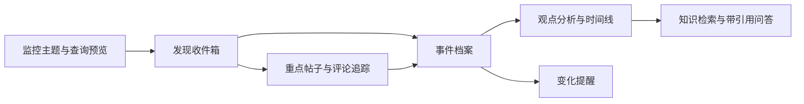
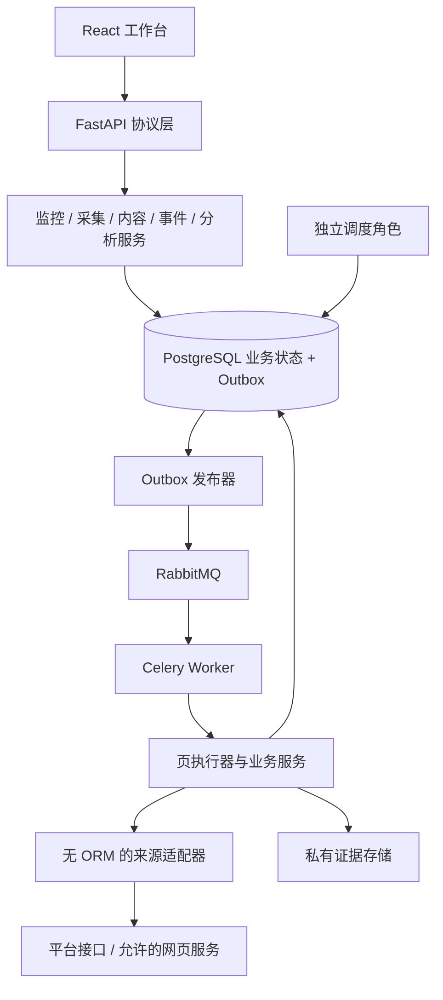

# 热点事件与评论知识库设计

2026-09-15。本文将本轮 GitHub、Firecrawl、Context7 研究和鱼皮源码分析落实到当前 HotKey。用户已授权开始实施；S00 工程与契约门禁已经验收，后续产品能力仍按切片验收。

**产品定位：围绕关注主题，持续发现相关内容，追踪重点事件与评论，将证据和分析沉淀为可检索、可统计、可复核的事件知识库。**

## 1. 与现有工程的关系

007 是下一轮产品范围、信息模型和实施顺序的规划入口；[006 Design](006-社交媒体关键词监控与评论分析设计.md) 继续记录已采用的 Python 基础架构和来源探测边界，[006 Plan](../plans/006-社交媒体关键词监控与评论分析计划.md) 保留原进度。007 不把 006 未完成事项标记完成，也不撤销其可靠性约束。进入下一轮实现时以 007 切片顺序承接，两套任务不并行重复建设。

本次直接核对的代码事实如下；没有重跑历史集成测试，也没有重新探测平台。

| 当前事实 | 对规划的影响 |
|---|---|
| FastAPI / SQLAlchemy / PostgreSQL / Alembic；Celery + RabbitMQ + 数据库 Outbox | 复用基础，增加真正的采集任务类型和业务结果；不重建语言栈 |
| 单 owner 认证、会话、CSRF；React / TypeScript / Vite 与生成客户端 | 第一版保持单用户工作台；页面跟随真实业务切片增加 |
| Monitor 仅有 title、keywords、sources、version、created_at；返回状态固定 draft | 增加监控生命周期和不可变配置版本；旧草稿仍为草稿 |
| Job 的数据库约束只允许 verify_pipeline；JobResult 是短字符串 | 诊断基础不能直接宣称支持采集，需新增任务契约和独立运行结果结构 |
| 来源列表含 11 个平台名称，但 search/comments 均为 not_connected | 平台名称是配置选项，不是已接入能力；必须按操作展示状态 |
| Bluesky 查询预览不联网；CLI 支持有界搜索与线程读取 | 保留预览和独立探测；持久化链通过验收后才声明连接 |
| 2026-09-08 探测记录：搜索 403；线程 20 节点后 partial/node_limit | 是历史小样本证据，不能证明今天的搜索准入或完整评论覆盖 |

代码核对入口：[监控模型](../../backend/src/monitors/models.py)、[任务模型](../../backend/src/jobs/models.py)、[来源契约](../../backend/src/sources/schemas.py)、[历史探测记录](../operations/evidence/source-probe-summary.json)。

## 2. 产品边界与体验

### 2.1 四个核心对象

- **监控主题**：用户长期关心什么，例如“某品牌的售后体验”；包括别名、排除词、来源、频率、预算。
- **内容**：一篇帖子、文章、视频条目或评论，是带平台身份和时间的证据。
- **事件**：同一主体在一段时间内发生的具体事情，例如“9月某型号更新后续航投诉”。同主题可以有多个事件，同事件可以跨平台。
- **知识条目**：带引用和版本的事实陈述、时间线、观点总结、复盘报告；明确区分来源说法和已交叉核实的信息。

不要将“命中关键词的一条结果”直接命名为事件；不要把事件摘要当成事实原文。

### 2.2 主流程与页面



| 页面 | 核心信息和动作 | 交付阶段 |
|---|---|---|
| 监控主题 | 查询范围、排除项、实际平台查询、可用操作、采集计划；保存草稿、启用、暂停 | S02 |
| 发现收件箱 | 原文、来源、发布时间/发现时间、命中原因、分析状态；关注、忽略、归入事件 | S02 |
| 内容详情 | 原文版本、指标快照、根帖/回复关系、采集范围与停止原因；追踪评论 | S03 |
| 事件档案 | 简介、实体、时间线、相关内容、分平台趋势、主要观点、证据、更新历史 | S04 |
| 知识库 | 主题/事件/平台/时间筛选；全文检索、统计、带引用问答；保存分析 | S05 |
| 设置与运行状态 | 来源权限、预算、最近成功/失败、积压、告警规则；人工恢复 | 随阶段交付 |

默认首页先是可操作的收件箱；有事件后增加事件概览。首屏只显示新增、待处理、关注事件变化和来源异常，不先做缺少真实数据的大屏。

### 2.3 范围

完整 MVP 包含：单 owner、以X等主流信息平台为重点的信息发现入口、至少一个用户指定国内平台的重点帖评论及回复、人工辅助事件归并、样本观点分析、基础知识检索与引用、站内告警。信息发现与评论来源可以不同，但必须通过事件关联并保留平台原始关系。X的免费持续入口尚未验证，不能以其他平台成功替代该目标。S02 的收件箱只是首个可用版本，不是完整 MVP 验收。

P1 再扩展账号/RSS订阅、更多平台、自动事件合并建议、高级比较和外部通知；P2 再考虑团队工作区及复杂传播网络。全网完整覆盖、全量历史回溯、实时秒级承诺、视频文件归档/全量转录、自动判真伪不在本轮范围。

## 3. 技术选型与决策

| 决策 | 选择与理由 | 本轮取舍 |
|---|---|---|
| DEC-007-001 产品单元 | 主题 → 内容 → 事件 → 知识；先交付发现收件箱 | 借鉴鱼皮的轻量发现体验，增加后续可追踪身份和状态 |
| DEC-007-002 后端 | Python 3.12 + FastAPI + Pydantic + SQLAlchemy 2 + Alembic | 符合现有工程与采集/分析生态；不切换 Express/Prisma 或恢复 Go |
| DEC-007-003 持久化与任务 | PostgreSQL 为业务事实源；Celery + RabbitMQ 执行；原 Outbox/租约/fencing 延续 | 不以进程内 cron、消息队列结果或内存 Map 保存任务事实 |
| DEC-007-004 前端与交互 | React + TypeScript + Vite；`@umijs/openapi` 从 FastAPI OpenAPI 自动生成全部端点函数和类型；共享 Axios request 只处理传输横切逻辑 | 业务代码不手写 URL/HTTP 方法/DTO；首版轮询任务状态，暂不引入 Socket.io |
| DEC-007-005 来源 | 按平台、操作、账号范围和用途登记能力，HTTP API 优先 | Firecrawl 仅负责允许的新闻/网页发现与正文提取；社交搜索/评论使用专用适配器 |
| DEC-007-006 采集 | 页级任务、先保留有界候选再分析、重叠窗口和独立评论游标 | 模型故障不删除候选；保存条数上限不等于请求/模型调用预算 |
| DEC-007-007 数据与证据 | 规范内容 + 不可变版本 + 观察记录；跨监控多对多；关系数据库记录证据引用 | URL 只作辅助标识；未知计数保留 null，真实 0 保留 0 |
| DEC-007-008 评论与事件 | 根帖带入评论上下文；分层抽样；人工归并先行；趋势分平台展示 | 不按评论正文关键词硬筛；不把平台计数直接相加成全网热度 |
| DEC-007-009 知识与模型 | 受控 SQL 统计 + 词法/向量检索 + 引用生成；Pydantic 严格校验 | 模型不直接执行任意 SQL，不将模型摘要覆盖原始证据 |
| DEC-007-010 权限与保留 | 获取、展示、保存、派生分析、外部模型处理、导出分别准入 | 权限未知时禁用对应操作；删除传播覆盖衍生结果 |
| DEC-007-011 部署与演进 | 模块化单体 API + 独立 Worker/调度角色 + 当前根 Compose | 暂不引入 Kafka、Temporal、Redis、ClickHouse、OpenSearch、Neo4j 或多 Agent |
| DEC-007-012 目录先行 | 每片开始前固定模块归属、文件清单、依赖方向与生成物路径 | 新目录须纳入架构扫描；不为未来功能批量创建空目录 |
| DEC-007-013 来源角色与费用 | 2026-09-15用户明确：X等主流信息平台优先发现；B站/微博/小红书/抖音提供评论研究；内容采购零付费 | 免费服务或自建采集；免费额度耗尽停止，不自动充值、切换付费数据商 |
| DEC-007-014 对象存储 | 2026-09-15用户明确使用并复用现有MinIO，通过私有S3接口保存证据 | 撤回本地目录作为正式证据存储的推荐；不新建实例，实施前核对连接/版本 |

**有条件的组件选择：**

- 原始证据存储：固定MinIO，数据库保存bucket/object_key/hash/权限/过期时间。先完成对象上传和校验，再提交数据库引用；事务失败产生的孤儿对象按宽限期清理。S3对象提交/删除需独立验证，不照搬本地rename，不将私有对象公开。推荐用MinIO Python SDK封装S3操作，具体版本经兼容验证锁定；自托管服务不是应用内再写一套文件服务。
- 向量检索：S05 加 pgvector；小规模先精确搜索。中文词法检索增加经标注集验证的分词/归一化，不把 PostgreSQL 默认配置视为中文检索方案。ANN 上线前与精确结果比较过滤后的召回；扩展版本以兼容试验和锁定结果为准。
- 模型：先定义可替换的文本分析/embedding 接口；供应商与模型 ID 在 S04 用同一标注集比较质量、耗时和单次费用后锁定。初版无须 LangChain 或独立 AI Agent 服务。
- 浏览器采集：仅在目标用途允许、HTTP 不满足且小样本成功时增加隔离浏览器执行角色；不把浏览器进程放入 API 进程，不在首片引入整套爬虫运行时。
- 图表：先实现分平台时间桶和样本构成；确有可视化需求后再选择轻量图表库。没有数据与指标口径时不增加图表依赖。

### 3.1 技术选型登记与版本基线

“已固定”指现有工程约束及本轮继续采用的基线；“待确认”不能视为已同意；“后续评测”不阻塞与之无关的来源/采集设计。以下版本直接读取当前锁文件、Dockerfile和Compose，不代表最新版本或本轮完成了升级/安全验证。

| 层级 | 当前选择/本地锁定版本 | 状态与实施位置 |
|---|---|---|
| Python运行时 | Docker/CI为3.12；pyproject范围为>=3.12,<3.14 | 已固定部署基线3.12，扩大运行版本需独立验证 |
| HTTP/Schema | FastAPI 0.141.1、Pydantic 2.13.5、HTTPX 0.28.1 | 已固定；backend/uv.lock，业务与协议边界见第13节 |
| 数据访问/迁移 | SQLAlchemy 2.0.52、psycopg 3.3.5、Alembic 1.19.2 | 已固定；模型在各业务模块，迁移只在src/migrations |
| 数据库 | 当前Compose PostgreSQL 16 | 沿用当前主版本；镜像tag未锁digest，不宣称位级可复现 |
| 异步任务 | Celery 5.6.3、RabbitMQ 4.1-management | 已固定；jobs管状态，worker管传输/进程装配；RabbitMQ镜像tag未锁digest |
| 浏览器端 | React/React DOM 19.2.8、TypeScript 5.9.3、Vite 7.3.6；Node构建/CI为24 | 已固定；frontend/package-lock.json；无Node业务后端 |
| HTTP客户端契约 | Axios 1.20.0、@umijs/openapi 1.14.1、tslib 2.8.1 | 2026-09-15 已切换；唯一契约由 FastAPI 自动生成，客户端固定输出到 frontend/src/generated/api，业务端点请求禁止手写 |
| 测试 | pytest/Ruff/mypy；Playwright 1.63.0 | 沿用现有工具；后端版本以uv.lock为准 |
| UI组件/状态 | 现有React组件、CSS、局部state与显式API调用 | 首片沿用；尚未选择新组件库、全局store、路由或查询框架，新增前列出实际需求与方案 |
| 原始证据存储 | 复用现有MinIO + 私有S3访问；Python SDK封装于evidence/adapters/minio.py | 用户已固定DEC-007-014；不新部署MinIO，接入前核对现有版本/网络与SDK兼容 |
| 分析模型/服务商 | 可替换的文本分析与embedding接口 | 服务范围/预算待用户回复；具体模型经S04/S05评测后固定OPEN-007-003 |
| 中文分词、pgvector | pgvector为S05方向；精确版本和分词实现尚未固定 | S05前评测与兼容验证；结果写回本表，不能先安装任意依赖 |
| 平台优先级 | X等信息平台发现；B站/微博/小红书/抖音评论链 | 用户已固定DEC-007-013；先验X免费发现与国内评论候选，具体能力见OPEN-007-005 |

内容采购预算固定0；自建服务器、存储、带宽等资源成本单独记账，不把“自建”描述为零运行成本。AI费用是否也限定免费/自建已追加询问，未答复前不启用付费推理。Firecrawl云服务仅可在明确免费额度内使用；产品运行可评估自建网页提取，不能假定本次研究工具的账号额度可直接供产品使用。

如果后续选择改变部署方式、长期维护成本、付费预算或用户可用的平台/功能，先带推荐方案与影响向用户询问；参数细节可按已确认方案实现。问题未回答时记录为待确认，只继续不依赖该决定的工作。每个切片只需冻结该片必需的选择，不因S05模型未定而阻塞S01目录和来源契约。

## 4. 来源策略与准入门禁

每个来源保存 `platform + provider + operation + account_scope + adapter_version`。operation 至少区分 search_posts、fetch_post、list_comments、list_replies、fetch_thread、fetch_article、fetch_hotlist；能力相同也不混淆数据语义。

能力状态、流水线状态与本次结果三个维度独立：

- 能力：unknown / supported / unsupported / authorization_required；保存证据日期、允许范围与配额。
- 流水线：not_connected / connected / degraded / paused；connected 只在持久化验收后设置。
- 本次结果：ok / empty / partial / failed；另带 access_denied、rate_limited、cursor_stalled、node_limit、schema_drift 等原因。

| 优先级 | 候选与工作 | 进入产品的条件 |
|---|---|---|
| 首轮信息发现 | X等主流信息平台；先研究X免费/自建可持续入口 | 2026-09-15官方文档仍为按量付费读取，不纳入内容零付费方案；公开网页/用户获准访问/免费订阅等候选逐项实测，不保证自建即可获得搜索能力 |
| 首轮评论 | B站、微博、小红书、抖音 | 四个平台均进入验证清单；工程先实现通过验证的一条闭环，其他平台保留缺口；帖子发现、根评、回复分别验证，不用评论计数或热榜替代评论原文 |
| 发现补充 | 允许的新闻网页、RSS；HN 可作为海外技术主题补充 | 新来源需补其当前契约与用途验证；补充来源不能悄悄替代国内社交评论门槛 |
| 补充与回归 | Bluesky现有适配器、Reddit等获准免费入口 | Bluesky历史搜索403保留为已知缺口，不作为新的主线；不启用收费的数据提供商 |
| 后续待核实 | 知乎、快手、微信等 | 研究线索不是已接入承诺；不得把后台草稿中的平台列表全部标为可用 |
| 受限候选 | YouTube | 官方检索/评论 API 技术可读，不等于允许本产品的聚合、派生指标与长期知识用途；允许范围确认前不作为默认分析来源 |

来源不可用时保留缺口，并缩小该来源功能或更换已验证候选。用户导入可以验证后续界面/分析，但单独标明 imported，不能计作持续监控验收。首轮预算为试验上限，不自动购买付费接口。

X事件发现后，用实体、事件动作、时间范围和别名到国内平台寻找讨论根帖，再获取这些根帖的评论。`event_members`关联不同平台的根帖；B站/微博等评论的root/parent始终指向其本平台对象，不能伪装成X帖子的回复。web搜索摘要只作为web_snippet发现线索，抓到并核实平台原文后才建立平台帖子身份；不将摘要记为完整X采集。

## 5. 关键信息与逻辑数据模型

以下是目标逻辑模型，按阶段增表，不在第一片一次建立全部结构。统一 UTC 存储，界面显示用户时区；`published_at`、`observed_at`、`first_seen_at`、`updated_at` 分开。

| 数据单元 | 关键字段/约束 | 阶段 |
|---|---|---|
| monitors + monitor_versions | title、state、current_version；不可变 query_spec、source_policy、schedule、budget；unique(monitor_id, version) | S02 |
| source_capabilities | provider/operation/scope、support、rights、quota、verified_at、evidence_ref；密钥只保存引用 | S01/S02 |
| collection_runs + collection_checkpoints | monitor_version、操作/根帖/父评论/查询变体/排序、窗口、计数、停止原因、游标、lease；checkpoint key 包含上述采集维度 | S02/S03 |
| raw_pages | provider_request_fingerprint、对象键、hash、observed_at、retention_until、policy_version；不保存认证头 | S02 |
| contents | id、platform、provider_namespace、external_id、kind、canonical_url、author_ref、root_id、parent_id、visibility；身份范围内 unique | S02/S03 |
| content_versions | content_id、version、text/title、provider时间、observed_at、hash、raw_page_id；不可变正文版本 | S02 |
| monitor_matches | monitor_version_id、content_id、first/last_seen、match_reason、relevance_status、review_state；多对多，幂等关联 | S02 |
| content_observations | content_id、observed_at、like/comment/view等原始指标、指标定义、raw_page_id；0 与 null 不混同 | S02 |
| events + event_members + event_revisions | 事件标题/实体/时间范围/state；关联内容、归并理由、人工确认；合并/拆分保留修订 | S04 |
| analysis_runs + analysis_samples + analysis_labels | 冻结成员版本、采集窗口/排序/抽样策略、模型/提示/标注版本、目标/立场/置信度、引用 | S04 |
| knowledge_entries + knowledge_versions + knowledge_chunks | event、entry_type、正文、有效时间、引用、权限；chunk/embedding 绑定条目和正文版本 | S05 |
| alert_rules + alert_occurrences + deliveries | rule_version、event/change_id、渠道、幂等键、尝试/送达状态；与业务变化/Outbox 同事务 | S04及P1 |

S02 最少实现来源记录、配置快照、运行/检查点、页证据、内容/版本/指标观察和监控关联。任务与审计沿用当前表，不另建第二套调度平台。跨 provider 声称同一平台 ID 之前需验证命名空间；无法确认时保留独立身份并建立候选关联。

### 5.1 查询结构

`query_spec` 包含 include_any、include_all、exclude、aliases、entity_context、language、时间范围与观察对象。首版支持其中经过源适配器验证的子集，预览每条规则的执行方式：native、local_filter、unsupported。

例如品牌词含别名时，远端查询扩展最多 N 条，并明确列出；本地相关性规则可更丰富。两者各自版本化。平台不支持的时间/排除条件可对已返回内容本地过滤，但需注明“不能扩大平台返回范围”。启用时绑定配置快照，编辑保存产生新版本；旧运行不会中途读取新规则。

### 5.2 身份、更新与去重

1. 以来源对象 ID 幂等 upsert；web 内容才使用谨慎归一化 URL，不能删掉具有身份意义的参数。
2. 同一对象匹配多个主题只存一份内容，分别记录命中；忽略 A 主题下的结果不影响 B。
3. 同文转载用 content_family/关联关系去重分析，保留独立来源；不能合并成同一平台互动计数。
4. 文本 hash 改变形成新版本；仅计数变化写观察记录，不反复调用全文分析。
5. 无法找到父评论时保留平台 parent_external_id 与 relation_status=unresolved；后续补全，不伪造树。
6. 不可见响应与明确删除分开；不因某次分页未出现就推断删除。

### 5.3 生命周期

- Monitor：draft → active ↔ paused → archived。启用需通过选定操作准入；暂停后不派新任务，运行任务在页边界退出。
- CollectionRun：queued → running → completed/failed/cancelled；completed 的 collection_outcome 可为 ok、empty、partial。执行成功不等于采集完整。
- 相关性：pending → accepted/rejected/needs_review；analysis_failed 单独保留失败与重试，不等于 rejected。
- Event：candidate → tracking → cooling → archived；新证据可重新打开。归档是停止主动追踪，不等于删除。
- Analysis：pending → running → succeeded/failed/stale；输入版本变化后旧结论仍可查看，但明确过期。

## 6. 采集执行与模块边界



模块遵循当前 `backend/src/` 规范：`sources/` 只处理外部协议；`collection/` 负责页执行、预算与检查点；`contents/` 负责内容/版本/关联；`events/`、`analysis/`、`knowledge/` 按切片增加。服务通过明确参数/DTO 协作，不互相访问对方内部表；需要多模块同事务时由该用例的服务组织，不能嵌套独立提交导致页水位先行。API 仅经 dependencies 注入，Worker 不绕过服务直接改业务表。

### 6.1 一页采集的提交顺序

1. 调度器按 due_at 原子领取到期计划，生成唯一 `monitor_version + source_operation + schedule_slot` 运行与 Outbox。调度重启只补有限缺口，回填单独预算，不无限补齐停机期间全部轮询。
2. Worker 领取任务并验证 epoch、fencing、取消、用途和保留屏障；预留本页请求/字节/节点预算。
3. 适配器执行单个有界页，返回对象、原始证据、cursor、观察时间和结果原因；不持有数据库事务跨网络等待。
4. 保存被允许的原始页；事务内再次检查租约/权限，将页记录、规范对象、观察、命中和下一检查点一起提交。解析失败保存允许的页证据和错误，水位不前进。
5. 同事务派生后续页/分析的 Outbox；提交成功后确认消息。进程崩溃重放相同页只能产生一次业务结果；游标不能先于数据提交。

认证拒绝停止对应源操作并提示恢复；429 遵循 Retry-After；暂时网络错误退避；永久参数错误不重试。响应大小、单页时间、页数、节点、并发、请求费用和模型 tokens 分别计量。评论 root 与每个 parent 回复拥有独立检查点；每次增量保留重叠时间窗口，迟到数据按发布时间和发现时间分别统计。

现有任务的短期限适合诊断，采集任务需按操作实测配置超时和租约续期，不能只把诊断 kind 更名。大线程拆成页，不在一个任务里无限遍历。

## 7. 评论、事件与分析方法

**评论采集范围由相关根帖确定。** 默认先采重点帖最近评论和热评，并记录平台排序与截止点；存在回复接口时继续展开。短评“确实如此”“我也遇到了”依靠父级上下文，不因缺少关键词直接丢弃。

分析单位保留 comment_version + parent/root context。按平台、时间段、根帖、排序来源分层取样；保留样本入选原因。输出主题、讨论目标、目标情绪、对某具体主张的立场、诉求、无法判断。讽刺/多目标/上下文缺失允许弃判；不推断作者身份或将异常账户自动认定为机器人。

分析卡片必须显示：有效独立评论数、已采根帖数、时间范围、平台构成、热评/最新评论构成、未知/弃判数、引用。情绪比例默认“本次样本中”，分母是已定义样本集合；不写“全网有 80% 用户反对”。模型只标注/解释，聚合统计由确定性代码完成。

事件先由人工创建、加入/移出内容。自动建议以主体、动作、时间、地点、共享链接和语义相似度共同判断；同品牌不同事故不能仅靠 embedding 合并。保存人工修订并用于后续评估。事件时间线标明“来源主张”“官方说明”“尚未核实”，不由一个 isReal 布尔值认证真假。

趋势首先展示每平台新增内容/已采评论、已观察互动增量、覆盖状态。趋势比较只在相同采集范围、时间桶与指标口径下进行；回填、故障或采样策略变更打断可比性。风险由主题规则、证据与人工判断独立输出。综合热度仅在后续有校准样本后引入，不能直接累加微博热度、视频播放和点赞。

## 8. 知识库与问答

知识库包含原始证据、规范内容、事件档案、分析结论四层。允许保存的内容自动进入规范层；稳定总结形成版本化知识条目，不要求用户逐条复制进知识库。

三条查询路径：

1. “最近一周我们采到了多少条售后评论？”→ 受控统计服务，固定指标/过滤/去重/时间口径；返回范围和统计版本。
2. “找到支持某观点的原评论”→ 平台/时间/权限过滤，中文词法 + 向量召回，重排并返回证据。
3. “事件为什么升级？”→ 获取统计和证据后生成有引用的解释；多来源冲突并列，证据不足明确说明。

检索前过滤权限，生成前再验证证据有效性，返回前校验引用存在且支持对应句子。引用包含 content/version、原链接、观察时间和选中文本位置。top-k 检索样本不能作为总体计数；页面上区分“统计结果”和“检索证据”。

Embedding、词法索引、摘要均记录输入 hash 和模型/规则版本，内容编辑使相关结果 stale；删除或用途撤销后相关内容立即不可检索，后台清除索引、缓存、摘要与报告引用，恢复备份时重放删除清单。

## 9. 安全、成本与可观测性

延续单 owner 会话、CSRF、输入验证与审计。来源凭据通过 SecretStr/私有配置注入，数据库仅存 credential_ref；仅采集必需作者标识，不尝试跨平台识别人。适配器对用户 URL 做协议、主机、重定向和私网访问限制；原始页面和评论作为不可信内容，不执行其中的模型工具指令。

用途权限采用 allowed/denied/unknown 三态，绑定 policy_version 和 verified_at。原始响应、正文、派生分析可有不同保留周期；没有经过确认的周期时不启用对应长期存储，不默认无限保留。外部模型没有处理权限时可保留允许的检索/展示，不能偷偷改走另一模型提供商。

成本公式：每日查询请求≈监控数 × 每监控启用来源数 × 每日轮询数 × 查询变体数 × 页数，加根帖刷新、评论、回复与重试；模型预算另按输入/输出 tokens 计。试验配置建议：单 owner、5 个主题、国内/海外各 1 个来源、每来源每主题 30 分钟一轮、单变体单页，约 480 次搜索/日，未含评论和重试。若配额不足自动降低频率/启用来源并展示实际计划；这不是默认获准的调用量或性能承诺。

关键指标：各源最后成功时间、成功/合法空/部分/拒绝比率、页与游标停滞、发现延迟、数据库积压、租约过期、重复投递抑制、评论增长、样本弃判、无效引用、请求与 token 预算。日志带 request_id/run_id/job_id/adapter_version，不带认证信息和完整正文。页面显示“最后成功观察时间”，不能用 API 进程健康替代来源新鲜度。

## 10. 演进、迁移与回滚

复用当前数据库和单 owner 身份，新增 Alembic revision，保持已应用 0001–0003 不变。监控现有 version 是乐观锁值：迁移生成当前值对应的配置快照，不伪造缺失历史版本；新配置从下一版本延续。旧草稿不自动激活，不派历史采集或告警。

先扩展 schema/任务接收能力，再部署 producer 和生成客户端；Job kind 约束与 Worker 白名单同步更新。迁移到 PostgreSQL 镜像含 pgvector 是 S05 的独立发布操作，必须先验证扩展、备份和恢复。对象存储迁移用复制、hash 核对、引用切换；失败保留原对象，避免同时删源。

降级顺序：暂停新调度 → 停止分析/向量检索 → 保持已有事件/内容只读 → 修复后有界补采。应用回滚必须停止新 kind 派发并排空/隔离新任务，旧 Worker 不得误消费；保留已扩展表，不自动执行破坏性 downgrade。外部提醒以变化 ID 去重并记录投递结果，不能只在保存后顺手发送一次。

## 11. 风险、未决项与验收边界

| ID | 风险/未决项 | 处理和关闭条件 |
|---|---|---|
| RSK-007-001 | 可访问不代表可持续，来源仍有准入缺口 | S01 逐操作实测；国内/海外分别保留结论，不用模拟数据补齐 |
| RSK-007-002 | 采样偏差与同主题误合并影响分析 | 分层样本、弃判、人工修订；保存可复现评估集 |
| RSK-007-003 | 调度/重试/AI放大费用，旧任务回写 | 预算预留、单页限额、fencing、恢复演练与成本对账 |
| RSK-007-004 | 数据用途或删除变化导致知识过期 | 权限版本、保留时间、删除屏障与索引/报告传播 |
| OPEN-007-001 | 原首批国内平台与Bluesky主线选择 | 2026-09-15范围选择已关闭：用户改为X信息发现与四类国内评论平台，结论DEC-007-013；原Bluesky搜索403未解决，留作补充来源缺口；新主线准入转OPEN-007-005 |
| OPEN-007-002 | 月费用、实际主题量、频率与保留天数 | 2026-09-15内容采购预算已固定0，结论DEC-007-013；AI费用规则待用户回复，频率/保留期需样本计量后形成budget/retention配置；未明确前不订购付费服务 |
| OPEN-007-003 | 中文分析模型和 embedding 的具体版本 | S04/S05 同一人工标注集评测，登记质量、成本和允许处理范围后锁定 |
| OPEN-007-004 | 第一版证据存储采用本地私有持久卷还是S3 | 2026-09-15已关闭：用户指定MinIO，结论DEC-007-014；实例/发行版转OPEN-007-006 |
| OPEN-007-005 | X免费持续发现、四类国内评论来源的实际准入 | 新增：S01分别记录免费访问方式、授权范围、分页、运行限额；X不可用不能由Bluesky/HN成功代替 |
| OPEN-007-006 | MinIO实例、发行版与部署版本 | 2026-09-15部署方式已关闭：用户选择复用现有实例，结论DEC-007-014；现有版本/endpoint/权限作为S02接入前置检查，不新部署或升级该实例 |

实现与验收见 [007 PRD](../prd/007-热点事件与评论知识库.md) 和 [007 Plan](../plans/007-热点事件与评论知识库计划.md)。当前只交付规划，未证明任何新平台、采集链、模型、知识库或容量指标已可用。

## 12. 研究依据

- 鱼皮固定提交 `cd48b0885bfa8ae9c8043cf78ef6cfd045530bdb`：[定时发现与保存流程](https://github.com/liyupi/yupi-hot-monitor/blob/cd48b0885bfa8ae9c8043cf78ef6cfd045530bdb/server/src/jobs/hotspotChecker.ts)、[AI相关性逻辑](https://github.com/liyupi/yupi-hot-monitor/blob/cd48b0885bfa8ae9c8043cf78ef6cfd045530bdb/server/src/services/ai.ts)。它值得借鉴的是发现体验；所读评论计数、URL去重和单关键词归属不足以支撑我们的评论/事件知识库。
- [MediaCrawler 小红书分页](https://github.com/NanmiCoder/MediaCrawler/blob/d6f7c5bb906b6dac40ddf343ef9e26438a3de092/media_platform/xhs/client.py#L449)、[微博内嵌回复](https://github.com/NanmiCoder/MediaCrawler/blob/d6f7c5bb906b6dac40ddf343ef9e26438a3de092/media_platform/weibo/client.py#L231)：根评论和回复分页需要分别核实。研究采集实现不自动取得平台授权。
- [Bluesky 搜索契约](https://github.com/bluesky-social/atproto/blob/main/lexicons/app/bsky/feed/searchPosts.json)、[微博官方手册](https://open.weibo.com/cli/manual)、[YouTube 用途政策](https://developers.google.com/youtube/terms/developer-policies)：来源接入以操作/用途为单位；实施前复核当前账号和政策。
- Context7 核验采用的一手文档：[Celery Tasks](https://docs.celeryq.dev/en/stable/userguide/tasks.html)、[pgvector](https://github.com/pgvector/pgvector)、[Firecrawl Change Tracking](https://docs.firecrawl.dev/features/change-tracking)。消息确认不等于业务恰好一次；ANN 过滤召回需实测；网页变化不能直接等同新事件。
- 完整研究在仓库外的[调研依据](../../../research/2026-09-15-热点事件监控平台/04-调研依据.md)与[鱼皮源码分析](../../../research/2026-09-15-热点事件监控平台/05-鱼皮热点监控源码分析.md)。上面保留一手链接，使仓库独立检出仍可追溯主要依据。核验日期为本轮 2026-09-15；源码阅读与文档核验不等于实时平台验收。
- 本轮选型复核：[MinIO服务端仓库](https://github.com/minio/minio)已归档，[README](https://github.com/minio/minio/blob/master/README.md)声明不再维护且社区版为源码分发；[Python SDK](https://github.com/minio/minio-py)为独立客户端项目。[X收费文档](https://docs.x.com/x-api/getting-started/pricing)采用按量付费，不能据此承诺免费关键词读取。上述事实用于选择实例/访问方案，未部署或调用真实数据接口。

## 13. 实现前目录规划与文件归属

### 13.1 仓库边界与目标目录

Git仓库根为 `HotKey/hotkey-server/`。父目录 `HotKey/research/` 是此前独立调研材料，`HotKey/var/` 是已有外部目录；本轮不搬动或清理其内容。正式产品决策进入仓库 `docs/`，原始抓取/凭据/运行数据不能为方便归档而混入正式文档或业务代码。

以下为按S00–S05逐步形成的目标目录，不是当前已存在结构；子模块按需求创建，禁止提前堆空壳。

```text
hotkey-server/
├── AGENTS.md / README.md / README.en.md
├── docker-compose.yml / docker-compose-prod.yml
├── .github/workflows/                 # CI
├── backend/
│   ├── src/
│   │   ├── main.py                    # 唯一FastAPI装配入口
│   │   ├── api/routers/               # HTTP协议与身份检查
│   │   ├── api/dependencies.py        # 服务注入
│   │   ├── core/                      # 通用配置、错误、时间、基础Schema
│   │   ├── db/                        # Base、Session、metadata、健康检查
│   │   ├── identity/ / audit/         # 身份与审计
│   │   ├── monitors/                  # 主题、配置版本、命中归属
│   │   ├── sources/                   # 契约、查询编译、适配器注册
│   │   │   └── adapters/              # bluesky.py、后续平台.py；外部I/O
│   │   ├── collection/                # 能力准入记录、运行、预算、检查点、页用例
│   │   ├── contents/                  # 内容、版本、指标、根帖/父评论关系
│   │   ├── evidence/                  # 原始页元数据、保留/删除、存储接口
│   │   │   └── adapters/minio.py      # MinIO SDK封装；业务层只依赖存储契约
│   │   ├── events/                    # 事件成员、时间线、修订
│   │   ├── analysis/                  # 样本、标签、确定性统计、分析用例
│   │   ├── ai/                        # 无ORM的模型协议与外部调用
│   │   │   └── adapters/              # 确认供应商后实现；不放业务prompt
│   │   ├── knowledge/                # 知识条目、chunk、检索、引用问答
│   │   ├── notifications/             # 规则、提醒、投递对账
│   │   ├── jobs/                      # 通用任务状态、幂等、租约、fencing
│   │   ├── worker/                    # Celery装配与RabbitMQ消息
│   │   ├── cli/                       # migrate、owner、scheduler、probe等入口
│   │   ├── migrations/versions/       # 唯一Alembic revision位置
│   │   └── tools/                     # OpenAPI生成等开发工具
│   ├── tests/{unit,integration,architecture}/
│   ├── scripts/                       # verify_*.py运维/集成验证
│   └── pyproject.toml / uv.lock / Dockerfile
├── frontend/
│   ├── src/
│   │   ├── main.tsx                   # 浏览器装配入口
│   │   ├── app/App.tsx                # 会话、导航、页面装配
│   │   ├── features/                  # identity、monitors、inbox、contents
│   │   │                             # events、analysis、knowledge、settings
│   │   ├── generated/api/             # @umijs/openapi生成端点函数和类型，禁止手写
│   │   └── shared/                    # api/request.ts、ui/、styles/global.css
│   ├── openapi2ts.config.ts           # 生成器配置和唯一request导入
│   ├── tests/                         # Playwright流程；fixtures按需要增加
│   ├── scripts/                       # check-contract.mjs等工具
│   └── package.json / package-lock.json / Dockerfile / nginx.conf
└── docs/
    ├── design/ / prd/ / plans/        # 同编号正式方案；SPEC/CHECKLIST在Plan
    ├── acceptance/                    # 实现验收后才创建同编号报告
    ├── operations/evidence/           # 精简脱敏、可提交的验证证据
    └── openapi/openapi.json           # 唯一生成HTTP契约
```

### 13.2 文件职责与依赖方向

业务模块使用 `models.py / schemas.py / services.py`；复杂度需要时才增加 `execution.py / queries.py / policies.py` 等明确职责文件。可复用I/O协议放对应模块 `contracts.py`，外部SDK封装在 `adapters/`；不创建泛化的 utils、manager、BaseService、全局repository目录。

| 归属 | 可以承担 | 不应承担 |
|---|---|---|
| monitors | 配置快照和monitor_matches；命中本身是主题与内容的关系 | 平台HTTP调用、评论树、事件归并 |
| sources | 无数据库的能力描述、查询编译、平台协议/解析 | 持久化授权状态、业务事务、调度和模型分析 |
| collection | source_capabilities等运行准入记录、run/checkpoint/budget；编排一页提交 | 重复定义内容版本或通用job状态机 |
| evidence | raw_pages及对象键/hash/保留记录；存储与删除生命周期 | 将原始文件直接写入源码、公开目录或日志 |
| contents | 内容身份/版本/指标和评论关系 | 主题配置或分析标签 |
| analysis / knowledge | 各自的prompt模板、Schema、样本与业务校验 | 在ai适配器里硬编码业务阈值/SQL，或直接对来源发采集请求 |
| ai | 文本生成/embedding DTO、SDK调用、用量结果 | ORM、业务表、任务发布、提示模板和业务决策 |
| jobs / worker / cli | 状态机 / 消息与进程装配 / 命令入口 | 各自再建一份采集业务逻辑 |

`collection` 用例依赖 `sources`、`evidence`、`contents`、`monitors` 的明确接口；后者不反向导入collection。`analysis`读取内容/事件并调用ai；`knowledge`读取事件/分析结果并调用ai；ai不反向导入业务。业务服务不导入worker/api/cli；工作进程通过注入执行用例。

跨模块的页提交由collection用例持有一个Session/事务，调用参与方明确接受该Session的内部写入方法；参与方不能自行commit或创建嵌套的独立事务。HTTP入口服务可拥有外层事务。跨模块只读/写DTO与服务接口，不通过导入其他模块ORM模型任意改表；外键字符串和db/metadata显式注册不构成业务绕过。

前端依赖方向为：app可装配features/generated/shared，features可依赖generated/shared，generated只依赖shared request，shared只依赖shared。shared不导入features，跨功能组合由app完成。`shared/api/request.ts` 只封装Axios实例、Cookie会话、XSRF、参数序列化和错误透传；所有URL、方法、请求体和DTO来自generated。只有多处使用的UI才提升shared/ui；不用index.ts大范围重导出形成隐式依赖。

### 13.3 命名、生成物与运行数据

- Python包/文件为snake_case；类为PascalCase；绝对导入；包初始化文件仅说明包，不装配业务。
- React组件为PascalCase.tsx；hook为useX.ts；普通TS工具为camelCase.ts；功能目录为小写英文业务名。
- 原始页和允许的导出放现有MinIO私有bucket；数据库备份和模型日志使用各自私有运行存储，不混放源码。bucket命名和最小访问权限在S02接入前核对，不创建新的MinIO服务卷，也不借用父目录var。临时下载文件只用于上传缓冲，不能成为正式证据的第二真源。
- 原始调研抓取保留在工具工作区；正式结论在design中保留来源/版本，正式验收证据在operations/evidence/007/下按EV编号命名并脱敏。不把社交全文或凭据作为测试fixture提交。
- FastAPI 运行时自动生成 `/openapi.json` 与 `/docs`，`tools.export_openapi` 只把运行时同源文档确定性导出到 `docs/openapi/openapi.json`；`@umijs/openapi` 固定生成到 `frontend/src/generated/api/`。三者及生成文件禁止手写，CI 同时检查后端快照漂移和前端逐文件漂移。构建产物dist、node_modules、缓存、临时Playwright报告继续排除Git。
- 已应用迁移不重命名；旧006证据路径不迁移；既有源代码只按Plan中的迁移表调整并同步全部导入与测试。

### 13.4 实现前置约束

每项TASK开始前先列出本片的新增/修改/移动/生成文件，逐个映射到本节职责；列出技术选择及未决项。若有影响该片的待确认选择，先向用户询问，不将“推荐”当作答复。

S00 已把 `backend/src` 全量递归扫描、未知顶层模块拒绝、后端违规导入样例、前端未知目录与反向依赖样例纳入自动检查。新增模块仍须先登记到本节及测试白名单；生成客户端只能由契约生成，目录图继续作为后续切片的放置依据。
