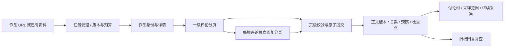

# 评论与回复采集设计

日期：2026-09-22。依据用户明确的 B站、小红书、抖音、微博评论需求，结合 [047 调研](../research/047-本地网页与浏览器采集调研.md) 建立 proposed 设计。X 保留独立要求。本文只冻结建议和差距，不声称已建立评论处理器、数据库写入或真实平台验收；六项产品 AC 均未通过。

## 1. 目标、现状与边界

用户应能提交已知视频/笔记/博文 URL，取得根作品、评论和回复，看到实际采样范围，并再次采集旧作品的新回复。四个国内来源分别完成此路径；实现可以分片，某一个平台成功不能关闭其他三个。已知 URL 的评论路径不等待所有平台关键词搜索/账号监控完成。

当前 `sources/contracts.py` 已有 CommentsRequest、RepliesRequest、SourceComment 和分页停止语义；`content_records` 已允许 comment 类型，`content_versions`、`content_version_relations`、观察与生命周期可复用。但 `ContentService` 入库入口仍只接作品，Worker 业务注册为空，SourceComment 未表达线程根/被回复对象/关系未知差异，也没有每根评论的分页覆盖证据。这些是实施缺口，不再新建一套 comments 数据库。

非目标：全量或全历史承诺、弹幕、私信、发表评论/点赞/关注、下载视频本体、推断作者私人属性、自动绕过登录或验证码。视频评论属于作品上下文；媒体分析仍由 023 承接。

## 2. 核心决策与职责

**DEC-008-001** 沿用 PRD：真实关系和采样证据优先，缺口必须可见。

**DEC-008-002：四平台共用任务与存储，采集器按平台固定。** `sources/adapters/` 负责受控平台访问/解析，返回纯 DTO；`content/collection.py` 编排作品定位、评论/回复读取；`content` 服务持有正文、关系、观察和讨论查询；`jobs` 持有任务、预算、租约、检查点；`connections` 持有连接版本/秘密引用/能力证据；`evidence` 处理字段准入和生命周期。页面和 API 不调用浏览器或第三方服务。

Firecrawl 负责网页正文，不承担评论树抽取；浏览器运行边界沿用 [047 Design](047-本地网页与浏览器采集设计.md)。外部爬虫只作为平台适配器的执行依赖，不获得 HotKey 数据库权限，不接管调度/重试。独立服务的内部任务、Cookie 文件和归档必须满足同样的取消、版本、隔离和删除约束；无法做到则不接入该候选。

## 3. 来源契约与身份

**DEC-008-003：作品身份、线程根、直接父节点和回复目标分开。**

| 字段/契约 | 语义与拟变更 |
|---|---|
| 作品定位 | 038 增加 `post_detail` 能力、类型化详情请求/结果；先验证平台/URL 与稳定原生 ID，再创建 SourcePost。不能通过搜索标题猜作品。已有资料入口可直接复用身份 |
| 评论 ID | 全程不透明字符串；HTTP、数据库、JSON 与浏览器读取不得先转 JS Number 再转字符串；唯一身份复用 owner/source/object_type/native_scope/external_id |
| `post_external_id` | 讨论所属原生作品。B站保留 BV 与评论目标身份映射，小红书 note ID，抖音 aweme ID，微博博文 mid；媒体 ID 不能代替作品 ID |
| `root_comment_external_id` | 所属楼中楼线程的根评论；新字段可空，未知不得猜 |
| `parent_comment_external_id` | 原站明确的直接结构父节点；现有字段 null 不能同时代表“一级”和“未知”，增加明确关系状态 |
| `reply_to_comment_external_id` | 原站明确的回复对象；可能与线程根不同。不得把 @用户名或正文“回复某人”推断为唯一评论 ID |
| `relation_status` | 至少区分顶层、已知父链、父 ID 已知但资料缺失、未知；来源只提供平铺楼中楼时保留实际能力 |
| 评论观察字段 | 现有时间/正文/点赞外，增加可空 reply_count、is_pinned 及来源排序信息；未知计数保持 null |
| 分页覆盖 | SourcePage 增加只在 comments/replies 适用的类型化 coverage；含根作品/线程范围、请求排序与实际排序、终止依据、已见条数和可空来源显示数量。缺字段不能填“已完成” |

新增能力/字段同步 038、004、007、009 和相关 Pydantic/SQLAlchemy/schema.sql 校验、证据准入与客户端。`post_detail`、comments、replies、search、author_posts 独立展示 readiness，不能因某条评论读成功就给来源全部能力放行。

上游游标只在 Worker 内部使用，不直接充当业务列表 cursor。必须有大小限制；如含访问令牌，用受控秘密引用保存敏感部分，检查点仅保留非敏感版本/引用。小红书 xsec_token 不参与稳定 ID，不进入日志、Kafka 或普通资料 URL；超出有效期按访问状态处理，不伪造新令牌。

## 4. 内容模型与覆盖证据

**DEC-008-004：复用现有内容版本关系，增加必要的采样记录。**

- `content_records`：保留同一条评论的稳定实体。`native_scope` 由平台规则决定，不能采用任务 ID；同作品重复采集保持稳定。
- `content_versions` / `content_version_relations`：复用正文与版本关系，为所属作品、线程根、直接父节点、回复对象增加明确关系类型/目标对象类型；关系变更追加版本。缺父节点只保留引用与缺失状态，不创建伪造正文。跨 owner/source 关系写入拒绝。
- `content_observations`：记录本轮实际可见的作者公开标识、来源发布时间、观察时间、互动指标、置顶等可变状态。正文未变也能增加新观察；相同页重放不得重复观察。
- `content_comment_samples`（拟建）：关联 job、根作品、来源/采集器/连接版本、采样策略、时间窗、来源数量口径、根评论与回复实采数、结束/部分原因。外部 task ID 属于执行恢复记录，不作为评论身份。
- `content_comment_thread_progress`（拟建）：按 sample + 原生根评论记录线程覆盖/停止原因；可见查询只用投影。可执行游标、待处理线程与预算检查点由 jobs 持有，二者同页提交，避免双份可修改进度。

页提交幂等、事务内 fencing、当前连接/政策校验和生命周期登记复用 047 的协议，不另造提交机制。新增表必须在 `schema.sql` 和 ORM 同步，并具备 owner 约束与所属资料删除/撤权路径；不以数据库 cascade 提前删除尚需清理的执行证据。

保留 `captured_at`、来源时间、来源 URL/字段定位、正文指纹、采集器版本和变更依据。必要的小片段证据按 028/036 准入保存；原始 HTTP headers、Cookie、完整个人主页、IP 归属地和完整网络包默认不入库。不同来源结果冲突保留各自观察，不由最后一个响应覆盖事实。

## 5. 分页、增量与结束语义

**DEC-008-005：一级评论与每条楼中楼分别推进，不用单一游标代表整个讨论。**

1. 受理任务时固定作品、连接/采集器版本、排序意图、根/回复采样上限、页/时间/请求预算和回看策略；同操作重试不重复创建任务。
2. 读取并校验作品详情，取一级评论页，合并本页置顶/热评与普通列表并按原生 ID 去重。预览回复可保存为已观察样本，但仍登记该线程待继续读取。
3. 在预算内轮转处理多个线程，每次仅一页；不能让首条大楼中楼耗尽全部根评论预算。根评论数、回复数和两类页数分开计量，深度上限不能误解释为平台只有两级页面。
4. 响应校验后，页数据、来源证据、覆盖投影、用量和下一检查点在一个事务中提交。新请求之前检查取消/预算/版本/租约；浏览器操作不持有数据库事务。
5. 每个有界执行单元在 Kafka poll/任务租约期限内结束；多页任务续租与恢复按 047/031 执行。外部爬虫返回 202 时保存其 task ID，不能重复提交代替轮询；取消与超时后不得继续无界后台抓取。
6. 增量至少包含最新根评论的重叠回看、已知活跃根评论的回复复查，以及预算内轮转复查较旧根评论。上轮未完成线程继续排队，不能只追新增根评论或只根据 reply_count 变化决定是否复查。

没有持久游标的平台保存排序/窗口及稳定 ID，从有界窗口重读去重；DOM 滚动位置和浏览器页面对象不是检查点。游标失效、重复游标或连续无新增有界停止，保留重读范围，不能推进完整水位。重新采样保持新的 observation 时间，旧快照留存；本轮未出现不等于删除。

| 结果 | 规则 |
|---|---|
| 完成 | 仅表示声明的会话、排序、窗口内，一级及所有被选线程都有可验证结束；UI 不称“平台全部评论” |
| 部分 | 有可读样本，但条数/页数/深度/时间/请求耗尽、回复被跳过、仅预览、某线程失败或终点不可证；分别记录缺口 |
| 合法空 | 成功读取了有效评论页面/响应，明确零项与合法终点；根详情可读本身不能证明零评论 |
| 失败/需登录/受限 | 登录页、验证码、401/403/429、正文结构漂移或上游任务失败映射稳定原因；不写成零评论 |
| 取消 | 已提交资料仍可读，后续页不再提交，保存已观察范围；不冒充成功结束 |

样本数与原站显示总数并列且标注观察时间、排序和计数范围；原站数字可能混合隐藏/楼中楼/排序结果，不据此计算全站完整率。相同 ID 的重复观察不重复计入样本量。

## 6. 四平台适配与验收矩阵

| 来源 | 候选与实现重点 | 必须单独证明 |
|---|---|---|
| B站 | 专用 Playwright 适配；opencli 仅作字段/读取参考；已关停 bilibili-api 不选用 | BV/评论对象对应、置顶合并去重、根分页、每根楼中楼至少两页、ID 无精度损失 |
| 小红书 | 专用浏览器或 xiaohongshu-mcp 只读详情服务；其 Go/Rod 会话单独隔离 | note ID 与令牌分离、嵌套配置实际生效、超过默认 20 根/10 回复阈值的行为、滚动终点与被跳过线程分别记录 |
| 抖音 | 评估固定 v5 Douyin_TikTok_Download_API，不能满足执行边界则专用适配 | 作品/cid 对应、预览与完整回复分页区分、两种 cursor、上游 202/内层失败/缓存/取消/固定身份 |
| 微博 | 参考 MIT WeiboSpider，补完整有界分页和关系映射 | 博文 mid、根/被回复对象、二级 max_id 后续页、转发与回复区分、原生 ID 字符串 |

来源样本均包含正常、合法空、重复页、缺父节点、平台错误和旧帖新回复。四平台独立记录通过/部分/未验证及候选版本；X 另外按 002 记录。源码能力不能代替运行结果，平台访问条件未满足不阻止内部 fixture 和其他来源推进。

## 7. HTTP、页面与组件

**DEC-008-006：复用统一任务入口，保持一次受理只有一个事实源。**

- `POST /api/jobs` 增加 `comments.collect` 判别输入：目标为已有 content ID 或准入平台作品 URL（二选一）、operation ID、排序意图和有界采样选项。URL 模式先执行 `post_detail`；服务器决定 owner、来源与执行版本。202 在 Job + Outbox 持久提交后返回。
- `GET /api/contents/{id}/comments` 读取已存根评论、采样摘要和平台/本地排序标记；`GET /api/comments/{id}/context` 按有界深度返回上下文/缺失状态。回复分页作为上述查询的明确 root/comment 参数，业务 cursor 绑定 owner、目标、筛选及采样视图。
- 取消、重试、进度复用 `/api/jobs/{id}` 既有协议。008 Plan 原候选 `POST /api/contents/{id}/comment-runs` 收敛到统一入口，不同时实现两种写入受理。

这些是待实现契约；最终可编辑事实源仍是 FastAPI 路由/Pydantic，客户端从运行时 OpenAPI 生成。界面只读取持久内容，点击本地展开不暗中触发外采；“补采/刷新”显式产生任务。

| 组件 | 路径与归属 | 数据/状态 |
|---|---|---|
| `CommentCollectionForm` | `frontend/src/app/content/[contentId]/components/`，详情页专属 | 来源能力、排序、预算、受理/权限/登录失效；URL 输入复用 content 添加资料入口 |
| `CommentThread` | 同目录，评论/上下文展示 | 缺父节点、折叠、本地分页、部分/删除；嵌套深度有界 |
| `CommentSampleSummary` | 同目录，采样摘要 | 根/回复数、时间、排序、跳过/停止原因、可继续操作 |
| 现有 `JobDetail`、`SourceCapabilityMatrix` | 现有页面 | 逐平台逐能力状态、取消/重试/结果链接；首个待验证连接可执行有界手动读取 |

至少两个页面有稳定复用后才提升到共享组件。桌面、390px 窄屏、键盘展开、加载/空/错误/无权限均需真实浏览器验证。

## 8. 运行、风险与回退

平台并发先设 1，不同连接版本独立 context/秘密；浏览器和第三方服务仅开放受控内部端口。固定脚本/只读端点白名单，URL 解析、跳转、子资源和出站边界沿用 047。评论内容视为数据，不执行脚本，不让内容决定工具调用、额外抓取或发送消息。

本地框架或适配器升级前固定 commit/image digest、许可记录和脱敏样本回归；失败只停对应能力。记录按平台/能力划分的延迟、失败类型、重复率、父链差异、根/回复缺口与预算用量；不在日志放评论正文、敏感 URL 或 Cookie。检查第三方服务是否仍有后台任务/缓存/归档，不能只清理 HotKey 一端。

数据库变化仅修改 schema.sql，先在隔离空库验证，再按备份/新库/导入核对方式迁移。回退先关闭新任务受理和对应处理器，保留历史读取；在途任务持久结束/延期后处理消息，不能产生毒消息。新枚举/关系字段与旧二进制不能直接混用，旧版本恢复使用匹配备份。

未决条件：每平台真实作品/会话样本、访问范围、资源预算和保留期；它们影响对应运行验证。四平台均必需已确认，无需再次选择其中一个；具体候选是否可采用以实验输出决定。

## 9. 验收与交付

沿用 AC-008-001—006，不新增 AC 编号；每项适用场景在 B站/小红书/抖音/微博分别展开证据，并保留 X 要求。父链/文本/ID 在冻结参考集逐条一致，重放重复实体为 0，采样时间/排序/缺口说明齐备，二次采集旧根新回复可见；这些是目标，不是本轮结果。

047 验证运行工具、连接与页级提交，008 验证评论业务语义、阅读和增量；同一份真实证据可引用但不能相互代替。完整验收还需真实依赖的崩溃/重投/换版/取消、生命周期和浏览器交互，之后才创建 Acceptance。
