# 热点事件语义监控与出处正文设计

## 设计基线

本设计由业务目标、开放标准、官方文档和研究论文重新推导，不把仓库历史功能、既有数据表或现有页面作为能力前提。实现必须落在当前 `hotkey-server` 单体仓库内，并保持既定技术栈和工程边界：Go、Gin、Fx、PostgreSQL/pgvector、MinIO 原始证据、本地 Vault 人类可读投影、现有持久任务体系，以及 Next.js、React、TypeScript、Tailwind 和现有组件体系。

本设计不引入第二套 Schema、独立向量库、Elasticsearch、Kafka、微服务、Fastify 或 Vite。是否复用某段现有代码，只能由实现阶段的契约测试证明，不能改变本设计定义的产品语义。

### 语义命名与数据对象分层

计划编号只用于文档追踪、升级目标和验收关联，不得进入业务文件名、类型名、函数名、数据库函数名或约束名。代码统一使用能力语义命名，例如 `evidence_lineage_integration_test.go`、`current_rights_action_allowed` 和 `DocumentVersionRecord`，禁止 `plan032_*`、`Plan032*` 这类实现命名。

Go 中以纯 `struct` 落实 POJO 的低耦合目标，并保持各层对象独立：

- Domain 使用 Entity、Aggregate 和 Value Object 表达身份与不变量，不携带 HTTP/JSON/SQL 映射职责。
- Application 使用 `Command`、`Query`、`Result` 与跨模块只读 `DTO`，不得把数据库 Row 或 Transport DTO 直接传入领域逻辑。
- Infrastructure 使用 `Row`、`Record`、`Manifest` 等持久化对象，并通过显式 mapper 转换为 Domain/Application 对象；正文/raw bytes 不得混入只保存元数据的 Record。
- Transport 使用 `RequestDTO`、`ResponseDTO` 和安全 Projection；OpenAPI DTO 不得兼任 Domain Entity。

同名业务概念跨层时也必须显式转换，禁止用一份万能 `struct` 同时承担数据库、业务、队列和接口契约。文件名使用稳定的业务能力名，不使用阶段号、任务号或临时实现名。

| 层 | 正文版本示例 | 职责 | 明确禁止 |
| --- | --- | --- | --- |
| Domain | `Document`、`DocumentVersion`、`DocumentIdentity` | 身份、状态机和不变量 | `json`/`db` tag、HTTP 状态、SQL、对象存储路径 |
| Application | `PersistDocumentVersionCommand`、`DocumentObservationDTO`、`PersistDocumentVersionResult` | 用例输入输出与跨模块只读投影 | 数据库行、供应商响应、开放连接或 raw object client |
| Infrastructure | `documentVersionRecord`、`evidenceSnapshotManifest` | SQL/MinIO/Vault 持久化形状与扫描 | 直接作为 API 返回，承载领域状态转换 |
| Transport | `CreateMonitorRequestDTO`、`DocumentVersionResponseDTO` | 参数校验与安全的 OpenAPI 投影 | 数据库键、MinIO object key、Vault 物理路径、领域行为 |

Mapper 必须位于拥有目标对象的一侧并使用语义名称，例如 `documentVersionRecordFromEntity`、`documentVersionEntityFromRecord`、`documentVersionResponseFromResult`。跨模块只传 Application DTO 或实体 ID；队列载荷同样是独立 DTO，只保存 ID、期望版本和幂等键，不携带正文或 raw bytes。

## 调研依据

- NIST TREC Filtering 将持续监控定义为对到达文档流持续作相关/不相关判断，并使用反馈改进过滤配置，而不是简单关键词命中：<https://trec.nist.gov/data/filtering/T11filter_guide.html>。
- BEIR 表明 BM25 是稳健的跨领域基线，dense-only 检索并不稳定：<https://openreview.net/forum?id=wCu6T5xFjeJ>。
- pgvector 官方建议把向量检索与 PostgreSQL 全文检索组合，并可使用 Reciprocal Rank Fusion 或 cross-encoder 融合结果：<https://github.com/pgvector/pgvector>。
- RRF 通过名次而不是不可比的原始分数合并多个排序器：<https://research.google/pubs/reciprocal-rank-fusion-outperforms-condorcet-and-individual-rank-learning-methods/>。
- 实体感知的在线新闻聚类需要联合文本、实体和时间信号，dense-only 容易把同一主题下的不同事件误合并：<https://aclanthology.org/2021.eacl-main.198/>、<https://aclanthology.org/D18-1483/>。
- Atom 明确定义 `content`、`summary`、`id`、`source` 与不同 link 关系，可作为正文和出处语义基线：<https://www.rfc-editor.org/rfc/rfc4287.html>。
- W3C PROV 将实体、处理活动和责任主体分开，适合表达采集、转换和模型派生关系：<https://www.w3.org/TR/prov-o/>。
- C2PA 明确指出可验证的来源和修改历史不等于内容为真：<https://spec.c2pa.org/specifications/specifications/2.0/security/Harms_Modelling.html>。
- `react-markdown` 默认不使用 `dangerouslySetInnerHTML`；如引入不安全转换，必须在最后使用严格清洗：<https://github.com/remarkjs/react-markdown>、<https://github.com/rehypejs/rehype-sanitize>。

## 目标

- 把关键词升级为可版本化、可预览、可反馈的监控意图。
- 用词法、向量、实体和硬约束形成真实工作的混合召回与相关性链路。
- 分开保存来源观察、发布作品、正文版本、原始证据和 Markdown 衍生物。
- 保留所有来源观察，通过内容家族识别副本、转载、翻译和修订，不因去重丢失出处。
- 将内容在线聚合为具体微事件，再把微事件连接为长期 storyline。
- 让每条摘要、陈述和事件状态回到可引用正文位置。
- 只描述报道关系和证据覆盖，不产生真假裁决。
- 在桌面和移动 Web 上形成“监控配置—事件发现—出处核查—Markdown 阅读—反馈”的闭环。

## 非目标

- 不建设通用互联网爬虫，不采集非官方或未授权来源，不绕过登录、验证码、付费墙或访问控制。
- 不把公开可访问、robots 允许、来源数量、签名有效或内容哈希完整解释为事实真实。
- 不输出 `is_real`、`truth_score`、真假概率、媒体信誉排行或“AI 已证实”。
- 不让 LLM 自动批准查询扩展、自动覆盖人工事件关系或直接发送高风险告警。
- 不保证所有来源都能获得完整正文；无正文时必须诚实降级。
- 不在本设计中规定原生 iOS/Android 客户端；移动范围为响应式 Web。Web Push 是 P2 必交付能力，但对每个用户和设备都必须主动 opt-in。

## 核心不变量

系统必须永久保持以下维度独立：

| 维度 | 回答的问题 | 禁止解释 |
|---|---|---|
| 相关性 | 内容是否符合某个监控版本 | 事实是否真实 |
| 同一事件 | 内容是否描述同一具体发生项 | 来源是否可靠 |
| 热度 | 事件传播速度和覆盖变化 | 事实是否成立 |
| 证据覆盖 | 有多少独立内容起源作出何种表述 | 多数即真实 |
| 正文完整度 | 系统保存了全文、摘要、片段还是元数据 | 全文即可信 |

任何 v2 API DTO、活跃数据库字段、排序公式、通知文案和前端标签都不得跨越这些语义边界。回滚窗口内保留的旧字段只能处于 `legacy_quarantined`，不得进入 v2 计算、展示或训练，并必须在迁移清单中有明确停止写入时间。

## 总体链路

```mermaid
flowchart LR
  A["监控意图草稿"] --> B["人工规则与待审批扩展"]
  B --> C["不可变监控版本"]
  C --> D["来源专用查询与意图向量"]
  D --> E["官方或授权来源发现"]
  E --> F["来源观察与权利决策"]
  F --> G["原始证据与正文版本"]
  G --> H["词法、向量、实体召回"]
  H --> I["RRF 融合与相关性复核"]
  I --> J["内容家族去重"]
  J --> K["微事件在线聚类"]
  K --> L["陈述、证据覆盖与热度"]
  L --> M["事件页、Markdown、通知与反馈"]
```



每一步都通过现有持久任务体系传递数据库实体 ID，不在任务载荷中传递正文、来源密钥或完整 Prompt。重复任务依靠业务幂等键得到同一结果。

## 现有模型收敛与切换

032 是对现有能力的语义重构，不允许在相同业务概念上长期保留两套可写事实源。以下处置矩阵已经冻结；实现阶段只能调整物理列名，不能改变所有权、主身份和切换方向。

| 现有实体或能力 | 032 目标 | 处置 | 切换约束 |
|---|---|---|---|
| `source_connections` | `SourceEndpoint` | alter/reuse | 保留连接身份，新增不可变能力版本和 RightsPolicy 引用；旧 `allow_body_storage` 只作 legacy 输入，不再独立授权任何动作 |
| `source_checkpoints`、`collection_runs` | `SourceCheckpoint`、采集 `ProcessingRun` | alter/reuse | 保留游标和运行身份，新增 collector/version、RightsDecision 和 EvidenceSnapshot 关联 |
| `collection_run_items.captured_item` | `SourceObservation` | supersede payload write | 行可保留兼容引用；032 新写入只保存 observation ID、最小元数据和 raw snapshot locator，不再把正文写入 JSONB |
| `monitor_config_versions`、`monitor_sources` | `MonitorVersion`、来源范围 | alter/reuse | 已发布版本继续不可变；新增 intent profile、compiled profile 和模型 profile 引用 |
| `monitor_rules` | `IntentClause`、`IntentEntity`、`IntentExample`、`ExpansionCandidate` | supersede writes | 旧规则只在回滚读路径可见；032 发布只读取新意图实体，禁止新旧规则同时参与评分 |
| `contents` | `SourceObservation` 的兼容列表投影 | supersede as fact | 不再承载正文身份、版本或去重事实；新 API 可保留 `content_id` 兼容引用，但必须返回真实 `document_version_id` |
| `content_assets` | `EvidenceSnapshot`、`DerivedArtifact` | supersede writes | 旧 `text` 对象明确标记为 legacy derived，绝不能回填成 raw evidence；新 raw 只写 EvidenceSnapshot，新 Markdown/plaintext 只写 Vault |
| `monitor_matches` | `MonitorMatchDecision` | supersede writes | 新决策直接引用 MonitorVersion 与 DocumentVersion，旧行只用于影子对比和回滚读取 |
| `monitor_match_feedbacks`、`monitor_feedback_suggestions` | 版本化 `Feedback`、扩展候选决策 | alter/reuse where possible | 保留历史操作人；新反馈必须引用目标版本和原/新决策，不覆盖历史 |
| `content_embeddings` | `DocumentVersionEmbedding` | supersede writes | 旧向量在 v2 激活后设为 legacy inactive；新向量引用 DocumentVersion 和 immutable model profile |
| `monitor_embeddings` | `MonitorVersionEmbedding` | supersede writes | 不再按可变 `monitor_id` 唯一；每个 MonitorVersion 可独立重放 |
| `events`、`event_contents`、`event_clustering_decisions` | `MicroEvent`、`EventMembershipDecision` | supersede writes | 新事件只接收 ContentFamily；旧 Event 在影子期只读，v2 API 不混读成员 |
| `topics`、`topic_events` | `Storyline`、`StorylineEvent` | supersede writes | 旧 Topic 不自动推断为 Storyline；仅经保守回填或人工确认建立关系 |
| `event_claims`、`claim_evidences` | `Claim`、版本化 `ClaimEvidence` | supersede writes | 旧 `unverified/corroborated/confidence` 保持 legacy quarantine，不映射为 v2 证据覆盖状态 |
| `metric_capability_profiles.credibility_weight`、旧 Heat/Radar | `HeatProfile v2`、`EvidenceStateProfile v2` | supersede algorithm | heat-v2 不读取信誉权重；旧分数只在影子对比中供管理员查看，不进入用户排序、告警或报告 |
| `ai_runs` | `ModelRun` | alter/reuse | 继续作为模型审计事实，扩展 DocumentVersion、算法 Schema 和 profile 版本，不新增第二张同义运行表 |
| `knowledge_documents` 与现有 Vault | `DerivedArtifact` 的 Vault 写入端口 | extend | 新增只读、确定性的正文归档命名空间；不允许知识提案或本地人工编辑改写归档正文 |
| `notification_events` | `OutboxEvent`、`UserNotification`、`DeliveryAttempt` | supersede role broadcast | 旧角色广播只作回滚；v2 按用户、Monitor 权限和单调事件 ID 投影 |
| `river_job` 与现有 queue adapter | 032 持久任务 | reuse | 只增加稳定任务类型和幂等键，不新增调度器或内部事件总线 |

切换采用 `legacy → shadow → allowlist → default → rollback_expired` 五态 profile。`shadow` 只写 v2 决策和对比指标；`allowlist` 只对指定 Monitor 读 v2；`default` 后停止对应 legacy 新写入。回滚窗口内允许旧列物理存在，但它们必须标为 `legacy_quarantined`，不得进入 v2 Repository、API、OpenAPI、前端、通知、训练或评测；这不是第二套活跃语义。破坏性删除只在回滚窗口结束后另行评审。

所有跨表回填均保存 `migration_run_id`、源行身份、目标身份、输入哈希、结果状态和 reason code。同一源行重复执行必须得到同一目标行；无法证明正文类型、来源主体、权利或谱系时分别降级为 `unknown`、空主体、`policy_blocked` 或待复核，禁止猜测。

## 领域模型

### 监控意图

```text
Monitor
  └─ MonitorVersion (immutable)
       ├─ IntentClause
       ├─ IntentEntity
       ├─ IntentExample
       ├─ ExpansionCandidate
       └─ CompiledProfile
```

- `IntentClause.kind`：`must`、`should`、`must_not`、`phrase`、`action`、`location`、`language`、`region`、`source`、`time_window`。
- `IntentEntity` 保存规范实体 ID、显示名、别名和歧义说明。
- `IntentExample.label` 只允许 `positive` 或 `negative`，用于预览、向量意图和离线评测。
- `ExpansionCandidate` 保存候选值、来源、理由、模型与 Prompt 版本、输入哈希、相似度、风险、审批状态和审批人。
- `CompiledProfile` 保存面向来源的查询、PostgreSQL 词法表达、意图向量引用和结构化约束；发布失败时不得留下部分可用版本。

扩展优先级固定为：用户输入 > 实体知识库别名 > 用户批准的历史反馈 > 语料相关反馈 > LLM 候选。LLM 候选未经批准不得参与采集或强匹配。

### 来源、发布主体与观察

```text
SourceEndpoint ── SourceCheckpoint ── ProcessingRun
      │                    │
      │                    └─ EvidenceSnapshot (MinIO raw)
      │                                  │
      └─ SourceObservation ── SourceObservationEvidence(locator)
                    │
                    ├─ Publisher / Author / Distributor
                    └─ RightsDecision
```

必须分开建模：

- source operator：运行 API、Feed 或聚合平台的一方；
- publisher：发布作品的一方；
- content origin：当前可识别的原始内容起源；
- distributor：转载或分发作品的一方；
- author/account：署名作者或平台账号；
- collector：执行采集的软件版本。

`SourceEndpoint` 提供能力清单：

```text
supports_poll / supports_push / supports_cursor
supports_conditional_get / supports_updates / supports_deletes
provides_full_body / provides_license
auth_type / rate_limit_policy / max_page_size
```

来源接入优先级为授权 API、Webhook、Atom/RSS、授权 Feed 和用户明确授权的账号。搜索、榜单和聚合结果只能作为 discovery observation；其 snippet 不得升级为发布方正文。

来源记录幂等键为：

```text
(source_endpoint_id, external_id, upstream_version_or_payload_sha256)
```

canonical URL 不能作为来源记录身份，因为同一 URL 会更新，多个来源也可能指向同一作品。

### 原始证据所有权与基数

Source 模块拥有 `ProcessingRun`、`EvidenceSnapshot`、`SourceObservation`、`SourceObservationEvidence` 和采集阶段 RightsDecision。Connector 必须在响应仍处于 Source Application 生命周期内，把允许保留的原始响应交给 Source 定义的 raw evidence port；MinIO 实现位于 Source Infrastructure，不能让 Source 回调 Ingestion Application。Ingestion 只通过 Source Application 的只读端口按 ID 读取已归档、安全的证据投影，因而不会形成 `source ↔ ingestion` 包依赖环。

原始证据基数固定为多对多：一个 RSS/Atom/榜单响应可产生多个 observation；一个 observation 也可能同时依赖榜单响应和条目详情响应。关联实体至少保存：

```text
source_observation_id / evidence_snapshot_id
locator_type: json_pointer | xml_path | byte_range | whole_payload
locator_value / byte_start / byte_end
selected_payload_sha256 / selector_version
```

`byte_start/end` 均以原始字节的 UTF-8 byte offset 表达并使用左闭右开区间；XML/JSON selector 的结果还要保存选中片段 SHA-256。Connector 返回数据库实体 ID 和最小诊断，不在队列载荷中传输 raw bytes。原始响应只保存响应 body、状态码、最终 URL、redirect chain 及 allowlist 响应头（`Content-Type`、`ETag`、`Last-Modified`、`Date`、`Link`、`Retry-After`）；Authorization、Cookie、Set-Cookie、请求头和来源密钥永不归档。

`ProcessingRun` 覆盖采集、解析、正文抽取、Markdown/plaintext 转换、embedding、匹配、去重、聚类和证据抽取。非模型转换也必须保存 software agent、版本、输入实体、配置哈希、开始/结束时间和结果；`ai_runs` 只承载其中的 ModelRun 子集。

### URL 与正文版本

至少保存：

```text
source_record_url
canonical_url
discussion_url (optional)
published_at / modified_at / discovered_at / captured_at
```

如授权采集过程发生 HTTP 跳转，还需保存 requested URL、final URL 和 redirect chain。canonical 只是发布者提示；跨域 canonical 必须标为未验证，不能删除观察 URL。依据：<https://www.rfc-editor.org/rfc/rfc6596.html>。

```text
Document
  └─ DocumentVersion (immutable)
       ├─ EvidenceSnapshot
       ├─ DerivedArtifact(markdown / plaintext)
       └─ EvidenceLocator
```

身份与基数固定如下：

- `SourceObservation` 是某 SourceEndpoint 对一个上游记录版本的观察，身份由 endpoint、external ID 和 upstream version/payload digest 决定。
- `Document` 是一个发布作品在本系统中的稳定容器，不以 canonical URL 唯一；首次只能由明确 publisher/external work ID 建立，无法证明时每个 observation 独立建 Document。
- 一个 SourceObservation 可以派生零个或多个 DocumentVersion；政策阻断或仅元数据时仍保留 observation。相同 `(document_id, source_observation_id, normalized_content_sha256, extractor_profile_version)` 只能有一个版本并幂等返回；只有规范正文或 extractor profile 变化时才追加新版本，不能伪造新的 observation。
- 一个 Document 拥有多个不可变 DocumentVersion；modified、corrected、withdrawn 或重新采集产生新版本和 lineage 关系，绝不覆盖旧版本。
- 不同 observation 或 Document 之间的副本、翻译、转载关系只由 ContentFamily 表达，不能共享或合并带不同权利/出处的 DocumentVersion。

DocumentVersion 的业务幂等键为 `(document_id, source_observation_id, normalized_content_sha256, extractor_profile_version)`；“最新版本”只是查询投影，不是引用身份。ClaimEvidence、匹配、embedding 和 Markdown anchor 必须直接引用 `document_version_id`。

`DocumentVersion` 使用两个正交字段：

```text
body_origin:
  api_content | feed_content | feed_summary |
  structured_article_body | authorized_payload_extraction |
  platform_post | search_snippet

completeness:
  full | partial | summary | snippet | metadata_only | unknown
```

并保存 `word_count`、`language`、`truncated`、`quality_score`、`quality_warnings`、`content_sha256`、`extractor_version`、`lifecycle_state`。该状态使用下文共享生命周期枚举，但受 DocumentVersion 子集约束。正文抽取只处理官方 API、RSS、Atom 或授权 Feed 已返回且允许处理的载荷，不自动跟随 canonical URL 获取任意网页。只有来源协议或授权策略明确提供完整正文时才能标记 `full`；结构抽取结果最多标记 `partial` 或经过来源级人工策略确认后的 `full`。

来源提供的 `feed_summary` 或授权搜索 `search_snippet` 在 `may_quote=allow` 时可以作为明确标型的引用，但只能表达“该来源摘要/搜索结果如此显示”，不能冒充发布站全文，也不能单独产生 `multiple_origins`。AI 生成摘要和任何无法回到 SourceObservation/EvidenceSnapshot 的文本永远不是证据。

`availability` 是面向用户的可用性投影，不是跨存储事务状态：

```text
full_archive
partial_archive
summary_only
metadata_only
policy_blocked
temporarily_unavailable
quarantined
tombstoned
```

只有生命周期处于 `readable` 且读取时权利复核通过，`availability` 才能为 `full_archive`、`partial_archive` 或 `summary_only`；`policy_blocked`、瞬时处理中/失败、完整性隔离和墓碑分别投影为 `policy_blocked`、`temporarily_unavailable`、`quarantined` 和 `tombstoned`。`metadata_only` 可以在没有可读正文版本时由 SourceObservation 安全元数据形成。两类状态不得共用同一枚举或相互反推历史权利。

### 权利与原始证据

来源可访问与正文可存储是不同决策。`RightsPolicy` 是不可变策略版本，作用域只允许 `organization_default`、`source_endpoint`、`publisher`、`feed_or_account` 或 `observation`；保存依据、条款/许可 URI、适用地域、有效期、创建/批准人和父策略。`RightsDecision` 是对一个具体 subject、snapshot/input digest、policy version 与 action 的不可变求值结果，不能作为可随时改写的来源布尔配置。

策略优先级固定为：条目级明确许可/撤回 > endpoint 或账号合同 > connector 的官方静态限制 > 组织默认拒绝。同一优先级冲突取 `deny`，低优先级不得扩大高优先级许可，人工 override 只能进一步收紧；任何 `unknown` 都按该 action 不执行。旧 `allow_body_storage=true` 不能生成 allow 决策，必须经 v2 Policy 重新求值。

Action matrix：

| action | 决定的操作 | deny/unknown 降级 |
|---|---|---|
| `fetch` | 发起官方/授权请求 | 不请求，只保留连接诊断 |
| `store_raw` | 将响应 body 存入 MinIO | 仅保存不含正文的运行元数据和 payload digest |
| `store_derived` | 生成/保存 plaintext 与 Markdown | 不生成 Vault 投影 |
| `display_private` | 向有权用户显示归档正文 | 只显示元数据、状态和允许的原站链接 |
| `redistribute` | 对授权范围外再分发 | 禁止导出或公开传递 |
| `quote` | 保存并展示 exact quote/prefix/suffix | 不创建 ClaimEvidence |
| `embed_local` | 在本地/自管模型处理正文 | 不生成向量或本地模型输入 |
| `send_external_model` | 把正文发送给外部模型供应商 | 只能使用元数据或本地能力，不能以 `embed_local` 代替授权 |
| `retain` | 到期后继续保留对应资产 | 到期转不可读并进入受审计删除/墓碑流程 |

`RightsDecision` 至少保存：

```text
rights_decision_id
subject_type / subject_id / action
policy_id / policy_version / policy_scope / priority_rank
snapshot_or_input_sha256
decision / reason_codes / evaluator
basis / terms_url / license_uri
evaluated_at / effective_from / expires_at
retention_days / supersedes_decision_id
```

一个 RightsDecision 行只求值一个 action，其 `decision` 为 `allow`、`deny` 或 `unknown`；不得同时保存一组会与 action 行漂移的 `may_*` 聚合布尔值。`retention_days` 仅对 `retain` action 有值并受数据库约束，读取方按同一 subject/input 上各 action 的有效决定形成只读 action matrix。条款、许可、账号授权或删除要求变化时创建新 Policy/Decision 并触发生命周期重算；旧决定保留用于解释历史动作，不能继续授权新动作。Atom license、Dublin Core 与 ODRL 可作为机器可读依据：<https://www.rfc-editor.org/rfc/rfc4946.html>、<https://www.dublincore.org/specifications/dublin-core/dcmi-terms/>、<https://www.w3.org/TR/odrl-model/>。

现有 Connector 的最低能力/权利基线：

| 来源 | 允许的数据入口 | 正文/URL 语义 | v2 默认策略 |
|---|---|---|---|
| RSS/Atom | HTTPS Feed | Feed content/summary；entry/source link 分别映射 source record/canonical；不跟随 canonical 抓网页 | 无明确策略时 fetch 可按连接准入执行，raw/derived/display/quote/model 均 unknown→deny |
| Hacker News | 官方 Firebase API | HN text 是 `platform_post`；外链只是 canonical，HN item 是 source record/discussion | 不获取外链正文；按 API/组织策略分别评估 raw、quote 和模型动作 |
| X | 官方 Recent Search API | tweet 是 `platform_post`，引用/会话 URL 与发布 URL分开 | 必须有有效 Bearer、适用条款和删除同步；失效立即停采 |
| Bing Grounding | 已授权官方接口 | 只作为 discovery/snippet，不是发布方正文 | snippet 保存、展示和模型处理分别求值，不跨数据边界 |
| Bilibili | 开放平台授权账号 | 平台帖子/开放平台字段；发布 URL 与 API 记录分开 | 绑定授权 OpenID、署名、保留和删除同步 |
| Weibo | 开放平台授权接口 | 平台帖子；账号/发布 URL 与 API 记录分开 | Bearer、开发者条款、署名和删除同步均有效才执行 |
| Google Agent Search | 已授权官方接口 | discovery/snippet，不是发布站正文 | 绑定 location/ServingConfig 与数据边界；snippet/action 分别求值 |

当 `store_raw=allow` 时，原始响应作为不可变 EvidenceSnapshot 保存在 MinIO；当 `store_derived=allow` 时，Markdown 和纯文本作为人类可读投影保存在本地 Vault。PostgreSQL 保存两类资产的不可变清单、引用、MIME、字节数、SHA-256、采集时间、转换器版本、配置哈希、截断原因、权利决定和保留期限。MinIO 原始对象是证据 master；Vault 投影必须能从它重建。安全 HTML 在读取时由 Markdown 渲染和清洗，不作为第二份持久正文。

PostgreSQL、MinIO 与文件系统不能组成分布式原子事务，因此共享 `LifecycleState` 枚举只允许 `policy_pending`、`policy_blocked`、`raw_pending`、`raw_available`、`raw_failed`、`derive_pending`、`derived_available`、`derive_failed`、`readable`、`retention_blocked`、`quarantined`、`tombstoned`。该枚举可被多个资产清单复用，但数据库必须用 CHECK 约束限制实体子集：EvidenceSnapshot 只使用 policy/raw 加 `retention_blocked/quarantined/tombstoned`；DerivedArtifact 只使用 derive 加 `retention_blocked/quarantined/tombstoned`；DocumentVersion 只使用 `policy_pending/policy_blocked/derive_pending/derived_available/derive_failed/readable/retention_blocked/quarantined/tombstoned`。跨行 saga 只允许以下可恢复推进，不要求一行依次经历所有状态：

```text
policy_pending
  → policy_blocked
  → raw_pending → raw_available → derive_pending
                                  → derived_available → readable
                    ↘ raw_failed      ↘ derive_failed
raw_failed → raw_pending（新重试 attempt）
derive_failed → derive_pending（新重试 attempt）
policy_blocked → raw_pending / derive_pending / readable（新 RightsDecision 为 allow 且前置资产健康）
readable → retention_blocked / tombstoned
readable → policy_blocked
retention_blocked → tombstoned
任意非终态 → quarantined
```

写入顺序固定为：

1. PostgreSQL 事务保存 ProcessingRun、RightsDecision 和 `raw_pending` snapshot 清单，提交后再执行外部存储。
2. Source 使用由 endpoint、payload SHA-256 和 capture profile 组成的确定性 object key 写 MinIO；重复 Put 必须内容相同。随后 HEAD 校验 MIME、字节数和 SHA-256。
3. 第二个 PostgreSQL 事务把 snapshot 标为 `raw_available`，保存 observation/locator 并与下游任务同事务入队。若对象写成功但事务失败，对象进入至少一个对账宽限期，不能立即无条件删除。
4. Ingestion 按 snapshot/locator 生成不可变 DocumentVersion；Knowledge 先在同一 Vault 目录写临时文件并 `fsync`，再用 POSIX hard-link 或 rename-no-replace 做原子无覆盖发布并 `fsync` 目录，最后返回相对路径和哈希。
5. PostgreSQL 记录 DerivedArtifact 为 `derived_available` 后，且读取时 RightsDecision 仍允许 display，DocumentVersion 才可变为 `readable`。

补偿与对账规则：

- PostgreSQL 有 `raw_pending` 而对象不存在：保留失败码并幂等重试；超过策略上限后 `raw_failed`。
- MinIO 有对象而 PostgreSQL 无清单：在宽限期内等待原事务重试；到期后仅由 source-scoped reconciliation 在确认无任何引用时删除。
- PostgreSQL 有 derived 清单而 Vault 文件不存在/哈希不符：立即停止展示，标记 `derive_failed` 或 `quarantined`，从 raw master 重建。
- Vault 有未引用文件：隔离而非覆盖；对账确认无引用且过宽限期后清理。
- 权利撤回或保留到期：先停止展示/模型使用，再通过任务处理资产；删除失败保持任务级 `delete_pending`（不新增 DocumentVersion 生命周期枚举），历史 Decision 与墓碑不删除。

Vault 正文投影的唯一确定性路径冻结为 `documents/{document_id}/{document_version_id}/{artifact_type}/{transformer_profile_sha256}.{md|txt}`。Knowledge Application 必须新增独立、不可变的 `ProjectionService`，不得复用 `ProposalService`；只有该服务的单写入端可以写正文投影，本地人工修改和知识提案/merge 都不能改写它。唯一幂等身份是 `(document_version_id, artifact_type, transformer_profile_sha256)`：同一路径且字节与登记 SHA-256 相同视为幂等成功，同一路径出现不同字节必须拒绝覆盖并转 `quarantined`。PostgreSQL 显式指向当前 active artifact；更换 transformer profile 产生新路径，旧 profile 产物按权利和保留策略继续留存，不能原地覆盖。`all` 角色可共享现有单卷；拆分 `api/worker` 时所有角色必须挂载同一具备 POSIX 原子 hard-link 或 rename-no-replace 与 locking 语义的受控卷，worker 单写、API 只读。无法证明共享语义时 readiness 失败，禁止各副本使用各自本地 Vault。

W3C PROV 映射：

```text
EvidenceSnapshot  = prov:Entity
ProcessingRun     = prov:Activity
Collector/Model   = prov:SoftwareAgent
DerivedArtifact   prov:wasDerivedFrom EvidenceSnapshot
EvidenceSnapshot  prov:wasGeneratedBy ProcessingRun
```

该映射只证明系统在某时观察并处理了某些字节，不证明报道内容真实。

## 混合召回与相关性

### 查询编译

一个 MonitorVersion 原子发布四类产物：

1. 各来源官方语法允许的查询；
2. PostgreSQL 全文/字符查询；
3. 由自然语言目标、批准术语和正反例形成的意图向量；
4. 实体、动作、地点、语言、来源、时间和 MUST_NOT 硬约束。

任一必要产物失败时发布整体失败。不同来源不支持的高级条件必须在预览中显示为采集后过滤，不能静默忽略。

032 v1 的 MonitorVersion、DocumentVersion 和 MicroEvent embedding 统一使用现有 `halfvec(1024)` profile；P0-0 不实现任意维度或同列混合维度。模型必须输出 1024 维并通过 manifest/profile 校验，维度变化属于后续独立 Design/Schema 变更，不能仅创建新 profile 后写入当前索引。

### 候选召回

```text
PostgreSQL FTS / pg_trgm Top 100
+ pgvector ANN Top 100
+ 实体与硬规则 Top 50
→ RRF(k=60) Top 200
```

中文和中英文混合文本优先使用精确短语、别名、`pg_trgm` 字符相似度和多语言 embedding；不为此引入第二套搜索服务。

每个候选保存各召回通道名次、原始分数、RRF 分数、模型/算法版本和降级状态。RRF 只用于候选排序，不能直接解释为概率。

### 重排与决策

重排输入至少包括：

- query-document cross-encoder 或等价模型分；
- 全文、标题和短语命中；
- BM25/字符、dense、实体与动作覆盖；
- 地点、语言、来源和时间约束；
- 与正例和反例的相似度；
- MUST_NOT 冲突；
- 新鲜度，且新鲜度不得代替相关性。

输出只允许：

```text
accepted
review
rejected
```

冷启动阈值可使用 `accept >= 0.80`、`reject < 0.40`，但只作为未校准启动值并显示 `uncalibrated`。正式阈值必须由时间隔离标注集产生，相关性概率用温度缩放或 isotonic regression 校准；该概率只表示 relevant。

决策 profile 状态只允许 `uncalibrated`、`shadow`、`active`、`rolled_back`。`uncalibrated` 结果可用于预览和人工 review，但不得触发自动告警；`shadow` 只写对比决策；只有达到样本量、切片和质量门槛并由管理员激活的 profile 才能自动接受或告警。人工 review 必须写新的 Decision/Override，保留原自动决策，不更新原行。

Embedding 或精排不可用时，语义分必须为空并设置 `degraded=true`；结果仅由可用词法和结构化信号决定，不确定区间进入 review，禁止使用固定伪分。

## 内容家族与跨来源去重

去重按成本和确定性逐层执行：

1. 来源外部 ID 和保守规范 URL；
2. 规范正文 SHA-256；
3. 64-bit SimHash，冷启动 `Hamming <= 3`；
4. 5-token shingles + MinHash，冷启动 `Jaccard >= 0.90`；
5. 多语言 embedding、实体、数字和时间识别翻译或高度改写稿；
6. 人工复核不确定关系。

关系类型：

```text
exact_copy
near_duplicate
syndicated_from
translation_of
revision_of
unrelated
```

`exact_copy`、`near_duplicate` 是对称关系；`syndicated_from`、`translation_of`、`revision_of` 是有向关系。有向 lineage 必须通过数据库约束与 Application 检查禁止自环和环；每个成员在一个 relation profile 下最多有一个生效父节点。`lineage_root` 是版本化计算投影，不作为不可修订的人工事实；关系撤回、merge/split 或人工覆盖产生新决策版本并重算所有受影响 root，历史覆盖快照继续引用原 root/profile。

去重只建立 `ContentFamily` 和 lineage，不删除 `SourceObservation` 或 `DocumentVersion`。事件热度和证据覆盖按 `lineage_root` 统计，避免同一通讯稿被多个站点转载后虚增独立来源。

## 微事件、长期议题与热度

### 两层事件模型

- `MicroEvent`：一个具体发生项，至少包含主体、动作和时间，可选地点、对象、产品、数字或案件标识符。
- `Storyline`：多个相关微事件组成的长期议题。

内容进入事件层前必须先通过某个监控版本的 accepted 或人工接受，避免无关语料形成自动事件。

### 在线聚类

每个新内容家族从最近 7 天活跃微事件中，通过向量 ANN、实体倒排和 canonical/lineage 关系召回 Top 20，再分别计算：

- 稀疏文本相似度；
- 事件专用 dense 相似度；
- 实体与动作重合；
- 地点一致性；
- 产品、数字、案号等标识符；
- 时间相似度，72 小时只作为冷启动尺度；
- 转载与内容起源关系。

same-event 分类器输出 `P(same_event)`。冷启动规则：

```text
P >= 0.90 且领先第二名 >= 0.15：自动归并
0.60 <= P < 0.90：review
P < 0.60：新建微事件
```

同名不同实体、动作冲突、地点冲突、互斥数字/版本或明显不同时间窗口构成 hard conflict。聚类支持后续 merge、split、关闭和重新打开；每次决策保存候选、分项特征、模型、阈值、版本与人工覆盖。

### 热度

热度独立计算：

```text
heat-v2 = 独立 lineage root 数量
        + 报道速度
        + 报道加速度
        + 发布主体/来源类型覆盖
        + 来源内归一化互动量
        + 新鲜度
```

同一内容家族的转载只计一次内容起源。热点冷启动触发可要求速度 z-score 达到 3 且至少 3 个独立 lineage root，最终阈值由编辑标注集校准。

heat-v2 明确不读取 `credibility_weight`、claim confidence、来源账户 verified 标记或证据覆盖状态。缺失互动指标时仅对可用维度重归一化并产生 `metrics_unavailable`，不能以信誉权重填补。旧 heat/radar 处于 `legacy_quarantined`；影子期只供管理员对比，v2 列表、告警、报告和通知只能读取激活的 HeatProfile v2。

## 陈述与证据覆盖

原子陈述结构：

```text
subject + predicate + object + time/location qualifiers
```

每条 ClaimEvidence 关联不可变 DocumentVersion，并保存：

```text
exact_quote
prefix / suffix
text_start / text_end
quote_sha256
source_record_url / canonical_url
publisher / content_origin
published_at / captured_at
processing_run / model_version
plaintext_sha256 / normalization_version
offset_unit = utf8_byte / selector_version
```

正文定位采用 W3C Web Annotation 的 TextQuoteSelector 与 TextPositionSelector 思路：<https://www.w3.org/TR/annotation-model/>。

`text_start/text_end` 固定使用 NFC plaintext 的 UTF-8 byte offset、左闭右开区间；服务端按 rune boundary 校验，禁止切在多字节字符中。DerivedArtifact 额外保存 plaintext→Markdown anchor map 的转换器版本和哈希。前端不自行用 JavaScript UTF-16 下标切正文，而是请求服务端返回的稳定 anchor；anchor 失效时以 exact quote + prefix/suffix 在同一 plaintext_sha256 上恢复，跨 DocumentVersion 不自动漂移。

报道关系只允许：

```text
asserts
attributes_to
mentions
contradicts
corrects
withdraws
unknown
```

用户可见状态：

```text
no_citable_body          暂无可引用正文
single_origin            一个内容起源有此报道
multiple_origins         多个不同内容起源表达一致
conflicting_reports      不同内容起源存在相反表述
publisher_corrected      原发布者已更正
publisher_withdrawn      原发布者已撤回
```

`multiple_origins` 必须按独立 lineage root 或经确认的独立发布主体计算，不能按文档行数、来源连接数或 URL 数量计算。状态变化必须保留快照和触发证据，且不得命名为 verified、trusted 或 confidence。

EvidenceStateProfile v2 只产生上述枚举和 reason codes，不产生总分。旧 `unverified`、`corroborated`、claim `confidence`、Radar confirmation/data confidence 均不做一一映射；历史行只进入 legacy 投影，v2 状态必须从仍可引用的 DocumentVersion、lineage root 和关系重新计算。模型关系分仅保存在受限审计记录中，字段名为 `model_relation_score`，不得作为用户可见事实概率或排序依据。

## 接口设计

所有 JSON 接口继续使用统一 Result，OpenAPI 只通过后端注解生成。v2 资源契约如下；带 `:run` 的异步动作成功返回 HTTP `202` 和统一 Result，其中 `data` 至少含 `run_id`、`status`、`status_url`、`input_hash`。客户端只能轮询状态 URL 或消费安全通知，不能假设请求完成即已有候选。

```text
POST   /api/v1/monitors
GET    /api/v1/monitors/{id}/draft
PUT    /api/v1/monitors/{id}/draft/intent
POST   /api/v1/monitors/{id}/draft/expansion-runs
GET    /api/v1/monitors/{id}/draft/expansion-runs/{run_id}
POST   /api/v1/monitors/{id}/draft/expansion-candidates/{candidate_id}/decision
POST   /api/v1/monitors/{id}/draft/preview-runs
GET    /api/v1/monitors/{id}/draft/preview-runs/{run_id}
POST   /api/v1/monitors/{id}/publish

GET    /api/v1/monitors/{id}/matches
GET    /api/v1/monitors/{id}/matches/{match_id}
POST   /api/v1/monitors/{id}/matches/{match_id}/decision

GET    /api/v1/source-endpoints/{id}/capabilities
GET    /api/v1/source-endpoints/{id}/rights-policies
GET    /api/v1/source-observations/{id}

GET    /api/v1/events
GET    /api/v1/events/{id}
GET    /api/v1/events/{id}/evidence
POST   /api/v1/events/{id}/feedback

GET    /api/v1/contents
GET    /api/v1/contents/{id}/citation
GET    /api/v1/contents/{id}/document
GET    /api/v1/document-versions/{document_version_id}/citation
GET    /api/v1/document-versions/{document_version_id}/document

GET    /api/v1/notifications/stream
POST   /api/v1/push-subscriptions
DELETE /api/v1/push-subscriptions/{id}
```

`PUT /draft/intent` 原子替换自然语言目标、clauses、entities、examples 和来源/语言/时间约束，避免只增不删；所有草稿修改、候选审批、人工 match decision、发布和 merge/split 请求必须携带 `If-Match: "v<resource_version>"`，版本不匹配返回 HTTP 409 的稳定业务错误码。异步创建和人工 action 还必须携带 `Idempotency-Key`；同键同输入返回原 run/decision，同键不同输入返回冲突。发布只有在 expansion/preview/compile 必要 run 全部成功、草稿版本未变化且 CompiledProfile 四类产物一次事务落库时才成功。

人工 match decision 只接受 `accepted` 或 `rejected`，保存 actor、原自动 decision ID、目标 DocumentVersion、expected version、理由和时间；不能更新原自动决策。`review` 在没有人工决定时不进入事件聚类或自动告警。

`/contents/{id}` 是 legacy-compatible 列表投影；其 citation/document 路径解析当前可读版本并在响应中返回 `document_version_id`。事件证据、固定链接和 ClaimEvidence 必须使用 `/document-versions/{id}`，从而保证 ETag、Markdown 和 locator 始终指向同一不可变版本。

`ContentCitation` 安全投影至少包含：

```text
content_id / document_version_id
title / author / publisher / content_origin
source_name / source_type
source_record_url / canonical_url / discussion_url
published_at / captured_at
body_origin / completeness / availability
excerpt / locator
content_sha256（仅 `availability=ready` 时返回）
```

不得返回 MinIO object key、预签名原始证据地址、来源密钥、供应商原始载荷或完整模型输入。当 Citation 因 policy、permission、retention 或 integrity 不可读时，`artifact`、`content_sha256`、artifact SHA/size/profile/ETag 均为空，不允许通过哈希确认侧信道证明曾经存在的正文。

Document Markdown 响应仍使用统一 Result，并以实际返回的 active Markdown artifact `sha256` 形成强 ETag；`content_sha256` 作为独立的原始内容版本事实返回，不得代替表示哈希。`If-None-Match` 必须在读取并校验 artifact 完整性后才可返回 304；政策撤回时 Citation 返回成功的不可读安全投影，Document 正文端点返回稳定的不可读错误，两者都不泄露曾经存在的正文。列表统一 cursor 分页；cursor 绑定过滤条件、排序和 active read profile，切换 profile 后旧 cursor 返回稳定的 cursor-expired 错误。

## 前端交互

P0 必须完成 Transport → Swaggo/OpenAPI → 生成 Client → 最小 Web 闭环，不能把可验收界面推迟到 P1：设置页完成意图原子编辑、异步 expansion/preview 状态、候选审批和发布；内容页完成 v2 match、出处、正文类型、Citation、版本化 Markdown 及人工 review。P1 在此基础上增加 ContentFamily、MicroEvent/Storyline、证据关系和全类型反馈；P2 交付主动订阅的 Web Push。

### 监控设置

- 自然语言目标与 MUST/SHOULD/MUST_NOT 分组编辑。
- 实体消歧、正反例和来源/语言/时间约束。
- AI 扩展候选显示理由、来源、风险、相似度和审批状态。
- 发布前加载真实历史候选，显示各召回通道、分项相关性、排除原因和预计告警量。

### 事件工作台

- 列表只展示事件级热度、相关性范围、独立内容起源数、证据覆盖和最新变化。
- 事件详情直接展示时间线、发布主体、摘录、正文类型和表述关系。
- 每条证据同时提供“阅读归档”“访问原文”和在不同情况下的“查看来源记录/讨论”。
- 内容入口携带 event/monitor 过滤，不让用户重新搜索事件成员。

### Markdown 阅读

- 页面顶部明确显示 `完整正文 / 部分正文 / 来源摘要 / 搜索片段 / 仅元数据`。
- 使用 `react-markdown + remark-gfm`，禁止 raw HTML；链接只允许 HTTP(S)，外链使用 `noopener noreferrer`。
- 默认不直连加载源站图片，图片需由受控代理或显式用户操作加载。
- 引用定位通过稳定 anchor 和文本选择器高亮；定位失败时显示摘录并说明正文版本已变化。
- 页面覆盖窄屏、键盘导航、可见焦点、减弱动效和打印状态。

### 通知

- SSE 只传事件 ID、类型、摘要和单调事件 ID，支持 Last-Event-ID 回放。
- Web Push 是 P2 必交付能力；对单个用户和设备只在主动授权后启用，payload 只含标题、事件 ID、深链和优先级。
- 所有通知先持久化，SSE、邮件或 Push 只是交付通道。

通知持久化分三层：`OutboxEvent` 是与业务事实同事务的领域变化；`UserNotification` 是按用户、Monitor 权限和订阅规则生成的站内事实；`DeliveryAttempt` 是 SSE、邮件或 Push 的通道尝试。旧 `notification_events.audience_role` 不能满足用户级过滤，v2 不再将其作为通知事实源。用户失去 Monitor 权限后，SSE 回放和深链均不得返回对应摘要。

## 安全与合规

- 只接入官方 API、RSS、Atom 或明确授权 Feed；授权正文采集不得扩张为任意 URL 抓取。
- 权利矩阵在采集、MinIO 原始证据存储、Vault 投影、Markdown 展示、引用、本地 embedding 和发送外部模型前分别检查。
- 来源正文始终是数据而不是 Prompt 指令；模型无数据库、来源管理、通知或外部工具权限。
- 模型必须返回受版本化 Schema 约束的结构化结果，服务端再次校验实体 ID、正文定位和枚举。
- 原始资产保持私有；正文 API 鉴权后流式返回安全投影，不暴露内部对象地址。
- Markdown 禁止 script、iframe、form、style、SVG、事件属性和 `javascript:`、`data:`、`file:`、`blob:` 协议，并配置 CSP。
- 日志不保存来源凭据、Authorization/Cookie、完整正文、完整 Prompt 或用户个人数据。
- 保留、撤回、删除和许可变化通过新状态与审计活动处理，不静默覆盖历史。
- Push endpoint、`p256dh` 与 `auth` 按敏感订阅数据加密保存；VAPID 私钥只来自环境 Secret，不进入数据库、OpenAPI、日志或 Service Worker。订阅创建绑定当前用户、Monitor 范围、设备指纹摘要、授权时间和免打扰策略，404/410 只失效对应设备订阅。

## 失败与降级

统一失败记录必须包含 `stage`、`failure_code`、`retry_class`、`attempt_count`、`next_attempt_at`、安全诊断和用户可见说明。

关键失败码：

```text
DISCOVERY: AUTH_EXPIRED, RATE_LIMITED, CURSOR_INVALID, SOURCE_EXPIRED
POLICY: LICENSE_DENIED, LICENSE_UNKNOWN, RETENTION_NOT_ALLOWED
FETCH: TIMEOUT, HTTP_401, HTTP_403, HTTP_404, HTTP_410, HTTP_429, HTTP_5XX
PARSE: FEED_INVALID, UNSUPPORTED_MEDIA_TYPE, STRUCTURED_DATA_INVALID
EXTRACT: NO_ARTICLE_BODY, SUMMARY_ONLY, CONTENT_TRUNCATED, LOW_EXTRACTION_QUALITY
TRANSFORM: SANITIZE_FAILED, MARKDOWN_CONVERSION_FAILED, UNSAFE_LINK_REMOVED
STORE: OBJECT_STORE_FAILED, DIGEST_MISMATCH, SNAPSHOT_FORBIDDEN
MODEL: EMBEDDING_UNAVAILABLE, RERANK_INVALID, OUTPUT_SCHEMA_INVALID
LIFECYCLE: UPSTREAM_UPDATED, RETRACTED, LICENSE_CHANGED, TOMBSTONED
```

- 429 遵循 Retry-After 并对来源级降速。
- 5xx 和超时使用指数退避与抖动。
- 401/403 停止自动重试并提示重新授权或复核许可。
- 无正文时保留可用元数据和原因，不调用 LLM 补写正文。
- 模型失败时结果进入 review 或延迟处理，不默认接受。
- MinIO 暂不可用时不把未归档内容显示为可读；Vault 写入失败时保留已归档原始证据并标记“投影待重建”。

## 可观测性

结构化日志和 trace 关联：

```text
request_id / job_id / source_id / monitor_version_id
source_observation_id / document_version_id / event_id / model_run_id
```

必须监控：

- 来源成功率、429、时延、游标和数据新鲜度；
- 正文获取成功率，以及 full/partial/summary/snippet/metadata 比例；
- 原始证据和 Markdown 完整性错误；
- 词法/向量/实体召回命中率、降级率和复核率；
- 去重关系分布、错误合并反馈和内容家族规模；
- 聚类自动归并、复核、新建、merge/split 与碎片率；
- 独立内容起源、相反表述、更正和撤回状态变化；
- 通知积压、SSE 回放、邮件/Push 成功和失效订阅。

正文、URL、用户 ID 和内容 ID 等高基数或敏感字段不得作为 Prometheus label。

## 质量与校准

标注集必须覆盖语言、来源类型、行业、大小事件、转载家族和 hard negatives，并按时间切分。建议上线门槛：

每个自动决策 profile 的独立测试集至少包含 200 个正例和 200 个负例；每个承诺的语言/来源类型切片至少 50 个样本。样本不足时指标只能标记 `insufficient_sample`，profile 保持 `shadow`。Precision/Recall 同时报告 95% Wilson 区间，只有点估计达到门槛且关键 Precision 指标的区间下界不低于门槛减 3 个百分点时才允许 allowlist；任何 hard-negative 安全切片未达标都禁止自动激活。数据集、标注指南、标注人一致性、时间边界和内容家族隔离哈希必须版本化。

| 模块 | 指标 |
|---|---|
| 候选召回 | Recall@100 ≥ 95% |
| 自动相关告警 | Precision ≥ 90%，Recall ≥ 80% |
| 相关性校准 | ECE ≤ 0.05，并报告 Brier score |
| 近重复 | Precision ≥ 99.5%，Recall ≥ 90% |
| 事件聚类 | Pairwise Precision ≥ 95%，B-Cubed F1 ≥ 90% |
| 证据定位 | 准确率 ≥ 98% |
| 出处审计 | 可引用证据字段完整率 100% |
| 热点发现 | Precision ≥ 80%，中位发现延迟 < 5 分钟 |

同一事件和同一内容家族不得同时进入训练集与测试集，防止内容泄漏造成虚高指标。

## 非空库升级与回滚

`backend/db/schema.sql` 继续是唯一结构事实源。032 不创建 `db/migrations/`、第二份 DDL 或文档内 SQL 副本；非空库升级必须由 `cmd/hotkey` 的受控 db 命令读取编译进二进制的 canonical Schema，先生成 catalog diff/preflight，再在显式 `--confirm-non-empty` 下应用可收敛的加法 DDL。数据回填由独立 maintenance 命令按 `migration_run_id`、phase 和批次执行，不包含结构 SQL。

正式顺序为：一致备份和独立恢复演练 → 停止相关 producer → schema dry-run → canonical schema apply → 空库/非空库指纹验证 → 分阶段幂等回填 → PG/MinIO/Vault 对账 → shadow → Monitor allowlist → default。回滚只切 active read/write/profile 和停止 v2 producer，不逆向删除表、对象、Vault 文件或历史决策。可执行命令、批次、重入和对账流程以 [032 非空库升级与证据对账](../operations/005-032非空库升级与证据对账.md) 为唯一运维入口。

## 验收边界

- 监控意图、查询编译、来源采集、正文归档、混合匹配、内容家族、微事件、证据覆盖和 Markdown 阅读形成可运行闭环。
- P0 已包含 Transport、生成 OpenAPI Client 和最小设置/内容/版本化 Markdown UI；异步 run、人工 review、并发冲突和 exact DocumentVersion 链接可演示。
- 全文、摘要、snippet、仅元数据、政策阻断和暂不可用均有独立 API 与 UI 状态。
- Source-owned raw snapshot、observation locator、MinIO/Vault 故障、孤儿资产和非空库回填均通过幂等重试及对账验收。
- 向量和模型不可用时有可证明的显式降级，不产生伪语义分或伪证据。
- 转载不虚增独立来源，两个不同内容起源存在相反表述时显示争议而非真假。
- 任何自动化测试、接口、页面、通知和报告均不生成真实、虚假或可信百分比。
- Design 已在 v1.1 评审为 `accepted`，PRD 已批准且 Plan 已进入 `in_progress`；实现必须继续遵守阶段质量门禁，不能因文档状态跳过测试或回填预检。
