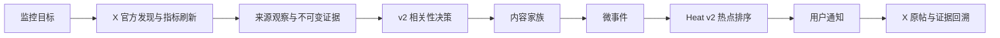

# X 热点核心链路收敛与遗留系统清理设计

> **已被 035 替代（2026-08-12）**：用户明确首版不是 X-only，而是 7+ 来源聚合的 AI 热点监控工具。本文件中“非 X 来源退出”“只创建/调度 X”等决策无效，不得继续实施。仍有效的单一 MicroEvent ID、停止 legacy 双写和移除报告/知识库等重复产品面的决定已纳入 [035 多源 AI 热点监控首版收敛设计](archive/035-多源AI热点监控首版收敛设计.md)。

## 结论

当前首要问题不是缺少更多热点功能，而是 032 已经定义了 v2 切换方向，生产运行时却仍让 legacy 与 v2 两套业务链同时写入、读取和对外服务。继续直接实现 033 会把 X 指标刷新再次接到两套事件模型上，扩大重复事实源和错误链接。

034 将产品收敛为一条主链：

这条链之外的能力分成三类处理：必要的平台约束继续保留；已有数据进入只读兼容和可恢复迁移；偏离 X 热点目标的产品面停止新写并从默认运行时、API 和导航移除。034 不用一个新的“统一平台”再包裹旧系统，也不创建第三套 Hotspot、Event、Alert 或 Report 模型。

## 设计目标边界

本提案以以下目标作为待确认的产品边界：

1. X 是核心版本唯一必须支持的发现与持续指标来源；一个 Monitor 只配置 X 也必须完成全链路。
2. 用户得到的是“与监控目标相关且正在升温的具体微事件”，不是通用 RSS 阅读器、跨平台搜索门户、知识库或报告平台。
3. 热度来自 X Post 的窗口指标增量与微事件传播特征；搜索相关性、AI 判断、账号认证和来源数量不得冒充热度或真假。
4. 站内通知是唯一业务通知事实源；邮件可以作为同一通知的投递通道，不再维持独立 legacy Alert 事实。
5. 每个事件必须能回到官方 X Post、采集时间和允许保留的原始证据；凭据、限流、安全、审计和权利边界不是可清理的“过度设计”。
6. RSS、Hacker News、Bing、Bilibili、Weibo、Google 搜索、日报周报、私有 Feed、知识提案、Agent API、自动 Claim/Storyline 和高级治理不属于核心发布面。历史数据先保留，是否重新启用必须由新的独立需求证明价值。

若上述边界未获确认，034 不进入生产代码和数据清理。

## 代码与运行时审计事实

本设计基于 2026-08-12 对实际启动图、任务扇出、SQL 和前端路由的核验，不以表数或文件数单独判断过度设计。

| 观察 | 代码事实 | 影响 |
|---|---|---|
| 两套事件链同时运行 | `CollectSource` 固定进入 `NormalizeContent → EvaluateRelevance → ClusterContent → RecomputeEventHeat → EventUpdate → Alert/Summary`；具备对象存储时又运行 `SourceDocument → DocumentMatch → ContentFamily → MicroEvent → Heat v2 → UserNotification` | 同一输入被两套相关性、事件、热度和通知语义重复处理 |
| 两套 API 同时公开 | Bootstrap 同时注册 legacy Event、Radar、EventUpdate、Alert、Report、Knowledge、Agent 路由与 MicroEvent、v2 Notification 路由 | 客户端无法知道哪套 ID 和状态是权威事实 |
| 已出现 ID 语义错误 | Content API 从 `event_contents/events` 返回 legacy `event_id`，Alert 也引用 legacy `events.id`；前端却把它们链接到只按 `micro_events.id` 读取的 `/dashboard/events` | 链接可能打开无关微事件或空详情，不能靠 UI 文案修复 |
| 报告仍消费旧算法 | Report Candidate 直接读取 `events/event_updates/monitor_events`，Alert Thread 外键也指向 `events` | 032 声明的 Heat v2 默认切换并未真正完成 |
| 来源入口偏离目标 | Domain、Connector Registry 与新增来源 UI 同时公开 7 种来源，新增表单默认值仍是 RSS | 用户要求的 X 核心被多来源配置面稀释，RSS 仍是默认心智 |
| 运行面持续扩大 | 当前 canonical Schema 有 150 张表、18 种持久任务、26 个 API 路由组和 8 个一级工作台入口 | 数量本身不是罪证，但其中多项仍是重复可写事实和非核心产品面 |
| 既有设计与实现冲突 | 032 明确规定 `default` 后停止 legacy 新写，旧 Event/Heat/Radar/Notification 只读隔离，物理删除另立清理评审 | 034 正是 032 要求但尚未执行的清理评审，不是重新推翻 v2 |

## 保留、收敛、停止和删除矩阵

### 保留为核心

| 能力 | 保留理由 | 收敛后的职责 |
|---|---|---|
| Identity、Monitor 所有权与最小 RBAC | 私有监控和通知隔离所必需 | 只保护核心页面与 API，不扩展组织协作产品 |
| `monitor_config_versions` + v2 Intent/Compiled Profile | 已发布来源查询和语义目标需要精确版本 | 保留一个发布入口；legacy `monitor_rules` 不再参与新评分 |
| X SourceConnection、checkpoint、collection run | 官方发现、限流、恢复和幂等所必需 | 默认只创建和调度 X；不执行 RSS 或网页回退 |
| SourceObservation、EvidenceSnapshot、DocumentVersion | 证明采集输入、长帖正文和版本，不把 snippet 当原文 | 对外只投影必要的原帖、时间、正文状态和哈希 |
| DocumentMatchDecision、ContentFamily | 相关性、去重与转载谱系所必需 | 只为微事件提供有效成员，不产生真假分 |
| MicroEvent、membership decision、Heat v2 | 核心热点实体和排序事实 | 成为唯一事件 ID、事件列表和热度事实源 |
| OutboxEvent、UserNotification、DeliveryAttempt | 持久通知、权限复核和通道重试所必需 | 站内通知为业务事实；邮件只追加投递尝试 |
| 凭据加密、SSRF、限流、配额、审计、可观测性、保留策略 | 安全、成本和可运营性约束 | 留在后台，不进入用户主流程或制造第二业务事实 |

### 收敛为兼容投影

| 当前能力 | 目标 | 约束 |
|---|---|---|
| `contents` | SourceObservation/DocumentVersion 的有界列表投影 | 不再作为正文、相关性或事件事实；当前仍承载 033 的指标投影与快照入口，返回 `document_version_id` 和 `micro_event_id`，删除含混的 legacy `event_id` |
| `monitor_config_versions` 与 v2 Intent | 一个 Monitor 发布事务 | 继续复用 config 身份和来源范围；自然语言意图、条款和 compiled profile 只读 v2 实体 |
| Knowledge Vault 投影基础设施 | DerivedArtifact 的内部只读写入端口 | 保留确定性 Markdown/plaintext 产物；移除知识提案、人工编辑和独立知识产品 API |
| Legacy 数据表 | 回滚窗口内只读历史 | 代码中以单向兼容 Reader 或导出工具访问，不进入默认 API、排序、通知、报告或任务扇出 |

### 先停止新写，再移除运行面

以下 producer 在 v2 对应链通过契约和数据对账后停止入队：

- legacy `EvaluateRelevance`、`ClusterContent`；
- legacy `RecomputeEventHeat`、`GenerateEventSummary`、`EvaluateEventAlerts`；
- `ProjectKnowledge`、`ReconcileKnowledge` 的知识产品写入；
- `BuildReport`、legacy `DeliverEmail`、`DeliverAlertEmail`。

随后从默认 API/前端移除：

- legacy Event、Radar、EventUpdate、Claim、Event Summary 与 Event Governance；
- legacy Alert Thread/Occurrence 的处理页；
- Report、Report Subscription、私有 RSS Feed；
- Knowledge Proposal/Document 产品页和依赖 legacy Event 的 Agent 路由；
- Dashboard 中“告警、报告、订阅”一级入口，改为一个 v2“通知”入口；
- Content 和 Alert 产生 legacy Event ID 的深链。

停止新写不等于立即删表。历史 Alert/Report/Event 先提供管理员导出，普通用户读路径不再混入主产品。

### 退出核心范围

| 能力 | 034 处置 |
|---|---|
| RSS、Hacker News、Bing Grounding、Bilibili、Weibo、Google Agent Search | 新建 UI 与自动调度从核心版本移除；现有连接设为停用并保留历史读取，不能自动回退。物理 Connector 删除在确认没有活跃连接后执行 |
| Storyline、自动 Claim/ClaimEvidence/EvidenceState 摘要 | 停止自动 producer 并从用户主界面移除；MicroEvent 仍保留原帖与基础出处，不把证据图当作热点发现前置条件 |
| AI 查询扩展、Embedding、Reranker | 作为可选增强；不可用时规则与官方查询仍能工作，不得阻塞采集、热度和通知 |
| MicroEvent merge/split、权利审批、质量评测 | 保留必要的管理员纠错和 fail-closed 后台能力，但不作为普通用户一级工作区 |
| Web Push | 保留为 opt-in 投递适配器且默认关闭；不新增 Push 业务事实 |
| 全局 X Trends、通用网页搜索、新 RSS 源、更多平台 | 延后；必须另立需求，不进入 033/034 |

## 单一 ID 和 API 契约

`micro_event_id` 是唯一对外事件身份。所有列表、通知和深链只能携带该字段；不得再用名称相同的 `event_id` 同时表示 legacy Event 与 MicroEvent。

- `/api/v1/micro-events` 继续作为事件集合端点，并在清理后评审是否重命名；034 不为改名复制第二套路由。
- Content 投影只能从 `DocumentVersion → ContentFamily → active MicroEventMember` 得到 `micro_event_id`。不存在唯一活跃关系时返回 `null`，不得回退查 `event_contents`。
- UserNotification 深链只引用 v2 MicroEvent；legacy Alert/Report 只允许导出，不再跳到当前事件页。
- 前端路由参数继续使用 `event` 也只能解释为 `micro_event_id`；后续可无状态重命名为 `micro_event`，但不能同时兼容两种数字空间。

## 运行时收敛顺序

1. 冻结 legacy 新功能，建立“任务种类、路由组、表写入者、前端消费者”清单和架构测试。
2. 修复 Content/Alert 深链：主产品只接受 `micro_event_id`；legacy 记录退出用户导航。
3. 让 X/033 新能力只写 v2 观察、指标、MicroEvent Heat 和 UserNotification，禁止再增加 legacy 双写。
4. 按输入对账 v2 覆盖后停止 legacy producer；`NormalizeContent` 暂时只维护 Content/指标兼容投影且不得再扇出 legacy relevance/event，队列中已有任务先排空或显式取消并留审计。
5. 卸载 legacy 路由、调度器、Worker handler 和前端页面，再删除不可达 Application/Repository 代码。
6. 停止非 X 来源新建和调度；导出、停用并核对现有连接。
7. 至少完成一次生产备份恢复演练、一个完整回滚窗口的零 legacy 写入证明和外键/引用扫描后，才从 canonical Schema 删除旧表列。

034 不增加通用 Feature Flag 平台、微服务、事件总线或新的迁移框架。切换状态使用现有审计和配置事实；数据库结构仍只有 `backend/db/schema.sql` 一份。

## 删除门槛

物理删除某个 legacy 表、Connector 或路由前必须同时满足：

- 对应新 producer 已成为唯一写入者，连续一个经评审的回滚窗口没有 legacy 写入；
- 队列没有该 Job 的 pending/running/retry 记录；
- OpenAPI、生成 Client、前端和 Agent consumer 已无引用；
- 现有数据已导出或能从保留事实重建，外键和对象存储引用扫描为零阻断；
- 备份与独立恢复演练通过；删除脚本支持 dry-run、显式确认和幂等重入；
- 删除后 canonical Schema、空库初始化、非空升级、启动图和端到端 X 主故事通过。

任何门槛未满足时只停止运行面，不破坏历史数据。

## 验收边界

- AC-034-1：一次 X 输入只进入一条 v2 业务链；不存在 legacy Event/Heat/Alert/Report 新写。
- AC-034-2：Content、事件列表和通知只公开 `micro_event_id`，所有深链打开同一微事件；legacy ID 不进入当前 UI。
- AC-034-3：默认工作台只保留概览、监控、X 来源/凭据、内容证据、热点事件和通知；报告、订阅、legacy 告警与知识产品入口消失。
- AC-034-4：核心版本不能新建或自动调度非 X 来源，X 失败不会回退 RSS/网页/第三方 API；历史连接和数据不会被静默删除。
- AC-034-5：AI、Web Push 或高级治理不可用时，X 发现、相关性降级、Heat v2 排序和站内通知仍能完成；MinIO/Vault 继续作为证据与正文基础设施接受 readiness 检查。
- AC-034-6：删除前置扫描、备份恢复和零 legacy 写入门槛可重复验证；失败只阻止删除，不影响 v2 主链。

## 与 033 的关系

033 提供官方 X 发现、Post Lookup 指标刷新和 Heat v2 改进；034 决定这些能力只接入哪条生产链。两项必须一起评审：先完成 034 的单 ID 与停止双写门禁，再把 033 接到 v2，最后执行 034 的运行面和物理清理。未完成前，不实现“同时重算 legacy 与 v2”的过渡方案。
