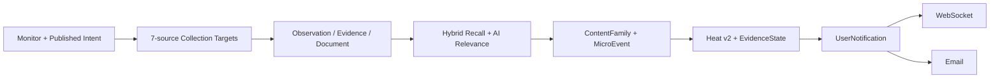

# 多源 AI 热点监控首版收敛设计

## 结论

首版产品不是 X-only，也不是通用情报、报告或知识管理平台。唯一主故事是：用户配置监控目标，系统从 7 个受支持来源持续采集，通过 AI 查询扩展提高召回，通过相关性与可引用证据判断降低噪声，将内容归并为 MicroEvent，按热度/相关性/时间和多维条件浏览，并通过 WebSocket 与邮件通知。

参考项目 `liyupi/yupi-hot-monitor` 在提交 `cd48b0885bfa8ae9c8043cf78ef6cfd045530bdb` 上定义了相同的六项核心能力。我们参考它的产品边界和交互闭环，不照搬以下实现：第三方 Twitter API、单次 LLM `isReal` 布尔值、进程内 Query Expansion 缓存、内存全量热度排序、无持久游标的 Socket.io 广播，以及命中既有 URL 后不再刷新指标。

## 首版产品边界

### 必须交付

1. 监控目标：创建、发布、暂停和恢复监控，监控内容可以是自然语言目标和关键词规则。
2. 7 个正式来源：RSS/Atom、Hacker News、X/Twitter、Bing Grounding、Bilibili、Weibo、Google Agent Search；每个来源独立失败，不能拖垮其他来源。
3. AI 查询扩展：生成可审核候选，发布后形成版本化 Compiled Intent；AI 不可用时保留原始查询和确定性规则，不静默扩大范围。
4. AI 真假/可信度与相关性：相关性决定是否进入事件；真假识别必须表现为有证据和不确定性的可信状态，不把模型分数宣称为事实概率。
5. 热点：MicroEvent 是唯一事件 ID；Heat v2 是唯一用户排序热度，X 额外支持发现后 1h/6h/24h 指标持续观测。
6. 实时与邮件：PostgreSQL UserNotification 是唯一通知事实；WebSocket 支持鉴权、持久游标重放、心跳、连接上限和重连，邮件采用同一事实并追加投递尝试。
7. 多维筛选排序：至少按来源、监控、可信状态、事件状态和时间范围筛选，按热度、相关性和时间排序；分页排序必须在数据库中稳定完成。

### 明确不在首版

- 日报/周报、私有 Feed、独立知识库、Agent Token/Agent Skill 产品面。
- 第二套 legacy Event/Radar/Alert/Report 事实链。
- 通用组织协作、自动发布、社媒账号运营、全网无约束爬虫。
- 评论/回复正文、评论树与浏览器爬虫；后续候选边界见 036，未评审前不进入首版。
- 将 LLM 的 `isReal`、confidence 或单来源断言显示为“已证实真实”。
- 为 WebSocket 新增 Redis Pub/Sub、Kafka、Socket.io 或进程内通知事实总线。

### 角色与路由边界

- 来源配置、用户与权限、配额与审计统一定义为 Admin 路由；角色规则由前端单一映射同时驱动桌面导航、移动导航和深链门禁。
- Viewer 与 Editor 不展示上述入口，账户页也不查询或链接来源管理；直接输入 Admin URL 时不挂载目标页面、不发起目标页面请求，并以客户端 replace 返回概览。
- 页面组件保留空渲染的 fail-closed 防线，API 继续执行服务端 RBAC。隐藏导航与客户端重定向只改善产品信息架构，不能替代后端授权。

### 个人自部署交互边界

- 新增来源采用渐进式配置：首屏只显示连接成功所需字段，语言、地区、证据保留、保留天数、请求边界和 X 指标刷新进入默认折叠的高级设置；字段和安全默认值仍由同一个创建契约提交，不建立简版 DTO。
- 手动搜索不设置每用户每日产品硬配额。五分钟冷却和唯一任务键继续避免重复入队；来源 Connector 的上游限流、超时、最大页数和 X 指标预算继续保护真实成本。
- `manual_searches` 账本只记录事实并以 `observed` 投影到管理员治理页，不阻断业务事务，也不在普通监控页面制造套餐余额心智。

## 核心链路

所有来源共享 B–I；X 的 Post Lookup 只增强 F 中的指标快照，不建立 X 专属事件、通知或页面模型。

## 真假识别语义

“AI 真假识别”拆成两个可审计事实，避免一个含混布尔值承担全部责任：

- `DocumentMatchDecision`：内容是否与当前监控意图相关，允许模型/向量/规则信号并存，可人工复核。
- `EvidenceStateSnapshot`：当前可引用证据覆盖状态，值为 `no_citable_body`、`single_origin`、`multiple_origins`、`conflicting_reports`、`publisher_corrected` 或 `publisher_withdrawn`。

UI 可以把后四种映射为“多源印证、存在冲突、发布者更正、发布者撤回”等用户语言；`single_origin` 只能显示“单一来源，待核验”。AI 可以辅助抽取 Claim 和判断证据关系，但任何结论必须绑定具体 DocumentVersion 和引用片段。自动证据分析是异步增强，不得阻塞热点入库和基础通知。

## 实时传输

保留现有 SSE 作为兼容降级，同时新增 `/api/v1/notifications/ws`。WebSocket 与 SSE 都只轮询同一持久 Repository：

- 连接前完成现有 Bearer 鉴权和 Monitor 权限复核；不从 query string 接收长期 token。
- 客户端用 `after_id` 恢复；服务端先重放再增量轮询，断线不会丢事实。
- 服务端发送 notification JSON 与 heartbeat，不接受改变业务状态的客户端消息。
- 共享连接容量上限，慢客户端关闭；WebSocket 成功发送只追加 `DeliveryAttempt(channel=websocket)`。

## 多维查询

MicroEvent 列表查询扩展为：`monitor_id`、`source_type`、`evidence_state`、`status`、`started_from`、`started_to`、`sort`、`cursor`、`limit`。排序：

- `heat`：最新 Heat v2 分数、窗口、开始时间、ID。
- `relevance`：事件有效成员中当前监控匹配的最大已校准相关性、开始时间、ID。
- `latest`：事件开始时间、ID。

游标必须包含筛选指纹和 `as_of`，防止换筛选条件继续使用旧游标或翻页漂移。

## 过度设计清理

继续移除默认运行时中的 legacy Event/Radar/Alert/Report/Knowledge/Agent 产品入口和 producer；保留不可变证据、Rights、Document、MicroEvent、EvidenceState、通知、审计、来源限流与安全基础设施。个人版不保留任意的手动搜索产品硬配额；Storyline、报告、知识库和 Agent 不进入首版；Claim/Evidence 只作为真假识别的证据能力保留，不恢复为第二套热点实体。

非 X Connector、Bilibili webhook、来源表单和多源调度属于核心，不得清理。

## 当前代码审计基线

| 能力 | 代码事实 | 035 判断 |
|---|---|---|
| 7 来源 | Domain 和 ConnectorRegistry 已注册 7 类；X-only DTO/UI/调度是本轮误改 | 恢复入口和调度，保留 X 增强 |
| 查询扩展 | Monitor Intent 扩展、候选审核、发布/编译链存在 | 保留并做回归验证 |
| 相关性 | Hybrid recall、reranker、calibration、DocumentMatch 决策链存在 | 保留并验证多源输入 |
| 真假/证据 | ClaimEvidence/EvidenceState 查询存在；自动投影刚被从主链拆除 | 以异步非阻塞方式接回，不恢复 Storyline 前置 |
| 实时 | 当前只有带持久重放的 SSE，没有 WebSocket | 新增 WebSocket，SSE 保留降级 |
| 邮件 | UserNotification 邮件租约、重试和 Dispatcher 已接入 Worker | 保留并验证 |
| 筛选排序 | MicroEvent 仅 status + heat/latest | 增加来源、监控、证据、时间和 relevance |

## 决策

本 Design 经用户 2026-08-12 明确确认的功能边界视为 accepted。实现只在上述范围内修复或增强，不以参考仓库的文件结构、技术栈或展示文案作为复制目标。
