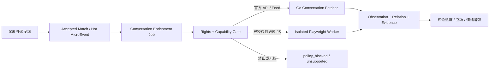

# 评论会话采集与采集运行时边界设计

## 结论

继续使用 Go 作为 HotKey 的核心框架和主采集运行时，不因为后续需要评论正文而重写服务。当前七类来源中，X 和 Hacker News 已有可表达会话的官方 API，微博优先根据开放平台权限使用官方互动能力；这些工作都适合留在 Go Connector 体系中。

仅当某个来源同时满足“有明确授权”、“官方 API/订阅源无法提供目标数据”、“页面必须执行 JavaScript”三个条件时，才在 Go 核心服务之外增加隔离的 TypeScript/Playwright Worker。不把浏览器、用户 Cookie、反爬绕过或 Node.js 运行时塞进 Go API/Worker 进程。当前也不引入 Python/Scrapy：只有未来出现大量经授权的通用静态站点爬虫时，其调度、中间件和 AutoThrottle 生态才能抵消第三运行时的运维成本。

评论正文不属于 035 首版，036 当前只是待评审的后续设计，不授权任何生产代码实现。

## 调研边界

本设计回答四个问题：

1. 参考项目是否已经解决评论正文获取。
2. 当前 HotKey 领域与持久模型能否保存“帖子—评论—回复”关系。
3. 已支持来源的评论数据是否需要页面爬虫，以及是否允许爬取。
4. Go、TypeScript/Playwright 和 Python/Scrapy 应各自承担什么边界。

本设计不决定评论情感模型、前端评论树 UI，也不扩大 035 的七类来源和首版交付面。

## 参考仓库复核

复核对象为 `liyupi/yupi-hot-monitor` 提交 `cd48b0885bfa8ae9c8043cf78ef6cfd045530bdb`。其 README 定义了 8+ 来源、AI 查询扩展/真假/相关性、筛选排序、WebSocket 和邮件等产品闭环，这些已在 035 中作为产品参考。但它没有实现评论正文链路：

- `Hotspot` 只保存 `replyCount`/`commentCount` 指标，没有评论实体、父子关系或会话游标。
- Twitter 搜索显式加入 `-filter:replies`，排除回复。
- Hacker News 查询使用 `tags: 'story'`，注释明确为“只搜索故事，排除评论”。

因此，参考仓库能证明热点产品边界，不能作为评论采集的数据模型或技术选型依据。

## 当前代码审计

| 位置 | 已有事实 | 结构问题 |
|---|---|---|
| `source/domain/collection.go` | `SourceItem` 和 `CapturedItem` 已有 `ParentExternalID`，指标已有 `CommentCount` | Connector 边界不是阻碍，无需为评论重写框架 |
| X/HN/Weibo Connector | 均会在上游返回关系时填充 `ParentExternalID` | 尚未形成统一的 root/conversation/relation 语义 |
| Collection Repository | 采集快照 JSON 保存 `ParentExternalID` | 该关系仅是临时采集快照字段 |
| `source_observations` | 保存可引用 Observation 及内容类型 | 没有 parent/root/relation 字段或关系表 |
| Evidence Selection / Ingestion DTO | 保存 External ID、ContentType 和证据身份 | 没有传递 `ParentExternalID`，关系在 Document 主链之前丢失 |
| `ingestion/application/normalizer.go` | 限定可归一化内容类型 | Hacker News `comment` 会被改为 `post`，破坏评论语义 |

核心缺口不是 Go 抓不到评论，而是“会话关系没有成为可追溯的持久事实”。

## 平台能力与准入结论

| 来源 | 官方能力证据 | 是否需要页面爬虫 | 036 默认决策 |
|---|---|---|---|
| X/Twitter | [X Conversation ID](https://docs.x.com/x-api/fundamentals/conversation-id) 说明所有回复共享 `conversation_id`，可用 `conversation_id:<id>` 检索完整回复并从 `referenced_tweets` 获取直接父项 | 否 | 扩展现有 Go X Connector，按配额获取会话 |
| Hacker News | [HN 官方 API](https://github.com/HackerNews/API) 将 story/comment 都定义为 item，并提供 `parent`/`kids` | 否 | 用 Go 按深度和数量限制遍历 item 树 |
| Weibo | [微博开放平台 CLI](https://open.weibo.com/cli/index) 当前对外描述了评论/转发互动管理与内容检索 | 默认否 | 先通过权限探测确认可读范围和配额；不足时返回可观测的不支持，不隐藏爬取 |
| Bilibili | [哔哩哔哩开放平台开发者服务协议](https://open.bilibili.com/agreement/developer-service) 第五部分明确禁止未经书面同意使用机器人、蜘蛛、爬虫等自动程序获取平台数据 | 技术上可做，合规上不准入 | 没有书面授权与已核验官方能力前，评论正文状态固定为 `policy_blocked` |
| RSS/Atom | 只有发布者显式声明的评论 Feed 才有稳定契约 | 否 | 可消费显式 Feed，不从文章页推测或通用爬取评论 |
| Bing Grounding / Google Agent Search | 定位是发现/搜索来源，不是目标站点的评论 API | 不应需要 | 只返回根内容候选，不把搜索结果页或目标站点爬取作为隐式回退 |

`robots.txt` 不能替代平台条款、数据授权和隐私处理依据。每个来源必须先通过 Rights Policy，再进入技术能力选择。

## 为什么 Go 仍然适合

- 现有 Connector 只暴露 `Validate`/`Fetch`/`Health`，是协议无关且来源独立的稳定端口；评论会话能作为可选能力扩展，不需要改变主程序语言。
- 已知可准入的 X、HN 与微博路径都是 HTTP/JSON 或 Feed，Go `net/http` 官方文档明确 `Client`/`Transport` 可并发复用，可控制超时、跳转、TLS、代理和连接复用，符合现有配额/限流/证据快照边界：[Go `net/http`](https://pkg.go.dev/net/http)。
- 现有 PostgreSQL 持久任务、Rights Policy、Source Observation 和证据系谱已在 Go 服务中；重写会同时制造数据一致性与运维风险，而不会解决关系字段丢失。

Playwright 的官方支持语言是 JavaScript/TypeScript、Python、Java 和 .NET，不包含 Go，且每个版本需要对应浏览器二进制与系统依赖：[Supported languages](https://playwright.dev/docs/languages)、[Browsers](https://playwright.dev/docs/browsers)。这是把浏览器能力隔离为 Worker 的原因，不是替换 Go 核心的理由。

## 目标架构

评论采集是根内容被判定相关或成为热点后的按需增强，不是发现阶段的全网无界爬取。

### 能力端口

不扩大当前发现 `Connector.Fetch`。在来源层新增可选的 `ConversationFetcher` 能力，输入只包含根 Observation/外部 ID、时间窗口、页游标、最大数量、最大深度与配额预算；输出仍使用有界的 SourceItem、EvidenceSnapshot、Relation Assertion 和 RateLimit。不支持该能力的来源返回明确 capability result，不通过隐式 HTML 爬取回退。

外部 Worker 若被批准，只能作为该端口的一个适配器；Go 应用仍负责任务、Rights、凭据授权、预算、幂等、证据入库和状态机。

### 持久关系

在不改写不可变 `source_observations` 的前提下，增加不可变的会话关系事实，至少包含：

- child observation/external ID、直接 parent external ID 和 root/conversation external ID；
- `reply_to`、`comment_on`、`quote_of` 或 `repost_of` 关系类型；
- source connection、捕获时间与证明该关系的 Evidence Reference；
- 父项尚未入库时允许保存外部 ID，后续只追加解析绑定，不原地修改历史关系。

`comment` 必须成为可保留的内容类型，不再归一化为 `post`。关系事实需跟随 Evidence Selection 进入 Ingestion/Document 读模型，但不需要新建图数据库或通用社交图谱。

### 分析语义

评论默认是热度、用户立场、情绪和纠正线索，不是一个独立出版来源。同一根帖子下的多条评论不得把 `single_origin` 提升为 `multiple_origins`。只有当评论自身引用了另一个可核验出版物并完成证据系谱绑定时，该出版物才能作为新 origin。

## 预算与失败边界

- 只为 Accepted Match 或达到可配置热度阈值的根内容排队，不为所有发现结果全量获取评论。
- 每任务必须限定页数、总项数、树深度、时间窗口、墙钟时间、字节数和上游配额；游标与幂等键持久化。
- 单一来源的配额、授权、解析或 Worker 失败不回滚根 Document/MicroEvent，也不阻塞其他来源。
- 删除、撤回、更正、授权撤销和保留期必须复用现有 Rights/Evidence 生命周期，不保留无权长期使用的评论正文。

## 过度设计清理

本阶段明确不建设：

- 通用全网爬虫平台、动态插件市场、图数据库、Kafka 或新事实总线；
- 同时引入 Go、Python 和 TypeScript 三套采集调度器；
- 全量会话抓取、无限深度递归、长期浏览器会话和个人 Cookie 托管；
- 绕过验证码、设备指纹、登录门禁、反爬或平台配额；
- 用评论数量伪造多来源真假印证。

## 引入非 Go Worker 的准入门槛

只有以下证据全部存在时，才单独提案引入 TypeScript/Playwright Worker：

1. 已保存来源的书面授权/开放平台条款依据、可处理数据范围和删除义务。
2. 官方 API、Feed、Webhook 或合作数据无法提供该数据，且返回的静态 HTTP 内容确实无法解析。
3. 浏览器路径不依赖个人 Cookie、反爬绕过或不可审计的手工操作。
4. 已有独立的并发、超时、内存/磁盘、浏览器二进制版本、网络出口与失败隔离运维契约。
5. 通过有界流量验证后，其业务收益高于新运行时的持续运维成本。

若未来需要维护大量经授权的通用静态站点 Spider，再为 Python/Scrapy 单独立项。Scrapy 的 [AutoThrottle](https://docs.scrapy.org/en/latest/topics/autothrottle.html) 会根据每域名延迟调节请求间隔，但这项优势当前不足以证明引入 Python 服务。

## 待评审决策

本文档当前为 `proposed`。评审通过前：

- 035 继续交付多源 AI 热点监控首版，不新增评论正文、浏览器 Worker 或通用爬虫。
- 后续若批准 036，第一批只实现 X 与 Hacker News 官方 API 会话，用实际数据验证关系模型、预算与分析价值。
- Bilibili 评论正文在获得书面同意和可审计的官方能力前不进入实现。
