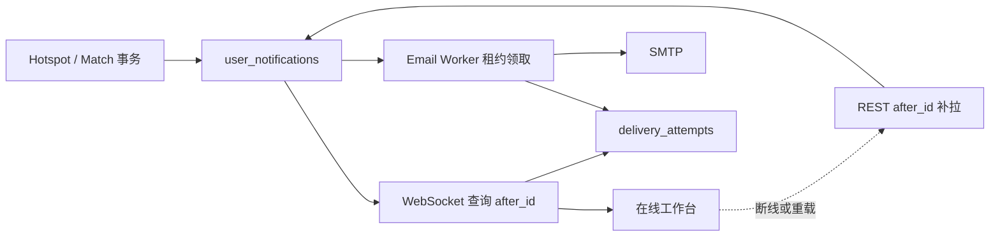

# 邮件与 WebSocket 双通道通知收敛设计

## 结论

HotKey 的用户通知只保留两种送达方式：页面在线时使用经过身份认证的 WebSocket 实时送达，页面关闭或用户不在线时由 SMTP 邮件承接 `high/urgent` 热点。REST `after_id` 查询是 WebSocket 断线恢复协议，不是第三种通知通道。

两种通道必须消费同一个持久 `user_notifications` 事实。WebSocket 或 SMTP 失败不得回滚热点、Monitor Match 或通知事实；每次实际投递另存不可变 `notification_delivery_attempts`。不引入通知 SaaS、消息中间件或第二套 Inbox 表。

## GitHub 实现调研

本轮固定复核了以下公开实现，采用其成熟模式，不复制其框架和源码。

| 实现 | 可复用事实 | 不直接复制的部分 | HotKey 取舍 |
|---|---|---|---|
| [Gotify `491a17a`](https://github.com/gotify/server/tree/491a17a5303038284cff570df2065ac914bc846e) | 消息先持久化，WebSocket 只负责在线流；客户端仍可从 REST 读取历史消息；服务端有 ping 与连接生命周期 | Gotify 面向 token/application 的通用推送服务，用户模型和 HotKey 不同 | 采用“数据库消息事实 + WebSocket 在线流 + REST 历史恢复” |
| [Novu `1373b21`](https://github.com/novuhq/novu/tree/1373b216) | 工作流把触发事实与 email/in-app provider 分离，Inbox 是可嵌入的实时消费面 | 完整平台、模板编排、Provider 生态和独立基础设施超出 MVP | 只保留通道解耦、独立投递状态和统一通知投影 |
| [yupi-hot-monitor `cd48b08`](https://github.com/liyupi/yupi-hot-monitor/tree/cd48b0885bfa8ae9c8043cf78ef6cfd045530bdb) | 页面使用 Socket.io 展示新热点，`high/urgent` 发送 SMTP 邮件，符合本产品最低效果 | 内存广播没有可靠重放；通知创建与业务事务、用户隔离和断线补齐不足 | 保留产品阈值，使用 PostgreSQL 事实、用户鉴权和游标补拉修正可靠性 |

Gotify 的关键参考代码包括 [WebSocket stream](https://github.com/gotify/server/blob/491a17a5303038284cff570df2065ac914bc846e/api/stream/stream.go)、[客户端连接管理](https://github.com/gotify/server/blob/491a17a5303038284cff570df2065ac914bc846e/api/stream/client.go) 和 [持久消息查询](https://github.com/gotify/server/blob/491a17a5303038284cff570df2065ac914bc846e/database/message.go)。参考项目的页面通知见 [App.tsx](https://github.com/liyupi/yupi-hot-monitor/blob/cd48b0885bfa8ae9c8043cf78ef6cfd045530bdb/client/src/App.tsx#L392-L439)，定时热点处理与邮件门槛见 [hotspotChecker.ts](https://github.com/liyupi/yupi-hot-monitor/blob/cd48b0885bfa8ae9c8043cf78ef6cfd045530bdb/server/src/jobs/hotspotChecker.ts#L119-L235)。

## 统一事实与通道拓扑

- `user_notifications` 是不可变、安全、用户隔离的通知投影。
- `notification_delivery_claims` 只处理邮件并发领取；领取租约为 2 分钟。
- `notification_delivery_attempts` 按通道追加 `succeeded/failed/permanent_failure`，不反向修改通知。
- 历史 Schema 中的 SSE/Web Push 枚举和订阅表暂时保留，只为兼容旧数据；API、Worker、前端和新领域校验不再产生这些记录。

## 站内实时协议

1. 浏览器只连接同源 `/api/v1/notifications/ws`，请求子协议 `hotkey.notifications.v1`。
2. Access Token 不进入 URL 或子协议；连接建立后 5 秒内通过第一条 `authenticate` 应用帧提交 Token、`after_id` 和可选 Monitor ID。
3. 服务端认证成功先返回 `ready`，再按用户和游标查询最多 100 条通知，逐条发送 `notification` 帧。
4. 服务端定期发送包含当前游标的 heartbeat，限制帧大小、写超时和单进程最大连接数。
5. 浏览器首次加载先做一次 REST 恢复读；WebSocket 失败后立即按当前游标 REST 补拉，再以 1 秒、2 秒、10 秒封顶退避重连。
6. UI 明确显示“WebSocket 已连接”“正在连接”或“REST 补拉中”，不把降级伪装成实时。

WebSocket 仍由 API 进程从 PostgreSQL 轮询新增事实，默认 1 秒。它满足单体 MVP 的 2 秒送达目标；只有实际观测证明数据库轮询成为瓶颈时，才评审 PostgreSQL LISTEN/NOTIFY 或独立 broker。

## 邮件交付

- 只有当前已发布 Monitor 配置启用邮件，且通知级别为 `high/urgent` 时可领取；用户、Monitor 或配置失效后不再发送。
- Worker 使用 `FOR UPDATE SKIP LOCKED`、租约和稳定 ID 顺序并发领取；最多尝试 5 次，临时失败按 1/2/4/8 分钟退避。
- 邮件主题为 `[HotKey][级别] Monitor · 标题`；正文包含安全转义后的标题/摘要、Monitor、来源、相关度、原文和 HotKey 详情链接。
- 原文只允许绝对 HTTP(S) URL，HotKey 深链只来自领域白名单路径；Header 邮箱必须是无显示名、无换行的规范地址。
- SMTP 永久失败或次数耗尽记录 `permanent_failure`；邮件失败不影响站内消息。

## 前端信息架构

通知页先展示两张通道状态卡，再展示通知收件箱：

- “站内实时通知”展示当前连接状态和断线补齐语义。
- “邮件通知”展示当前账户邮箱、`高 / 紧急`门槛和管理入口。
- 移除手机设备、浏览器授权、VAPID、刷新设备等 Web Push 控件。
- Service Worker 只保留公开离线壳缓存，不再处理 `push` 或 `notificationclick`。

## 删除与兼容边界

- 删除 SSE 公开路由、Handler、前端解析器及生成 Client；断线恢复统一为 REST，减少一个长期连接协议和两套解析状态机。
- 删除 Web Push API、订阅服务、加密器、发送 Worker、前端设备 UI 与配置项，并移除不再使用的 `webpush-go` 依赖。
- 不破坏性删除旧订阅表或历史投递行。本轮没有数据迁移和不可逆清理；未来单独以 Schema 升级计划评估归档。

## 可观测与验收

- 自动化覆盖 WebSocket 首帧鉴权、游标重放、用户隔离、投递事实、连接容量和非法帧。
- 自动化覆盖 REST 降级补拉、页面通道状态、邮件阈值、租约、重试、内容转义及安全链接。
- OpenAPI 只发布 `GET /api/v1/notifications` 和 WebSocket upgrade；SSE 与 Web Push 路由必须不可达。
- 本地没有隔离 SMTP 时只验收到 Mailer 边界，不向真实邮箱发送测试邮件。
