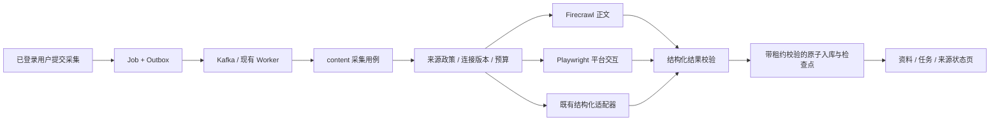

# 本地网页与浏览器采集设计

日期：2026-09-23。本文回应本地部署 Firecrawl / Playwright、减少来源接口依赖的需求。v1.10 接受 S00/S01 及完整 S02 网页业务闭环：`webpage.collect` 由服务端固定连接版本与目标，经 Job/Outbox、Kafka、Worker、Firecrawl、预算结算和原子页提交形成持久资料与任务结果；现有 `/content` 可提交 URL，任务页可取消、手动重试、呈现部分状态并打开持久资料。重放、换版、限流、未知历史 kind、调用结算前崩溃和页提交后中断均有持久恢复边界。产品 Acceptance 仍未建立，四平台评论、隔离浏览器与恢复验收继续按 S03—S05 推进。Scrapling 临时环境受控研究见 047 Research，不计入业务验收。承接 004—010、034、036—039、042 的既有范围；044/045 可在以后复用。本专项不增加产品 PRD、P0 分母，不替代 X 和国内来源的独立验收。

范围补充：用户已明确 **B站、小红书、抖音、微博都需要评论采集**。四个平台均纳入本专项与 008 的必需出口；首个实验可分片完成，但不再以“一个平台成功、其他以后再定”关闭需求。候选源码、许可证、维护与分页差异见 [047 Research](../research/047-本地网页与浏览器采集调研.md)，评论契约与业务语义由 [008 Design](008-评论与回复采集设计.md) 主责。

## 1. 当前事实与实施起点

本次调研始于 server HEAD `a33d2a2c`。S01 开工基线为 HotKey `c9889ea9`（004 S03 内部技术闭环已提交）与独立 Firecrawl `7666c1f`（v2.11.162）。Firecrawl 初始工作树含构建/网络改动和无必要 shell 包装，两个容器停止且 3002 无监听；本片在独立仓库本地 `main` 整理并提交 `6d9fb16`，移除无必要 shell 文件，只保留部署所需的幂等 Python 初始化入口，原位恢复既有两个容器且未启动第二套依赖服务。

| 现有位置 | 已有能力 | 本专项要补的缺口 |
|---|---|---|
| `sources/contracts.py` | search / author_posts / comments / replies、作品/评论、分页与停止原因；page_content 使用独立文档契约并已由 S02 持久任务消费 | 网页不能进入社交 `SourcePage`；浏览器交互与平台评论仍需独立适配 |
| `sources/adapters/x_twscrape.py` | 固定 SDK、有界单会话请求与映射 | 受控验证不等于 X 已接入；没有浏览器采集器 |
| `worker/app.py` | 租约、取消、失败、完成的装配；已注册 `webpage.collect`，历史未知 kind 持久失败后确认 | S03 独立浏览器和 S04 平台处理器仍待接入 |
| `jobs/execution.py`、`jobs/services.py`、`content/collection.py`、`content/services.py` | 已串联类型化受理、版本化目标、collector_call 预算、Firecrawl 调用、网页原子页提交、结果引用及结算前/提交后崩溃恢复 | 多页浏览器任务的逐页续租、硬截止和资源释放仍待 S03 |
| `connections/` | `web` 只声明 page_content，以 `auth_kind=none`、空 secret_ref 和规范化 allowed_hosts 建立不可变版本；任务固定版本，执行和页提交均复核当前版本与目标 | browser state 及四平台会话换版仍待接入 |
| `content/`、`evidence/` | webpage URL 身份、最终跳转、机器提取正文、观察、发现、生命周期、能力证据与 checkpoint 已原子持久；列表/详情及任务结果链接可读 | 原始 HTML/截图仍默认不保存；平台评论关系由 008/S04 补齐 |
| 本机独立 Firecrawl 仓库 | 固定 `v2.11.162`，API + Playwright 复用宿主依赖；中央日志脱敏、出站校验、CLI 探针及 HotKey 真实 Kafka/Worker live 单页链通过 | HotKey Docker worker 到该控制面及 S03 独立浏览器仍待验证 |

004 已提交证据 `connection_version`、停用/换版拒写、固定服务端凭据映射及配置/启停 API/UI。047 将认证版本扩展为 `none`/`server_credential`：公开网页不保存或伪造秘密，并把规范化精确域名写入不可变版本；S02 已由服务端在受理时固定版本和规范化目标，执行与页提交分别在事务内复核 owner、连接、当前版本和允许域名。浏览器状态文件解析及四平台会话仍需后续接入。

S01 已实现的边界是：`page_content` 使用独立 `WebPageRequest` / `SourceDocument` / `WebPageResult` / `DocumentAdapter`；目标只允许调用方明确列出的精确公共 HTTP(S) 域名，拒绝 IP 字面量和非默认端口，移除 fragment 并保留路径/query 语义；Firecrawl 只调用固定本地 `/v2/scrape`，发送 `maxAge=0`、`storeInCache=false`、20 秒/100000 字/2 MiB 上限，不接受任意 headers、Cookie、脚本、代理或服务地址。结果分别校验服务 HTTP、`success`、目标状态、最终地址、正文及登录/验证码特征；只报告一次 collector call，无法观测的目标请求数保持 unknown。能力由 0600 的本地环境显式启用；CLI 探针保持无持久化，S02 业务调用者则通过固定 Job/Worker 用例持久提交。

首个交付目标：用户提交一个准入的公开 URL，任务经 Kafka 执行，在 `/content` 查到正文、来源和采集时间；重复执行不重复建资料，失败/取消不伪造成功。这是基础采集闭环，不先依赖平台登录或模型推理。

用户要求的核心出口是四平台作品链接下的评论与楼中楼。网页闭环只是共享执行基础；S03 会话和 008 评论设计可在依赖满足后同时准备，四平台 URL 评论路径不等待 X 搜索或国内所有关键词/账号能力完成。

## 2. 方案与职责

**DEC-047-001：按能力选择采集方式，复用一套 HotKey 业务执行与存储。**

| 方式 | 本项目用途 | 边界 |
|---|---|---|
| HTTP / 已有来源适配器 | 已验证的结构化搜索、账号、评论接口 | 保留可维护路径；浏览器不是无条件替换 |
| 自托管 Firecrawl | 已知公开 URL 的正文与元数据提取 | 首期只用 `/v2/scrape`，不启动 crawl/map/search 或云端 Agent/Browser |
| 自管 Playwright | 经准入的平台搜索、列表滚动、展开评论、回复分页 | 每个平台编写明确脚本与字段映射；不是让模型任意导航的通用 Agent |
| Scrapling 组件候选 | Python Selector 解析、AsyncDynamicSession 浏览器动作 | S03-T00 已完成同样本比较，本期未采用；不接管业务调度/checkpoint |
| 经验证的本地平台采集服务 | 小红书/抖音等已有项目的只读能力候选 | 固定版本、只读端点、连接隔离、后台任务/缓存清理；不继承候选的全部控制台或任务体系 |

默认自托管 Firecrawl 的 Playwright 引擎能渲染网页，但不开放 actions / screenshot；复杂交互由 HotKey 的独立 Playwright 运行时承接。[官方自托管说明](https://docs.firecrawl.dev/contributing/self-host)

**DEC-047-002：来源标识与执行工具分开。** X、抖音或公开网页是来源；Firecrawl、Playwright、twscrape 是实现方式。任务固定来源、能力、连接版本和采集器版本。401/403/429、验证码、授权失效时停止或按原策略延期，不自动切换工具重试；更换实现需显式重新受理且重新计量。

工具只获取并返回数据，不直接读写 ORM、业务任务或 Kafka。`content/collection.py` 拥有采集用例与最外层事务；Worker 只装配资源并分派处理器。长时间网络/浏览器操作不持有数据库事务。

现阶段不一次安装四套完整爬虫。B站/微博优先以 HotKey 专用适配器承接；小红书/抖音对独立服务与自有浏览器适配器做有界比较。MediaCrawler 作为跨平台研究对照，不能忽略其非商业学习许可；已关停 bilibili-api 不作为默认新依赖。具体候选结论以 Research 的固定源码为准，尚未形成运行选型验收。

Scrapling 的高 star 使其进入 S03 优先比较名单，不构成生产采用结论。0.4.15 受控实验中，动作异常/等待超时仍可返回 200，自适应定位可能返回另一条评论。S03-T00 因原生 WS 拓扑、身份准确性和最小依赖选择直接 Playwright；不引入其 curl_cffi、开发响应缓存、完整 Spider 调度或特征 SQLite。普通 HTTP 继续用既定 HTTPX，平台适配器必须校验稳定 ID、作品、父链和页终点。研究细节和发布证据见 [047 Research 第 6 节](../research/047-本地网页与浏览器采集调研.md#6-scrapling按-star-筛选再核对实际能力)。

## 3. 来源与数据契约

### 3.1 网页与平台能力

**DEC-047-003：在既有 sources 领域增加独立网页契约。**

- `SourceCapability` 增加 `page_content`；现有四类社交请求和 `SourcePage` 保留各自语义。
- `WebPageRequest`：目标 URL、超时、正文上限、刷新策略；内部调用不接受任意 HTTP headers、脚本、代理地址或 Firecrawl API 地址。
- `SourceDocument`：请求 URL、最终 URL、标题、正文、正文范围、抓取时间、可空发布时间、内容指纹、提取器版本。原站未提供的作者/日期保持空；不得从当前时间推导发布时间。
- `WebPageResult`：文档或稳定失败原因、目标页面 HTTP 状态、可验证的用量及其统计范围。HTTP 200、Firecrawl success、目标页面成功和有效正文必须分别检查；登录/验证码页不能算资料。
- `WebPageAdapter.fetch_document()` 是单一外部边界。平台 Playwright 适配器继续实现 `SourceAdapter.fetch_page()`，返回稳定作品/评论 ID、父链、游标和停止原因。
- 来源目录显式登记每个来源可提供的能力；增加 `page_content` 后不得让 X/抖音自动出现未实现能力。`web` 仅声明网页正文；通用网络搜索不能冒充平台关键词搜索。
- 已知平台作品 URL 的定位/详情由 008/038 增加 `post_detail` 能力及独立类型化请求/结果，复用 SourcePost；它与网页正文、search、comments、replies 的可用证据分别记录。评论的线程根、直接父节点、回复目标和 coverage 字段以 008 为唯一业务定义，不从 Firecrawl Markdown 推断评论树。

新增枚举时同步 `sources`、`connections`、`jobs`、`evidence` 的 Pydantic/SQLAlchemy/`schema.sql` 检查约束、状态投影、OpenAPI 与生成客户端，不只改 Python 枚举。

### 3.2 内容持久化

**DEC-047-004：扩展现有内容模型，网页显式记为 `object_type=webpage`。**

复用 `content_records` / `content_versions` / `content_observations` / `content_discoveries`，新增 `persist_document_in_transaction()`，不再建一套爬虫数据库。网页无社交互动数，存空并在 UI 隐藏对应指标。评论持久化仍由 008 承接；返回评论 DTO 不代表评论业务表与查询已完成。

网页身份采用 `(owner, source_key=web, object_type=webpage, native_scope=规范化主机, external_id=规范化请求 URL 的 SHA-256)`。规范化只处理 scheme/host 大小写、默认端口与 fragment；保留路径大小写及有业务含义的 query，跟踪参数的删除须有来源规则。拒绝带 userinfo 或令牌的 URL。最终跳转地址另存为观察元数据；不因 rel=canonical 或跨站跳转自动合并资料。相同正文复用版本，新观察保留本次时间；同一页提交重放复用原观察。

Firecrawl Markdown 标记为 `machine_extracted`，`text_origin_ref` 绑定提取器/版本与可追溯清单。保存清洗后正文、来源链接、摘要性抓取证据即可形成第一版闭环；原始 HTML/截图按明确需要和政策另行启用，默认不留全量响应。Markdown 渲染关闭原始 HTML，外链仅允许安全协议。

## 4. 页级执行、事务与恢复

**DEC-047-005：先补原子提交与版本校验，再注册首个真实处理器。**

1. 受理时固定 owner、operation ID、任务 kind、目标、来源能力、连接/采集器/政策版本与预算。服务端校验来源可执行性，目标和版本不能由通用 scope 自由拼接。
2. 执行前短事务检查当前准入、连接版本、取消、租约和预算并预留资源；退出事务后请求来源。
3. 每次新导航/分页前重复检查执行权、取消、预算和连接版本；响应后进行类型、字段、大小、来源身份及完整性校验。
4. 页提交开启同一 Session/事务，先锁任务并检查 epoch、租约未过期、取消和当前连接/政策版本，再调用 content/evidence/connections 的事务内入口。正文、观察、发现关系、持久读取证据、页结果及检查点一起提交。跨领域通过所属服务，不直接操作其他领域 ORM。
5. 只有页事务提交后才推进游标；只有任务持久完成/失败/延期后才提交连续 Kafka offset。不得先确认消息再落数据，也不得在“保存作品、保存检查点”之间保留两个独立事务。

同一 Kafka topic 可能已有 `monitor.collect` 任务。新增处理器后必须检查历史消息兼容：有效任务若没有已启用处理器，持久记录 `configuration_unavailable` 和后续动作，再按失败事务确认消息；不静默丢弃，也不让一个未注册 kind 反复终止整个 Worker。

当前 `ContentService.persist_post()` 的最外层包装可保留，但拆出真实事务内实现；`JobExecutionService` 增加事务内 fencing/检查点入口。禁止内层 rollback/commit。需要批次持久化幂等记录时在现有 `jobs` 内增加以 `(job_id, checkpoint_sequence)` 唯一的页提交记录，记录请求指纹、输出指纹和来源观察时间；重放不得制造新观察，响应发生变化也不得覆盖已提交页。

连接更换/撤销与最终提交需要同一版本锁协议。不能采集时用旧凭据、落库时自动记到新连接版本。失去租约的旧 Worker 既不能推进检查点，也不能写业务正文。浏览器滚动位置不作为跨进程持久游标；平台没有可靠游标时，保存排序/时间窗口及已见稳定 ID，从有界窗口重读去重，标明不保证全量。

网络调用使用硬截止时间；当前默认任务 lease 为 60 秒、Kafka max.poll.interval 为 120 秒，不能直接加入无界浏览器等待。首期每任务 1 URL，建议单次获取上限 20 秒、清理后总执行上限 45 秒；运行配置必须验证总执行时间小于 poll 间隔并留余量。多页社交任务在 S04 明确每页续租和整任务硬上限，超过上限保存 partial 并由后续有界任务续采；不在 Kafka 消息内无限滚动。

S02-T02 的实现将 URL 收窄为按 `kind` 判别的请求，连接、版本、目标和入口均由服务端写入私有 job scope，Outbox 不携带 URL。Worker 只注册明确的 `webpage.collect`；历史消息没有处理器时先取得租约，再以 `configuration_unavailable` 持久失败并确认消息。每个 epoch 使用独立 collector attempt；进程在调用后、结算前中断时，下一 epoch 对遗留预留按“外部副作用未知”保守记满并结束旧 attempt，再申请新预算。页事务提交后即保存 content/observation ID 检查点；若在任务完成前中断，恢复执行先验证该持久结果并直接完成，不再次请求来源。接受响应丢失后的相同 operation/URL 重放读取原任务，不因连接随后换版改变已受理意图；真正执行仍要求原版本当前有效，因此换版后在调用前持久失败。

partial 沿用既有 `partially_succeeded` 状态；Worker 处理器现已返回类型化 `JobCompletion`，统一包装只在未提供完成结果时兼容旧处理器的 succeeded，并可将部分结果及稳定失败上下文持久化。当前单 URL 网页要么完整提交、要么失败，不制造部分正文；多页任务后续以同一契约返回 partial。重复游标/无新增 ID 触发有界停止，失败不推进完整水位。客户端超时不代表 Firecrawl 后端已经停止，超时后的资源占用与有限回收须单独测试。

## 5. 连接、凭据与网络边界

**DEC-047-006：Firecrawl 首期只处理无凭据公开页；平台登录由连接领域管理。**

- 公开网页连接增加 `auth_kind=none`，此时 `secret_ref` 可空且 `has_credentials=false`；不得伪造凭据。未来 browser_state/session_cookie 类型要求非空受控秘密引用，同步数据库条件约束。
- 连接版本固定采集器标识/版本与非敏感配置；运行时只从服务端可信秘密目录解析引用。平台 storage state 按 owner/连接版本隔离，文件 0600，目录 0700；不进入 Git、Kafka、数据库正文、日志或 MinIO 资料桶。Playwright 官方说明状态文件可包含可用于身份冒用的 Cookie/headers。[登录状态说明](https://playwright.dev/python/docs/auth)
- 登录维护先使用受控本地 CLI/人工登录流程。用户请求或页面脚本不能提供任意文件路径；校验目录边界和符号链接。任务创建独立 BrowserContext，结束/取消关闭；不共享个人日常浏览器 profile。
- 连接状态沿用 004，probe 成功仅进入待验证；同一来源、连接版本、能力、入口有可重读业务资料后才显示可用。manual 证据不直接放行 scheduled。
- 首次有界手动读取允许“已配置、当前准入有效、待验证”的连接进入执行，不能要求它先为 available，形成无法获取首份证据的循环。`web` 的准入范围还须匹配连接版本中的明确域名清单，不以一个通用 web 政策放行任意网站；重定向与所需资源域名单独校验。
- X 的现有受限状态不因浏览器已部署而解除；若要按免费实现重新评估，004/002 必须把费用/准入结论绑定到具体采集器和能力，保持未验证能力受限。

外部目标仅允许准入的 HTTP(S) 地址；验证初始地址、重定向、浏览器子资源和实际出站解析结果，阻止 loopback/private/link-local/metadata 等目标。仅解析一次 hostname 不足以防 DNS rebinding；以网络隔离/受控出口配合应用校验。Firecrawl 服务地址属于受信控制面，来自配置，不把用户目标地址当服务地址；浏览器和 Firecrawl 的外采网络不可访问 HotKey 数据库与管理面。DNS/proxy 异常不能通过关闭 SSRF 防护解决。

本机 Firecrawl `6d9fb16` 已移除 Playwright 原始 URL/headers 日志，并在 API 日志格式化前统一脱敏 URL/query、headers/body、错误与堆栈；重建后的 API/Playwright 镜像经带 query 标记的普通/动态页探针验证，两个容器日志均为 0 命中。出站解析对公开 IP 固定连接，拒绝私网、保留地址及 DNS 重绑定样本。该证据只覆盖当前固定版本和本机运行拓扑；后续升级仍需重跑相同门禁。

## 6. 部署与资源

**DEC-047-007：Firecrawl 复用现有独立部署；HotKey 根 Compose 只新增必要浏览器运行时。**

| 环境 | Firecrawl 访问 | Playwright 访问 |
|---|---|---|
| 当前宿主机开发 | 配置指向 `http://127.0.0.1:3002`；既有容器已恢复，HotKey CLI 普通/动态页探针通过 | S03 再启用受管运行时，worker 用固定版本客户端连接 |
| Docker 部署 | 经受控内部网络和明确服务别名连接既有 Firecrawl；从 worker 容器实测 DNS/端口 | 根 Compose 可选 `browser` 服务，内部 WebSocket，不发布公共端口 |

不能把容器里的 127.0.0.1 当宿主机，也不默认 `host.docker.internal` 一定能访问宿主 loopback 绑定。S01 记录实际网络名、服务别名与隔离结果；不复制 Firecrawl 的数据库/Redis/RabbitMQ 到 HotKey。Firecrawl 的内部队列属于它的运行依赖，HotKey 业务事实、调度和重试仍只有 PostgreSQL/Kafka。

browser 服务仅运行 Playwright Server/Chromium；无业务代码、数据库连接和持久任务。采集脚本留在 HotKey `sources/adapters/`，通过 Playwright Python 连接。API 镜像保持精简；浏览器构建时固定安装匹配版本，运行时不临时下载依赖。使用非 root、Chromium sandbox/适用 seccomp、tmpfs、资源和进程上限，独立出站边界；禁止把 Docker socket 或个人 profile 挂入浏览器。[官方 Docker 与远程连接说明](https://playwright.dev/python/docs/docker)

**DEC-047-007 的 S03-T00 固定实现：**只采用 Playwright Python `1.63.0` 的原生 `BrowserType.connect()` WebSocket；浏览器服务使用匹配的 `mcr.microsoft.com/playwright:v1.63.0-noble` 候选镜像，并在构建时固定 Server 包版本。Scrapling 0.4.15 的 `cdp_url` 走 `connect_over_cdp()`，不兼容该原生 WS；同样本实验中动作异常/等待超时仍返回 200、自适应误认评论 ID，默认日志输出完整 URL/query。故本期不引入 Scrapling/Selector、CDP 服务、SQLite 特征库或响应缓存，普通 HTTPX 与业务 Kafka/PostgreSQL checkpoint 不变。T01 有真实调用者时才加入 Playwright Python 依赖与镜像；其 Linux 容器、worker 远程连接、sandbox、出站隔离和非公开 WS 尚未验证，不能由 macOS 实验推断。[同样本记录](../research/047-本地网页与浏览器采集调研.md#66-s03-t00-同样本复核与选型2026-09-23)

第三方平台服务按需使用单独 profile/内部地址，不假定共享同一 Playwright：xiaohongshu-mcp 使用 Go/Rod。其发布/评论/点赞等写端点不纳入 HotKey 调用白名单；专用连接秘密与实例隔离需证明。抖音 v5 候选的上游 task ID 持久映射到当前页执行；HTTP 200 不等于内部任务成功，超时不能重复提交，取消/后台任务寿命与归档删除必须可验证。具体字段及候选缺口见 Research，未验证服务默认关闭。

第一轮建议并发 1、单 URL、正文至多 100000 字符，Firecrawl 响应读取上限初始 2 MiB；超限明确失败或记录截断，不能静默丢失。上述是实验配置而非性能承诺，需记录硬件与峰值占用。现有 Firecrawl 4 GiB/2 GiB 是配置上限，不是最低内存要求。

新增 `HOTKEY_FIRECRAWL_BASE_URL`、`HOTKEY_FIRECRAWL_ENABLED`、`HOTKEY_BROWSER_WS_URL`、`HOTKEY_BROWSER_ENABLED` 与有界超时/大小配置；默认关闭。停用工具拒绝新采集并处理已受理任务，已入库可读资料不受影响；浏览器不可用不拖垮 API、身份或已有内容查询。

Firecrawl 的本地执行配置固定为基础 fetch/Playwright 与正文格式；核对并关闭未选用的外部引擎、AI 提取和收费代理，失败不得转云端补采。只核对配置资格与是否启用，不输出密钥值；零内容采购不等于已授权付费模型或其他服务。

## 7. 预算、缓存与证据

**DEC-047-008：工具调用量与目标站请求量分开计量。** 一次 Firecrawl API 调用会触发数量不透明的目标请求，不能记作“目标站只请求了一次”。037 的 `collector_call` 用量/预算维度已同步 Pydantic、ORM 与唯一 DDL；原 `network_request` 只报告可观察的请求并带统计范围。上游未知数保持 unknown；浏览器可见请求在请求发出前计量，重定向/失败也消耗预算。S02 已将该路径串入 Kafka/Worker：当前租约、owner/operation、连接版本和目标与预算预留、用量开始、请求计数在同一短事务内完成，网络事务外执行，随后按 `collector_call_count` 原子结算预算和用量结果；预算/零成本组件政策缺失时闭锁。技术门禁已通过，但产品 AC 仍需 S05 按完整场景建立 Acceptance。

动态监控首期向 Firecrawl 显式发送 `maxAge=0`、`storeInCache=false`；这两项在本机固定版本请求 schema 中存在。它们不证明队列/日志零留存，仍需核查实际存储。相同 URL 再抓取的观察时间与正文版本时间分开，缓存命中不得冒充重新访问。

结构化正文由现有生命周期机制管理。启用 MinIO 原始证据时先落持久写入意图，再上传，最后关联业务事务；写入失败/事务失败留下可重试清理任务，不能假定 MinIO 和 PostgreSQL 原子提交。内容撤权、删除、保留期缩短必须覆盖网页版本与证据。

## 8. HTTP 与 Web 入口

复用 `/api/jobs` 的受理、读取、取消、重试协议；新增 `webpage.collect`，请求采用按 kind 判别的类型化输入。用户只提交 operation ID、目标 URL 和有限业务选项；owner、可执行来源/连接版本、工具地址、策略与上限由服务端确定。旧 `monitor.collect` 契约保持兼容。202 仅在 Job + Outbox 提交后返回；错误沿用 046，不开放 Firecrawl 透传代理。

`/content` 增加“添加网页”入口；提交后进入现有 `/jobs/[jobId]`，完成后可打开已有 `/content/[contentId]`。详情显示来源域名、原始链接、采集时间、正文范围及失败/部分原因，不让用户选择浏览器引擎或填写执行脚本。

| 拟用组件 | 归属 / 路径 | 数据与状态 |
|---|---|---|
| `WebPageCaptureForm` | `/content/components/webpage-capture-form.tsx`，页面专属 | URL 校验、提交中、受理、字段错误、权限/网络错误 |
| `ContentDetail` | 现有内容详情组件 | webpage/社交作品分型；无日期、截断、不可读、已删除 |
| `JobDetail` | 现有任务详情组件 | 排队、运行、取消、延期、部分、失败、成功及资料链接 |
| `SourceCapabilityMatrix` | 现有来源页面组件 | 只列该来源实际能力；待验证、可用、需登录、受限、停用 |

端点与类型只从 FastAPI 运行时 OpenAPI 生成；App 后续消费同一契约。初始网页切片不新增全站搜索、爬虫管理台或独立登录平台 UI。

## 9. 实施顺序、兼容与验收

按 [047 Plan](../plans/047-本地网页与浏览器采集计划.md) 推进：安全恢复/受控探针 → 单 URL 业务基础 → 隔离运行时与会话 → 四平台分别有界采集 → 两次采集及故障恢复验收。S01 可独立准备；业务写入与网络入口必须先满足对应 035/034/036/037 切片，不等待全部产品计划完成。

上述平台阶段按用户补充扩展为 **B站、小红书、抖音、微博四个独立评论切片**，不再固定“先做 X Playwright”。X 继续由 002 保持必需范围；国内评论不以 X 先通过为前置。每平台按作品 URL/详情→一级评论→独立回复分页→可读样本→二次增量验收；搜索/账号能力另按 005/006 逐项推进。真实访问资格与样本不足时可做受控验证，保持该平台真实验收未完成，不取消已明确的平台需求。

本计划扩展数据库时仍以 `backend/database/schema.sql` 为唯一 DDL，先新建隔离空库验证；需保留现有数据时走备份、新库、导入核对，不原地改旧库。回退首先关闭新采集能力，保留可读已有结果；含新枚举/对象的数据库不能直接交给旧二进制，旧版本回退使用匹配数据库与备份演练。

| 验收 | 必须证明 |
|---|---|
| AC-047-001 | 本地 Firecrawl 对受控普通页与 JS 页实际提取成功；心跳、真实抓取、HotKey 业务可用分别报告 |
| AC-047-002 | 单 URL 经 API/Outbox/Kafka/Worker 形成可重读网页资料、任务结果与正确来源状态 |
| AC-047-003 | 重复消息、页提交前后崩溃、旧 epoch、连接/政策换版均不产生越权或重复观察 |
| AC-047-004 | 取消、超时、限流、验证码、空页、解析失败、资源耗尽映射正确，部分结果不假装完整 |
| AC-047-005 | 目标校验覆盖重定向/子资源/解析变化；凭据、query、正文不进日志或消息，秘密上下文隔离 |
| AC-047-006 | B站、小红书、抖音、微博分别按准入的固定采集器获取真实作品详情、评论及回复；逐平台记录分页/父链/部分与二次采集证据，并与 008 联验；一个来源成功不代表四个通过 |
| AC-047-007 | 二次抓取、内容变化、缓存、去重、生命周期和启用的证据清理均可核对 |
| AC-047-008 | 宿主和容器路径、故障关闭、版本回退、桌面/窄屏交互及实际资源占用有记录 |

未决条件只影响依赖它的阶段：实际平台授权样本影响 S04；硬件测量影响并发提升；受控内部网络的可达性与隔离影响容器部署。当前未建立 Acceptance。

信息准确性以 008 的文本/身份/关系核对、新鲜度和覆盖分别计量。候选支持页不能保证实采效果，动态获取也不能自动保证内容事实真实或样本具有总体代表性。根评论与每个楼中楼分支必须各有覆盖证据，跳过/限额/未知终点不能隐藏为成功。

## 10. 证据来源

- 官方：[Firecrawl 自托管](https://docs.firecrawl.dev/contributing/self-host)、[固定版本请求定义](https://github.com/firecrawl/firecrawl/blob/v2.11.162/apps/api/src/controllers/v2/types.ts)、[Playwright Docker](https://playwright.dev/python/docs/docker)、[Playwright 认证](https://playwright.dev/python/docs/auth)。2026-09-22 读取；产品文档不是本站采集成功证明。
- 本地：独立仓库 `/Users/stephenqiu/Desktop/StephenQiu/Firecrawl` 的 `6d9fb16`、`LOCAL-DEPLOYMENT.md`、`docker-compose.local.yaml`、API/Playwright 源码、容器 readiness/日志及真实普通页、动态页、DNS/私网/重绑定探针。服务源码不属于 HotKey，提交与运行证据在独立仓库单独审阅。
- HotKey：本文第 1 节对应文件、[038 来源契约](038-可维护与可替换设计.md)、[004 连接设计](004-平台与连接管理设计.md)、[007 内容设计](007-作品资料与上下文设计.md)、[046 公共契约](046-全局异常与响应契约设计.md)。当前代码事实优先于早期设计中的实现快照。

## 11. 版本记录

| 日期 | 版本 | 记录 |
|---|---|---|
| 2026-09-22 | v1.2 | 建立本地网页、浏览器及四平台评论的设计与验收边界。 |
| 2026-09-22 | v1.3 | 接受 S00 与 S01 网页契约/适配器基础；记录 HotKey/Firecrawl 实际基线、精确域名与固定请求边界。既有 Firecrawl 恢复、上游脱敏、CLI/真实探针和业务闭环仍待执行。 |
| 2026-09-22 | v1.4 | 接受完整 S01：独立 Firecrawl 脱敏/出口修复、既有容器原位恢复、显式无持久化 CLI 及普通/动态页真实验证；S02 业务闭环仍待执行。 |
| 2026-09-22 | v1.5 | 接受 S02 匿名连接子片：`web` 仅声明 page_content，`auth_kind=none` 与空 secret_ref 同步 ORM/DDL，保留版本化启停且不伪造凭据。 |
| 2026-09-22 | v1.6 | 接受 S02 连接/计量子片：allowed_hosts 随匿名版本保存，事务内校验 owner/当前版本/目标，新增 public_web 与 collector_call；业务提交待后续。 |
| 2026-09-22 | v1.7 | 接受 S02 持久化/页提交基础：webpage 复用内容模型，以规范化请求 URL 建立身份并单列最终跳转；正文、生命周期、能力证据与 checkpoint 在租约/取消/连接/政策版本锁内原子提交。实际预算、Worker/Kafka 与 UI 待后续。 |
| 2026-09-22 | v1.8 | 接受 S02 collector_call 调用基础：执行前短事务原子完成租约/owner/operation/连接版本门禁、预算预留、用量开始与请求计数；网络外执行后按实际调用数结算预算与结果。Worker/Kafka、崩溃恢复与 UI 待后续。 |
| 2026-09-23 | v1.9 | 接受 S02-T02 后端业务闭环：类型化受理、真实 Kafka/Worker/Firecrawl 单 URL 入库、持久结果引用、未知 kind 失败、重放/换版及结算前与页提交后崩溃恢复通过；URL UI 与产品 AC 待后续。 |
| 2026-09-23 | v1.10 | 接受 S02-T03 用户入口：内容页 URL 表单、operation ID 重试/重复提交边界、任务取消/重试/部分状态及持久结果链接完成桌面/窄屏浏览器和 owner/CSRF 契约验证；S02 技术闭环完成，产品 AC 仍待 S05。 |
| 2026-09-23 | v1.11 | S03-T00 选择固定 Playwright 1.63.0 原生 WS 单浏览器拓扑，暂不引入 Scrapling/Selector/CDP；Linux 隔离运行与真实平台仍待验证。 |
