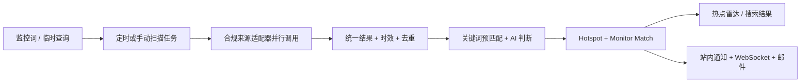

# 实时热点监控 MVP 功能基线设计

## 结论

HotKey 当前 MVP 收敛为一个清晰的关键词热点监控工具：用户配置监控词，系统定时或按需从多个来源发现新内容，完成去重、时效过滤和 AI 内容判断后形成热点卡片，并把新结果实时送到页面和邮件；用户也可以在 Web 工作台执行一次性多源搜索。

MVP 中的一条“热点”就是一篇文章、帖子、视频或榜单条目，不要求先把多篇内容聚类成现实世界事件。跨来源语义聚类、Claim/Evidence 图谱、Storyline、评论树、趋势预测和知识库都不是这条主链的前置条件。

本设计以用户于 2026-08-13 明确要求的 `liyupi/yupi-hot-monitor` 已支持能力为最低功能线，状态视为 `accepted`。参考的是固定提交 [`cd48b08`](https://github.com/liyupi/yupi-hot-monitor/tree/cd48b0885bfa8ae9c8043cf78ef6cfd045530bdb) 的实际源码，不把 README 宣传、未调用函数或缺陷当作已经实现的能力。

## 调研方法与事实边界

本次复核覆盖参考仓库的 README、需求说明、定时任务、来源服务、AI 服务、数据库模型、REST 接口、Socket 客户端和完整 Web 页面，并检查了公开截图。关键事实如下。

| 能力 | README/文档表述 | 固定提交中的实际实现 | HotKey 决策 |
|---|---|---|---|
| 监控词 | 配置、激活、暂停 | Web 支持新增、启停、删除；编辑只有 API | MVP 补齐 Web CRUD，历史热点不随监控删除 |
| 自动监控 | 实时、8+ 来源 | 固定每 30 分钟轮询；Web 主链实际调用 6 源 | 明确定义“轮询发现 + 实时送达”；首版主链对齐 6 类来源能力 |
| 查询扩展 | 提高搜索召回 | 扩展词只参与结果预匹配，来源仍只查询原词 | 扩展词必须真实参与支持查询的来源请求 |
| AI 分析 | 真假识别、相关性、重要性、摘要 | 单次 LLM 对标题/摘要分类，无原文交叉核验 | 保留用户价值，但称为“AI 内容质量判断”，不宣称事实核验 |
| 热点雷达 | 统计、卡片、筛选、排序 | 主体已接通；显示热度与排序热度公式不一致 | 作为 P0，热度由服务端单一公式生成 |
| 全网搜索 | 多源聚合搜索 | Web 只查 Twitter 与 Bing；AI 字段响应结构与前端不一致 | 作为 P0 修复为真实多源、统一 DTO 的即时搜索 |
| 实时通知 | WebSocket + 邮件 | 页面打开时 Socket.io 推送；高/紧急项发 SMTP 邮件 | 作为 P0；站内事实先持久化，断线后补拉 |
| 设置/日报 | 需求文档中出现 | KV API 与日报函数没有 Web 调用方 | 不纳入对标基线 |

参考证据：六项宣传能力见 [README 35–68 行](https://github.com/liyupi/yupi-hot-monitor/blob/cd48b0885bfa8ae9c8043cf78ef6cfd045530bdb/README.md#L35-L68)；Web 六源调用见 [hotspotChecker 76–108 行](https://github.com/liyupi/yupi-hot-monitor/blob/cd48b0885bfa8ae9c8043cf78ef6cfd045530bdb/server/src/jobs/hotspotChecker.ts#L76-L108)；30 分钟调度见 [index 69–78 行](https://github.com/liyupi/yupi-hot-monitor/blob/cd48b0885bfa8ae9c8043cf78ef6cfd045530bdb/server/src/index.ts#L69-L78)。

参考提交的关键运行参数也已逐项核对：

| 参数 | 实际值/行为 | 037 处理 |
|---|---|---|
| 自动周期 | 固定 30 分钟 | 保留为默认周期，交给现有持久任务执行器 |
| 新鲜度 | 有发布时间时只保留 7 天内；未知时间保留 | 保留该首版规则并显式标记未知时间 |
| 单 Monitor 处理上限 | Twitter 最多 15 条，其他来源合计最多 10 条 | 改为来源适配器的显式有界预算，不把所有非 X 来源挤进一个共享隐形配额 |
| X 搜索 | Top 近 7 天两页、Latest 近 3 天一页，排回复/转推 | 用 X 官方 API 实现同等“热门 + 最新”效果 |
| X 质量门槛 | 点赞≥10、转发≥5、浏览≥500、作者粉丝≥100，认证作者阈值减半，且四项必须同时满足 | 作为可测试的初始降噪参考，不把认证身份直接等同内容可信；阈值按官方指标可用性配置 |
| AI 门槛 | `isReal=true`、相关性≥50；未直接提词时相关性≥65 | 保留 50/65 相关性规则，把真假布尔改成可解释质量状态 |
| 邮件 | 仅 `high/urgent` | 保留 |
| 热点分页 | 每页 20 条 | 保留合理默认值，允许 API 限定范围内调整 |
| 热度排序 | `likes×10 + retweets×5 + log10(views)×2`，但页面另有公式 | 不复制分叉；服务端只维护一个含各来源可用指标的公式 |
| 通知面板 | 铃铛展示最近 5 条并支持全部已读 | 保留并增加跳转、断线补拉 |

对应源码见 [新鲜度与来源优先级](https://github.com/liyupi/yupi-hot-monitor/blob/cd48b0885bfa8ae9c8043cf78ef6cfd045530bdb/server/src/jobs/hotspotChecker.ts#L10-L38)、[处理配额](https://github.com/liyupi/yupi-hot-monitor/blob/cd48b0885bfa8ae9c8043cf78ef6cfd045530bdb/server/src/jobs/hotspotChecker.ts#L125-L136)、[X 过滤与检索](https://github.com/liyupi/yupi-hot-monitor/blob/cd48b0885bfa8ae9c8043cf78ef6cfd045530bdb/server/src/services/twitter.ts#L5-L207)、[服务端热度公式](https://github.com/liyupi/yupi-hot-monitor/blob/cd48b0885bfa8ae9c8043cf78ef6cfd045530bdb/server/src/utils/sortHotspots.ts#L24-L41) 和 [通知面板](https://github.com/liyupi/yupi-hot-monitor/blob/cd48b0885bfa8ae9c8043cf78ef6cfd045530bdb/client/src/App.tsx#L392-L439)。

固定提交的 Server 测试可运行，但 Server 与 Client 的生产构建各有已存在的 TypeScript 配置/未使用导入错误。它适合作为产品效果参考，不是可直接复制的生产实现。

## 用户最终看到的效果

### 1. 热点雷达

- 顶部展示总热点、今日新增、紧急热点和启用监控数。
- 下方是持续更新的热点流；新热点入库后，无需刷新即可出现在列表顶部。
- 卡片至少展示重要性、来源、命中监控词、AI 判断状态、热度、标题、AI 摘要、作者、互动指标、发布时间、发现时间和原文链接。
- 用户可展开 AI 判断理由和采集到的原始摘要/正文片段。
- 支持分页、组合筛选和服务端稳定排序。

### 2. 监控词

- 用户可以新增、编辑、暂停、恢复和删除监控词。
- 每个监控显示当前状态和累计命中数。
- 新增后可立即扫描，也可以等待定时扫描。
- 暂停只停止后续扫描，不删除历史；删除需确认，也不级联删除历史热点。

### 3. 即时搜索

- 用户输入临时查询，选择全部可用来源或指定来源，得到同一套热点卡片结果。
- 搜索复用监控链的来源适配、规范化、AI 分析和热度计算。
- 即时结果默认不写入监控历史、不创建通知、不改变监控词。
- 结果必须明确列出成功、失败和未配置的来源，不能把来源故障伪装成“0 条结果”。

### 4. 通知

- 通知入口只保留在顶栏右侧铃铛，不再作为一级菜单项。
- 铃铛显示未读数和最近通知，支持全部已读；点击通知可定位到对应热点。
- 页面在线时，新热点在持久化后实时送达；重连后通过 REST 补拉缺口。
- `high` 和 `urgent` 热点发送即时邮件；低/中等级不发邮件。
- MVP 不承诺网页关闭后的 Web Push，网页关闭时依靠邮件。

## MVP 功能范围

以下全部为 P0，不再拆成宏大平台能力：

1. 监控词完整 CRUD、启停和累计命中数。
2. 默认 30 分钟的自动扫描、手动立即扫描、扫描状态与重复触发保护。
3. 多来源并行发现、单来源失败隔离、来源结果/故障可见。
4. 查询扩展、规范化、时效过滤、确定性去重和 AI 内容质量判断。
5. 热点持久化、历史列表、统计、卡片、分页、筛选和排序。
6. 统一 DTO 的多源即时搜索。
7. 页面实时更新、持久站内通知、顶栏铃铛和高/紧急邮件。
8. 响应式桌面/移动工作台。

## 来源能力与合规实现

对标的是来源带来的用户效果，不是参考仓库采用的非官方抓取方式。HotKey 继续只允许官方 API、RSS/Atom 或明确授权 Feed；没有合法接入方式时必须显示 `unavailable`，不得用随机 User-Agent、伪造 Cookie、代理、登录态或反爬绕过来“补齐数量”。

| 参考能力 | Web 自动监控 | Web 即时搜索 | HotKey 合规实现 |
|---|---:|---:|---|
| X/Twitter 关键词内容 | 必须 | 必须 | X 官方 API；过滤回复/转发并读取官方互动指标 |
| Bing 类网页搜索 | 必须 | 必须 | Bing Grounding 或明确授权的搜索 API |
| Hacker News 最新内容 | 必须 | 必须 | HN 官方 API 获取最新/热门 item 后本地匹配；不抓 HTML |
| 授权中文网页发现 | 必须具备同类能力 | 必须具备同类能力 | 只使用已授权 Feed/API；没有搜狗授权时不使用“搜狗”名称 |
| Bilibili 视频/账号更新 | 必须 | 必须 | Bilibili 开放平台、已授权 webhook/Feed；不调用未文档化接口，不生成设备 Cookie |
| 微博热榜/关键词内容 | 必须 | 必须 | 微博开放平台或授权 Feed，并明确“热榜匹配”与“全文搜索”的能力差异 |
| Google 搜索 | 非自动主链要求 | 可用 | Google Agent Search 或授权搜索 API |
| DuckDuckGo | 非自动主链要求 | 可用 | 官方 Instant Answer 能力；UI 明确它不是完整网页搜索 |
| RSS/Atom | 可追加 | 可追加 | 标准 RSS/Atom，作为 HotKey 的额外合法来源 |

来源数量只按当前 Web 实际已配置且可用的能力统计。若某个来源未配置或未获得授权，产品必须展示真实状态，发布说明不能把它计入已接通数量。

## 最小技术架构

不复制参考项目的 Express/SQLite/Socket.io 文件结构，也不增加微服务、Kafka、图数据库或第二套事实链。继续使用 HotKey 的 Go 模块化单体、PostgreSQL、现有持久任务执行器、OpenAPI 生成客户端和现有 WebSocket/邮件设施。



### 逻辑数据契约

不预设必须新建同名表；实现应优先复用现有实体。无论底层命名如何，用户主链至少要表达以下事实：

| 逻辑对象 | 最小字段/关系 |
|---|---|
| Monitor | 所属用户、名称/查询、启用状态、默认来源、创建/更新时间 |
| Hotspot | 来源、外部 ID、规范 URL、标题、内容摘要、作者、发布时间、首次/最后发现时间、最新互动指标、热度 |
| MonitorMatch | Monitor 与 Hotspot 的多对多关系、命中词、相关性、理由、质量状态、重要性、AI 摘要 |
| Scan | 触发方式、开始/结束时间、`queued/running/succeeded/partial/failed`、各来源结果摘要 |
| Notification | 用户、Monitor、Hotspot、未读状态、创建时间和投递状态 |

同一外部内容可以命中多个 Monitor。Hotspot 只保存一份，MonitorMatch 分别保存各自的相关性和通知状态，避免参考项目 `(url, source)` 唯一后只归属第一个关键词的问题。[参考模型](https://github.com/liyupi/yupi-hot-monitor/blob/cd48b0885bfa8ae9c8043cf78ef6cfd045530bdb/server/prisma/schema.prisma#L23-L54)

实现采用“简单对象优先”原则：Go 领域/应用层使用无框架依赖的 struct，HTTP 与 TypeScript 只使用 OpenAPI 生成的扁平投影。不为同一事实再创建一组同义 DTO、包装对象或前端派生模型；旧 MicroEvent/Claim/Evidence 可作为历史事实保留，但不得继续渗入默认热点卡片、搜索或监控交互。新主链替代后，删除已无运行时调用方的页面、组件、端点、组装代码和测试，不用“可能以后需要”作为保留冗余代码的理由。

### 统一来源结果

每个来源适配器返回相同的最小结构：

```text
source_type, external_id, url, title, content,
published_at, captured_at,
author{name, username, avatar, followers, verified},
metrics{views, likes, reposts, replies, comments, quotes, source_score}
```

缺失字段保持为空，不伪造 `0` 或当前时间。每个适配器还必须返回 `success/empty/failed/unavailable` 和可安全展示的原因，使调度器能区分无结果与故障。

## 扫描算法

每次自动或手动扫描执行同一条有界流程：

1. 读取启用 Monitor 和它实际启用的来源。
2. 将原始查询编译为原词加 3–8 个受控别名/中英文/缩写；支持查询的来源真实使用这些变体，不只是给 LLM 看。
3. 以来源为隔离边界并行调用，设置超时、页数、结果数和上游配额；单源失败只把 Scan 标成 `partial`。
4. 规范化来源结构，丢弃明确超过 7 天的内容；无法取得发布时间时保留并标记未知。
5. 优先用 `source_type + external_id` 幂等；没有外部 ID 时使用规范 URL。去掉已知跟踪参数和 fragment，但不做语义聚类。
6. 对候选执行确定性关键词预匹配和结构化 AI 分析。
7. 相关性低于 50 的候选默认拒绝；未直接提词且相关性低于 65 的候选默认拒绝。阈值作为首版明确规则保存，不隐藏在 Prompt 中。
8. 事务内 upsert Hotspot、MonitorMatch 和 UserNotification；重复命中更新 `last_seen_at` 与最新互动指标，不重复通知。
9. 提交成功后发送页面实时事件；`high/urgent` 另行排队发送邮件。
10. 保存扫描完成/部分完成/失败摘要，页面立即刷新统计与来源状态。

参考项目的流程和阈值见 [hotspotChecker 119–235 行](https://github.com/liyupi/yupi-hot-monitor/blob/cd48b0885bfa8ae9c8043cf78ef6cfd045530bdb/server/src/jobs/hotspotChecker.ts#L119-L235)。HotKey 只采用可解释的产品规则，不采用同步长请求、非事务通知或命中后永不刷新指标的实现。

## AI 判断语义

AI 返回固定结构：

```text
quality_state: credible | suspicious | unavailable
relevance: 0..100
relevance_reason: string
keyword_mentioned: boolean
importance: low | medium | high | urgent
summary: string
```

- `credible` 只表示模型认为内容不像垃圾、标题党或明显伪造，不等于事实已经证实。
- `suspicious` 默认不进入普通热点流，但可通过质量筛选查看，避免“可疑”筛选永远无数据。
- `unavailable` 表示模型未配置、超时或解析失败；不能回填为“真实”。确定性直接命中的内容可保存为未分析，但不发送高优先级邮件。
- 结构化输出必须做 Schema 校验、长度限制和一次有界重试；失败后明确降级。
- 模型和 Prompt 是服务端配置，不由通用字符串 KV 或前端任意覆盖。

参考项目的实际 Prompt 和回退见 [ai.ts 116–218 行](https://github.com/liyupi/yupi-hot-monitor/blob/cd48b0885bfa8ae9c8043cf78ef6cfd045530bdb/server/src/services/ai.ts#L116-L218)。

## 热度、筛选与排序

热度是便于排序的相对指标，不是跨平台绝对影响力。服务端维护唯一 `heat_score`，列表排序和卡片展示都使用该值。首版将可用的点赞、转发、评论、回复、引用、浏览和来源原生分数映射为一个确定性对数分数；缺失指标不伪造。具体权重必须由一个服务端函数和对应测试维护，前端不得再实现第二套公式。

热点列表至少支持：

- 筛选：来源、重要性、Monitor、时间范围、AI 质量状态。
- 排序：最新发现、最新发布、重要性、相关性、热度。
- 分页：由数据库完成筛选和稳定排序；不能先全量载入内存再分页。

参考实现的控件见 [FilterSortBar 36–76 行](https://github.com/liyupi/yupi-hot-monitor/blob/cd48b0885bfa8ae9c8043cf78ef6cfd045530bdb/client/src/components/FilterSortBar.tsx#L36-L76)，其内存热度分页不作为 HotKey 实现参考。

## 即时搜索契约

即时搜索和定时监控共享来源、AI 及统一结果 DTO，但行为不同：

| 行为 | 定时/手动监控扫描 | 即时搜索 |
|---|---:|---:|
| 读取已启用 Monitor | 是 | 否，使用临时 query |
| 持久化 Hotspot/Match | 是 | 默认否 |
| 创建通知/邮件 | 是 | 否 |
| 返回各来源状态 | 是 | 是 |
| 使用同一热点卡片 DTO | 是 | 是 |

参考项目把 AI 结果嵌套在 `analysis`，前端却按顶层 Hotspot 读取，见 [后端响应](https://github.com/liyupi/yupi-hot-monitor/blob/cd48b0885bfa8ae9c8043cf78ef6cfd045530bdb/server/src/routes/hotspots.ts#L222-L234) 与 [前端假设](https://github.com/liyupi/yupi-hot-monitor/blob/cd48b0885bfa8ae9c8043cf78ef6cfd045530bdb/client/src/services/api.ts#L132-L140)。HotKey 的 OpenAPI 必须只有一个明确 DTO，生成客户端后才实现页面。

## 实时语义

“实时监控”拆成两个可以验收的时延：

- 发现时延：来源采用轮询时，默认每 30 分钟扫描一次；管理员可在来源配额允许的范围选择已支持周期。手动扫描立即入队。MVP 不承诺来源级流式数据。
- 送达时延：Hotspot 和 Notification 提交后，在线页面应在 2 秒内收到实时事件；离线期间的缺口在重连后通过持久通知补拉。

WebSocket 只是传输通道，PostgreSQL 中的 Notification 才是事实。邮件失败不得回滚热点；投递应有幂等和有界重试。

## 失败与降级

- 无启用 Monitor：扫描成功结束并返回 `0`，不是错误。
- 单来源超时/限流/未授权：扫描为 `partial`，其他来源继续；UI 展示该来源状态。
- 全来源失败：扫描为 `failed`，不生成空的成功通知。
- AI 不可用：保存明确的 `unavailable`，不伪装为可信；允许用户查看直接命中的未分析内容。
- WebSocket 断线：指数退避重连并重新订阅；REST 补拉期间不重复展示。
- SMTP 失败：热点和站内通知保持成功，邮件任务独立重试并记录最终状态。
- 同一内容重复发现：更新最后发现时间和最新指标，不重复创建同一 Monitor 的通知；命中另一个 Monitor 时新增对应 Match 和通知。

## 明确不做

- 跨文档事件聚类、MicroEvent/Storyline 产品面、Claim/Evidence 图谱和自动事实核验。
- 评论/回复正文、评论树、浏览器自动化采集和通用爬虫平台。
- Kafka、微服务、图数据库、独立向量库、第二套任务系统或第二套热点事实表。
- 日报/周报 Web 页面、知识库、自动发帖、社媒运营和通用设置中心。
- Web Push、系统通知、离线浏览器推送；MVP 离线告警只承诺邮件。
- 复刻参考项目的赛博朋克视觉、Express/SQLite 技术栈、随机 User-Agent、伪造 Cookie 或第三方未授权接口。

已有认证、用户隔离、来源权利、审计和部署安全不能因为参考项目没有这些功能而删除，但本需求不新增一套用户或权限系统。

## 不能照搬的参考缺陷

1. Web 主链只有 6 源，却在筛选器和 README 展示 8+ 源。
2. 扩展词没有进入来源查询，无法提高召回。
3. 同一 URL 只能归属第一个关键词。
4. 已存在热点不刷新互动指标，热度无法变化。
5. 手动搜索只查两源，响应 DTO 与页面读取不一致。
6. 可疑内容入库前被全部丢弃，真实性筛选成为空控件。
7. 扫描任务在 HTTP 请求内同步等待，cron 与手动扫描可重叠。
8. 热点与通知非事务，通知可能永久丢失。
9. Socket 断线后不保证重订阅或补拉。
10. 通知广播没有用户隔离，所有管理接口无鉴权。
11. 页面热度和后端排序使用两套公式，且在内存中全量排序。
12. 未接线的设置、日报、Google/DDG 函数被误写成可用能力。

## 验收边界

实现完成前不创建 037 Acceptance，也不得把本 Design 的目标描述成当前已实现。最低验收必须证明：

- Web 主链的六类来源能力均通过真实合规适配器或被明确标记为不可用，宣传数字与实际一致。
- 从“新增 Monitor”到“自动/手动扫描—热点卡片—铃铛通知—高优先级邮件”的纵向链路可重复运行。
- 即时搜索是真实多源且使用统一 DTO。
- 同一内容可以命中多个 Monitor，但同一 Monitor 不重复通知。
- 页面在线送达、断线补拉、单来源失败、AI/SMTP 降级均有自动化证据。
- 390px 与桌面视口都能完成核心流程，顶栏铃铛是唯一通知导航入口。
