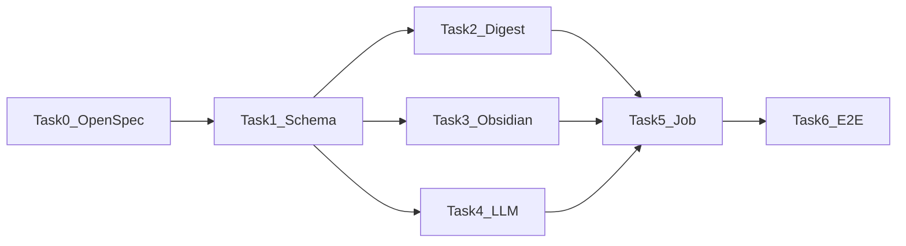

# Daily Digest Obsidian Knowledge Base Implementation Plan

> **For agentic workers:** REQUIRED SUB-SKILL: Use superpowers:subagent-driven-development (recommended) or superpowers:executing-plans to implement this plan task-by-task. Steps use checkbox (`- [ ]`) syntax for tracking.

**Goal:** 将每个关键词监控下的热点按北京时间自然日沉淀为 LLM 摘要 Markdown，写入 Obsidian 同步目录，供 Dataview 聚合。

**Architecture:** `digest` 筛选主题 → `llm` 生成摘要 → `obsidian` 渲染写盘；`topic_daily_exports` 保证幂等；`daily_scheduler` + `publish_daily_topics` 每日触发。

**Tech Stack:** Go, PostgreSQL, OpenAI-compatible LLM API, YAML frontmatter, table-driven tests

**Linear Epic:** [STE-301](https://linear.app/stephenqiu/issue/STE-301)

---

### Task 0: OpenSpec 与设计文档门禁（STE-302）

**Files:**
- Create: `openspec/changes/2026-06-14-daily-obsidian-digest/proposal.md`
- Create: `openspec/changes/2026-06-14-daily-obsidian-digest/specs/daily-digest/spec.md`
- Create: `openspec/changes/2026-06-14-daily-obsidian-digest/design.md`
- Create: `openspec/changes/2026-06-14-daily-obsidian-digest/tasks.md`
- Exists: `docs/design/004-热点日报Obsidian知识库设计.md`
- Exists: `docs/superpowers/specs/2026-06-14-daily-obsidian-design.md`

- [ ] **Step 1:** 编写 proposal — 范围、非目标、与 001 LLM 扩展说明
- [ ] **Step 2:** 编写 daily-digest spec — 入选规则、frontmatter 契约、失败路径
- [ ] **Step 3:** 编写 design.md — 模块图、表结构、配置项
- [ ] **Step 4:** 编写 tasks.md — 与本文 Task 1–6 对齐

**Validation:** OpenSpec artifacts 完整，无 TBD；与 004 设计一致

---

### Task 1: 数据模型与配置（STE-303）

**Files:**
- Modify: `db/schema.sql`
- Create: `db/migrations/001_topic_daily_exports.sql`（或项目既有 migration 约定路径）
- Modify: `db/queries.sql`
- Modify: `internal/config/config.go`
- Modify: `.env.example`
- Create: `internal/database/digestrepo.go`
- Create: `internal/database/digestrepo_test.go`

- [ ] **Step 1: 写 exports 表迁移**

```sql
create table topic_daily_exports (
  id bigserial primary key,
  monitor_id bigint not null references keyword_monitors(id),
  topic_id bigint not null references topics(id),
  export_date date not null,
  summary_text text not null default '',
  markdown_path text not null default '',
  status text not null default 'pending',
  error_message text not null default '',
  published_at timestamptz,
  created_at timestamptz not null default now(),
  unique(monitor_id, topic_id, export_date)
);
```

- [ ] **Step 2: 写 config 字段测试**

```go
func TestLoad_DailyDigestConfigDefaults(t *testing.T) {
    t.Setenv("DATABASE_URL", "postgres://localhost/hotkey")
    t.Setenv("JWT_SECRET", "test")
    t.Setenv("OBSIDIAN_VAULT_PATH", "/tmp/vault")
    cfg, err := config.Load()
    if err != nil { t.Fatal(err) }
    if cfg.DailyDigestTime != "08:00" { t.Fatalf("got %s", cfg.DailyDigestTime) }
}
```

- [ ] **Step 3: 运行失败测试**

Run: `go test ./internal/config -run TestLoad_DailyDigestConfigDefaults -v`
Expected: FAIL

- [ ] **Step 4: 扩展 Config 结构体与环境变量绑定**

新增：`ObsidianVaultPath`, `DailyDigestTime`, `DailyDigestTimezone`, `DailyDigestTarget`, `DailyDigestTopN`, `LLMProvider`, `LLMAPIKey`, `LLMBaseURL`, `LLMModel`

- [ ] **Step 5: 实现 DigestRepo Upsert/GetByTopicDate**

- [ ] **Step 6: 验证**

Run: `make schema && go test ./internal/config ./internal/database -run Digest -v`
Expected: PASS

---

### Task 2: digest 模块 — 自然日窗口与主题筛选（STE-304）

**Files:**
- Create: `internal/digest/window.go`
- Create: `internal/digest/window_test.go`
- Create: `internal/digest/selector.go`
- Create: `internal/digest/selector_test.go`
- Create: `internal/digest/service.go`
- Create: `internal/database/digestquery.go`

- [ ] **Step 1: 写 CST 边界测试**

```go
func TestDayWindow_CSTBoundary(t *testing.T) {
    start, end := DayWindow(time.Date(2026, 6, 14, 12, 0, 0, 0, time.UTC), "Asia/Shanghai")
    // 2026-06-14 00:00 CST = 2026-06-13 16:00 UTC
    wantStart := time.Date(2026, 6, 13, 16, 0, 0, 0, time.UTC)
    if !start.Equal(wantStart) { t.Fatalf("start=%v want=%v", start, wantStart) }
    _ = end
}
```

- [ ] **Step 2: 运行失败测试**

Run: `go test ./internal/digest -run TestDayWindow_CSTBoundary -v`
Expected: FAIL

- [ ] **Step 3: 实现 DayWindow / ResolveExportDate**

`ResolveExportDate(now, target)` → `yesterday|today` 的 CST date

- [ ] **Step 4: 写主题筛选测试** — mock repo 返回 hits/posts，验证 Top N 与活跃过滤

- [ ] **Step 5: 实现 ListTopicsForDay(monitorID, exportDate)`** — JOIN topics, topic_posts, monitor_post_hits, platform_posts

- [ ] **Step 6: 实现 FetchRepresentativePosts(topicID, limit=3)**

- [ ] **Step 7: 验证**

Run: `go test ./internal/digest -v`
Expected: PASS

---

### Task 3: obsidian 模块 — Markdown 渲染与原子写盘（STE-305）

**Files:**
- Create: `internal/obsidian/slug.go`
- Create: `internal/obsidian/slug_test.go`
- Create: `internal/obsidian/render.go`
- Create: `internal/obsidian/render_test.go`
- Create: `internal/obsidian/writer.go`
- Create: `internal/obsidian/writer_test.go`

- [ ] **Step 1: 写 slug 安全测试**

```go
func TestSlugify_RemovesSpecialChars(t *testing.T) {
    got := Slugify("AI 监管/政策!")
    if got != "ai-监管-政策" { t.Fatalf("got %q", got) }
}
```

- [ ] **Step 2: 写 frontmatter 渲染测试** — 断言 `type`, `date`, `monitor_id`, `tags` 存在

- [ ] **Step 3: 写原子写盘测试** — temp dir，`WriteAtomic` 后无 `.tmp` 残留

- [ ] **Step 4: 实现 RenderTopicNote(in RenderInput) string**

- [ ] **Step 5: 实现 BuildPath(vaultRoot, monitorSlug, filename) string**

- [ ] **Step 6: 实现 WriteAtomic(path, content) error** — write `.tmp` then `rename`

- [ ] **Step 7: 验证**

Run: `go test ./internal/obsidian -v`
Expected: PASS

---

### Task 4: LLM 摘要模块（STE-306）

**Files:**
- Create: `internal/llm/client.go`
- Create: `internal/llm/openai.go`
- Create: `internal/llm/openai_test.go`
- Create: `internal/llm/mock.go`
- Create: `internal/llm/prompt.go`

- [ ] **Step 1: 定义 Client 接口与 TopicSummaryInput**

- [ ] **Step 2: 写 mock client 测试** — 返回固定摘要，验证 prompt 输入截断

- [ ] **Step 3: 实现 MockClient 与 PromptBuilder**

- [ ] **Step 4: 实现 OpenAI 兼容 HTTP client** — `SummarizeTopic` POST `/chat/completions`

- [ ] **Step 5: 写 httptest 覆盖** — mock 200 response

- [ ] **Step 6: 验证**

Run: `go test ./internal/llm -v`
Expected: PASS

---

### Task 5: 发布 Job 与调度（STE-307）

**Files:**
- Create: `internal/jobs/daily_scheduler.go`
- Create: `internal/jobs/daily_scheduler_test.go`
- Create: `internal/jobs/publish_daily_topics.go`
- Create: `internal/jobs/publish_daily_topics_test.go`
- Modify: `internal/app/worker_jobs.go`

- [ ] **Step 1: 写 scheduler gate 测试** — 08:00 前不触发；08:00 后触发一次；同日不重复

- [ ] **Step 2: 实现 DailyScheduler.ShouldRun(now, lastRunDate) bool**

- [ ] **Step 3: 写 publish job 集成测试** — fake digest/llm/repo + temp vault dir

- [ ] **Step 4: 实现 PublishDailyTopicsJob.Run(ctx)`**

流程：
1. 遍历 active monitor IDs
2. `exportDate = ResolveExportDate(now, cfg.DailyDigestTarget)`
3. `topics = digest.ListTopicsForDay(...)`
4. 对每个 topic：LLM 摘要 → upsert exports → render → WriteAtomic → update status=published → 回写 topics.summary

- [ ] **Step 5: 注册到 worker_jobs.go** — interval 1min，内部 scheduler gate

- [ ] **Step 6: 验证**

Run: `go test ./internal/jobs -run 'Daily|Publish' -v`
Expected: PASS

---

### Task 6: 端到端测试与文档验收（STE-308）

**Files:**
- Create: `tests/integration/daily_digest_test.go`（或 `internal/jobs` 集成测试）
- Exists: `docs/obsidian/dataview-examples.md`

- [ ] **Step 1: 写幂等测试** — 同 topic+date 执行两次，文件数不变、内容更新

- [ ] **Step 2: 写 LLM 失败隔离测试** — 一个 topic 失败，其他仍 published

- [ ] **Step 3: 写 Vault 权限失败测试** — exports status=failed

- [ ] **Step 4: 全量验证**

```bash
make test
make lint
make validate
```

- [ ] **Step 5: 手工验收清单**
  - 配置 `OBSIDIAN_VAULT_PATH` 指向同步目录
  - 触发 job（或等待 08:00 CST）
  - Obsidian 打开 Vault，运行 Dataview 昨日热点查询
  - 确认 frontmatter 字段可筛选

**RAG 证据记录：**
- 红灯命令 + 失败信号
- 绿灯命令 + 通过结果

---

## 任务依赖顺序



## Linear Issue 映射

| Task | Issue | 标题 |
|------|-------|------|
| Epic | STE-301 | 热点日报 Obsidian 知识库 MVP |
| Task 0 | STE-302 | OpenSpec + 设计文档门禁 |
| Task 1 | STE-303 | topic_daily_exports 与配置扩展 |
| Task 2 | STE-304 | digest 自然日窗口与主题筛选 |
| Task 3 | STE-305 | obsidian Markdown 渲染与写盘 |
| Task 4 | STE-306 | LLM 摘要模块 |
| Task 5 | STE-307 | publish_daily_topics Job + 调度 |
| Task 6 | STE-308 | 端到端测试与验收 |

## 风险与不做事项

- 不做 Web 配置页（后续 Epic）
- 不做多用户 Vault 路径
- 不修改 Jaccard 聚类
- 不依赖 snapshot 表持久化（MVP 用 hits/posts 时间筛选）
