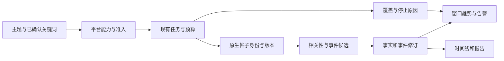

# 02 关键词热点事件监测：平台、竞品与复用调研

核查日期：2026-10-10。本文维护平台、竞品与开源复用的调研依据；已采纳的关键词采集、热点事件识别和持续监测要求见 [产品定位](00-产品定位.md) 与 [功能需求](../index.md#需求目录)，阶段依赖见 [执行计划](../plan/00-产品目标与边界.md)，实际进度只在仓库根目录 BACKLOG。候选方案与价格/权限是核查时证据，接入前需复核，不据此登记成已接通能力。

## 结论与产品定位

建议把 Ripplesight 的核心收敛为：**用户配置主题和关键词，系统持续发现相关公开讨论，将材料组织为可追溯的事件，并在出现新事实或异常增长时提醒。**

最重要的交付物是可靠的关键词发现和事件更新。日报、情感、榜单和公开阅读服务于这条路径，不能替代它。当前最关键的风险是来源准入、查询覆盖和持续运行；继续增加页面或分析 Agent 不能解决这些问题。

需要分清四种能力：

| 能力 | 回答的问题 | 无法据此证明的能力 |
|---|---|---|
| 平台关键词检索 | 平台搜索能返回哪些命中帖子？ | 不能默认代表全平台穷尽或全部评论 |
| 热榜、标签和账号订阅 | 榜单、指定标签或账号里有什么？ | 不等于任意关键词检索 |
| 事件发现与追踪 | 哪些材料描述同一件事？有什么新进展？ | 不能只按标题相似度确认事件 |
| 模型联网研究 | 模型能检索并解释哪些证据？ | 不等于可分页、可回补、覆盖可核查的采集流 |

本轮明确涉及 X、Instagram 和 OpenRouter；用户已确认 OpenRouter 指模型服务。本报告将 X、Instagram 作为社交内容来源，将 OpenRouter 作为模型与辅助搜索服务评估；Reddit 仅为补充调研候选，不是用户明确指定的目标。当前没有充分证据证明存在同时满足**零第三方费用、X 与 Instagram 任意正文关键词、长期稳定和完整覆盖**的通用方案。应先选择成本与覆盖边界，再承诺产品能力。

## 调研方法与证据边界

- 使用 pm-market-research 的 competitor-analysis 方法，比较五个商业产品的目标用户、主要能力、价格和与本项目的适配性。
- 使用 GitHub 插件查询候选仓库、读取 README 与实际 LICENSE，并检查 twscrape、Instaloader 的问题报告；不以 Star 数或 README 宣传作为可用性证明。
- 使用 Firecrawl 检索和读取平台官方文档、竞品官方产品及价格页；一次搜索连接中断后重试成功。X 的两页 Firecrawl 读取返回错误，改用网页工具读取官方原文。
- 使用 Context7 的官方文档索引核对 X、Instagram、OpenRouter 接口能力，再用当前官方页面核对影响结论的价格和限制。
- 对本地 main 分支进行只读源码检查，起点提交为 `b8795786`。未读取凭据、未调用社交数据采集接口、未调用模型推理接口、未进行真实送达或持续运行验收。

文中“官方文档说明”“上游项目宣称”“源码存在”“建议验收”是不同证据层级。下列商业产品的覆盖量、速度和功能属于厂商说明，本轮没有采购或独立实测。未核实可比的市场规模、份额、融资与留存数据，因此不提供这些数字。

## 平台可行性与优先级

### X：功能适配度高，现行零费用边界阻止官方接入

官方 Search Posts 支持关键词、短语、标签、账号和语言等查询。Recent Search 覆盖最近七天，支持分页；Filtered Stream 用规则匹配近实时帖子。搜索与流式采集是不同接入方式，账户准入、端点限额、断线恢复仍需逐项核对。[搜索文档](https://docs.x.com/x-api/posts/search/introduction)、[Filtered Stream](https://docs.x.com/x-api/posts/filtered-stream/introduction)。

当前官方价格页列出第三方帖子读取 **0.005 美元/资源**，用户读取 **0.010 美元/资源**。计费单位是返回资源，不是搜索请求；同一 UTC 日去重属于软保证，不能作为预算上限依据。[官方价格](https://docs.x.com/x-api/getting-started/pricing)。

仅作成本情景计算：每天返回 1,000 个需计费帖子、连续 30 天，帖子读取约 `1,000 × 30 × $0.005 = $150/月`。不含用户信息、跨日重读、其他端点和模型费用；这不是对实际用量的预测，也没有触发付费调用。

**判断：** 如果海外关键词是首要目标，X 值得作为第一个目标平台，但必须先解决官方路径费用边界。若继续零费用，只能研究当前编号需求 允许的公开趋势或本人账号有限试点，不能承诺其具备官方搜索的稳定性与覆盖，也不能把代理、换账号或绕过风控当作恢复方案。

### Instagram：先确认“标签监测”是否满足需求

Meta 的 Hashtag Search 查找带指定标签的公开媒体，使用 Business/Creator 账号，要求 App Review、Instagram Public Content Access 与相应权限；当前限制为每账号滚动七天最多 30 个不同标签，获取已有标签的媒体也计入标签限额。Stories 的标签不在支持范围。[官方 Hashtag Search](https://developers.facebook.com/documentation/instagram-platform/instagram-api-with-facebook-login/hashtag-search)。

这不能等同于“任意正文包含关键词的所有公开帖子”。账号媒体、标签媒体、提及、自有媒体评论的权限边界不同，不能因某端点支持评论管理，就推导出所有搜索结果的评论均可读取。标签结果中某些字段也可能缺失，例如隐藏点赞数时 `like_count` 不返回。[Top Media 字段与限制](https://developers.facebook.com/documentation/instagram-platform/instagram-graph-api/reference/ig-hashtag/top-media)。

**判断：** 将其定义为“指定标签/账号的有限监测”才具有清晰验收对象。若必须支持任意正文关键词，现有官方资料不足以满足承诺，应先保留为可行性缺口，不能用 Instaloader 或通用网页抓取的功能列表填补。Instagram 目前仍在本项目冻结范围，本轮研究不代表已启用。

### OpenRouter：能辅助 X 研究，但不能视作另一个社交平台

OpenRouter 是模型接入和路由服务。当前 Web Search server tool 文档支持在特定 SpaceXAI 模型的 native search 中显式开启 `x_search`，可设置账号和日期过滤。因此，“OpenRouter 完全不能搜 X”并不准确。[当前搜索工具文档](https://openrouter.ai/docs/guides/features/server-tools/web-search)。

同一文档说明 X Search 已按返回帖子/用户资源计费，另外还有模型推理成本。工具处于 Beta；默认网页搜索并不自动开启 X Search。文档没有给予穷尽帖子、稳定游标、完整评论、历史连续回补或删除同步的保证。

**判断：** 可作为未来按需研究、线索补充和解释入口；不能单独承担本系统的持续采集、覆盖统计和热点计量。按当前编号需求，只使用本机 Codex app-server，OpenRouter 云端模型和收费搜索均不应启用。若用户想监测的是 OpenRouter 的模型发布信息，则应另定义其官方公告/目录为资讯源，而不是社交帖子源。

### 其他平台：按用途补充，不自动扩大实施范围

| 平台/来源 | 已找到的可行依据 | 关键限制 | 建议 |
|---|---|---|---|
| Hacker News | Algolia HN Search 支持全文、时间筛选、分页和评论树；本项目已有适配器 | 技术社区样本，不能代表主流社媒舆情；Algolia 搜索与 Firebase 官方数据接口不同 | 优先复用，适合较低接入门槛的海外对照实验 |
| YouTube | 官方 Data API 有搜索及配额规则 | 当前文档为 search.list 独立默认每日 100 次、每次 1 配额，额外分页另计；其他端点另有日配额。不要沿用旧的“搜索每次 100 units”说法 | 视频讨论确有价值时再评估，按控制台实际配额做预算 |
| Bluesky | 官方 searchPosts Lexicon 定义 q、latest/top、时间和游标 | 查询语法依实现而定；游标不保证遍历全部结果；hitsTotal 可被截断；部分服务可能要求认证 | 海外候选，不承诺完整覆盖，不替代用户指定的 X/Instagram |
| Reddit | 官方政策要求 API 访问先获明确批准 | SDK、OAuth 或个人非商业用途均不等于自动准入；商业及模型训练等用途另受限制 | 仅为补充候选，保持获批前不请求，不列入本轮明确目标 |
| B 站及国内来源 | 现有 B 站关键词/评论适配器与国内 POC 计划 | 小样本、根评论、回复、增量与自然运行分别验收 | 零费用边界下，继续验证已有最小闭环，避免先重写采集系统 |
| RSS、新闻搜索、公开网页 | 已有 RSS、SearXNG 和网页来源基础 | 搜索引擎索引的可见性与延迟不等于平台搜索；热榜过滤会漏掉未上榜事件 | 补充事件背景与交叉证据，结果注明发现路径 |

来源：[HN Search API](https://hn.algolia.com/api)、[YouTube 当前配额](https://developers.google.com/youtube/v3/determine_quota_cost)、[Bluesky 官方 Lexicon](https://github.com/bluesky-social/atproto/blob/main/lexicons/app/bsky/feed/searchPosts.json)、[Reddit Responsible Builder Policy](https://support.reddithelp.com/hc/en-us/articles/42728983564564-Responsible-Builder-Policy)。YouTube 页面本轮读取显示更新于 2026-10-08；配额最终以接入账户控制台为准。

## 市场与五个直接竞品

市场主要分为品牌声誉/危机监测、消费者洞察、媒体公关和个人情报阅读。当前 Ripplesight 面向个人非商业使用，最接近“个人主题情报与事件追踪”。商业社交聆听产品可作能力标杆，企业协作、广告衡量和 CRM 集成不适合直接进入当前 MVP。

| 产品与主要用户 | 官方能力与优势 | 官方价格/销售方式 | 对 Ripplesight 的启示与适配缺口 |
|---|---|---|---|
| Brand24：个人品牌、小团队、代理机构 | 关键词提及、情感、告警；较高套餐有事件检测和主题分析 | Individual 月付 $249；年付折算 $199/月，3 关键词、2K mentions/月、12 小时更新。Team 年付折算 $299/月、小时更新 | 学习可解释的关键词配额和更新间隔；入门套餐并非实时，也不符合零供应商费用 |
| Mention：组织级媒体与品牌监测 | Boolean、社交与网页提及、趋势、竞品比较、告警 | 当前价格页引导 Company 演示；抓取结果金额缺失，不能给出已核实起价。历史数据和 API 为附加项 | 学习查询构建和提醒；历史/接口权限需单独核查，不照搬旧博客价格 |
| Brandwatch Consumer Research：消费者研究团队 | 历史材料、图像分析、自定义分类器、AI 洞察 | Custom plans，演示/销售驱动 | 学习材料分类与历史对比；企业研究工作流和采购模式超出个人 MVP |
| Talkwalker：品牌、公关及危机团队 | 异常告警、conversation clusters、传播分析、视觉识别 | 选方案后 custom quote | 学习增长异常与传播解释；本文不把厂商覆盖声明作为本项目的接入许可或效果证明 |
| Meltwater：市场与传播团队 | 社交和媒体监测、事件/情感异常、告警及报告 | 按目标、模块和规模定制报价 | 学习“新变化→通知→证据”流程；广覆盖企业套件不适合作为零费用运行依赖 |

对应官方页面：[Brand24 价格与功能](https://brand24.com/prices/)、[Mention 价格与功能](https://mention.com/en/pricing/)、[Brandwatch 产品](https://www.brandwatch.com/products/consumer-research/)与[方案](https://www.brandwatch.com/plans/)、[Talkwalker 产品](https://www.talkwalker.com/social-media-listening)与[价格](https://www.talkwalker.com/pricing)、[Meltwater 产品](https://www.meltwater.com/en/products/social-media-monitoring)与[价格](https://www.meltwater.com/en/pricing)。

表中的“缺口”是相对本项目约束的适配判断，不是经过客户访谈证实的竞品缺陷。没有采购测试，不判断其真实召回率、准确率、送达率或客户满意度。

**差异化建议：** 围绕少量高价值主题，提供中文可读的事件时间线、逐条来源证据、跨平台材料关联、明确的采集缺口和可控预算。AI 摘要与情感分析已经是竞品常见能力，不宜作为唯一差异化。长期威胁是平台准入和数据价格变化，以及商业产品继续向低门槛 AI 研究延伸；优先投资适配器可替换性和历史证据可复核性。

## GitHub 复用候选与许可证核对

下表核对了实际 LICENSE。功能描述来自上游文档，不表示已安装、运行或验证。所有复用还需遵守当前编号需求：MIT 按许可改编并署名，GPL/AGPL 仅参考设计或独立运行；后者是本项目选定的复用边界，不是对许可证法律后果的完整解释。

| 项目 | 可借鉴或复用内容 | 本轮 LICENSE | 推荐程度与边界 |
|---|---|---|---|
| [TrendRadar](https://github.com/sansan0/TrendRadar) | 热榜/RSS 聚合、关键词筛选、增量推送和趋势呈现 | [GPL v3](https://github.com/sansan0/TrendRadar/blob/master/LICENSE) | 高：参考产品流程或隔离评估。热榜筛选不能代替平台任意关键词召回；其上游数据服务也是运行依赖 |
| [BettaFish](https://github.com/666ghj/BettaFish) | 研究分工、证据汇总、报告结构 | [GPL v2](https://github.com/666ghj/BettaFish/blob/main/LICENSE) | 中：适合研究报告参考。README 的广覆盖及多 Agent 宣称不代表持续采集已获准入；不要整套迁入替代现有任务链 |
| [RSSHub](https://github.com/DIYgod/RSSHub) | 已有路由的 RSS 标准化 | [AGPL v3](https://github.com/DIYgod/RSSHub/blob/master/LICENSE) | 高：延续本机独立实例与逐路由准入。当前上游不是可不经核对就称为 MIT 的组件；有路由不等于有搜索、评论和持续覆盖 |
| [MediaCrawler](https://github.com/NanmiCoder/MediaCrawler) | 国内平台搜索、作品和评论的采集参考；本地已存在 B 站适配 | [NON-COMMERCIAL LEARNING LICENSE 1.1](https://github.com/NanmiCoder/MediaCrawler/blob/main/LICENSE) | 有条件：仅在许可与学习研究边界内评估。不能笼统称为 MIT/商业可用，也不能把个人非商业自动等同于所有用途获准 |
| [twscrape](https://github.com/vladkens/twscrape) | X Search/GraphQL 返回解析、对象字段与分页研究 | [MIT](https://github.com/vladkens/twscrape/blob/main/LICENSE) | 有条件：代码许可适合研究，但其账号池轮换、代理、SQLite 会话和等待行为与本项目约束不一致；不建议原样接入 |
| [Instaloader](https://github.com/instaloader/instaloader) | Instagram 账号/标签材料、评论与更新迭代参考 | [MIT](https://github.com/instaloader/instaloader/blob/master/LICENSE) | 低：不能解决任意正文关键词发现；登录和上游变化另有风险，当前 Instagram 冻结范围内不实施 |
| [SearXNG](https://github.com/searxng/searxng) | 新闻/网页元搜索，本项目已有适配基础 | [AGPL v3](https://github.com/searxng/searxng/blob/master/LICENSE) | 高：本机独立运行、保留实际引擎和失败状态；不可承诺覆盖社媒站内搜索 |
| [BERTopic](https://github.com/MaartenGr/BERTopic) | 多语言主题建模、离线聚类对照 | [MIT](https://github.com/MaartenGr/BERTopic/blob/master/LICENSE) | 中低：有误聚类评测数据后再比较。主题簇与同一具体事件不同，不能替代事件事实校验；模型权重许可和本机资源另核对 |

TrendRadar 的当前[官方介绍](https://trendradar.sandev.cc/zh/)明确以热榜和 RSS 采集、筛选与推送组织流程；这说明它适合作为热点聚合参考，而不是已经证明任意社媒关键词覆盖的替代品。

维护风险还应看具体问题而非热度：twscrape 有[搜索限流处理问题报告](https://github.com/vladkens/twscrape/issues/351)；Instaloader 有[429 问题报告](https://github.com/instaloader/instaloader/issues/2750)。这些是用户报告，不能推导总体失败率，但足以要求试点单独验证异常停止、空结果识别和人工恢复。**代码许可证允许复用，不等于平台数据获取、保存或再分发权限已获批准。**

## 当前项目需求与实现核对

现行 [产品定位](00-产品定位.md) 与 [Plan](../plan/00-产品目标与边界.md) 已按“关键词采集 → 热点事件识别 → 持续监测”排列核心要求，首个平台从已准入免费来源中选择，优先复用 B 站/HN 路径；X、Instagram 保留目标并单列接入条件，OpenRouter 按模型服务评估。下表是源码核对依据，具体目标合同和缺口维护在 [Requirement](../index.md#核心功能需求)，不能将代码存在视作真实验收。

| 能力 | 当前 owning source | 源码可以支持的判断 | 本轮不能证明或仍需补齐 |
|---|---|---|---|
| 主题与关键词 | [monitors/schemas.py](../../backend/app/monitors/schemas.py)、[services.py](../../backend/app/monitors/services.py) | 已有 match_any、match_all、exclude，规则规范化和本地命中解释；中文子串、拉丁词边界有处理 | 不是任意嵌套 Boolean 编辑器；平台上游查询语义与本地过滤的一致性、别名召回和真实准确率需评测 |
| 平台能力与准入 | [connections/catalog.py](../../backend/app/connections/catalog.py) | 来源能力与产品限制已建模；X 明确受限，Instagram 路由信息不是可用连接 | 候选能力不能作为可执行来源展示；缺少本轮海外真实验收 |
| 任务与可靠性 | [jobs](../../backend/app/jobs)、[worker](../../backend/app/worker)、[PROJECT](../../PROJECT.md) | 已有 jobs/outbox、预算、租约、幂等、取消与调度基础 | 本轮未重跑测试或数据库验证，不能宣称持续运行通过 |
| X 离线适配 | [x_api.py](../../backend/app/sources/adapters/x_api.py) | 构造器强制 httpx.MockTransport；可参考对象转换与预算协议 | 不是生产网络采集，不能登记为 X 已接通 |
| X 编辑来源路径 | [editorial_x.py](../../backend/app/sources/adapters/editorial_x.py)、[editorial_factory.py](../../backend/app/sources/editorial_factory.py)、[editorial_job.py](../../backend/app/sources/editorial_job.py) | 有官方 HTTP 客户端、查询和计费适配；业务入口使用 zero_supplier_fee_only=True 拒绝付费来源 | 不能通过配置填 Token 就宣称符合当前产品范围；若改变边界，仍需真实搜索/增量/删除验收 |
| B 站/HN/资讯源 | [bilibili_chrome.py](../../backend/app/sources/adapters/bilibili_chrome.py)、[hackernews.py](../../backend/app/sources/adapters/hackernews.py)、[sources/adapters](../../backend/app/sources/adapters) | 已有搜索与内容来源代码；HN 实际走 Algolia API | 根评论与回复分别核查；一个适配器存在不证明平台持续可用 |
| 内容与覆盖 | [sources/contracts.py](../../backend/app/sources/contracts.py)、[content](../../backend/app/content)、[jobs](../../backend/app/jobs) | 身份、正文版本、评论关系、来源时间、观察时间、游标与 partial/stopped 等已有合同 | 需验证真实空结果与授权/限流错误不混淆；终点证明只限有界查询，不能扩大成全平台覆盖 |
| 事件归并与事实 | [clustering.py](../../backend/app/events/clustering.py)、[signals.py](../../backend/app/events/signals.py)、[facts.py](../../backend/app/events/facts.py)、[corrections.py](../../backend/app/events/corrections.py) | 有候选召回、事件/事实、关联与纠正基础；标题相似只生成候选 | 中英别名、同主体不同事件、旧闻重发、跨平台搬运的归并质量未实测 |
| 热度与增长 | [attention.py](../../backend/app/events/attention.py)、[heat.py](../../backend/app/events/heat.py)、[interaction.py](../../backend/app/events/interaction.py) | 已有来源参与度、48 小时窗口/6 小时比较、互动及增长逻辑 | 来源参与度不是社媒提及量；不能当成需求中的完整 24 小时曲线；跨平台指标不可直接相加 |
| 告警、报告与页面 | [notifications](../../backend/app/notifications)、[reports](../../backend/app/reports)、[Requirement](../index.md#需求目录) | 已有业务包和页面合同可继续承接结果 | 全站统计、正确窗口曲线、部分搜索/收藏/关注/已读等缺口仍在 BACKLOG；真实送达与使用耗时未验收 |

**复用优先级：** 先复用当前主题、连接、jobs、content、events、notifications 和 reports，补上特定来源最小缺口。不要增加第二套采集批次、队列、正文库或通用 Agent 编排；也不建议在数据来源尚未验证时迁移为 TrendRadar/BettaFish 的整套应用。

## 建议补充的产品合同

以下保留研究依据与能力取舍。核心合同已纳入 对应编号需求与阶段计划；自动扩词、额外提醒、云端模型等候选不因出现在本节就进入 P0。正式范围以 对应编号需求 为准，进度只维护在 BACKLOG，不表示已实现或通过验收。

### 配置与召回

监控配置至少明确：主题、任一词/必含词/排除词、语言、平台、发现方式、查询窗口、采集间隔、帖子及评论上限。别名和 AI 扩词先预览、由用户确认后保存，不能悄悄扩展查询和消耗预算。

上游查询与本地精筛分开表达。支持的操作由平台能力决定：不支持全文检索的平台，不能把上游缺失条件静默忽略后称为同一查询。每次运行沿用现有不可变配置版本和 job 作用域，结果能回答“因哪个词、哪种发现方式而命中”。

示例：主题“某产品发布”，任一词为产品中文名、英文名和公开别名；必含词为“发布”；排除词为“招聘”。配置别名扩大候选召回，事件分析仍需要区分正式发布、传闻与历史回顾。不要为这个示例硬编码 AI 行业。

### 帖子、事件与趋势

帖子身份按平台原生 ID 去重；跨平台相似文案保留不同材料身份，可归为同一传播链。主题是长期关注对象，事件是具有主体、动作和时间的一次具体变化；同一个公司同一天的两个发布不能仅因共享关键词就合并。

建议每个事件至少显示：发生了什么、首次及最新证据时间、本轮新增事实、原始链接、材料和作者数量、来源分布、相关性理由、已知采集缺口。只有单条材料时保留线索状态，不因“尚未形成热点”丢掉可能重要的早期信息。归并和拆分复用现有修订与纠正能力。

热度、增速、相关性、新鲜度、可信度分别表达。先展示窗口内唯一相关帖子/作者和变化量，再用经过评测的规则排序。各平台点赞、播放、转发和评论保留独立口径；缺失为 unknown，观察值下降可能由删除或计数修正造成，不能直接当成负互动。当前 48 小时来源参与度保留其原名称，新增 24 小时图表应按实际窗口计算。

### 覆盖与告警

每个平台同时显示最近成功时间、查询窗口、返回/新增/重复数量、预算使用和停止原因。来源停采时，帖子变少不能直接解释为事件降温。没有可访问全集时，不能给出“全网召回率”；人工对照也只限定在同账号、查询、排序和窗口的可见结果。

提醒可分为首次达到热点条件、已有事件新增重要事实、窗口内异常增长。现行 P0 先验证首次热点提醒，其他两类按 P1 扩展。使用最小样本量、冷却窗口和同事件去重控制噪声；阈值先从真实基线校准。评估、创建通知、发送、送达分别留回执；数据过期或覆盖缺失应影响告警解释。

## 路线选择与验证顺序

| 路线 | 能承诺的初始产品 | 下一步依据 | 暂不能承诺 |
|---|---|---|---|
| 当前采用：保留零供应商费用 | 已准入来源中的个人主题监测；优先核对 B 站/HN 现有路径 | 依现行 Plan 选择一个来源，核实账号、样本窗口、两轮增量、事件质量、停止和持续监测 | X 官方 API、OpenRouter 收费搜索、Instagram 任意正文关键词和全平台完整覆盖 |
| 有条件候选：海外关键词优先且允许明确预算 | 可评估 X 官方 Recent Search 的有界关键词闭环 | 用户先另行变更 PRD 费用与 X 边界，再核对最小运行路径、计费预算及真实样本；需要更低延迟时再评估流式接口 | 当前未启用；仍不代表 Instagram 支持任意正文关键词，也不自动启用其他收费来源 |

两条路线都应先完成一个平台，再扩第二个平台。Instagram 若进入实施范围，应单独确认标签/账号监测是否足够；若用户要求任意关键词，则保留明确缺口，先完成准入和可行性验证。

建议验证从小到大推进：

1. 固定一个主题、一个平台、少量明确关键词和时间窗口，核对上游搜索与本地命中语义，记录可见样本范围。
2. 跑通搜索、帖子、可访问评论及原文阅读；不支持回复就明确标注，不用评论总数冒充已采评论。
3. 两轮采集分别核查新增、重复、旧帖更新、游标、错误与预算结算，测试暂停和停止后不再发请求。
4. 用人工标注的相关/不相关、同事件/不同事件样本验证过滤和归并，再验证单来源下告警。
5. 做自然时间的持续运行观察，记录每个应运行窗口、实际请求、漏轮原因、恢复和检测延迟，之后才增加平台和复杂分析。

现行 Plan 已将至少七个连续自然日列为最小观察窗口；这不是已经承诺或验证的 SLA，通过条件还包括运行阈值、真实事件更新和最小提醒。执行以 Plan 为准，不在调研报告维护第二份任务状态。延迟应区分平台索引、调度、采集和分析；每小时轮询的系统不能宣传秒级发现。

## 评测与优先级建议

| 指标 | 怎么测 | 如何避免误报达标 |
|---|---|---|
| 关键词结果精确率 | 分层抽取真实采集样本，人工标相关性；按语言/平台/查询统计 TP 与 FP | 未检索到的材料不在分母中，精确率不等于召回率 |
| 可见集合覆盖 | 同账号、固定查询与窗口做人工对照，核对漏项和分页 | 可见集合本身也受平台限制，不能扩成全网覆盖结论 |
| 事件归并质量 | 标注同一/不同事件对，统计误合并与漏合并，专测同主体多事件及旧闻重发 | 不能只看摘要是否流畅；保留标注方法和样本数量 |
| 检测延迟 | 来源发布时间、首次可检索时间、采集时间、事件识别时间分别记录 | 首次可检索时间未知时标未知，不把采集时间冒充发布时间 |
| 持续运行 | 对照应执行窗口和回执，统计漏轮、风控停止、恢复及覆盖 | 受控测试和健康检查不能替代自然运行 |
| 告警质量 | 人工判断是否值得提醒，记录重复/噪声、确认的漏报及实际送达 | “规则命中”和“用户收到”分别计量 |
| 成本与证据 | 账本对照实际资源用量；逐条复核事件结论引用 | 没有预算/许可的路径不启用；数字由程序计算，不能交给模型编造 |

本轮不设未经基线验证的固定准确率/吞吐量目标。先获取分层真实样本和运行基线，再确认验收阈值；来源准入、证据可追溯、重复身份不误合并、停止后不再发新请求属于先行门槛。

**建议的工作重心：** 平台与成本决策 → 一个平台可靠发现 → 事件归并与新事实 → 趋势与有用告警 → 报告与多平台扩展。情感、复杂多 Agent、自建大型索引和企业功能均不应抢在来源闭环之前。

## 已确认事项、待决策与证据边界

- 已确认：OpenRouter 指模型服务，不是 Reddit。建议用于分析和辅助搜索；这一角色建议不等于已授权启用云端模型或付费调用。
- 现行要求保留零第三方费用和本机 Codex，按三个核心阶段先验证一个已准入来源；X、Instagram 的目标不由该来源替代，付费官方路径仍待另行决策。
- Instagram 的标签/账号监测是否满足目标，还是必须任意正文关键词。
- 第一批目标主题、语言、期望延迟和可用账号，需在真实接入前明确；不在聊天或文档中提供凭据。

本报告提供平台、竞品、开源许可与源码需求差距的依据，不证明真实采集、模型分析、自然运行或送达已通过。正式需求与阶段门槛由 对应编号需求与阶段计划 承接，待办和真实验证边界只维护在 BACKLOG；不因完成调研或需求梳理将实现任务标成完成。
