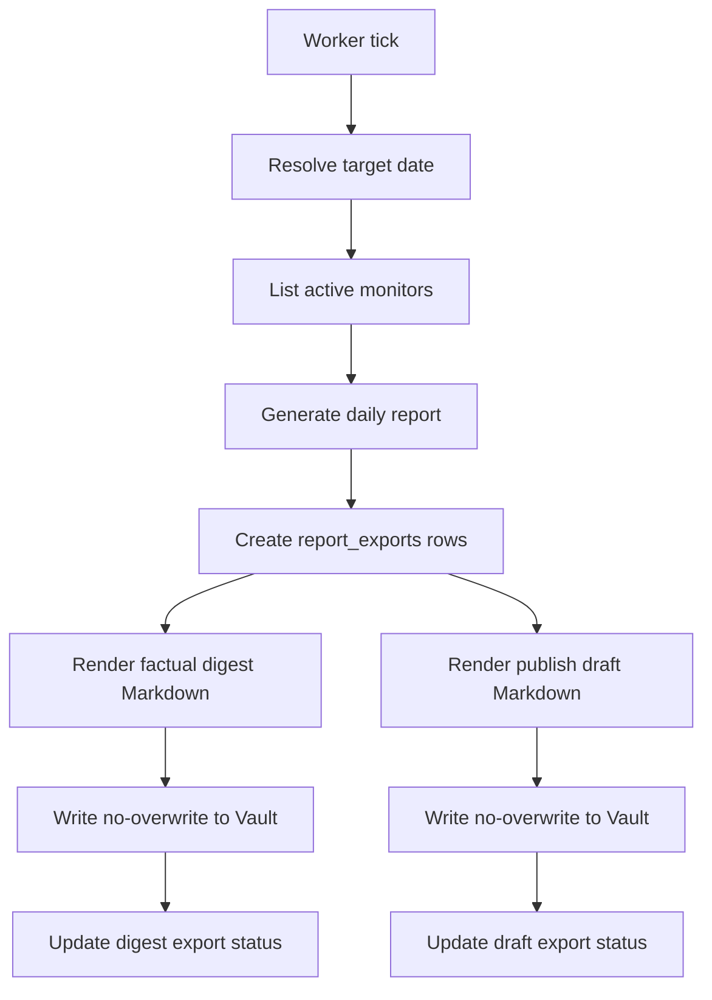

# Daily Obsidian Publish Design

## Context

HotKey already has backend report generation in progress through `internal/report` and a `reports` table. The next step is to make the generated daily content available as local Markdown files in an Obsidian vault.

The goal is not personal note-taking or bidirectional synchronization. Obsidian is used as a local Markdown editing and draft-management workspace before publishing articles to external platforms such as WeChat, Zhihu, or a website.

## Goals

1. Generate daily content on a backend schedule.
2. Persist the generated content as Markdown files under a configured local Obsidian vault path.
3. Produce two Markdown artifacts for each daily run:
   - a factual daily digest for source tracking and material review
   - a publish-ready article draft for external platforms
4. Never overwrite an existing Markdown file, because existing files may have been edited in Obsidian.
5. Keep the first implementation backend-only and globally configured through `OBSIDIAN_VAULT_PATH`.

## Non-Goals

1. Do not add frontend or miniapp changes.
2. Do not sync Obsidian edits back into HotKey.
3. Do not build an Obsidian plugin.
4. Do not publish directly to external platforms in this phase.
5. Do not overwrite user-edited local Markdown files.

## Product Shape

Each daily scheduled run generates two files per active monitor.

### Factual Digest

The factual digest is optimized for source review, traceability, and later article material selection.

Path:

```text
{OBSIDIAN_VAULT_PATH}/HotKey/digests/daily/{date}/{monitor-slug}.md
```

Frontmatter:

```yaml
---
type: hotkey-digest
date: 2026-07-08
report_id: 123
report_type: daily
monitor: AI Regulation
monitor_id: 10
source: hotkey-server
publish_status: material
tags:
  - hotkey
  - digest
  - daily
---
```

Body structure:

```markdown
# AI Regulation 日报 2026-07-08

## 今日概览

## 热点主题

## 代表内容

## 来源链接
```

### Publish Draft

The publish draft is optimized for external publication. It is rendered as an article draft rather than an internal report.

Path:

```text
{OBSIDIAN_VAULT_PATH}/HotKey/publish/drafts/{date}/{monitor-slug}.md
```

Frontmatter:

```yaml
---
type: hotkey-publish-draft
date: 2026-07-08
report_id: 123
report_type: daily
monitor: AI Regulation
monitor_id: 10
source: hotkey-server
publish_status: draft
target_platforms:
  - wechat
  - zhihu
  - website
tags:
  - hotkey
  - publish-draft
---
```

Body structure:

```markdown
# 今日 AI 行业热点：监管、模型能力与应用落地

## 导语

## 一、核心趋势

## 二、重点事件

## 三、值得关注的信号

## 结语
```

## Architecture

### `internal/report`

`report.Service` remains responsible for generating the factual daily report from backend data. It does not know about Obsidian paths or file-writing rules.

Responsibilities:

1. Resolve the daily reporting period.
2. Query monitor topics and representative content.
3. Generate or persist the `reports` database row.
4. Return structured report data to downstream exporters.

### `internal/obsidian`

`internal/obsidian` owns local Markdown persistence.

Responsibilities:

1. Build stable paths for digest and publish-draft artifacts.
2. Render YAML frontmatter and Markdown bodies.
3. Slugify monitor names for paths.
4. Write files atomically through a temporary file and rename.
5. Detect existing files and skip without overwriting.

Core API shape:

```go
type ExportKind string

const (
    ExportDailyDigest  ExportKind = "daily-digest"
    ExportPublishDraft ExportKind = "publish-draft"
)

type MarkdownExportInput struct {
    Kind        ExportKind
    VaultRoot   string
    Date        time.Time
    MonitorID   int64
    MonitorName string
    ReportID    int64
    Title       string
    Content     string
}

type WriteResult struct {
    Path    string
    Status  string // published, skipped
    Skipped bool
}
```

### `internal/worker`

The worker owns scheduled execution.

Responsibilities:

1. Read `DAILY_DIGEST_TIME`, `DAILY_DIGEST_TIMEZONE`, `DAILY_DIGEST_TARGET`, and `OBSIDIAN_VAULT_PATH`.
2. Decide whether the daily job is due to run.
3. Iterate active monitors through the report service.
4. Request both Obsidian exports for each report.
5. Persist export status independently for each file.

## Data Model

Add a `report_exports` table instead of overloading `reports`, because one report produces multiple local files.

```sql
create table report_exports (
  id bigserial primary key,
  report_id bigint not null references reports(id),
  export_kind text not null check (export_kind in ('daily-digest', 'publish-draft')),
  target_path text not null,
  status text not null default 'pending' check (status in ('pending', 'published', 'skipped', 'failed')),
  error_message text not null default '',
  published_at timestamptz,
  created_at timestamptz not null default now(),
  updated_at timestamptz not null default now(),
  unique (report_id, export_kind)
);
```

Status meaning:

| Status | Meaning |
| --- | --- |
| `pending` | Export row created before file write starts. |
| `published` | File was newly written. |
| `skipped` | File already existed and was intentionally not overwritten. |
| `failed` | Export failed due to configuration, rendering, or filesystem errors. |

## Scheduling

Configuration:

| Variable | Default | Meaning |
| --- | --- | --- |
| `OBSIDIAN_VAULT_PATH` | none | Required for the scheduled export job. |
| `DAILY_DIGEST_TIME` | `08:00` | Local trigger time. |
| `DAILY_DIGEST_TIMEZONE` | `Asia/Shanghai` | Timezone for target day and trigger checks. |
| `DAILY_DIGEST_TARGET` | `yesterday` | Generate yesterday or today. |
| `DAILY_DIGEST_TOP_N` | `20` | Maximum source items per monitor. |

The first implementation runs an in-process worker loop with a one-minute tick, consistent with the existing backend-only service shape. The loop avoids duplicate execution for the same target date through the existing `knowledge_runs` table. The run key format is `daily-obsidian-publish:{target-date}`.

## Data Flow



## No-Overwrite Rule

The no-overwrite rule is mandatory.

If the target path exists:

1. Do not open the file for writing.
2. Do not create a replacement file.
3. Mark the export as `skipped`.
4. Treat `skipped` as a successful protective outcome, not as a failure.

This preserves Obsidian edits and keeps HotKey as a generator rather than the owner of local drafts.

## Error Handling

1. Missing `OBSIDIAN_VAULT_PATH`: mark the run or export as `failed`; do not crash server startup.
2. Vault path does not exist: mark affected exports as `failed`.
3. Vault path exists but is not writable: mark affected exports as `failed`.
4. Digest export succeeds but draft export fails: record separate statuses.
5. Report generation fails for one monitor: continue other monitors and record the failure.
6. File exists: mark `skipped`, not `failed`.

## Testing Strategy

Unit tests:

1. Path generation for `daily-digest` and `publish-draft`.
2. Frontmatter rendering for both artifact kinds.
3. Atomic writer creates parent directories.
4. Atomic writer never overwrites existing files.
5. Report export repository records `published`, `skipped`, and `failed`.
6. Scheduler target-date resolution for `today` and `yesterday`.

Worker tests:

1. Missing Vault path records failure and does not write files.
2. A successful run writes two files for a monitor.
3. Existing files result in `skipped` status.
4. Partial failure keeps per-export status independent.
5. Duplicate tick for same date does not create duplicate exports.

Repository validation:

```bash
go test ./...
bash scripts/validate-repository.sh
go vet ./...
go build ./cmd/hotkey
```

## Implementation Plan

1. Add configuration defaults for daily Obsidian export.
2. Add `report_exports` schema, migration, GORM model, and repository.
3. Add `internal/obsidian` pathing, frontmatter rendering, and no-overwrite atomic writer.
4. Add report-to-Markdown rendering for `daily-digest`.
5. Add report-to-article rendering for `publish-draft`.
6. Add `internal/worker` daily scheduler and export job.
7. Wire worker dependencies through Fx.
8. Add unit and worker tests.
9. Run full backend validation.

## Open Decisions

No open decisions remain for this phase.
