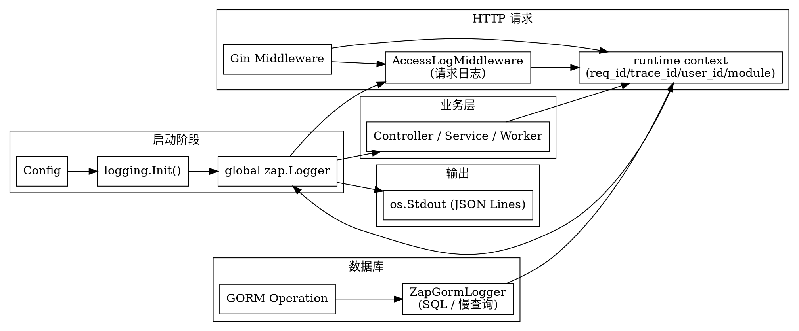

# Logging System Design

> **Status:** Approved  
> **Date:** 2026-07-08  
> **Author:** Claude

## Overview

HotKey 当前仅使用 Go 标准库 `log.Printf` 进行日志输出（28 处调用，遍及 6 个文件），存在以下问题：

- **无结构化输出**：所有日志均为纯文本，无法被日志收集系统（如 Loki、ELK）解析
- **无日志级别**：无法按 debug/info/warn/error 过滤
- **无上下文关联**：RequestID、TraceID、UserID 已存入 context（`internal/platform/runtime/context.go`），但从未被日志消费
- **无 HTTP 访问日志中间件**：无法记录请求延迟、状态码、客户端 IP
- **GORM SQL 日志静默**：默认不记录任何 SQL，不利于排查和慢查询定位
- **Worker 无日志**：后台任务出错后仅持久化到数据库，运行时无任何输出
- **自定义日志器已废弃但未清理**：`internal/platform/logging/logger.go` 存在但零引用

**目标：** 引入成熟的第三方日志库，统一所有日志输出，贯通上下文元数据，覆盖 HTTP、GORM、Worker 等所有运行时路径。

## Tech Stack

| 组件 | 选型 | 版本 | Stars | 理由 |
|------|------|------|-------|------|
| 日志内核 | uber-go/zap | v1.27+ (已间接依赖) | ~22k+ | Fx 已引入，无需新依赖；Uber 生产验证；强类型 API |
| Gin 中间件 | ginzap（间接依赖） | — | — | zap 官方 Gin 适配器 |
| GORM 日志 | 自实现 ZapWriter | — | — | GORM 的 `logger.Interface` 适配，<50 行 |

## Architecture



**数据流：** `Config → Init → Global zap.Logger`，Gin 中间件解析请求后将元数据注入 context → 各业务层通过 `logging.Ctx(ctx)` 获取带上下文的 Logger → 输出 JSON Lines 到 stdout。

## Component Design

### 1. Config — 日志配置

在 `internal/config/config.go` 的 `Config` 结构体中新增三个字段：

| 字段 | 环境变量 | 默认值 | 说明 |
|---|---|---|---|
| `LogLevel` | `LOG_LEVEL` | `"info"` | debug / info / warn / error |
| `LogFormat` | `LOG_FORMAT` | `"json"` | json / console |
| `LogOutput` | `LOG_OUTPUT` | `"stdout"` | stdout / stderr |

Console format 仅在本地开发时使用（`make dev`），生产环境始终用 JSON Lines。

### 2. Logger Factory — zap 初始化

**文件：** `internal/platform/logging/zap.go`

提供三个顶层函数：

- `Init(level, format string) error` — 初始化全局 Logger。根据 level 设定 `zap.AtomicLevel`，根据 format 选择 JSONEncoder 或 ConsoleEncoder。固定启用 `zap.AddCaller()` 和 `zap.AddStacktrace(zapcore.ErrorLevel)`。
- `L() *zap.Logger` — 返回全局 Logger
- `S() *zap.SugaredLogger` — 返回全局 SugaredLogger（`Printf` 风格兼容）

**编码器配置：**

| 配置项 | JSON 生产值 | Console 开发值 |
|---|---|---|
| TimeEncoder | ISO8601 | ISO8601 (彩色) |
| EncodeLevel | CapitalLevel | CapitalColorLevel |
| EncodeCaller | Short | Short |

### 3. Context Field Extraction

**文件：** `internal/platform/logging/context.go`

函数 `FieldsFromContext(ctx)` 从 `runtime.RequestIDFromContext()` / `TraceIDFromContext()` / `UserIDFromContext()` / `ModuleFromContext()` 提取非空字段，组成 `[]zap.Field`。

函数 `Ctx(ctx)` 等价于 `L().With(FieldsFromContext(ctx)...)`，让业务代码一行获取带上下文的 Logger：

```go
logging.Ctx(ctx).Info("processing digest",
    zap.String("target_date", dateStr),
)
```

### 4. Gin Access Log Middleware

**文件：** `internal/platform/http/accesslog.go`

在每个 HTTP 请求结束时记录一条结构化日志：

```json
{
    "level": "info",
    "ts": "2026-07-08T08:30:00+08:00",
    "caller": "http/accesslog.go:42",
    "msg": "access",
    "method": "GET",
    "path": "/api/v1/monitors",
    "query": "",
    "status": 200,
    "latency": "45ms",
    "size": 1234,
    "client_ip": "192.168.1.1",
    "request_id": "req-a1b2c3d4",
    "user_id": 42,
    "module": "http"
}
```

已有 `RequestIDMiddleware` / `ContextMetadataMiddleware` 运行在前，元数据已写入 context，`logging.Ctx(c.Request.Context())` 自动拾取。

不包含请求体日志（避免敏感数据泄露），不记录静态文件（/swagger/*）。

### 5. GORM Logger Adapter

**文件：** `internal/database/logger.go`

实现 `gorm.io/gorm/logger.Interface`（`LogMode`/`Info`/`Warn`/`Error`/`Trace` 五个方法）。

- `Trace` 方法记录每条 SQL：成功时用 `Debug` 级别，有错误时用 `Error` 级别，超过 `SlowThreshold`（200ms）时用 `Warn` 级别
- 慢查询阈值可通过环境变量 `DB_SLOW_THRESHOLD` 配置（默认 200ms）
- 使用 `logging.Ctx(ctx)` 拾取 HTTP 上下文，使得慢 SQL 可以关联到具体的请求 ID

在 `internal/database/database.go` 的 `gorm.Open` 中传入：

```go
&gorm.Config{
    Logger: &ZapGormLogger{SlowThreshold: 200 * time.Millisecond},
}
```

### 6. Migration: all `log.Printf` → zap

项目现有 28 处 `log.xxx` 调用，替换规则：

| 原调用 | 替换为 | 说明 |
|---|---|---|
| `log.Printf("...: %v", err)` | `logging.L().Error(...)` | 不可恢复错误 |
| `log.Printf("warning: ...")` | `logging.L().Warn(...)` | 配置加载警告等 |
| `log.Printf("...: starting")` | `logging.L().Info(...)` | 启动信息 |
| `log.Panicf(...)` | `logging.L().Panic(...)` | 保持 panic 语义 |
| worker 中零日志 | `logging.L().Info/Warn` | 新增运行状态日志 |

在 Fx 的 `OnStart` 中尽早调用 `logging.Init()`，确保在所有业务组件使用日志前完成初始化。

## File Inventory

| # | Action | Path | Description |
|---|---|---|---|
| 1 | Modify | `internal/config/config.go` | 追加 LogLevel / LogFormat / LogOutput 字段与默认值 |
| 2 | Create | `internal/platform/logging/zap.go` | zap Logger 初始化工厂 |
| 3 | Create | `internal/platform/logging/context.go` | Context 字段提取 Helper |
| 4 | Create | `internal/platform/http/accesslog.go` | Gin 请求日志中间件 |
| 5 | Create | `internal/database/logger.go` | GORM 日志适配器 |
| 6 | Modify | `internal/database/database.go` | GORM 初始化传入 Logger |
| 7 | Modify | `internal/fxapp/app.go` | OnStart 调用 Init，所有 log.Printf 替换 |
| 8 | Modify | `internal/platform/http/middleware.go` | Recover 改用 zap，注册 AccessLogMiddleware |
| 9 | Modify | `internal/platform/http/router.go` | 接入 AccessLogMiddleware |
| 10 | Modify | `internal/queue/consumer.go` | log.Printf → zap |
| 11 | Modify | `internal/queue/dispatcher.go` | log.Printf / log.Panicf → zap |
| 12 | Modify | `internal/config/config.go` | log.Printf → zap |
| 13 | Modify | `internal/llm/adapter.go` | log.Printf → zap |
| 14 | Modify | `internal/worker/daily_obsidian_publish.go` | 新增运行状态日志 |
| 15 | Delete | `internal/platform/logging/logger.go` | 废弃的自定义日志器 |
| 16 | Delete | `tests/unit/platform/logging/logger_test.go` | 废弃自定义日志器的测试 |
| 17 | Add dep | `go.mod` | 确认 `go.uber.org/zap` 升级为直接依赖 |

## Error Handling

- **Init 失败**：log.Panic（配置错误应在启动时快速失败，不静默降级）
- **GORM Trace 中 ctx 不携带 context 字段**：`FieldsFromContext` 对空值返回空切片，`L().With()` 无字段时等价于 `L()`，不会 panic
- **Gin 中间件 panic**：RecoverMiddleware 在前，会捕获所有 panic 并用 `L().Error` 记录后返回 500

## Testing Strategy

- **Logger 工厂**：分别测试 JSON/Console 输出格式、各日志级别的过滤行为
- **Context 提取**：构造带 request_id/user_id/trace_id 的 context，验证返回的 Field 切片内容
- **AccessLog 中间件**：构造 HTTP 请求，验证 JSON 输出中包含 method/path/status/latency 等字段
- **GORM Logger**：模拟 GORM Trace 回调，验证正常 SQL / 慢查询 / 错误 SQL 输出级别和字段

## Out of Scope

- **日志轮转**：由容器运行时（K8s / Docker）或 systemd-journald 处理，程序仅写入 stdout/stderr
- **分布式追踪**：OpenTelemetry 集成不在本次范围内，但在字段设计（trace_id）上预留了扩展点
- **审计日志**：对用户操作（增删改）的审计日志需各业务模块单独实现，不属于基础日志设施范畴
