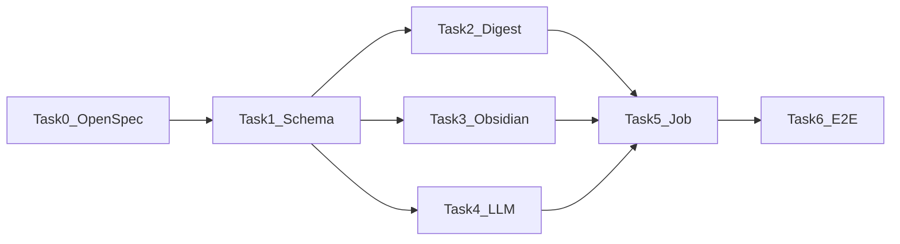

## 任务依赖顺序

## Linear Issue 映射

| Task | Issue | 标题 |
|------|-------|------|
| Epic | STE-301 | 热点日报 Obsidian 知识库 MVP |
| Task 0 | STE-302 | OpenSpec + 设计文档门禁 |
| Task 1 | STE-303 | topic_daily_exports 与配置扩展 |
| Task 2 | STE-304 | digest 自然日窗口与主题筛选 |
| Task 3 | STE-305 | obsidian Markdown 渲染与写盘 |
| Task 4 | STE-306 | LLM 摘要模块 |
| Task 5 | STE-307 | publish_daily_topics Job + 调度 |
| Task 6 | STE-308 | 端到端测试与验收 |

---

### Task 1: 数据模型与配置（STE-303）

**Files:**
- Modify: `db/schema.sql`
- Create: `db/migrations/001_topic_daily_exports.sql`（或项目既有 migration 约定路径）
- Modify: `db/queries.sql`
- Modify: `internal/config/config.go`
- Modify: `.env.example`
- Create: `internal/database/digestrepo.go`
- Create: `internal/database/digestrepo_test.go`

**Steps:**

- [x] **Step 1:** 写 `topic_daily_exports` 表迁移（含唯一约束 `(monitor_id, topic_id, export_date)`）
- [x] **Step 2:** 写 config 字段测试 — `TestLoad_DailyDigestConfigDefaults` 验证默认值
- [x] **Step 3:** 运行失败测试 — `go test ./internal/config -run TestLoad_DailyDigestConfigDefaults -v`（红灯）
- [x] **Step 4:** 扩展 Config 结构体 — `ObsidianVaultPath`, `DailyDigestTime`, `DailyDigestTimezone`, `DailyDigestTarget`, `DailyDigestTopN`, `LLMProvider`, `LLMAPIKey`, `LLMBaseURL`, `LLMModel`
- [x] **Step 5:** 实现 `DigestRepo.Upsert()` 和 `DigestRepo.GetByTopicDate()`
- [x] **Step 6:** 验证 — `go test ./internal/config ./internal/database -run Digest -v`（绿灯）

**Validation:** `make schema && go test ./internal/config ./internal/database -run Digest -v`

---

### Task 2: digest 模块 — 自然日窗口与主题筛选（STE-304）

**Files:**
- Create: `internal/digest/window.go`
- Create: `internal/digest/window_test.go`
- Create: `internal/digest/selector.go`
- Create: `internal/digest/selector_test.go`
- Create: `internal/digest/service.go`
- Create: `internal/database/digestquery.go`

**Steps:**

- [x] **Step 1:** 写 CST 边界测试 — `TestDayWindow_CSTBoundary` 验证 UTC→CST 转换
- [x] **Step 2:** 运行失败测试 — `go test ./internal/digest -run TestDayWindow_CSTBoundary -v`（红灯）
- [x] **Step 3:** 实现 `DayWindow()` / `ResolveExportDate()`
- [x] **Step 4:** 写主题筛选测试 — mock repo 返回 hits/posts，验证 Top N 与活跃过滤
- [x] **Step 5:** 实现 `ListTopicsForDay(monitorID, exportDate)` — JOIN topics, topic_posts, monitor_post_hits, platform_posts
- [x] **Step 6:** 实现 `FetchRepresentativePosts(topicID, limit=3)`
- [x] **Step 7:** 验证 — `go test ./internal/digest -v`（绿灯）

**Validation:** `go test ./internal/digest -v`

---

### Task 3: obsidian 模块 — Markdown 渲染与原子写盘（STE-305）

**Files:**
- Create: `internal/obsidian/slug.go`
- Create: `internal/obsidian/slug_test.go`
- Create: `internal/obsidian/render.go`
- Create: `internal/obsidian/render_test.go`
- Create: `internal/obsidian/writer.go`
- Create: `internal/obsidian/writer_test.go`

**Steps:**

- [x] **Step 1:** 写 slug 安全测试 — `TestSlugify_RemovesSpecialChars`
- [x] **Step 2:** 写 frontmatter 渲染测试 — 断言 `type`, `date`, `monitor_id`, `tags` 存在
- [x] **Step 3:** 写原子写盘测试 — temp dir，`WriteAtomic` 后无 `.tmp` 残留
- [x] **Step 4:** 实现 `RenderTopicNote(in RenderInput) string`
- [x] **Step 5:** 实现 `BuildPath(vaultRoot, monitorSlug, filename) string`
- [x] **Step 6:** 实现 `WriteAtomic(path, content) error` — write `.tmp` then `rename`
- [x] **Step 7:** 验证 — `go test ./internal/obsidian -v`（绿灯）

**Validation:** `go test ./internal/obsidian -v`

---

### Task 4: LLM 摘要模块（STE-306）

**Files:**
- Create: `internal/llm/client.go`
- Create: `internal/llm/openai.go`
- Create: `internal/llm/openai_test.go`
- Create: `internal/llm/mock.go`
- Create: `internal/llm/prompt.go`

**Steps:**

- [x] **Step 1:** 定义 `Client` 接口与 `TopicSummaryInput` 结构体
- [x] **Step 2:** 写 mock client 测试 — 返回固定摘要，验证 prompt 输入截断
- [x] **Step 3:** 实现 `MockClient` 与 `PromptBuilder`
- [x] **Step 4:** 实现 OpenAI 兼容 HTTP client — `SummarizeTopic` POST `/chat/completions`
- [x] **Step 5:** 写 httptest 覆盖 — mock 200 response
- [x] **Step 6:** 验证 — `go test ./internal/llm -v`（绿灯）

**Validation:** `go test ./internal/llm -v`

---

### Task 5: 发布 Job 与调度（STE-307）

**Files:**
- Create: `internal/jobs/daily_scheduler.go`
- Create: `internal/jobs/daily_scheduler_test.go`
- Create: `internal/jobs/publish_daily_topics.go`
- Create: `internal/jobs/publish_daily_topics_test.go`
- Modify: `internal/app/worker_jobs.go`

**Steps:**

- [x] **Step 1:** 写 scheduler gate 测试 — 08:00 前不触发；08:00 后触发一次；同日不重复
- [x] **Step 2:** 实现 `DailyScheduler.ShouldRun(now, lastRunDate) bool`
- [x] **Step 3:** 写 publish job 集成测试 — fake digest/llm/repo + temp vault dir
- [x] **Step 4:** 实现 `PublishDailyTopicsJob.Run(ctx)` — 遍历 monitors → digest → LLM → export → write
- [x] **Step 5:** 注册到 `worker_jobs.go` — interval 1min，内部 scheduler gate
- [x] **Step 6:** 验证 — `go test ./internal/jobs -run 'Daily|Publish' -v`（绿灯）

**Validation:** `go test ./internal/jobs -run 'Daily|Publish' -v`

---

### Task 6: 端到端测试与文档验收（STE-308）

**Files:**
- Create: `tests/integration/daily_digest_test.go`（或 `internal/jobs` 集成测试）

**Steps:**

- [x] **Step 1:** 写幂等测试 — 同 topic+date 执行两次，文件数不变、内容更新
- [x] **Step 2:** 写 LLM 失败隔离测试 — 一个 topic 失败，其他仍 published
- [x] **Step 3:** 写 Vault 权限失败测试 — exports status=failed
- [x] **Step 4:** 全量验证 — `make test && make lint && make validate`
- [x] **Step 5:** 手工验收清单 — 配置 Vault 路径，触发 job，Obsidian 中 Dataview 查询

**Validation:** `make test && make lint && make validate`

---

## 风险与不做事项

- 不做 Web 配置页（后续 Epic）
- 不做多用户 Vault 路径
- 不修改 Jaccard 聚类算法
- 不依赖 snapshot 表持久化（MVP 用 hits/posts 时间筛选）
